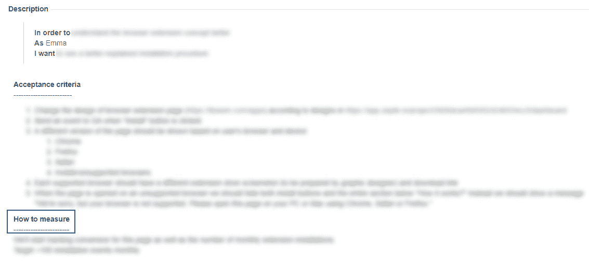
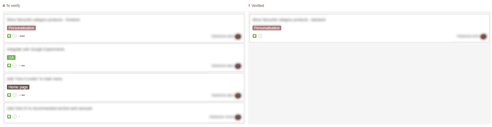
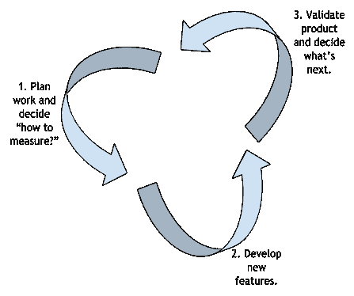
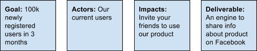
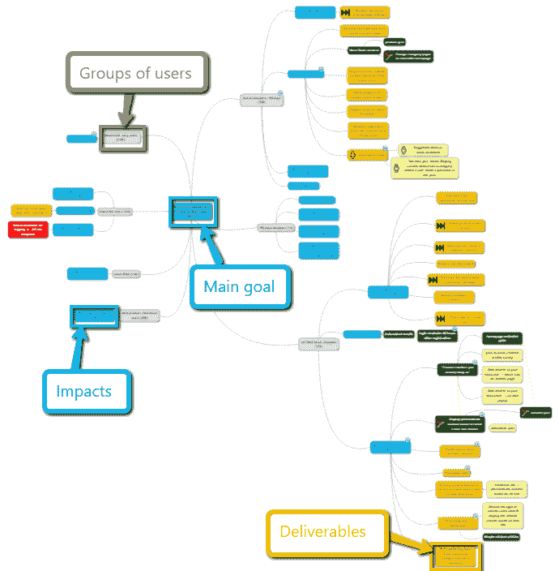

# 循序渐进:使用影响图的敏捷产品验证过程

> 原文：<https://www.stxnext.com/blog/step-step-product-validation-using-impact-mapping/>

 *更新于 2019 年 6 月 28 日。*

在从事各种 IT 项目的过程中，我意识到尽管有这些“精益”产品开发运动，许多公司仍然会遇到产品验证方面的重大问题。换句话说， 人们很难理解自己开发的产品是否是市场所需要的。

为了帮助您完成验证工作，我想让您深入了解一下我们与一位客户合作开发的一款实时产品的日常敏捷产品验证流程。 

#### 什么是产品验证？

让我们从回答最基本的问题开始:什么是产品验证？

所谓的**“产品验证”有很多方法** 试着谷歌一下这个短语，你会发现它的定义不止一种。我的简短解释是，产品验证是一个旨在回答以下问题的过程:我的产品是人们需要的吗？ 当你构建一个产品时，每次发布新版本时验证它的价值是一个好习惯

该领域最著名的框架之一出现在 Eric Ries 的《精益创业》中(你可以在我们的[CTO](https://stxnext.com/blog/2017/06/28/10-must-read-books-ctos/)必读书目中找到)。他建议遵循以下步骤:

1。**建立** 一个测试人们是否需要你试图向他们推销的东西的实验。

2。**测量**你实验的结果。

3。**吸取** 的教训，然后迭代构建下一个实验。

我喜欢这种方法的一点是，埃里克揭示了为了从循环中获得价值，你应该以相反的顺序进行规划。首先你需要知道你想了解你的用户什么。接下来，你要思考你将如何衡量它。只有在最后，你才应该试着找出如何建立最快最便宜的实验来获得知识。

#### 深入了解我们团队的产品验证流程

我个人认为产品验证是整个工作流程中最大的挑战之一。在我目前从事的项目中，我们遇到了同样的挑战。然而，我们决定构建一个支持我们验证的流程。我们不称我们的方法为精益启动框架，尽管它最终包括了前面提到的 3 个步骤:构建、测量、学习。

我们的验证过程是什么样的？

##### 1.预开发阶段:“如何衡量？”

##### a)产品负责人(PO)将他们的验证想法添加到用户故事中。

(不确定阿宝是干什么的？阅读我们关于 [产品负责人的职责](https://stxnext.com/blog/2017/05/31/product-owner-responsibilities-path-junior-expert/) 的文章。)每次我们的 PO 在产品 backlog 中增加一个新的用户故事，他们都要填写“如何度量？”字段。这种方法有助于他们在任何进一步的讨论之前，分析如何识别我们将要做出的改变是否是我们的用户需要的，以及我们是否有足够的工具来允许用户故事验证。请参见下面的用户故事模板快照——这是我们框架的“规划”部分。

##### b)在周会上与其他人讨论验证想法。

会议应由  [产品负责人](https://stxnext.com/blog/2017/05/31/product-owner-responsibilities-path-junior-expert/)、  [UX 设计师](https://stxnext.com/services/ux-audit/)、  [Scrum Master](https://stxnext.com/blog/2017/07/26/common-misconceptions-about-scrum-framework/) 和客户代表(可选)参加。

我们进行这个会议的方式非常简单:PO 提出他们的想法进行验证，而其他参与者进行讨论并提出适当的改进建议。通过这种方式，首席采购干事可以收到广泛的意见，并做出更明智的决定。

##### 2.发展阶段

在此阶段不做任何验证工作。这是精益创业框架的“构建”部分。

##### 3.开发后阶段:产品验证

新产品增量部署到生产中后，我们的验证流程就开始了。有些是临时发生的——我们的数据分析师开始生成统计数据。然而，这个过程的要点是每周一次的会议，在会上，产品负责人、UX 设计师、Scrum Master，以及可选的客户代表，讨论什么已经发布到我们的“实时”环境中，以及它产生了什么结果。换句话说，我们验证新产品特性对最终用户的影响是正面的、中性的还是负面的。为此，我们使用 Google Analytics(一种热图工具)和其他数据分析工具。

在我们收集必要的数据并验证新功能后，我们就未来的发展计划做出决策。我们使用吉拉板来促进会议(见下文)。我们将“待验证”列中的项目移至“已验证”，这意味着我们已经验证了我们的特性。这些是精益创业框架的“测量”和“学习”部分。

我们重复这些实践，并且每个下一个开发冲刺都从头开始循环。总而言之，验证工作流程如下图所示。

#### 什么是影响图，我们如何使用它？

除了上面例子中提到的吉拉，我们还使用了另外一个工具来可视化产品验证状态——影响图。

**影响图** 是 Gojko Adzic 为帮助企业实现目标而创造的战略规划技术。

(我们很兴奋地看到  [戈杰科·阿季奇本人](https://twitter.com/STXNext/status/882577070844522496) 在这篇文章发表后不久就转发了。)

这个想法很简单。首先，你定义一个商业目标，例如“在三个月内将我们的产品卖给一百万客户。”Gojko 建议将绘制影响图视为从 A 点到 B 点的地图导航练习。在这种情况下，A 点就是我们现在所在的位置，B 点就是我们想要达到的目标。

如果我们看地图，通常有许多方法可以达到相同的目标。想法是上路，检查是否所有的路都可以通行。结果可能是一些道路实际上已经关闭，或者有些道路还不存在。

使用影响映射术语，您应该定义 4 个元素:

##### 1.目标

从商业角度决定你想要实现什么。也许你想在给定的时间内达到一定的销售量，或者也许你更喜欢关注新注册用户的数量。无论你的目标是什么，尽可能精确地定义它。

##### 2.演员

想一想能帮助你实现目标的不同人群。这些可以是你的用户群，你的员工或者其他任何人。

##### 3.影响

在这个阶段，你需要考虑你的演员可以采取哪些行动来帮助你实现目标。

##### 4.可交付成果

尝试定义精确的产品特征，这将有助于演员产生影响。

一个例子可能是这样的:

如果创建一个可交付成果推动参与者产生支持我们主要目标的影响，我们会积极地验证这个可交付成果。利用这些信息，我们可以规划未来的工作。如果一个可交付成果没有产生任何积极的变化，我们会消极地验证它，这也是我们学习的一个重要部分。

#### 我们的影响图看起来像什么的例子

影响图的中间部分(深蓝色)代表我们作为团队设定的主要目标。它可以是任何类型的业务目标，例如，在未来 3 个月内在我们的应用程序中注册 100，000 名新用户。它应该是在特定时期结束时精确且容易衡量的东西。

在我们影响图的边界上，我们展示了我们希望提供给最终用户的交付物(黄色、红色、黑色和绿色),以支持我们的主要目标，例如，为在指定时间内注册的每个人提供一份免费礼物。在敏捷环境中，可交付成果将被称为用户故事或产品待办事项。

交付物的颜色具有额外的含义:

*   **黄色 —** 对于所有添加到影响图并处于预开发阶段的交付物，
*   **黑色 —** 交付物处于开发或后期开发阶段，但在验证阶段之前，
*   **绿色 —** 交付物得到了肯定的确认。
*   **红色 —** 交付物被否定确认。

在我们的例子中，影响图每周更新一次，并由 Scrum 主管监督。然而，产品所有者或任何熟悉它的人可以确保地图保持最新。

根据我们在影响图上看到的信息，我们对产品的未来发展做出数据驱动的决策。

#### 影响图的好处是什么？

影响图有许多优势，您的软件公司可以从中受益匪浅。除其他外，影响图:

*   通过使团队更容易专注于他们正在努力实现的目标，帮助最大化客户价值和最小化浪费；
*   以每个相关人员都可以理解的方式可视化流程；
*   通过促进集体创造和假设的测试，增加团队内部的协作并释放创造力；
*   促进横向工作，而不是从上到下；
*   帮助团队根据业务目标调整工作；
*   让团队成员很容易立即发现挑战并及时做出反应，以及适应不断变化的环境；
*   关注人们，他们的经历和想法。

#### 最后的想法

总的来说，以下是为什么敏捷产品验证的影响图绝对值得你花时间的几个原因:

*   创建影响图  **有助于团队专注于业务目标、**，即实际创造收入的行动。
*   它可以让您看到通向业务目标的所有可能路线的全貌，包括您可能错过的更快、更容易、更经济的  **路线。**
*   **影响图让你更有创意地做出决策；**您可以查看地图的所有部分，并能够看到哪些部分已经生效，哪些部分您应该给予更多考虑。
*   地图上总有不同的区域可以让你关注。
*   用地图思考  **帮助你保持动力。**

希望这篇文章能帮助你在团队中组织你的产品验证过程。祝你好运，并让我们知道进展如何！

如果你想通过  [了解更多关于有效软件开发过程的](https://stxnext.com/ebooks/what-is-python-used-for/) ，我们有几篇文章你可能会喜欢:

*   [充分利用下一个项目启动的 6 个步骤](https://stxnext.com/blog/2017/06/21/6-steps-get-most-out-your-next-project-kickoff/) (内有免费 PDF！)
*   [产品负责人职责](https://stxnext.com/blog/2017/05/31/product-owner-responsibilities-path-junior-expert/) [:从初级到专家的职业道路](http://stxnext.com/blog/2017/05/31/product-owner-responsibilities-path-junior-expert/)
*   [如何使用燃尽图获得透明且可预测的开发结果](https://stxnext.com/blog/2017/05/17/all-about-burn-down-charts/)

