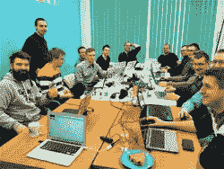
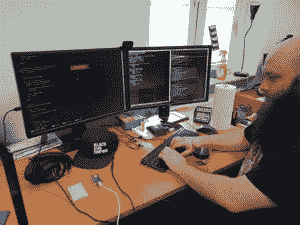
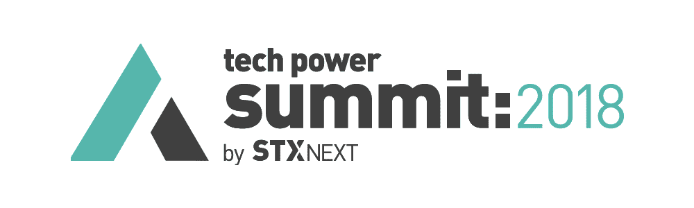
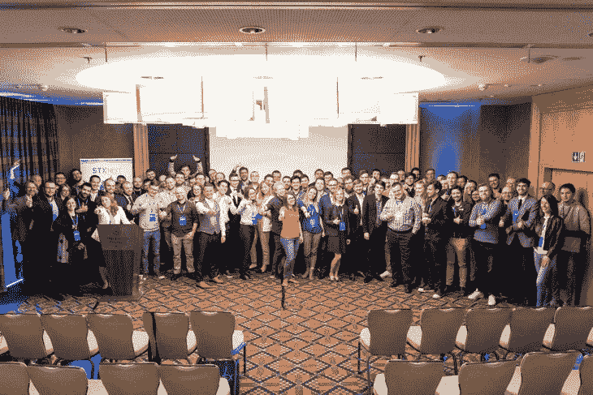
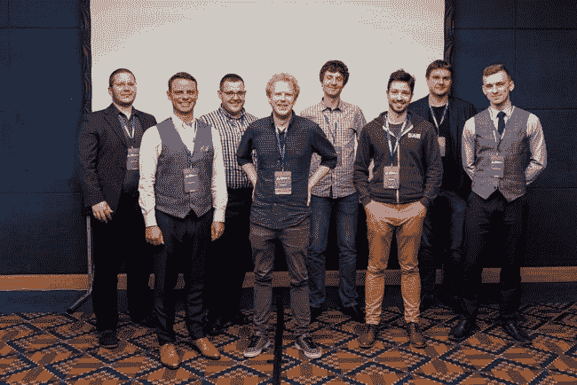

# STX Next 的新技术

> 原文：<https://www.stxnext.com/blog/new-technologies-stx-next/>

 很难用几句话来描述 STX Next 长达 13 年的历史，但如果有一个概念可以完美地概括该公司，那就是 **关注[的持续增长。](/blog/rapid-business-growth-future-challenges/)**

我们决定 **实施新技术** 就是这一理念的直接结果。

“如果我们的同事、市场和客户都向公司表示他们愿意涉足新技术，我们唯一能做的就是采取行动。**接下来我们将开启 STX 历史上全新的篇章；2018 年是我们实施新技术的一年，**”我们的服务交付总监 ukasz Koczwara 说道。

迄今为止，ukasz 已经在 STX Next 工作了近 5 年，他曲折的职业生涯经历了从开发人员、团队领导、服务交付经理、服务交付主管，一直到服务交付总监(他目前拥有的头衔)。

“我们一直想给公司呼吸点新鲜空气。**不断变化的 IT 市场不仅激发，而且加速了新技术的实施，**这自然让我非常高兴，”ukasz 补充道。 

#### 双赢

在我们公司实施新技术的过程中，一个关键因素是  **我们员工的声音。**

我们进行了一项内部调查，询问他们是否有兴趣了解公司使用的新技术并发展他们的技能，如果有兴趣，将会是哪些技术。

这些结果并不令人惊讶，因为它们反映了市场研究:其中最热门的是[人工智能](/stx-new-blog/will-artificial-intelligence-replace-developers/)、 特别是 [机器学习](https://stxnext.com/services/machine-learning/)、物联网、  [Golang](/stx-new-blog/go-go-python-rangers-comparing-python-and-golang/py) 、区块链、 和 [React Native](https://stxnext.com/blog/2018/01/24/why-use-react-native-your-mobile-app/) 。

*“考虑到我们员工的成长可能性，扩展我们的职业道路以包括新的视角，同时满足市场预期，这对 STX 来说是一个明显的双赢局面，这是我们的目标，也是其本身的一个重要价值。”*

对于一家以前主要与【Python】联系在一起的公司来说，实施新技术是否意味着重心的转移？

我们的一位经理面带微笑地说:“我宁愿称之为新的篇章，而不是重心或支点的改变。”。“STX Next 仍然是欧洲最大的 Python 软件公司，我们无意将我们的头把交椅让给任何人！公司的核心一直是 [Python](https://stxnext.com/ebooks/what-is-python-used-for/) ，我相当有信心它会保持这种状态，而我们的技术生态系统会一直围绕这个核心精心构建。”

#### 新的道路

我们公司实施新技术的方式类似于我们迄今为止实施其他新服务的方式。

“我们没有引入任何革命性的变化，只是充分利用了 Python 提供的可能性。”

“AI，尤其是 [机器学习](https://stxnext.com/blog/2017/12/12/getting-started-machine-learning-python/)， 与 Python 非常契合，就像 [区块链](/stx-new-blog/blockchain-part-one-what-blockchain-and-how-it-works/) 或者其他任何加密货币项目一样。我们在这方面已经有了相当丰富的经验。“甚至 Golang——一种独立、自给自足的编程语言——也经常与 Python 结合使用。”

#### 宝贵的知识

你如何着手在你的公司实施新技术？

STX Next 的一位经理说:“最好称之为。“例如，我们在  [区块链](/stx-new-blog/blockchain-part-two-how-blockchain-will-change-your-future-browser-experience/) 中的第一次成功主要是我们的后续知识、我们同事的专业技能以及我们开发团队令人难以置信的承诺和效率的结合。”

**reactłódź本土工坊**

类似的事情发生在**React Native:**就在几个月前，公司里只有几个人熟悉这项技术。几个月和几个项目之后的今天，公司的能力已经增长，我们的开发人员对技术进步的兴趣没有消退。

在 STX 下一步之前，我们的第一个项目是**【Golang】**，服务组合还应该包括  **物联网(IoT)** 项目。这些项目将使用 Python 或 Golang 来实现，这与 Python 匹配得非常好，并且与基于微服务架构的项目配合得非常好。

#### 知识转移

没有伴随新技术的 **事件和公司创造的能力增长机会，实施新技术是不可能的。**

**STX 现在接下来是将近 300 人，** 其中 250 人左右组成了软件工程师。毫不奇怪，将如此庞大的专家团队转移到使用新技术开发的项目中是一个相当大的挑战。然而，我坚信坚持和结果会带来想要的结果，”祖卡斯告诉我们。

“我们已经在做越来越多与新技术相关的项目，越来越多的开发人员正在以最好的方式获得经验:工作。”

“一个积极的‘副作用’是 **在组织内传递知识，在开发人员之间交流经验。** 我不能保证我们的每一位员工都会被分配到一个采用新技术的项目中，但我相信 **我们会迅速并永久地在这个市场中找到自己的位置，** 这将转化为更大的可能性，”尤卡斯补充道。

在实施新技术的过程中，最重要的是**与我们的业务开发团队紧密合作，**负责与潜在客户沟通，并针对新技术获得新项目。

#### 研究与开发(research and development)

除了会议、黑客马拉松或研讨会，实施新技术的一个重要部分是 **建立一个小团队，** 类似于研发团队。

“研发团队的概念正在我们公司慢慢扎根。它的目标是在各种项目的基础上探索新技术。不过，我会把细节留给自己，因为……竞争从不停歇。”

STX Next 公司格但斯克分公司负责招聘和雇主品牌的 Marta Rogowska 补充道:“学习新技术是我们非常关心的事情。

“为了熟悉新技术，我们开始开发一款应用程序，在了解用户的音乐偏好后，它会通知用户即将到来的现场演出。当我们开发这个概念时，我们只为自己设定了一个目标:最大限度地利用这个项目提供的可能性来熟悉新技术。这就是我们在**React Native**之前提到的，在 [Serverless](/stx-new-blog/serverless-computing-explained-comparing-features-and-pricing-saas-iaas-paas/) 和 **机器学习**的支持下，来编写 app 的过程。如果你想学习，就全力以赴！”她总结道。

#### 早期的胜利

实施新技术如何转化为 **实际招聘流程** 并规划负责在公司各分公司举办活动的团队的行动？

玛尔塔说:“我承认，很多事情都在发生——不仅仅是在我负责的格但斯克，而是在 STX Next 的所有分支机构。“在格但斯克，我们已经有专门从事或 **机器学习**的人员加入我们，帮助我们的部门实施新技术。其他城市的发展速度也一样快！”

#### 科技力量峰会

扩展您对新技术知识的绝佳机会是**STX Next Tech Power Summit**——我们公司的年度国际会议，由 STX Next 全体人员主办。今年第四届峰会的焦点领域正是新技术。

“我们希望今年的会议围绕新技术展开，”早在 1 月份，在 STX Next 的每个办公室举行的每次会议上，ukasz Koczwara 就开始这样说。“今年活动的议程将充满关于机器学习、无服务器、Golang 和 React Native 的讨论，所有这些都是为了促进新技术在我们公司的实施。”

就这样。负责组织今年会议的人员为自己设定了一些目标，主要是:

*   **呈现新技术提供的可能性**
*   **分享良好的商业实践**

****

议程中充满了有趣的技术话题，我们的社交媒体频道对此进行了直播，包括:

*   **圣杯**—AWS Lambda 微框架
*   **微控制器上的机器学习**
*   比较**Python**和**Go**语法
*   与 30 名开发人员一起工作了 30 个月的**React Native**
*   利用  **机器学习** 解决简单的电脑游戏
*   构建高性能  **密码资产交易平台**

我们的演讲嘉宾中有 ARM 的 **Jan Jongboom** ，BAM Technology 的 **Florian 对手** ，Blocktrade 的**Jernej makov ek**。STX Next 自己的 **Piotr Maksimczyk、Wojtek Lichota、Bartosz Kazuł、Sebastian Buczyński、Tomek makowiak、** 和 **Radek Jankiewicz 也加入了他们的行列。**

讲座简明扼要，虽然会议可能已经结束，但你可以在我们的 [YouTube](https://www.youtube.com/channel/UCI1AvU1piMZ80LXboJmRroQ) 频道观看我们的讲座。

[//www.youtube.com/embed/videoseries?list=PLwXxS6lAcQUNVxBWBEo7Tt2PgU-V3hUs8](//www.youtube.com/embed/videoseries?list=PLwXxS6lAcQUNVxBWBEo7Tt2PgU-V3hUs8)

讲座的质量以及组织本身都得到了参与者的高度赞扬。 “老实说，我想知道这些话题——我可能会补充说，对我来说是新的——将如何平易近人地呈现。我没有失望；就内容质量而言，这是一个强劲的周六，”我们的一位开发人员说。

STX Next wrocaw 分部的 Scrum 大师 Krzysiek jabo ski 说:“这是对东道主的一次伟大的脱帽致敬。

聚集在同一个地方的许多人提供了 **马切伊·济尔格瓦、**STX 的首席执行官接下来，利用这个绝佳的机会向所有与会者说几句话。

除了总结这次活动，Maciej 还谈到了公司的的动态增长，不仅关注管理层共享的**价值观，还关注 **扩大** 产品设计和销售&营销分支的规模和范围。**

 **

你可能想知道下一次峰会什么时候召开。我们可以这样回答:明年同一时间，差不多吧。我们第五届年度活动的焦点是否会再次成为新技术，目前仍有待观察。**  **#### 下一步是什么？

除了明年的科技力量峰会，我们还有什么与新技术相关的计划吗？我们当然知道！

在内部，我们的计划主要围绕着的黑客马拉松和项目，以及参加 **的会议和研讨会。但是我们并不打算仅仅停留在内部行动上。**

“在今年的第三和第四季度，我们计划举办更多的 Has Power 活动，这次以 React Native 为中心。就当你们是被真诚邀请的吧！”

机器学习、Golang、Serverless 和 React Native 都在产品市场继续获得动力。由于收购的项目和研发团队的工作，他们越来越多地成为 STX Next 日常使用的技术 **。**

2018 年无疑是新技术和扩大我们为客户提供的服务范围的一年。这是否意味着远离 Python？绝对不行。

没有什么能阻挡新技术补充 STX Next 迄今为止所提供的东西。同时，转向新技术为与我们一起工作的人创造了 **令人兴奋的增长机会** 。

#### 进一步阅读

如果这篇文章中提到的任何新技术引起了你的注意，你会很高兴地得知我们已经在我们的博客中以某种形式介绍了其中的大部分。

这里有一个方便的文章列表，方便你阅读:

*   [人工智能会取代开发者吗？](/stx-new-blog/will-artificial-intelligence-replace-developers/)
*   [Go Go Python Rangers！比较 Python 和 Golang](/stx-new-blog/go-go-python-rangers-comparing-python-and-golang/py)
*   [为什么要为你的手机 App 使用 React Native？](https://stxnext.com/blog/2018/01/24/why-use-react-native-your-mobile-app/)
*   [区块链，第一部分:什么是区块链，它是如何工作的](/stx-new-blog/blockchain-part-one-what-blockchain-and-how-it-works/)
*   [区块链，第二部分:区块链将如何改变你未来的浏览器体验](/stx-new-blog/blockchain-part-two-how-blockchain-will-change-your-future-browser-experience/)
*   [为什么是 Python？](/stx-new-blog/why-python/)
*   [无服务器计算讲解:将功能和定价与 SaaS、IaaS、PaaS](/stx-new-blog/serverless-computing-explained-comparing-features-and-pricing-saas-iaas-paas/) 进行比较
*   [教程:Python 中机器学习入门](https://stxnext.com/blog/2017/12/12/getting-started-machine-learning-python/)

感谢阅读。欢迎 **订阅我们的简讯** 获取 STX Next 更多优质内容！

**