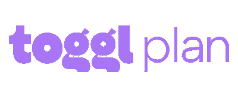

# 厌倦了吉拉和特雷罗的首席技术官的 10 个敏捷软件开发工具

> 原文：<https://www.stxnext.com/blog/agile-software-development-tools-for-ctos>

 2021 年，我们开始了一个新的十年。这似乎是一个做出一些改变的好机会。这也应该包括你的职业生涯——毕竟，每一个变化都有巨大的影响。

To make this process easier for you, we prepared a list of [software development](/services/) tools worth considering in the next months. Good work organization can improve your team’s efficiency and the overall results of your project. But it’s something that goes without saying. The question is, which tools can help you out in this process?

在我们的 [CTO 调查](/resources/cto-survey-2020) 中，超过 83%的 CTO 表示他们已经在使用敏捷方法。这就是为什么在这篇文章中，我们关注那些承诺与敏捷原则保持一致的应用。然而，我们跳过了吉拉和其他主流应用程序——我们想用一些你没有考虑过甚至可能从未听说过的工具给你一个惊喜。 

#### 完美的工具并不存在

首先，在浏览最有趣的 CTO 工具列表之前，停下来想想你的需求是什么。市场上充满了应用程序，其中一些声称是“最好的工具”。但什么是“最好”呢？有些解决方案对一个人来说可能很好，但对另一个人来说却不是。

##### 在选择最适合你的新应用程序之前，请思考以下问题:

*   你的预算限制是什么？
*   您更喜欢一体化解决方案还是专用工具？
*   有哪些必备功能？
*   您需要将应用程序与您正在使用的其他工具集成吗？

那只是你的起点。你可能需要考虑其他因素。显然，你知道的越多(关于你的团队、限制和你想要达到的目标)，选择正确的工具就越容易。但是如果你不能马上回答所有这些问题，不要担心。这份清单将向你展示一些你能在市场上找到的选择，这样你就能更容易地决定你需要什么:

#### 智能工作表

**定价:**个人计划每月每用户 14 美元起；

**App 集成包括:** Zapier，Slack，Qlik，微软 365，G Suite，Egnyte

我们从一个不是小众、未知工具的应用程序开始这个列表。恰恰相反——在过去的四年里，Smartsheet [的员工数量增加了两倍。](https://www.bizjournals.com/seattle/news/2021/01/04/smartsheet-hits-1-800-employees.html) 如果其增长率保持不变， [到 2023 年底，其收入可达 10 亿美元。](https://www.smartsheet.com/sites/default/files/451_Reprint_Smartsheets%20rapid%20growth%20could%20see%20it%20reach%201bn%20revenue%20in%20just%20a%20few%20years.pdf) 这种成功的背后站着什么？

将 [Smartsheet](https://www.smartsheet.com/) 与其他时间管理应用区分开来的是一个类似 Excel 的界面。该应用程序允许您实时协作并自动化工作流程。另外，您可以使用额外的模板。

然而，该应用程序也有一些缺点。例如，如果你习惯于 Excel 公式，你可能会惊讶于其中一些不起作用。当然，与 Smartsheet 所能提供的相比，这只是一个小小的不便。

#### Toggl 计划

****

**定价:**最多 5 个用户的免费计划，付费版本从每个用户每月 8 美元起

**应用集成包括:** Trello、Github、Chrome 扩展、谷歌日历、Slack

Toggl 计划创建于 2011 年，是一个内部时间跟踪工具，提供比电子表格和甘特图更灵活的计划。六年后，它成为了一个独立的业务和一个公认的时间跟踪软件。

尽管 Toggl 计划主要与时间跟踪功能相关联，但它也提供了一个敏捷的任务跟踪器。该应用程序承诺简单，并被认为是使规划顺利和不复杂。这些功能是有限的，但旨在使这一过程更加轻松——正如拖放功能所证明的那样。

功能的减少意味着您可以相对快速地掌握该工具，尽管习惯于更全面的软件的团队可能会渴望更多。

> 我最近最喜欢的组织发现是 [@togglplan](https://twitter.com/togglplan?ref_src=twsrc%5Etfw) 。我是通过 [@dsquintana](https://twitter.com/dsquintana?ref_src=twsrc%5Etfw) 听说看板的。对我来说，保持对我参与的各种不同项目的概述是一个真正的游戏规则改变者。
> 
> — Olivia Kirtley (@LivveyKirtley) [September 24, 2020](https://twitter.com/LivveyKirtley/status/1309178338456600580?ref_src=twsrc%5Etfw)