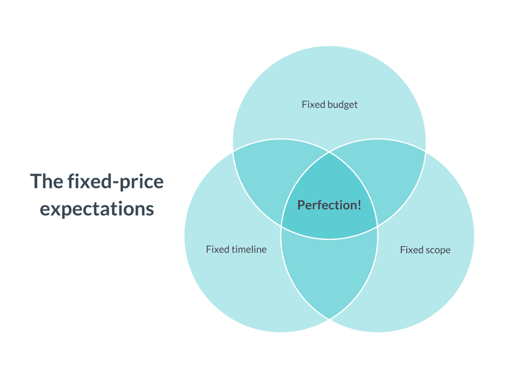
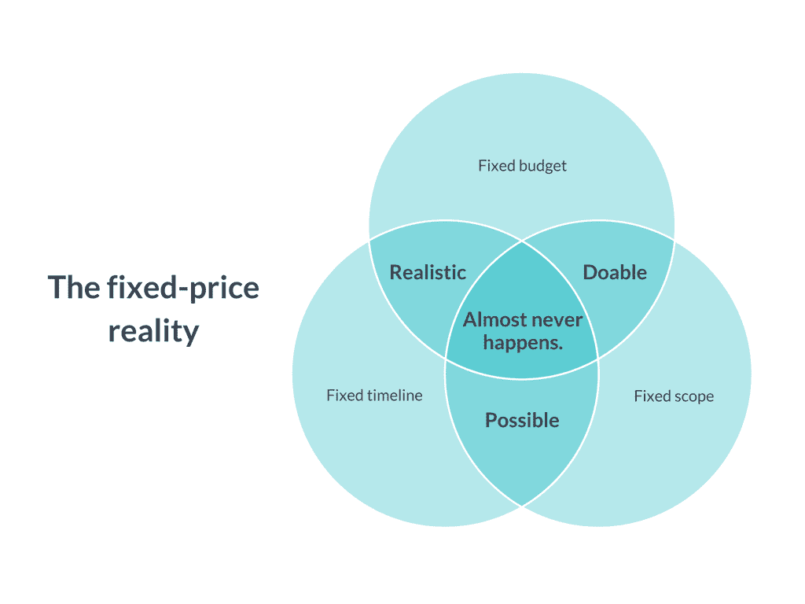

# 软件开发合同:固定价格与时间和材料

> 原文：<https://www.stxnext.com/blog/software-development-contracts-fixed-price-time-materials/>

 当你决定与一家软件公司合作时，你应该签署什么样的合同？

你不希望开发合同的手续束缚你。没有什么比工作被迫停下来为“重新谈判”腾出空间更糟糕的了。

如果有一个灵活的交易，让你自由地指导你认为合适的发展，那会对你更好。让你保持敏捷的安排。

为了更深入地研究软件合同这个主题，我请教了 STX Next 的服务交付主管 Krzysztof Karolczak。他帮助我理解了  **固定价格合同与时间和材料合同之间的区别。**

我们还在我们的  [外包软件开发综合资源](https://stxnext.com/software-development-outsourcing-guide/)中使用了 Krzysztof 的专业知识。如果你着眼于大局，就去那边吧。同时，你需要了解这两种合同。

 

#### 固定价格软件开发合同:考验与磨难

##### 1.什么是固定价格合同？

**固定价格合同是一种安排，在这种安排中，你为在给定时间内以给定金额生产的给定产品付款。**

在软件项目的情况下，你为你已经  [设想](https://stxnext.com/ebooks/what-is-python-used-for/)的软件产品付费，并且你想从一开始就知道这个产品将做什么，需要多长时间来构建，以及你将为它支付多少费用。

##### 2.固定价格合同的好处

你为什么想要一个固定价格的合同？因为你有固定的预算。在这个固定的预算中，你希望实现软件开发的**:**三连胜

你想知道工作要花多长时间，  **要花多少钱，****你会得到什么特性** 。

然而，困难在于:建立这三个变量通常比开发本身需要更多的时间。尤其是如果你想确定你已经建立了什么。

##### 3.固定价格=固定计划？

固定价格软件合同的问题在于，固定价格意味着固定的范围。 你在假设发展计划不会有变化。

然后，计划不可避免地改变了:

*   你看着软件的中期开发，并为进一步的工作提出了很好的新建议。
*   最终用户开始发送反馈，你开始发现他们真正想要什么。
*   市场在变化，迫使你去适应它的需求。或者，在内部工具的情况下，您公司的过程可能会在开发过程中改变。
*   你的商业模式改变了。
*   你的程序所依赖的第三方软件。

以上任何一个原因都可能迫使你重新考虑你的计划。当变更发生时，必须发出变更请求。

根据 Krzysztof 的描述，  **变更请求可能是一个主要的障碍。** 主要是因为他们实施了一个僵化的范围，使得任何新的有价值的想法都难以实施。

范围的任何变化都会影响预算，因此有必要重新协商整个交易。销售人员需要参与进来，询问客户，“这种改变还需要五天时间。你接受吗？”

**回想一下在您的组织中做出发展预算决策需要多长时间。** 在做出决定并获得认可之前，开发人员不能着手开发特性。

当然，更多的变更意味着更多的变更请求意味着更多的协商时间——以及更少的开发时间。

##### 4.你不可能总是知道自己想要什么

我并不是说你不能总是  *得到* 你想要的东西，因为滚石已经涵盖了这一点:

[//www.youtube.com/embed/3dfYcQ_r_x8](//www.youtube.com/embed/3dfYcQ_r_x8)

但他们的下一句话更重要:这一切都是为了得到你  *需要的东西。*

**这让我们想到了头号固定价格罪。** 你假设你想要的正是你需要的，或者你的市场和用户需要的。

但是后来发现，由于不可预测的复杂性，一些功能可能几乎不可能根据规格来创建。其他功能需要扩展才能发挥作用。你要么超出预算，要么留在预算内，得到一个无法使用的产品。

从一开始就建立绝对的所有需求是危险的，因为如果你忘记了什么——你  *将* 耗尽预算和时间。

事实上，通常在开发过程的开始阶段  **，你有一个非常具体的预算和一个非常模糊的想法，关于你要创造什么。**提炼这个想法的最佳方式是通过反馈。

对于固定价格合同，反馈周期要长得多，例如，你可能只在工作 2-3 个月后才提供反馈。然后，你转回到下一个零件的固定价格谈判，并在接下来的 2-3 个月内继续编码。估算这些固定价格的大块需要大量的工作，并且花费大量的时间进行协商。它会让你慢下来。

因此，如果你真的关心按时得到结果，固定价格可能不是办法。

#### 时间和材料软件开发合同:固定价格的替代方案

因此，您可以采用固定范围的“瀑布”方法，计划一切，然后以“一劳永逸”的方式外包工作。

或者，您可以立即与一个专门的开发团队开始，并在进行过程中一起创建愿景。

这就是时间和材料合同更适合你的时候。

##### 1.什么是时间和材料合同？

在时间和材料合同下，你为开发团队的工作和专业知识付费，你可以用任何你想要的方式来指导。

时间和材料合作是基于路线图形式的一般范围和时间估计。它没有严格的结束日期和“一成不变”的范围。这意味着你可以扩大或缩小开发规模，或者在你认为合适的时候终止合作。通知期通常是从做出决定的那一刻开始，直到下个月的最后一天。

##### 2.时间和材料合同的好处

*   **变化不成问题。**

有了时间和材料，变更只是简单地将其他项目在待办事项中下移。由于合作是开放式的，你可以说，“我们拥有的已经足够了，让我们用一个月的时间来完成这个项目，我们会有一个足够好的 MVP。”

*   **你马上开始发育。**

你开始建造，而不是谈论建造什么。你会更快地看到第一个结果。

*   **您可以更快地将您的产品提供给潜在的最终用户，并验证其价值。**

时机就是一切。

*   **你可以看看自己能完成多少工作。**

更重要的是，你可以在特定的时间内或者在一定的预算内进行估算。

*   **你降低了产品“过度设计”的风险。**

您可以经历连续的迭代，直到您得到一个可以验证的 MVP，而不是预先计划它的所有元素。迭代你可以与之交互的东西比修改一份 100 页的规格文档要容易得多。

*   在每次迭代中，你可以给开发团队具体的反馈。

你根据你接触过的实际软件来收集反馈。

*   **你很灵活。**

有了时间和材料，扩大团队规模(为了更快地开发)或缩小规模(为了省钱)就容易多了。

*   你也能更好地控制优先考虑的事情。

你可以先推出能给你带来收入的功能，或者对最终用户至关重要的功能，或者难以实现的功能。你决定吧。

关于时间和材料的明显保留是项目可能会超出预算。 但是当你主要关注每个特性的商业价值时，你通常会更快地完成工作。你可能只进行了几次开发冲刺，结果已经是一个有价值的 MVP，你可以向最终用户和投资者展示。

另一个相反的观点可能是，如果你走固定价格路线，你可以在花一分钱开发之前从头到尾设计软件。这都是真的，但是在计划上花费这么多时间，你仍然冒着由于不断变化的市场条件而导致的复杂化的风险(正如我们已经建立的，变更请求是地狱)。

有了时间和材料，你可以在一个星期后拥有第一个工作特性，你可以提供快速和相关的反馈，然后根据需要切换齿轮和纠正过程。

那么，你是想花两周时间来讨论你想要构建什么，还是开始构建和测试，看看你能完成多少，以及它如何符合你的愿景？

#### 固定价格与时间和材料:建立需求

固定价格合同的主要挑战是，在开发开始之前，你必须有所有潜在问题的答案。通常这些答案以包含精确开发规范的长文档的形式出现。

这份文件需要大量的工作来编写。阅读和处理需要很长时间。文档遗漏的任何东西都可能影响实际的工作范围，这意味着项目仍然可能超出预算。

此外，提前准备文档会剥夺您向雇佣的开发人员咨询的机会。文件中提出的技术方案是否可行？它们是最高效的吗？有些功能是不是矫枉过正？如果你想在你的固定价格内得到结果，你需要自己回答这些问题，并确定你的答案。

因此，如果你在寻找一个固定的价格，你也需要一个精确定义的范围。它基本上迫使你进入一种瀑布式的思维方式:“设置并忘记，让我们看看几个月后我们会得到什么。”

**时间和材料让你采取更加敏捷的方法。但这并不意味着你可以盲目地进入。**

你不需要为整个项目建立需求，你只需要开始计划前一两个星期。你可以和你的外包伙伴一起做，咨询他们每个特性的可行性，而不是单独做。

然后，通过改进和计划，你会得到一个不断发展的短期游戏计划。您改进的每一步都是为了最大化您获得的商业价值。

 

#### 这与代码行无关；这关乎商业价值

所以你决定签订一份时间和材料合同，为你购买一定数量的开发和测试时间。实际上，你已经把你的现金预算换成了“劳动力预算”你把钱花在什么地方了？

请记住，平均初始积压可以包括 200-300 个职位。你怎么能决定先做什么？

一个很好的开始方式是通过商业价值评估。不要看“随时间交付的特性”，你要试着确定每个特性一旦发布会给你的企业带来多少价值。

根据您的业务，您的 BV 可能由许多因素决定，例如:

*   **【潜在收益】，**
*   **，，**
*   **对报名人数的影响，**
*   内购
*   **等。**

**为了把所有的因素放在一起，你可以假设一个任意的商业价值货币，例如 1 BV。或 1 金币。或者 1 头金牛。但是在这个例子中我们将使用 1 BV。**

然后，您可以使用 BV 估算来建立待办事项优先级。例如，假设你决定特性 A 对你来说值 100 BV，而特性 B 值 50 BV。然而，功能 A 需要 10 个小时来开发，而功能 B 需要 1 个小时。你知道什么应该优先考虑。

(当然，要分配现实的商业价值，你应该很好地了解你的市场，以实现每个功能的 BV。那是困难的部分。如果你不了解市场，你分配的 BV 可能不能反映现实。)

BV 对于那些有很多令人兴奋的改进计划，但不知道什么会让他们的应用程序更有用的初创公司来说很有用。你可以添加一些东西来满足你的目标客户的需求，帮助你赚钱，而不是添加一些花里胡哨的东西。

例如，你可以重建你的用户面板，让它“更现代”——但是你的用户通常不会在意。至少不足以影响你的底线。或者，你可以在你的应用中添加一个支持不同货币的新支付系统。后者对 BV 的影响显而易见。

这就是为什么，在与一家  [软件外包](https://stxnext.com/software-development-outsourcing-guide/) 公司合作时，你不应该看在给定的时间内提供了多少代码。相反，  **关注代码交付的商业价值。一个[有能力的产品负责人](http://bit.ly/stxpowner)** 会非常了解你的产品环境，足以帮助你建立 BV-heavy 特性并加速它们的发布。

#### 时间和材料:如何做好

*   **明白自己想多早停多晚停都可以。**

时间和材料的优势在于灵活性。如果你看到的结果与你的预期不符，或者如果你的财务状况发生了变化，你可以减少损失并退出。

*   **要通透，要投入。**

在理想的 T&M 伙伴关系中，双方都参与发展进程。只有你，客户，可以核实和建立优先级。因此，T&M 不是那些想要“一劳永逸”的人的选择

*   信任你的伴侣——但要核实工作时间。

时间和材料似乎是一个危险的解决方案。毕竟，您信任您的软件合作伙伴对开发范围的控制。因此，你必须相信他们能有效地利用时间。保持这种信任的一个好方法是和使用时间追踪软件的伙伴一起工作。通过直接访问软件公司的内部网，您可以确保开发人员的时间和您的金钱得到了合理的利用。

*   **不要太灵活。**

知道开发人员将实现您想要的任何东西，您可能会发现自己变得过于雄心勃勃。如果开发团队不够自信，并且你没有过滤器，你的待办事项清单可能会被大量多余功能的建议填满。而是认为“简单才是王道。”专注于能带来最大商业价值的特性——一个好的产品负责人会帮助你快速识别这些特性。

*   **密切关注开发者的动机。**

如果你看到士气下降的迹象，向 Scrum 主管报告你的担忧。他们有责任确保工作进展顺利，团队精神高涨。

#### 最后的想法

你可能认为这篇文章有点偏颇。时间和材料合同似乎是明显的赢家。但这只是因为我们相信大多数软件项目，而且在大多数情况下，它们确实是优秀的。

软件产品不同于汽车或房子。物理结构给变化和即兴创作留下了很少的空间。另一方面，使用代码，您可以随时进行转换。

这就是为什么最好的方法是从小处着手(但不要慢！)，创建第一个迭代，然后进行修改。时间和材料赋予你这样做的灵活性。

但是这种灵活性需要信任，这就是为什么像我们这样的软件公司渴望通过  [代码评审](http://bit.ly/stx-code-review) 和  [UX 审计](http://bit.ly/stx-ux-audit)来展示他们的专业知识。一旦建立了信任，一切都会变得更容易。

如果你正在考虑软件合同和外包的复杂性，也许你想看看我们的  [软件开发近岸](https://stxnext.com/ebooks/c-level-guide-to-software-development-nearshoring/)C 级指南，或者更好的是，  [直接联系我们](https://stxnext.com/contact-us/)？

