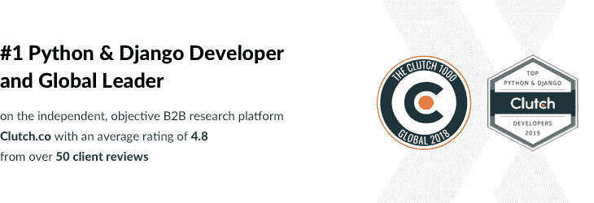
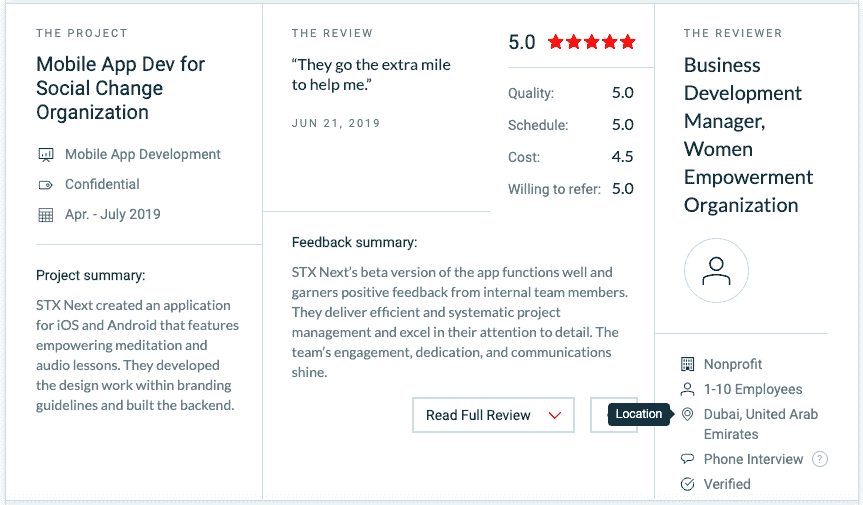

# STX 随后提名了 Clutch 的顶级金融服务软件开发商

> 原文：<https://www.stxnext.com/blog/stx-next-named-top-financial-services-software-developer-clutch/>

 是时候说说我们最新的离合器奖了！

**30 秒总结:**

*   Clutch.co 根据经过核实的客户评论对最佳 B2B 服务提供商进行排名，给每个客户打电话了解他们的印象；
*   他们只是给 STX 下了一个**2019 年度顶级金融服务软件开发商** 这大概跟我们伟大的  [fintech 项目组合](https://stxnext.com/portfolio/#fintech)有关系吧；
*   过去，我们在各种类别中获得过许多次这种类型的奖项[许多](/stx-new-blog/stx-next-named-industry-leader-clutch/)[许多](/stx-new-blog/stx-next-recognised-one-top-developers-poland-2017/)——但我们总是很高兴再获得一次！

这就是要点。请继续阅读完整的新闻稿。(读起来像新闻稿吗？是的，确实如此。) 

#### 我们如何成为顶级金融服务软件开发商

STX Next 的 300 多名技术和商业专家团队明白，优秀的软件始于编写第一行代码之前。

我们可能是欧洲最大的 Python 软件公司，但我们提供广泛的服务来满足我们所有客户的需求。对于我们来自全球的长期技术合作伙伴，我们已经管理了-、  [移动](https://stxnext.com/services/mobile-development/)、  [反应原生](https://stxnext.com/services/react-native/)、  [机器学习](https://stxnext.com/services/machine-learning/)、  [产品发现](/stx-new-blog/software-product-discovery-workshops/) 项目等等。

为了确保我们的客户无缝协作，我们的多元化团队包括  [产品设计师](https://stxnext.com/services/product-design/)、  [人工和自动化 QA 测试人员](https://stxnext.com/services/software-testing/)、  [开发运营工程师](https://stxnext.com/services/devops/)、  [商务沟通专家](https://stxnext.com/contact-us/) ，以确保我们的客户获得针对其项目的最佳服务。

STX Next 不仅提供多样化的服务，还为我们的客户提供价值。  **位于华盛顿特区的评级和评论公司 Clutch 提名 STX Next 为领先的金融服务软件开发商！** 我们欣赏赏识:

*“很高兴我们继续被 Clutch 和我们的客户认可为 Python 开发服务的顶级服务提供商。我们也很自豪地在不断增长的服务系列产品组合中获得越来越多的认可，包括前端开发、移动开发、产品设计、机器学习和 DevOps。”*

> ***马修·哈里斯，商务发展总监@ STX 接下来***

#### 关于离合器

离合器每年表彰领先的开发公司和其他 B2B 服务提供商。  [数据驱动的商业资源](https://clutch.co/developers/financial-services) 采用广泛的研究方法来确定顶级公司。

离合器团队评估一家公司的市场存在，项目历史和服务质量，这是由经验证的客户评论。

#### 对清单和可视对象的附加识别

STX Next 团队为我们的客户提供成功产品的能力也使我们在 B2B 购买指南 Manifest 上得到了认可。Clutch 的姊妹平台 STX Next 是波兰一家顶级定制软件开发公司。Visual Objects 将 STX 排在最佳软件开发者的第二位。

#### 最后的想法

我们非常感谢我们的客户向 Clutch 提供了宝贵的反馈。因此，STX Next 的团队继续因我们提供的多样化和高质量服务而得到认可。

无论你的项目处于什么阶段或范围，STX Next 都能帮助你编写代码。欢迎随时 [联系我们](https://stxnext.com/contact-us/) ！

