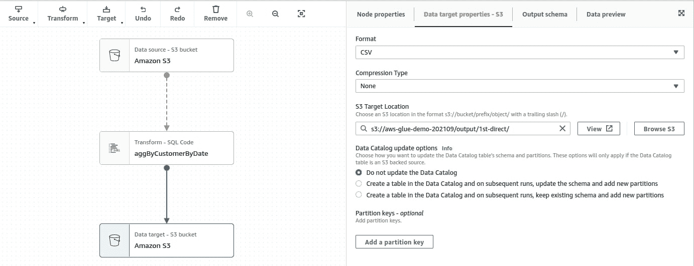

# AWS Glue Studio 指南——如何在不编写代码的情况下构建数据管道

> 原文：<https://www.stxnext.com/blog/aws-glue-studio-tutorial/>

 您可能听说过创建 ETL(提取、转换、加载)管道，尤其是复杂的管道，是一项复杂的任务。已经开发了各种工具来使这一过程变得更加容易，但大多数工具仍然需要一些编程语言的知识(例如， [Python 或 R](/blog/r-and-python-comparison/) ),通常还要结合对 Spark 等工具的理解。

2017 年 8 月，AWS 创建了 Glue DataBrew，这是一款非常适合数据和业务分析师的工具，因为它有助于数据准备和分析。一年前，该公司发布了 **AWS Glue Studio，**一个创建、运行和监控 Glue ETL 作业的可视化工具。

AWS Glue Studio 支持各种类型的数据源，如 S3、Glue Data Catalog、亚马逊红移、RDS、MySQL、PostgreSQL，甚至包括 Kinesis 和 Kafka 在内的流媒体服务。开箱即用，它提供了许多转换，例如 ApplyMapping，SelectFields，DropFields，FillMissingValues，SparkSQL，等等。我们可以将工作结果保存到亚马逊 S3 和 AWS Glue 数据目录中定义的表中。

此外，显然，我们可以在不了解 Spark 的情况下使用它，因为 Glue Studio 将为我们生成 Apache Spark 代码。

因此，让我们看看在实践中我们可以用 AWS Glue Studio 做些什么。我向自己保证，在解决我的案子时，我会尽量不写一行代码。

在本文中，我使用了稍加修改的 [电子商务数据](https://archive.ics.uci.edu/ml/datasets/online+retail) 数据集。 

#### 实践中的 AWS 胶水工作室

让我们假设您从数据分析师那里收到了以下任务:

一个系统正在上传每日 CSV 文件，其中包含以下信息:发票号、库存代码、描述、数量、单价、客户标识、国家、发票日期。计算每个客户每天售出的商品总数(数量)和总购买价值(每个商品数量的总和乘以单价)。将结果保存在 CSV 文件中，在 S3 桶中用逗号分隔。

我知道这听起来更像是数据分析师的工作，你们中的一些人可能认为这是一个简单而无聊的任务，但是不要担心，我们稍后会添加一些操作。

我的输入文件位于这个目录:*AWS-glue-demo-202109/inputs*

**

好了，让我们看看如何用 AWS Glue Studio 来做这件事。

要访问它，从主 AWS 管理控制台选择 AWS Glue，然后从左面板(在 *ETL)* 下点击 *AWS Glue Studio* 。转到*作业、*，在顶部你应该会看到*创建作业*面板——它允许你以几种不同的方式创建新的作业:*带有源和目标*的可视化、*带有空白画布的可视化、*、 *Spark 脚本编辑器*和 *Python Shell 脚本编辑器*。

我用空白画布选择了*视觉。*它应该创建一个新的、空的、无标题的作业。

在我们开始构建 ETL 流程之前，让我们转到 *Job Details* 选项卡，讨论一些决定 AWS Glue 如何运行作业的重要属性。除了作业名称，您可以随时更改这些设置。

*   *Glue version*—它决定了该作业可用的 Apache Spark 和 Python 的版本。**注意:**某些功能可能不适用于特定版本。例如，在撰写本文时，*数据预览*功能无法在最新版本 3.0 中使用。
*   *语言*—Python 或者 Scala。我选 Python。
*   *工作者类型* (G.1X 或 g . 2x)—对于 G.1X 工作者类型，每个工作者映射到 1 个 DPU。对于 g2x，每个工人需要 2 DPU。我选择了 G.1X，因为它比我实际需要的资源多得多。
*   *作业书签*(启用、禁用、暂停)—现在**这是一个相当重要的变量，**尤其是*启用*是一个默认值。简而言之:当您启用作业书签时，一旦您处理了一些数据(如 S3 文件)，**数据被一个作业标记为已处理，并且在下一次执行中将不会被该作业处理。**书签与作业绑定，所以不同的作业可以处理同一个文件。我现在禁用它，因为在我的工作发展过程中，我可能需要一遍又一遍地处理相同的文件。有关工作书签的详细描述，请阅读 [使用工作书签](https://docs.aws.amazon.com/glue/latest/dg/monitor-continuations.html?icmpid=docs_glue_studio_helppanel) 跟踪处理的数据。
*   *重试次数*—这是显而易见的。我现在将这个值从 3 切换到 0，因为我不希望 Glue 重试执行一个仅仅因为我犯了一些虚假的错误而失败的任务，比如使用一个空文件。

我不会进入*高级属性*部分，但是请记住，这是您可以配置 S3 脚本路径、Spark UI 日志路径、设置最大并发性、禁用指标等的地方。

**注意:**您必须为每个创建的作业设置这些设置，除非您正在克隆一个作业，否则其副本将与原始副本具有相同的设置。

现在，让我们回到*视觉*部分。

1.从*源中，*选择*亚马逊 S3* 节点。

在*数据源属性- S3* 中设置:

*   S3 源类型:S3 位置—因此您可以直接访问 S3 文件
*   S3 网址:S3://AWS-glue-demo-202109/input/
*   递归:真
*   数据格式:CSV
*   分隔符:逗号(，)

**注意:**你被限制在以下分隔符:*逗号，Ctrl+A，竖线，分号，制表符*。

现在，让我们转到*输出模式*选项卡。

嗯，这些数据类型看起来不正确，您必须改变这一点。点击*编辑*按钮，为每个键设置正确的数据类型(根据数据分析师提供的信息):

看起来不错，点击*下一个*，进入下一步。

2.做聚合。这是第一个“障碍”，因为 Glue Studio 没有内置的转换节点来允许我们进行聚合。最好的解决方案是使用 *Transform - Spark SQL 节点*。您可以将节点命名为 *aggByCustomerByDate，*，并在*转换*部分中，选择*亚马逊 S3* (父节点的名称)作为输入源，并给它一个*销售*别名*，*，您可以在您的 SQL 代码中将它用作表名。在*代码块中，*您可以放置一个简单的 SQL 查询，该查询采用 *customer_id* 列，从 *invoice_date* 列获取日期，对*数量和数量*单价*求和，并按照*客户*和*销售日期对其进行分组。*

让我们假设它没有违反我的“不写一行代码”的原则。

**注意:**这个编辑器不验证语法，所以在运行之前请仔细检查您的查询。【T2

*
*

3.现在您已经完成了聚合，将其结果保存到 S3。从*目标*菜单中，选择*亚马逊 S3* ，选择 CSV 格式。决定是否要应用任何压缩，并将目标位置设置为*S3://AWS-glue-demo-202109/output/1st-direct*

4.工作准备好了。在右上角，点击*保存*，然后*运行*，等待。您可以进入*运行*选项卡，查看作业进度，以及日志和运行元数据的链接。

一分钟后，您可以看到作业已经成功。

现在，转到目标 S3 目录。这里有 4 个文件:

每个文件包含*客户标识、销售日期、总数量*和*总销售额*。

好吧，这很快也很简单。但是我对这个解决方案不满意，你可能也不满意。没错，我对所有文件都进行了计算，但是明天新文件到达时会发生什么呢？像你一样，我不想再一次处理所有的数据。我们只对处理新创建的文件感兴趣。

此外，数据分析师还有一些进一步的要求。

1.他们记得有时*数量*可能是一个负值，表示某个商品被退回。他们希望我从聚合中排除这些行，并将返回项的列表存储在一个单独的文件中。

2.如果您仔细查看了最后一张图片，您应该会注意到第二行缺少了一个用于 *customer_id* 的值。分析师希望摆脱空壳客户。

3.分析师希望通过聚合将一些客户的数据(名字、姓氏、地址)链接到文件。

4.处理四个独立的文件有点麻烦——他们更喜欢只有一个文件。

让我们先解决我的问题。在我看来，有两种可能的方法:

1.前面提到的*工作书签。*正如文档所说:“*作业书签用于跟踪已经处理过的源数据，防止旧数据的再处理。作业书签可用于 JDBC 数据源和一些亚马逊简单存储服务(亚马逊 S3)源。工作书签与工作相关联。如果删除作业，其作业书签也会被删除。* *您可以将 Glue Spark ETL 作业的作业书签倒回任何先前的作业运行，这允许您的作业重新处理数据。如果要使用同一作业重新处理所有数据，可以重置作业书签。*

2.手动或通过使用函数或某些参数，决定应该处理哪些文件(日期或日期范围)。

第一种解决方案看起来很酷，但是假设我不能 100%确定数据是如何加载的——也许文件每天都会被覆盖？或者他们会突然开始那样做？或者您将经常修改我们的作业并为特定文件重新运行它们，并且您不想记住重置作业书签？

无论哪种方式，假设为了这篇文章，你根本不能或不想依赖工作书签。你现在能做什么？

例如，您可以过滤掉*Transform-Spark SQL*node 中的数据，但这并不能真正解决问题——作业仍将处理所有文件，您只是过滤掉输出或进入聚合的数据。您必须找出如何“逻辑地”划分这些文件

不要直接处理 S3 文件，尝试将 S3 文件组织到数据库和表格中。也许这样你就能更有效地查询数据了。为此使用 AWS Glue Crawler。

简而言之，AWS Glue 可以将 S3 文件组合成表格，这些表格可以根据它们的路径进行分区。例如，如果您的文件组织如下: