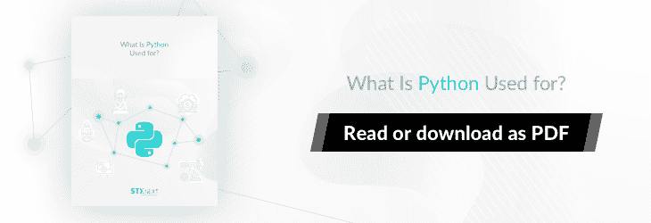
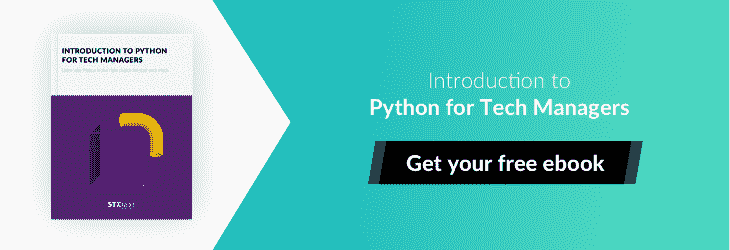
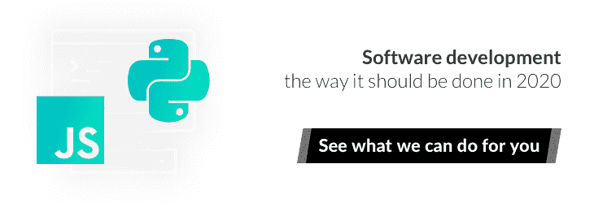
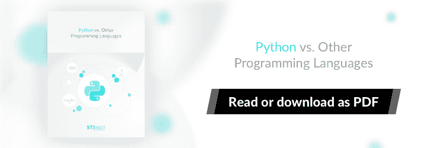
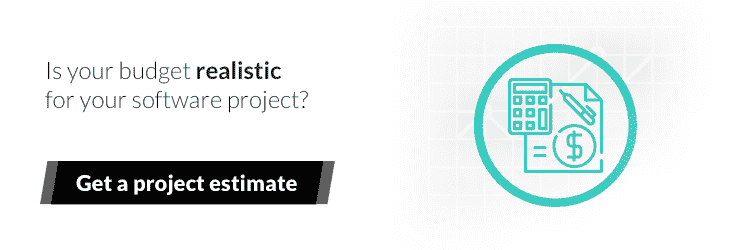

# 如何学习 Python:顶级网站和课程，从初学者到专业人士

> 原文：<https://www.stxnext.com/blog/learn-python-top-sites-courses/>

 有没有想过在网上哪里可以学习 Python 并且玩得开心？

在线学习可能很棘手。课程很少给你所有必要的信息，你最终会花几个小时搜索随机的东西来寻找答案，并最终对你的学习体验感到不满意。

谷歌显然是一个重要而有用的工具——尤其是当你知道如何正确使用它的时候。然而，不管你的技能水平如何，我们都希望通过给你 Python 之旅所需的一切来最大限度地减少你在这种情况下的谷歌搜索需求。

**在本文中，我们将探索学习 Python 基础知识、扩展知识和掌握这种强大语言的首选目的地。**

本文分为三个部分，每个部分针对不同的进步水平，具有不同的目的:

*   **初学者**——不被常见的学习障碍绊倒就能入门
*   **中级**——从业余到专业的过渡
*   **专业**——继续磨练自己的手艺，掌握自己的技能

请随意查看最符合您需求的产品！ 

#### 学习 Python，第一层:初级网站和课程

我们开始吧！第一部分是为那些还没有接触过 Python，或者刚刚开始学习，需要额外帮助的人准备的。

##### 1.TL；速度三角形定位法(dead reckoning)

*   [【自动化枯燥的东西】](https://automatetheboringstuff.com/)——在线书籍形式的基础 Python 课程，有实际例子，非常适合非程序员和初学程序员
*   [Python 文档](https://docs.python.org/3/)——你不确定的任何事情的首选资源
*   [Python 教程 99](https://www.guru99.com/python-tutorials.html)
*   [Python 编程的 Python 基础](https://pythonprogramming.net/python-fundamental-tutorials/)
*   [真正的巨蟒](https://realpython.com/start-here/)

当你第一次开始学习一项技能时，有巨大的热情和一段快速学习和进步的时间，随后是一片不确定性、怀疑和冒名顶替综合症的巨大空白。

换句话说，你从“太棒了，我马上就能成为 Python 大师了！”“我干嘛要自寻烦恼，我永远也不可能成为一名开发人员……”

一旦发生这种情况，许多人就会停止努力学习，放弃对知识的追求。

##### 2.“自动化枯燥的东西”:一条学习 Python 的清晰道路，即使对于非编码人员也是如此

这就是为什么  **开始时心中有一个明确的目标很重要。** 本着这种精神，我们要推荐的第一个网站是  [“将枯燥的东西自动化”](https://automatetheboringstuff.com/)

这是一本你可以在网上免费阅读的书，或者买一本实体的。在这本书中，软件开发人员兼教师 Al Sweigart 将带您了解 Python 的基础知识，然后教您如何在 web 上搜索信息、分析文档、自动发送电子邮件以及其他一些有用的东西。

材料是  **专为非程序员理解而设计，** 所以对于以前没有编码经验的人或者寻找一个简单的起点来熟悉 Python 的程序员来说非常棒。

真正让“自动化枯燥的东西”区别于其他课程的是 **它给了你一条清晰的道路。** 你学习概念并把它们应用到现实世界的例子中。它教你 Python 的实际应用，证明这种语言是多么强大和有用。

最重要的是，它会帮助你保持在正确的学习轨道上。

##### 3.Python 文档:必不可少，却被忽视了

接下来，学习任何编程语言的最基本——也是最常被忽视的部分: **文档。**

当你学习一门编程语言时，文档是寻找你所遇到的问题或你不清楚的事情的答案的第一个地方。  [Python 文档](https://docs.python.org/3/) 非常全面，为了让它们尽可能有用，我们做了大量的工作。

在文档中，在所有内容的描述旁边，您会发现:

*   [学习 Python 基础的教程](https://docs.python.org/3/tutorial/)，
*   [理解 Python 语法的语言参考](https://docs.python.org/3/reference/)，
*   [描述标准 Python 安装所附带的一切的资源](https://docs.python.org/3/library/)。

这些东西将  **为你节省大量时间** 当你试图掌握基础知识时，应该是你遇到无法解决的问题时的出发点。

在你问一个关于栈溢出的问题之前，在文档中寻找一个答案，并做一些谷歌搜索(这可能会引导你找到关于栈溢出的答案的现有线程)。

还是没人接？它是堆栈溢出。

##### 4.各种课程巩固你头脑中的 Python 基础

在学习的早期阶段，即使最简单的代码看起来也像神秘的龙魔法，这有助于收集多种观点。这就是为什么拥有  **几门课程是有用的，在那里你可以查找相同的概念并收集不同的答案** 以更深入地理解手头的问题。

这样，Python 的基本概念将被铭刻在你的大脑中，这在你进入中级阶段时会有很大帮助。

我们建议:

##### 一)  [Python 教程 99](https://www.guru99.com/python-tutorials.html)

对于初学者来说，这是一个很好的资源，有关于 Python 基础的详细教程和一些更高级的东西，会让你对 Python 能做什么感到兴奋。

教程写得很好，以博客帖子的形式附有图片和截图。

##### b) [Python 编程的 Python 基础](https://pythonprogramming.net/python-fundamental-tutorials/)

这是一门关于 Python 基础的课程，来自一个网站，该网站也有大量针对更高技能水平的课程。

与 Guru99 稍有不同的是，它为每个教程都提供了一个视频和一篇解释概念的代码示例文章。

##### c) [真正的 Python](https://realpython.com/start-here/)

你可能不得不花一点钱来获取这里的优质资料，但也有很多很棒的免费资料，你会发现它们真的很有用。尤其是涉及到最基本的问题时。

Real Python 既有视频课程，也有文章形式的教程，有代码示例和测验来测试你的知识。

 

#### 学习 Python，第二层:中级网站和课程

现在让我们离开对 Python 初学者的建议，进入下一部分。

你学 Python 已经有一段时间了。你很好地掌握了基本原理。你渴望开始建造更多的东西。

你应该去哪里？

##### 1.TL；速度三角形定位法(dead reckoning)

*   [全栈 Python](https://www.fullstackpython.com/)——超越 Python 基础的所有内容的绝佳参考点
*   [python 编程的课程](https://pythonprogramming.net/)
*   [阿里·斯皮特尔](https://dev.to/aspittel/moving-past-tutorials-a-course-on-problem-solving-for-programmers-3oa4) 的移动过去教程——学习编程语言的棘手中级水平的动机和建议

为了真正理解基础知识，很容易陷入通过不同教程的循环中。在一段时间内，它甚至可能是有益的，但如果你陷入基础知识太久，将很难推进到你的 Python 教育的下一个阶段 。

大多数程序员都会同意，最好的学习体验是做一些实际的事情。这就是为什么“自动化枯燥的东西”对初学者如此重要，因为你可以很快在现实世界的例子中使用 Python。

当你学习一项新技能时，中级水平是最棘手的。 你知道基础知识，但不知道如何应用它们解决复杂的现实问题。你可能甚至不确定你的  *能用你的知识* 解决什么类型的问题。更糟糕的是，教程和指南不再辅导或指导你了。

对于中级 Python 程序员来说，网上很少有好的资料。幸运的是，我们知道至少有一个伟大的网站。

##### 2.Python 综合扩展指南

幸运的是，对于中级 Python 程序员来说，有一个很棒的资源叫做  [全栈 Python](https://www.fullstackpython.com/) 。它为超出 Python 基础的所有内容提供了教程和解释，包括不同类型的 Python 框架、数据库、工具以及在现实世界中构建、测试和推广 Python 应用程序的最佳实践。

所以现在，就像你在不了解 Python 语言的时候查阅 Python 文档一样，你可以在需要理解 Python 基础知识之外的任何东西的时候查阅全栈 Python。

作为一名中级 Python 开发人员，您可以走几条明确的道路。你最好的选择可能是所有这些的组合(如果可能的话):

##### a)生成您自己的问题，并用 Python 解决它们

只要想出一个你想要构建的应用程序...开始建造吧！当然，一开始会很吓人，但是有了 Python 文档、全栈 Python 和栈溢出的帮助，你最终会完成它，并在途中学到很多东西。

##### b)获得远程实习机会

在这个水平上，你可能会被一家初创公司或  [软件公司](https://career.stxnext.com/)雇佣实习。如果你这样做了，它将为你提供一个清晰的途径来扩展你的教育，并且你已经获得了真实世界的编码经验。

##### c)开源项目的工作

寻找你感兴趣的基于 Python 的开源项目。分析代码库，努力成为贡献者。

##### 3.找一个你喜欢的利基 Python 领域

我们已经在初学者部分提到了[Python 编程](https://pythonprogramming.net/) ，因为他们提供了坚实的 Python 基础课程。但这不是他们提供的全部。

您会在那里找到大量课程，这些课程将引导您进入可以使用 Python 的不同领域:

*   机器人技术，
*   [游戏开发](https://stxnext.com/portfolio/digit-game-studios/)、
*   数据分析，
*   [网页开发](https://stxnext.com/services/python-development/)，
*   量子计算，
*   [机器学习](https://stxnext.com/services/machine-learning/)，
*   编程图形用户界面。

选择一个你感兴趣的话题，然后一头扎进去。无论你选择哪个领域，试着找到现实世界中的问题，并构建你自己的应用来解决它们。这是从一个中级 Python 爱好者成为专业 Python 开发人员的最好也是最快的方法。

##### 4.基本的第三方工具，不仅仅是 Python 开发人员的工具

对于中级 Python 程序员来说，另一件重要的事情是学习专业开发人员日常使用的第三方工具。这些可以简化你的工作，在你的个人项目中也会派上用场。

软件开发的一个重要部分是学习使用 Git 来管理你的代码库。要了解 Git 的最佳实践，请查看[LearnGitBranching](https://learngitbranching.js.org/)。这是一门设计精美、引人入胜的交互式课程，为学习使用 Git 的最佳方式提供了一种实用的方法。

另一件大事是 Docker。我们在这里最喜欢的资源是  [Play with Docker](https://training.play-with-docker.com/) ，这基本上是一个关于 Docker 的视频和教育材料的集合，从基础到高级进行了整齐的分类。

##### 5.让您在 Python 之旅中保持动力的软建议

最后，职业程序员 Ali Spittel 在 Dev.to 上发表了一个伟大的系列文章  [，为中级 Python 学生提供了大量有用的建议。你在那里找不到代码——只有给你勇气开始新项目并帮助你保持动力的软东西。](https://dev.to/aspittel/moving-past-tutorials-a-course-on-problem-solving-for-programmers-3oa4)

 

#### 学习 Python，第三层:专业级网站和课程

我们已经讨论了针对初学者和中间用户的教育资源。只剩下一部分:专业人士的网站和课程。

您已经构建了几个应用程序。你知道规矩。你可能是一名开发人员。

你是如何不断提高对语言的掌握的？

##### 1.TL；速度三角形定位法(dead reckoning)

*   [Codewars](https://www.codewars.com/)——挑战自我，学习最佳实践
*   -在排行榜上与其他程序员竞争，并获得有趣的工作

既然您已经是一名专业的 Python 开发人员，不要自满是很重要的。无论是挑战自己还是教导他人，你仍然可以学到很多东西。

##### 2.证明自己是代码战方面的 Python 专家

如果你正在寻找一个有益的学习经历，那么选择 [【代码大战】](https://www.codewars.com/)是不会错的。 它是许多 STX Next 开发者的首选实践网站，原因有几个。

标准的在线课程总是包含社区元素。这可能是一个论坛，脸书集团，或不和谐频道。这个想法是让人们通过互相学习来激励自己。

通常，社区只是课程的一小部分。

**Codewars 则不同。这纯粹是社区驱动的。** 用户创造代码挑战，为他们想出各种解决方案。您可以通过挑战发布问题，提出修复建议，或者就您不了解的事情提出问题。

高级用户管理内容并主持讨论，以确保无毒环境。

你在 Codewars 上做的主要事情是解决武士刀。Codewars 品牌深深植根于日本武术文化，这就是为什么挑战是一个形，等级是圭和丹，等等。

你也可以对打，这比形稍微复杂一点。你发布一点代码，而其他人对它进行重构或添加内容。这是针对还没有明确说明的挑战。一旦编码战士解决了这个问题，它就可以变成一个形。

许多挑战不是特定于代码的，如果你懂多种编程语言，这对于理解 Python 与其他脚本相比是如何工作的机制特别有用。

另一个让 Codewars 在你的教育追求中改变游戏规则的伟大特性是用户可以投票选出最佳解决方案。最终，你的方法会被提升为最佳实践。

相信我，对于开发人员来说，很少有比发现一行代码就能解决花了你 20 行代码才能解决的问题更有启发性的经历了。它让你保持谦虚——而谦虚正是你在 Python 教育的这个阶段应该做到的。

##### 3.在…一个游戏中编写 Python 代码？

Codingame 是 Codewars 的一个声音替代。它们大体上非常相似，只有一个例外:Codingame 也提供了一个  *游戏表示* 你的代码。那是什么意思？

你会遇到不同难度的编码挑战，但是所有的挑战都可以用一个游戏场景来表现。这为您提供了代码正在做什么的可视化表示。

Codingame 中的编码挑战不是特定于语言的，所以就像在 Codewars 中一样，您可以看到 Python 与其他语言相比是如何做事情的。

而 Codewars 看似没有什么不可告人的目的，除了给程序员提供一个提升的地方，  **Codingame 就有了找工作的成分在里面。**

您可以练习不同的挑战，甚至与其他开发人员竞争这些挑战。最好的一个赢得排行榜的第一名，当你试图找一份新工作时，这给了你吹嘘的权利。

Codingames 也有一个简单的求职功能，你可以在表格中填写四个输入: **你想在哪里工作，最低工资，首选工作，以及你的技术水平。** 如果需要你的技能，招聘人员会联系你。

 

#### 最后的想法

学习 Python 的热门网站和课程列表到此结束。这绝不是全面的，因为我们只关注那些我们自己已经尝试过并且可以担保的。

更多的在线资源提供 Python 教育，但是我们不想在不确定它们的质量符合标准的情况下推广它们。

我们希望我们的建议能帮助你成为 Python 大师。另外，如果你喜欢写博客，我们有一篇文章的配套文章，列出了让你开始学习 Python 的最佳博客。  [查看这里](/stx-new-blog/top-10-blogs-python/)。

但是也许你还没有决定选择 Python 作为你的编程语言？如果是的话，看看[Python](https://stxnext.com/what-is-python-used-for/)[的众多应用与其他流行语言](https://stxnext.com/python-vs-other-programming-languages/)相比如何。

你对我们的 Python 资源列表满意吗？你觉得我们错过了什么不该错过的吗？请在下面给我们留言，我们会尽快回复您。

最后但同样重要的是，一如既往，如果您有任何其他问题或顾虑，请不要见外！我们的大门永远敞开。

