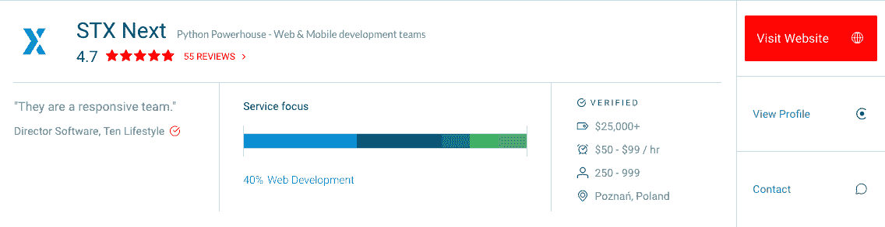

# 似曾相识:STX 下一个特色是离合器 1000 公司…再次！

> 原文：<https://www.stxnext.com/blog/stx-next-featured-clutch-1000-company-again/>

 随着年底的临近，Clutch 再次公布了他们的 Clutch 1000 全球排名。

就像去年一样，我们很自豪能够在这一类别中排名，其中包括离合器上排名前 1%的机构。

请继续阅读，了解我们是如何获得该奖项的，以及我们的业务发展总监对此有何评论。 

#### 行动纲要

*   STX Next 连续第二年位列 Clutch.co 全球 1000 强公司。
*   Clutch 是全球领先的 B2B 服务机构排名，列出了 500 多个类别的 27，000 多家机构。

*   这只是我们不断增加的离合器奖项中的最新一项。我们之前的奖项包括(大吸气…)2017 年顶级 IT 外包公司、[顶级开发者波兰 2017 年](https://stxnext.com/blog/2017/04/05/stx-next-recognised-one-top-developers-poland-2017/)、[顶级 B2B 公司波兰 2018 年](/stx-new-blog/stx-next-named-industry-leader-clutch/)、全球顶级 B2B 公司 2018 年、 [Clutch 1000 全球 2018 年](https://stxnext.com/blog/2018/11/30/stx-next-global-leader-clutch-1000/)、[顶级 Python & Django 开发者 2019 年](/stx-new-blog/stx-next-among-top-developers-clutch/)(仍然是这个类别的第一名！)，以及[顶级财务软件开发者 2019](/stx-new-blog/stx-next-named-top-financial-services-software-developer-clutch/) 。

这是 CliffsNotes 的版本，但如果你想了解细节，请阅读下面的内容。

 

#### 离合器 1000 上的顶级 web 开发人员

STX Next 是欧洲最大的 Python 开发者。我们开发代码，这样你就可以把你的愿景变成现实。

理解你的软件应该用什么语言编码是至关重要的——这就是我们的用武之地。我们利用我们的专业知识来帮助您创建最适合您的软件。

我们非常高兴地宣布，我们再次被评为离合器 1000 家公司名单中的顶级 web 开发人员！离合器，B2B 资源，允许商家  [查看不同服务商的服务](https://clutch.co/pl/web-developers) 。Clutch 根据行业数据、市场趋势、客户反馈和过去的项目绩效对服务提供商进行排名。

我们是入选这份独家名单的 15 家波兰公司之一。有趣的事实:Clutch 1000 只列出了在 Clutch 上排名前 1%的公司，而我们恰好是其中之一！

公告并没有就此结束。我们也在离合器的姐妹网站清单和视觉对象上被特别报道。

Manifest 是一种业务知识资源，可帮助公司通过特色列表提高知名度，而 Visual Objects 是一种组合展示资源，展示了几乎所有类别的领先服务提供商。这两个资源都将我们列为顶级 web 开发人员！

我们很高兴连续两年获得这个奖项。这种认可不仅让我们更加努力，也有助于验证我们的工作。

我们请我们的业务发展总监给我们讲讲他对这个大新闻的看法。他是这么说的:

“今年入选全球离合器 1000 强对我们来说尤为重要，因为我们最近将业务扩展到了荷兰。凭借我们新的国际业务，我们可以比以往更好地帮助全球客户。”

> ***— Matthew Harris，商务发展总监@ STX 下一个***

( [在此阅读更多关于我们向荷兰扩张的信息。](/stx-new-blog/history-stx-next-our-next-big-step/))

#### 借助 Clutch 上排名第一的 Python/Django 开发人员加速您的项目

有兴趣一起工作吗？  [联系我们](https://stxnext.com/contact-us/) ，我们将安排咨询，开发您梦想的软件！

