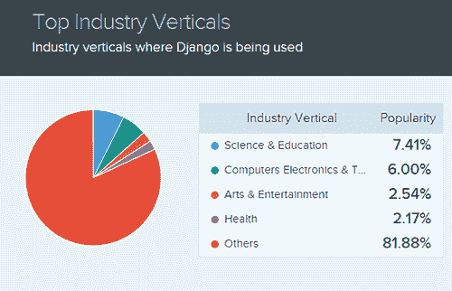
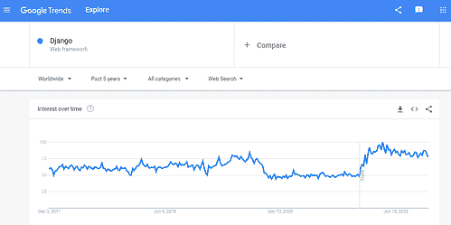
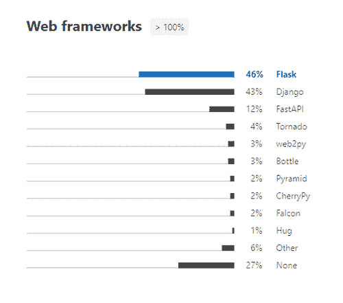
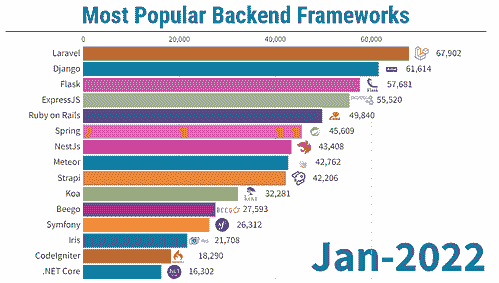

# Django 是什么，Django 是用来做什么的？

> 原文：<https://www.stxnext.com/blog/what-is-django/>

 如果你喜欢用 Python 构建软件 [，并希望进入](/services/python-development/) [web 开发](/services/web-development/) 领域，Django 可能是帮助你实现目标的工具。最受欢迎的 Python 框架之一， [Django 为 web 开发中的几乎所有常见任务提供了出色的内置解决方案](/services/django-development/) 。这意味着您可以更快地编写代码，更高效地交付项目。

此外，一些世界上最大的软件公司也在使用 Django，如 Instagram 或 Spotify。因此，这个出色的 Python 框架很有可能会帮助您满足所有的 web 开发需求。

在本文中，我们整理了一个 Django 教程，它简单易懂，内容丰富，非常有用。我们将详细探讨 Django 的基本概念——从 Django 是什么，通过为什么您应该考虑将它用于您的 Python 项目，到一些实际的例子。 

#### 什么是 web 框架？姜戈是什么？

在回答 Django 本身是什么之前，我们先试着理解一下框架是什么。

框架是用于简化 web 开发的模块集合。由于模块被分组在一起，从头开始创建应用程序或网站变得与框架无缝连接。这就是一个人如何开发具有高级功能的网站，如认证支持、联系方式、管理和管理面板等。

换句话说，如果你只用一种编程语言从头开始构建一个网站，你必须自己创建所有的组件。然而，框架带有内置组件，所以您所要做的就是正确地配置它们，使之符合您的站点。

Django 是一个用 Python 编写的高级 web 框架，是免费和开源的。由 Adrian Holovaty 和 Simon Willison 在 2005 年创建，它提供了大量的类、库和模块，可以在您的单个项目中实现。

Django 由经验丰富的开发人员构建，旨在加快开发过程，并鼓励务实的设计。因此，它可以节省你大量的时间和麻烦，帮助你专注于编写你的应用程序，而不是试图重新发明轮子。

此外，如果你想知道，“Django 是前端还是后端？”答案是，它是在考虑前端开发人员的情况下创建的。

由于 Django 是用 Python 编写的，所以它的模板语言让人感觉很舒服并且[容易学习](/blog/best-django-tutorials/)，即使对于那些习惯使用 HTML 的人来说，比如设计师和前端开发人员。尽管如此，它还是高度灵活和可扩展的，允许您根据需要改进模板语言。

关键的一点是，当使用 Python 进行 web 应用程序或 web 设计时，Django 框架可以提供巨大的价值。

#### 为什么用 Django？4 Django 的特性使它成为一个伟大的框架

在回答问题“Python Django 是什么？”我们还必须努力理解这一特定框架的独特特征。

##### 1.迅速发展

创建 Django 的主要目的是帮助开发人员在更短的时间内构建应用程序。值得一提的是，很多框架都将此作为它们的主要特性。然而，Django 提供的不仅仅是使项目实施阶段更快，这是它区别于竞争对手的地方。

通常，像为每个操作创建服务器文件，然后连接它们这样的小任务会消耗一半的开发时间和预算。然而，它们仍然是一个功能齐全的网站不可或缺的组成部分。Django 通过两条原则为开发人员简化了这类工作。

首先，Django 的快速开发原则允许开发人员同时进行多次迭代，而不必从头开始。第二，DRY 或“不要重复自己”原则允许开发人员为不同的项目重复使用现有的代码，或者为同一个项目创建额外的功能。

因此，开发人员可以花更少的时间在更小的任务上，更多地关注于为他们的网站创建独特的功能。此外，他们可以更快地将项目推向市场。

##### 2.增强的安全性

说 Django 非常安全是一种保守的说法。Django 的安全性超越了所有基本的安全特性。

让我们面对现实吧，开发人员在编写次要的开发任务时有时会拖延。然而，当您从零开始开发 web 应用程序时——特别是由于期限的临近而在很短的时间内——您会冒意外地将安全漏洞引入模块的风险。

传统上，这些漏洞是留给后端开发人员去解决的。但是 Django 自带了一个开箱即用的安全系统，默认情况下可以弥补开发过程中的所有安全漏洞。这意味着你可以放心，Django 会完成它的工作。

即使你不能立即判断 Django 提供的工作的质量和安全性，也可以问问后端开发人员。Django 涉及的常见安全问题包括跨站脚本、点击劫持和 SQL 注入。

最后，值得一提的是，Django 提供了快速开发而不牺牲安全性。该框架经常发布新的安全补丁来保护您的数据。此外，它还能快速响应漏洞，并经常提醒其他框架。使用其他技术的高级代码通常很难大规模实现这种安全级别。

##### 3.高通用性

Django 是一个通用的框架，可以用来创建各种领域的应用程序。它非常适合实施各种规模和容量的项目——无论您是想要构建一个高负载的 web 应用程序还是一个简单的网站。

虽然 Django 的逻辑项目结构和 MVT 架构有时可能看起来非常有限，但事实是它加载了额外的功能，并提供了一个坚实的基础，可用于创建处理大流量和大量数据的应用程序。此外，它是跨平台的，这意味着您可以将您的项目基于 Linux、Mac 或 PC——任何最适合您的平台。

此外，Django 可以与您已经在使用或即将使用的几乎任何现有技术集成。毕竟，Django 被称为 web 开发的未来是有原因的:它可以与几乎所有的主流数据库兼容。您可以为您的项目使用理想的数据库，甚至可以同时使用多个数据库。

世界各地的公司都在使用 Django 创建各种各样的应用程序，比如社交网站、内容管理系统、科学计算程序等等。

##### 4.出色的文档

Django 基于 [Python 编程语言，其语法类似于英语](/what-is-python-used-for/) 。这使得它相对更容易掌握，这也是很多开发人员选择学习这种语言和框架的主要原因之一。

此外，Django 多年来已经成熟。它拥有一个巨大的支持性社区，可以通过各种论坛、渠道和专门的网站轻松访问。所以，当你在开发过程中遇到困难或者需要为 Django 项目寻找开发人员时，寻求帮助总是比较容易的。

与市场上的其他开源框架相比，Django 还拥有最好的文档。事实上，它已经从优秀的文档开始，这只是通过定期更新和修复来改进。

任何技术的好文档就像一个巨大的图书馆——您可以无缝地搜索任何想要的功能。此外，技术文档越好，开发者就越容易使用它，而不是它的创造者。因此，开发人员可以确信，对于他们来说，找出特定用例的 Django 并不困难。

#### Django 框架和其他框架有什么不同？

Django 的特色是“模型、视图和模板”框架，也称为 MVT 框架。通常，MVT 被认为是 MVC 框架的替代方案，其中 C 代表“控制器”

现在，你可能想知道 MVT 和 MVC 有什么不同，为什么一个比另一个好。

这两种框架类型的主要区别在于，Django 架构本身充当控制器并处理其所有职责。或者更简单地说，Django 的模板处理所有与控制器相关的任务。那么，其他三个组件是做什么的呢？

##### 模型

模型是充当数据接口的组件。它连接用户界面和数据库，并负责维护数据。模型是整个应用程序背后的逻辑大脑，以数据库为特征。一些最常见的关系数据库包括 MySQL 和 Postgres。

##### 视角

视图组件与用户界面相关联，即您在浏览器中打开网站时看到的内容。用 CSS、HTML、 [、JavaScript](/services/javascript-development/) 、Jinja 文件或者其他前端技术等元素来表示。

##### 模板

模板使得从头开始创建 web 应用程序变得容易；例如，当执行复杂的操作或功能时。模板由特定 HTML 输出的静态部分和一些描述如何插入动态数据的特殊语法组成。

动态网站能够发送和接收变化的数据。动态数据通常与向用户提供个性化内容的场景相关联。例如，在 [fintech 产品](/services/fintech-development/) 或社交媒体帖子中的交易经常涉及动态数据。

#### 如何设置一个基本的 Django 项目或应用程序

在讨论技术说明之前，让我们先来区分 Django 项目和 Django 应用程序。

*   Django 项目

Django 项目是配置文件和应用程序的高级集合，作为管理整个 web 应用程序的逻辑部分。

*   **Django app**

Django 应用程序是 Django 项目的一个子单元，它是独立的，用来执行业务逻辑。Django 项目可以由零到多个应用组成。

Django 应用程序的奇特之处在于，它们不链接或依赖于包含在相同或不同 Django 项目下的其他应用程序。因此，理论上，你可以从一个项目中选择一个应用程序，然后把它放到另一个项目中，可以做任何修改，也可以不做任何修改。

给你一个实际的例子，把 Django 项目想象成一个完整的网站，把 Django 应用程序想象成该网站的独立组件，比如一个文章应用程序，一个装置和结果应用程序，以及一个排名表应用程序。应用程序通过记录良好的公共类和访问器方法相互交互。

##### 如何创建 Django 项目

现在我们知道了什么是 Django 项目和应用程序，让我们更深入地了解创建一个基本的 Django 项目的步骤。

要开始一个新的 Django 项目，您应该运行以下命令:*Django-admin start project my project。*

运行上面的命令会为 Django 项目生成一个基本文件夹结构，默认情况下包含五个基本文件。一个简单的项目结构足以构建一个单页应用程序。

在继续之前，让我们看一下这五个文件以及它们负责什么。

*   ***manage . py***这个文件作为一个快捷方式，允许你通过命令行与你的项目进行交互。它可以用于运行与您的项目相关的管理命令，例如启动服务器、同步数据库等。要获得可以对文件 *manage.py* 执行的命令的完整列表，请在命令窗口中运行以下代码: *$ python manage.py help。*
*   ***【init _ _】。py***
    一个空文件，充当 Python 包，用于执行包初始化代码。当包或包的模块被导入时，它被激活。
*   ***settings.py***
    它包含了项目的所有设置。这个文件可以用来注册创建的应用程序、静态文件的位置、数据库配置细节等等。这是一个在项目开发阶段会经常用到的文件。
*   ***urls.py***
    负责绘制项目中的路线和路径，这个文件包含了项目的所有链接和要调用的函数。
*   ***wsgi.py***
    它作为在 wsgi 中部署你的项目的网关接口。简单地说，它帮助您的 Django 应用程序与 web 服务器通信。

Django 的另一个优点是它安装了一个 web 服务器，使得在开发阶段在本地运行项目变得非常容易。您可以通过运行命令来测试您创建的项目: *python manage.py runserver。*

##### 如何创建 Django 应用程序

如前所述，Django 项目由 Django 应用程序组成，帮助您组织源代码。需要注意的是，没有 Django 项目就不能运行 Django 应用程序。现在，我们已经创建了一个 Django 项目，是时候创建一个 Django 应用程序了。创建这样一个应用程序有两种方法。

首先，您可以使用 *django-admin* 命令行实用程序并运行以下代码: *Django-admin startapp <新应用>。*其次，可以使用 *manage.py* 文件执行 *startapp* 命令:*$ python manage . py startapp<新 app >。*

在执行了 *startapp* 命令之后，您会看到一个新文件夹，它使用了您给它起的名字——在本例中是“new app”——添加到您之前的文件夹结构中。该文件夹还将包含几个其他 Python 文件。

创建 web 应用程序时，Django app 文件夹是您花费大量时间的地方。您还会经常使用 *settings.py* 文件夹，但是您将在 Django 应用程序“新应用程序”中构建大部分功能

在您的目录中，除了我们在 Django 项目创建阶段描述的五个基本文件之外，您还会发现其他文件。以下是这些文件的内容和作用:

*   ***models . py***
    web 应用程序的实体在该文件中声明，以允许 Django 与 web 应用程序的数据库接口。Django 会自动将模型翻译成数据库表格。
*   ***迁移/***
    这里存储了一些有助于跟踪对 *models.py* 文件所做更改的文件。这样做是为了确保数据库和 *models.py* 同步。
*   ***admin.py***
    内置 Django app 的配置文件，简称 Django Admin。
*   ***apps . py***
    app 的一个配置文件。
*   ***tests.py***
    用于为特定 app 编写单元测试的文件。
*   ***views.py***
    一个写你的 app 的代码逻辑的文件。它处理 web 应用程序的请求/响应周期。

至此，您已经完成了包含 Django 应用程序的 Django 项目的设置。现在，是时候开始实施你的想法了。从现在开始，由你来决定你想用 Django 做什么，或者你想创建什么独特的项目。

#### Django 是做什么用的？

如果你回顾一下 Django 的过去，你会发现这个 Python 框架最初是为了给报纸出版商的 web 应用程序 *Lawrence Journal-World* 提供支持而开发的。

考虑到这一点，Django 显然可以成为涉及大量内容、媒体文件或 web 流量的项目的理想框架——这正是 Django 最初被使用的地方。

尽管如此，开发者们很快意识到 Django 在出版业之外有着巨大的潜力。因此，他们开始采用这个框架来构建电子商务网站、旅游和预订行业应用程序、社交媒体平台等。

目前，Django 不再局限于单一甚至几个行业；它被用于在几乎每个部门创建各种各样的项目，如下所示:

**来源:**[【https://www.similartech.com/technologies/django】](https://www.similartech.com/technologies/django)

#### 哪些顶级网站用 Django？

看到世界各地的许多公司都采用 Django 是令人鼓舞的，更好的做法是了解 Django 目前的用途，以便更好地了解利用这个框架可以挖掘的众多可能性。

使用 Django 的最受欢迎的网站有:

*   Mozilla
    改用 Django 来处理高流量和 API 请求。
*   Instagram
    利用 Django 平稳运行，无缝添加新功能，并快速解决问题。
*   Pinterest
    使用 Django 处理大量媒体数据，同时保持用户友好的界面。
*   **Spotify**
    平台的创造者联合[【Python】](/services/python-development/)[Django](/services/django-development/)[机器学习](/services/machine-learning/) 来管理他们庞大的音乐库和其他数据。
*   Dropbox利用 Django 的共享、同步和可伸缩功能。
*   Reddit领先的网络内容平台使用 Django 的功能，如处理大量用户流量。
*   美国宇航局Django 帮助他们的网站处理高分辨率图像，并使几个功能元素更加可靠。
*   **华盛顿时报**
    使用姜戈来处理繁忙的交通。

名单上的其他玩家包括 Disqus、Bitbucket、National Geographic 和 Last.fm。要了解 Django 应用程序的更多示例，可以考虑浏览一下 [Django 网站](https://www.djangosites.org/) 数据库。他们有一个超过 5000(！)Django 支持的网站。

#### 什么时候用 Django，什么时候不用 Django？

在用 Django 启动一个新的软件项目之前，您应该确保这个框架非常适合您的目标。首先问问自己，对于新项目，什么对你最重要。是多才多艺吗？保安？支持？

您对这些问题的回答将帮助您做出更明智的选择，并且很有可能用 Django 构建一个优秀的 web 应用程序。

大多数情况下，利用 Django 开发 web 应用程序的组织这样做是因为他们希望快速开发产品。Django 致力于鼓励可重用代码的设计原则和模式。具体来说，它认真对待“不要重复自己”原则。这意味着，开发人员不必执行不必要的复制，这减少了代码量，并允许在未来快速更改或更新。

此外，Django 在防止常见的安全漏洞方面非常有效。因此，开发人员不必花费时间在 web 应用程序的基本安全特性上，这意味着开发时间的额外节省。

这就是像 Instagram、Disqus 和 Pinterest 这样的流行网络应用能够快速进入市场、处理大量用户流入并无缝添加新特性和功能的方式。

##### 什么时候应该使用 Django？

话虽如此，让我们看看什么时候应该使用 Django。仔细阅读下面的陈述，看看有多少适合你的情况。您同意的陈述越多，Django 就越适合您的项目。

*   你需要快速开发一个 web 应用或者 API 后端。
*   你希望创建一个集成了 ML，AI，DE 等前沿技术的应用程序。
*   您希望开发一个 web 应用程序，它可以快速部署，并可以根据您的需要进行伸缩。
*   你需要一款能够抵御最常见漏洞的应用。
*   您的应用程序将用于检索、发布或共享数据。
*   您希望 web 应用程序和 API 后端在同一个代码库中。
*   你希望利用开源软件。
*   你需要一个积极发展的框架，有好的文档，并且有一个支持的社区。
*   您需要 ORM 支持，并且希望避开管理数据库查询。

##### 什么时候不应该用 Django？

即使您完全同意上一节中提到的所有观点，Django 在以下情况下可能并不适合您的项目:

*   您正在构建一个巨大的 web 应用程序，这使得使用单个代码库很有挑战性。
*   你想建立一个没有数据库或其他复杂功能的基本应用程序。(在这种情况下，使用微框架比使用 DjangoT3 更好。)
*   你特别希望从零开始创造一切。
*   您的开发团队在 Python 编程方面没有经验，也没有能力投入时间或资源来获得合适的技能。
*   您计划将您的 web 应用程序归类到微服务中。(对于这样的用例，最好为每个微服务使用不同的框架，而不是为所有微服务使用一个框架。)

##### Django 适合哪些用例？

Django 提供了一整套工具，可以用来构建各种各样的 web 应用程序。此外，它在快速开发和企业功能之间取得了恰当的平衡，同时提供了简洁的设计，这是它成为流行甚至受欢迎的 web 框架的原因。

尽管如此，在决定为您的项目选择 Django 之前，您应该分析您的独特情况。为了让您更好地了解您是否在正确的轨道上，这里有一些可以使用 Django 创建的很棒的工具:

*   数据分析工具
*   社交媒体平台
*   内容管理系统
*   交易平台
*   投资管理应用
*   电子邮件系统
*   视频分享平台
*   基于云的存储
*   活动管理和票务系统
*   管理仪表板
*   新闻应用
*   验证系统
*   使用高级逻辑的过滤系统
*   电子商务市场
*   基于算法的生成器

对这些目的的认识应该有助于您进一步确定在您的 web 应用程序项目开发中考虑 Django 是否是一个好主意。

#### 姜戈是如何变得如此受欢迎的？

在过去的十年中，Python 的流行程度直线上升，导致 Django 被广泛采用。然而，这并不是各种组织选择使用 Django 的唯一原因。导致该框架越来越受欢迎的三个主要原因包括:

##### 1.可重复使用的应用

正如我们在本指南前面提到的，一个 Django 项目通常由几个 Django 应用组成。因此，一个 web 应用程序可以被分割成许多可重用的应用程序，这些应用程序本质上是 Python 包，可以进一步独立地用于创建其他项目。

这有助于组织代码，而且省时，因为您不必花时间从头开始为 Django 项目编写代码。

##### 2.对象-关系映射

ORM，或称对象-关系映射器，本质上是一个库或一组工具，将 web 应用程序连接到它的数据库。例如，想想 SQLAlchemy、Sequelize 或 TypeORM。其他 ORM 的问题是，您必须找到一种方法将大量查询整合在一起，并处理它们的迁移、播种等。

与此同时，Django 将所有这些放在银盘上提供给你。您所要做的就是插入您的数据库凭证，这个了不起的框架将处理剩下的事情。也就是说，您可以表达查询并操作数据库来获得结果，而无需编写原始 SQL 代码。

专家称 Django 的这一特性是一个工程奇迹，它利用 Python 的复杂方面使整个开发过程快速无误。

##### 3.默认管理面板

许多框架都试图让他们的管理面板用户友好，易于导航。然而，Django 框架的默认管理面板是不同的。

现在，有些人觉得 Django 的默认管理面板不太灵活，定制需要花费很多精力。虽然当您刚刚开始使用这个框架时，这可能是部分正确的，但是一旦您熟悉了 Django，您会发现轻微的学习曲线是值得努力的。

默认的 Django 管理面板结构良好，作为一个以模型为中心的界面，允许开发人员和非技术人员在内容和流程上进行协作。因此，它大大减轻了您管理应用程序的压力。

基本上，管理面板是一个后端控制面板，通过允许您创建、更新和删除数据库中的对象，可以节省您大量的时间。事实上，这个面板可以被定制成你想要它做的任何事情。

根据您的项目，您可以原样使用 Django 管理面板，或者用自定义模板替换它。无论哪种情况，使用管理面板都非常简单。最大的好处是您可以获得权限和认证模块，否则从头开始构建这些模块需要几天甚至几周的时间。

**来源:**[**https://trends.google.com/trends/explore?date=today%205-y&q = % 2Fm % 2f 06y _ qx**](https://trends.google.com/trends/explore?date=today%205-y&q=%2Fm%2F06y_qx)

就像 Django 本地支持的编程语言 Python 一样，这个框架已经发展了多年。谷歌趋势的上图清楚地表明了这一点。

此外，根据 [2020 年 JetBrains 开发者调查](https://www.jetbrains.com/lp/python-developers-survey-2020/) ，Django web 框架被认为是当年继 Flask 之后第二受欢迎的基于 Python 的框架。

[快进到 2022 年](https://statisticsanddata.org/data/most-popular-backend-frameworks-2012-2022/#:~:text=Most%20Popular%20Backend%20Framework%20January%202022&text=Laravel%20has%2067%2C902%20repository%20stars,49%2C840%20and%20Spring%20with%2045%2C609.) 而 Django 的人气依然没有消退。它被评为继 Laravel 之后第二受欢迎的后端框架。Django 拥有 61，614 颗储存库恒星，在过去两年中不仅成功超越了 Flask，还保持了第二的位置。

毫无疑问，姜戈的受欢迎程度会逐渐下降。经过多年的更新和改进，它已经非常成熟了。2022 年 11 月发布的最新版本 4.1.3 修复了上一版本的一个 bug，并将 Django 呈现为一个完整的 web 应用框架。

再加上许多知名网站都在利用这个神奇的 Python 框架，这意味着对 Django 的进一步开发和支持可能会永无止境。

#### 关于 Django 是什么和 Django 用于什么的最终想法

“姜戈是做什么用的？为什么用 Django？Django 是后端吗？”

这些只是我们在本文中回答的一些问题。我们还介绍了许多 Django 的独特特性，并查看了一些最好的 Django 应用程序，让您了解可以用 Django 做些什么。最后，我们提供了一个小教程，可以帮助你创建你的第一个 Django 项目和应用。

虽然这个迷你 Django 指南有望让你了解为什么 Django 如此受欢迎，为什么你应该选择它，但这只是冰山一角。关于这个伟大的 Python 框架，还有很多东西需要学习，这很难在一篇文章中涵盖。

拥有一个积极支持的 [Django 社区](https://www.djangoproject.com/community/) 的开发人员互相帮助，毫无疑问 Django 是各种形状和大小项目的最佳选择。

事实上，Django 是涉及大量内容(媒体文件)、高流量、用户交互和复杂功能或技术(机器学习)的项目的理想选择。同时，对于较小的项目，或者如果您计划在将来扩大项目规模，它也足够简单。这就是许多不同规模和目标的企业使用 Django 的原因。

如果你想进一步提高你的 Django 技能，可以考虑浏览我们网站上的以下资源:

*   [排名前 12 的 Django 包和库](/blog/top-django-packages-libraries/)
*   [Flask vs. Django:哪个 Python 框架更适合你的 Web 开发？](/blog/flask-vs-django-comparison/)
*   [2022 年 13 个最佳 Django 和 Django 休息教程](/blog/best-django-tutorials/)
*   [Django 与 Ruby on Rails 框架对比:哪个更好？](/blog/django-vs-rails-comparison/)
*   [姜戈发展服务公司](/services/django-development/)

最后但同样重要的是，如果您需要使用 Django 构建一个可定制的、可伸缩的、安全的应用程序，请随时查看我们提供的 Django 开发服务。另外，如果你对姜戈， [有任何其他问题，请随时联系我们](/hire-us) ！我们很乐意为您提供帮助，或者您可能需要的其他任何东西。