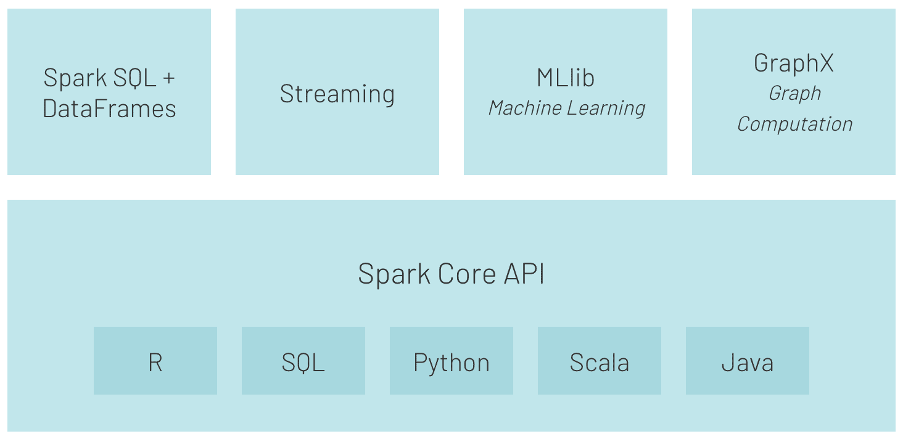
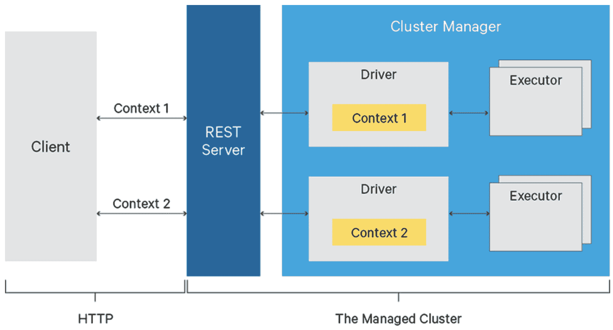
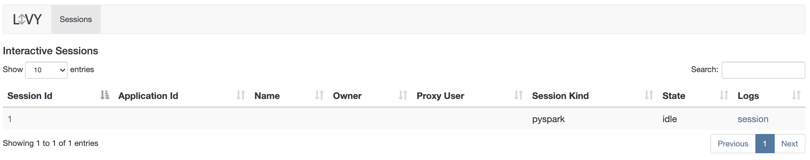
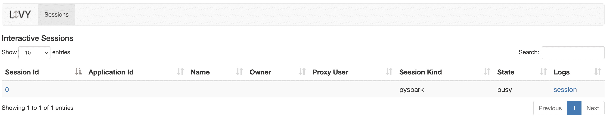
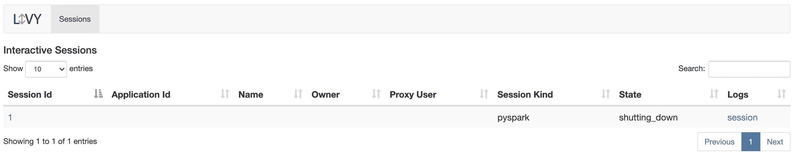
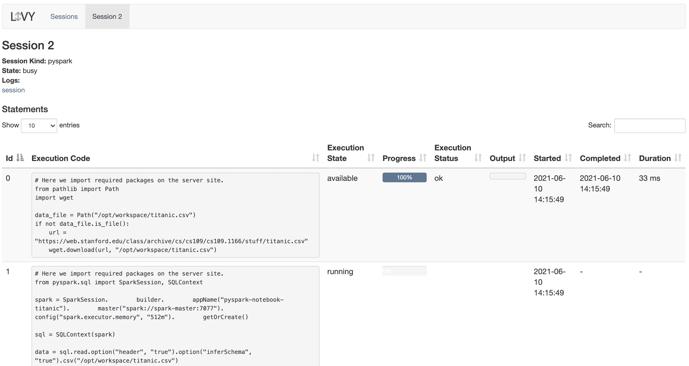
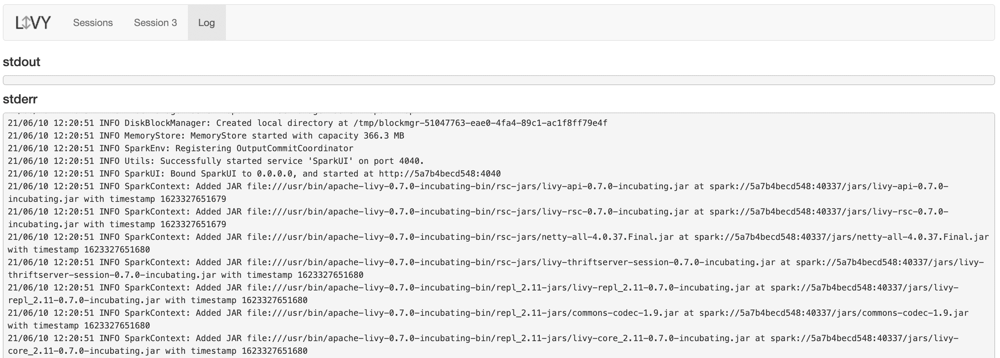
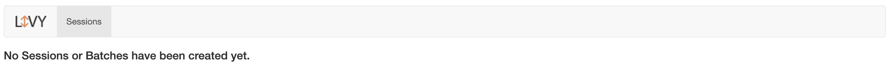
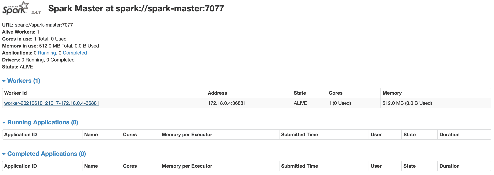
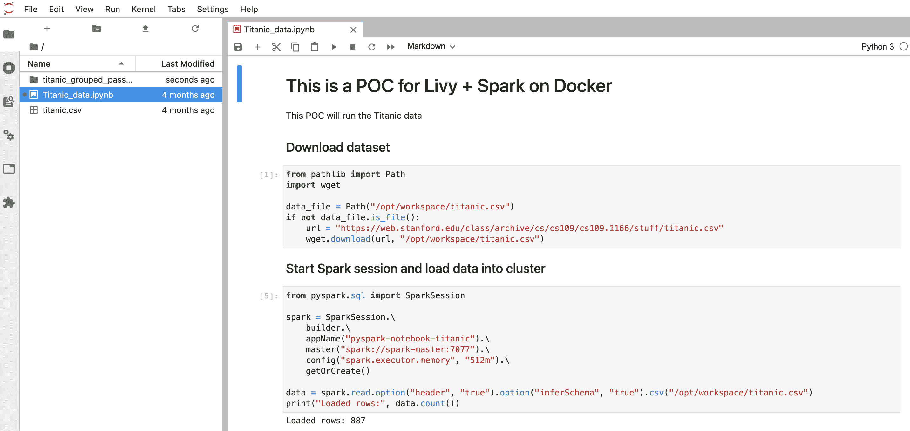

# 如何用 Docker、JupyterLab 和 Apache Livy 构建 Spark 集群 Apache Spark 的 REST API

> 原文：<https://www.stxnext.com/blog/docker-jupyterlab-apache-livy-rest-api-apache-spark/>

 您是否想过如何在项目中利用 Apache Livy，将您的 Apache Spark 集群体验提升到一个新的水平？我整理了一个循序渐进的指南来帮助你实现这个目标。

要运行一个示例项目并充分利用本指南，您需要首先安装 Docker 容器服务。如果你不熟悉容器，你会在 [Docker 文档](https://www.docker.com/resources/what-container) 中找到更多细节。

通过阅读本文，您将了解如何基于 Docker 虚拟环境使用 Livy 服务器和 JupyterLab 构建 Spark 集群。

您还将了解如何在 JupyterLab 中准备业务逻辑，并了解我如何使用一个示例项目通过 Livy 服务运行 PySpark 代码。 

#### 什么是阿帕奇火花？你为什么要用它？

Apache Spark 是一个分析引擎，用于以并行方式处理数 Pb 的数据。

得益于简单易用的[API](https://spark.apache.org/docs/2.4.0/api.html)和 RDD、数据集、数据框等结构以及丰富的运算符集合，以及对 [Python](/services/python-development/) 、Scala、R、Java 和 SQL 等语言的支持，它已经成为数据工程师的首选工具。

由于其速度(比 Hadoop MapReduce 快 100 倍)和灵活性(例如，支持 SQL 查询、机器学习、流和图形处理)，Apache Spark 被各行各业的企业大规模部署。



**来源:[https://databricks.com/spark/about](https://databricks.com/spark/about)**

#### 什么是阿帕奇李维？它对你的项目有什么好处？

Apache Livy 是一个通过 REST API 实现与 Spark 集群轻松交互的服务。

它的一些有用功能包括:

*   在 Python/Scala/R 中以预编译 jar 或代码片段的形式提交作业，
*   同步或异步运行 Spark 作业，
*   同时管理多个 SparkContexts，
*   长期运行的 SparkContext 可以被许多 Spark 作业重用，
*   跨多个作业和客户端共享缓存的 rdd 或数据帧，
*   安全认证通信。

您可能想知道如何让 Apache Spark 在自动化处理中更容易使用。

例如，我们可以想象这样一种情况，我们将 Python 或 Scala 编写的 Spark 代码提交到集群中，就像我们将 SQL 查询提交到数据库引擎中一样。如果我们不想通过命令行使用 SSH 直接访问集群，那么 Apache Livy 可以使用它的 REST API 接口。



**来源:[https://livy.apache.org/assets/images/livy-architecture.png](https://livy.apache.org/assets/images/livy-architecture.png)**

您是否必须创建一个额外的逻辑层来管理连接和所有 REST API 功能？

不，谢天谢地有一个名为*py lyivy*的专用库，我将在示例项目中使用它。你可以在这里 找到*py levy*的例子和文档[T5。](https://pylivy.readthedocs.io/en/stable/)

#### 测试在 Spark 集群中使用 Apache Livy 的概念

假设我们必须创建一个应用程序来处理 Spark 上的一些客户或市场数据，我们的应用程序将每天运行。

从开发人员的角度来看，我们首先必须准备带有业务逻辑的脚本。接下来，我们应该准备作业的控制器，通过 Livy REST API 管理与 Spark 集群的通信。

但是在我们开发任何东西之前，我们需要安装和配置 Livy 和 Spark 集群。

##### 设置要求

正如我在本文开始时提到的，为了保持操作系统不受依赖，我们使用 Docker 容器服务来运行我们的基础设施。因此，首先，我们需要为 Spark 主容器和工作容器准备 Docker 文件，并为 JupyterLab 准备一个单独的容器。

##### 安装和服务配置

如果您没有安装 Docker 服务，请按照这些[说明](https://www.docker.com/get-started)让它在您的机器上运行。

如果您在这里，我假设您已经让 Docker 准备好运行我们的容器，所以我们可以专注于代码。

为了让我们的概念更加现实，我决定将基础架构分成三个独立的服务:

*   jupyterlab,
*   火花大师，
*   星火工作者 1 号。

此外，为了保持逻辑简单明了，我为 Docker 服务创建了一个名为 *livy_poc_docker* 的专用文件夹。

第一步，我们将创建一个**基础映像。**

基本映像使用 Debian Linux，包含所有必需的库:python3、open-jdk-8 和实用程序，例如 wget、curl 和 unzip。

```
   FROM debian:stretch

   # System packages
   RUN apt-get clean && apt-get update -y && \
      apt-get install -y python3 python3-pip curl wget unzip procps openjdk-8-jdk && \
      ln -s /usr/bin/python3 /usr/bin/python && \
      rm -rf /var/lib/apt/lists/*
```

为了简化图像结构，我决定将 Spark 安装添加到基本图像中。对于生产用途，Spark 应该添加到单独的图像中。

```
   # Install Spark
   RUN curl https://apache.mirrors.tworzy.net/spark/spark-2.4.7/spark-2.4.7-bin-hadoop2.7.tgz -o spark.tgz && \
      tar -xf spark.tgz && \
      mv spark-2.4.7-bin-hadoop2.7 /usr/bin/ && \
      mkdir /usr/bin/spark-2.4.7-bin-hadoop2.7/logs && \
      rm spark.tgz
```

接下来，我创建了所需的目录并设置了环境变量。

```
   # Prepare dirs
   RUN mkdir -p /tmp/logs/ && chmod a+w /tmp/logs/ && mkdir /app && chmod a+rwx /app && mkdir /data && chmod a+rwx /data
   ENV JAVA_HOME=/usr
   ENV SPARK_HOME=/usr/bin/spark-2.4.7-bin-hadoop2.7
   ENV PATH=$SPARK_HOME:$PATH:/bin:$JAVA_HOME/bin:$JAVA_HOME/jre/bin
   ENV SPARK_MASTER_HOST spark-master
   ENV SPARK_MASTER_PORT 7077
   ENV PYSPARK_PYTHON=/usr/bin/python
   ENV PYTHONPATH=$SPARK_HOME/python:$PYTHONPATH
   ENV APP=/app
   ENV SHARED_WORKSPACE=/opt/workspace
   RUN mkdir -p ${SHARED_WORKSPACE}
   VOLUME ${SHARED_WORKSPACE}
```

然后，我为 **Spark master** 容器创建了一个图像。

Spark 主容器负责托管 Spark 主节点和 Livy 服务。

该图像基于之前创建的名为 *mk-spark-base* 的图像。

这一步将安装 Python 的其他包。

```
   FROM mk-spark-base

   # Python packages
   RUN pip3 install wget requests datawrangler
```

当然，我们也不能忘记阿帕奇·李维。

```
   # Get Livy
   RUN wget https://apache.mirrors.tworzy.net/incubator/livy/0.7.0-incubating/apache-livy-0.7.0-incubating-bin.zip -O livy.zip && \
      unzip livy.zip -d /usr/bin/
```

Spark master 将是我们必须暴露端口和设置入口点的最终图像。

```
   EXPOSE 8080 7077 8998 8888
   WORKDIR ${APP}
   ADD entryfile.sh entryfile.sh
   ENTRYPOINT ["sh", "entryfile.sh"]
```

好了，主映像的配置已经准备好了。现在，我们需要一个**工人形象**。

它只负责在 worker 模式下运行 Spark node，其他什么都不负责。

该图像也使用 *mk-spark-base* 图像作为基础。

```
   FROM mk-spark-base

   ENV APP=/app
   ENV JAVA_HOME=/usr
   ENV SPARK_HOME=/usr/bin/spark-2.4.7-bin-hadoop2.7
   ENV PATH=$SPARK_HOME:$PATH:/bin:$JAVA_HOME/bin:$JAVA_HOME/jre/bin
   ENV PYSPARK_PYTHON=/usr/bin/python
   ENV PYTHONPATH=$SPARK_HOME/python:$PYTHONPATH

   EXPOSE 8081 7077 8998 8888

   WORKDIR ${APP}

   CMD /usr/bin/spark-2.4.7-bin-hadoop2.7/bin/spark-class org.apache.spark.deploy.worker.Worker spark://${SPARK_MASTER_HOST}:${SPARK_MASTER_PORT} >> /tmp/logs/spark-worker.out
```

现在，是时候为 **JupyterLab 映像**创建一个配置了。让我们称它为 *mk-jupyter* 。

```
   FROM mk-spark-base

   # Python packages
   RUN pip3 install wget requests pandas numpy datawrangler findspark jupyterlab pyspark==2.4.7

   EXPOSE 8888

   WORKDIR ${SHARED_WORKSPACE}

   CMD jupyter lab --ip=0.0.0.0 --port=8888 --no-browser --allow-root --NotebookApp.token=
```

这有多简单？

最后，我们有了集群所有容器的配置，现在是构建映像的时候了。这个简单的脚本运行 *`docker build`* 命令来创建所有需要的图像。

```
   # Builds images
   docker build \
   -f base.Dockerfile \
   -t mk-spark-base .
   docker build \
   -f master.Dockerfile \
   -t mk-spark-master .
   docker build \
   -f worker.Dockerfile \
   -t mk-spark-worker .
   docker build \
   -f jupyter.Dockerfile \
   -t mk-jupyter .
```

让我们在 CLI 中运行它: *`sh build.sh`.*

要启动已经构建好的容器，我们必须准备一个 Docker 合成文件。

```
   version: "3.6"
   volumes:
   shared-workspace:
   name: "hadoop-distributed-file-system"
   driver: local
   services:
   jupyterlab:
   image: mk-jupyter
   container_name: mk-jupyter
   ports:
   - 8888:8888
   volumes:
   - shared-workspace:/opt/workspace
   spark-master:
   image: mk-spark-master
   container_name: mk-spark-master
   ports:
   - 8080:8080
   - 7077:7077
   - 8998:8998
   volumes:
   - shared-workspace:/opt/workspace
   spark-worker-1:
   image: mk-spark-worker
   container_name: mk-spark-worker-1
   environment:
   - SPARK_WORKER_CORES=1
   - SPARK_WORKER_MEMORY=512m
   ports:
   - 8081:8081
   volumes:
   - shared-workspace:/opt/workspace
   depends_on:
   - spark-master
```

Docker compose 文件负责服务编排，并描述输入参数，如服务名称、端口、卷和环境变量，以及服务之间的依赖关系(如果存在的话)。

##### 编码业务逻辑

如果您在这里，我假设您已经成功地完成了前面的所有步骤，并且所有容器都在运行。这是服务器站点。

现在，我们将关注我们项目的业务逻辑——客户端站点。正如我前面提到的，现在我们需要创建客户机脚本来使用 REST API 与 Spark 服务器通信。

在我们开始编码之前，我建议创建一个单独的项目来存放我们的代码。姑且称之为 *livy_poc* 。

为了使用 Livy 服务器，我们将使用一个名为 *pylivy* 的 Python 库。当然，你可以直接使用*请求*包来玩 REST API，但是在我看来*py levy*会简化我们的代码很多。

所以，首先，我们必须像` *pip install -U livy* 一样安装所需的 *pylivy* 包。

通常的做法是创建一个专用于给定项目的虚拟环境，并像上面那样手动安装所有需要的包，或者使用 requirements.txt 文件*` pip install-t requirements . txt `*。

你可以在这里找到关于如何使用*venv*的有用信息。

现在，我们可以创建一个名为 *titanic_data.py* 的文件，并将所有逻辑放在那里。

为了简单起见，我们将所有的逻辑放在一个文件中，但是在实际的项目中，根据所使用的框架或项目结构，将业务逻辑分成许多文件是一个很好的实践。

在客户端脚本中，我们必须导入所有必需的包( *livy* 和 *textwrap)* ，以使我们的代码模式友好。

```
   from livy import LivySession, SessionKind
   import textwrap
```

在这个例子中，我们将使用 Titanic 数据集，它非常流行并且可以免费使用。

```
   # Get and load Titanic data into Spark
   get_titanic_data = textwrap.dedent(
   """
   from pathlib import Path
   import wget
   data_file = Path("/opt/workspace/titanic.csv")
   if not data_file.is_file():
   url = "https://web.stanford.edu/class/archive/cs/cs109/cs109.1166/stuff/titanic.csv"
   wget.download(url, "/opt/workspace/titanic.csv")
   """
   )
```

如您所见，我们将 Python 代码嵌入到多行字符串中，并将其赋给 Python 变量 *get_titanic_data* 。

我们可以将多行字符串包装的代码视为将提交给 Spark 集群的查询脚本。就像数据库中的 SQL 查询。

注意多行字符串中的导入。这意味着 Spark 必须在执行其余代码之前导入这些包。

现在，我们必须创建一个 *SparkSession* 对象，并将之前下载的数据集加载到 Spark 数据框中。

在这里，您可以在 Spark 端找到额外导入的 *SparkSession* 、 *SQLContext* libs。

```
   load_to_spark = textwrap.dedent(
   """
   from pyspark.sql import SparkSession, SQLContext
   spark = SparkSession.\
   builder.\
   appName("pyspark-notebook-titanic").\
   master("spark://spark-master:7077").\
   config("spark.executor.memory", "512m").\
   getOrCreate()

   sql = SQLContext(spark)

   data = sql.read.option("header", "true").option("inferSchema", "true").csv("/opt/workspace/titanic.csv")
   print("---"*20)
   print("Loaded rows:", data.count())
   print("---"*20)
   """
   )
```

下面你可以看到分配给变量的逻辑，这些变量将在 Spark cluster 上的巨大数据集上运行。

```
   # Run some analysis
   general_number_of_survived_passengers = textwrap.dedent(
   """
   survived = data[data["Survived"] == 1]
   survived_percent = survived.count()/data.count() * 100
   print("Total number of passengers:", data.count())
   print("Count of survived passengers:", survived.count())
   print("Percent of survived passengers:", survived_percent)
   """
   )

   percent_of_survived_passengers_with_siblings_spouses = textwrap.dedent(
   """
   sur_with_siblings = data[data["Siblings/Spouses Aboard"] != 0]
   sur_with_siblings_percent = sur_with_siblings.count()/data.count() * 100
   print("Count of passengers with siblings-spouses:", sur_with_siblings.count())
   print("Percent of survived passengers with siblings-spouses", sur_with_siblings_percent)
   """
   )

   percent_of_survived_passengers_with_parent_children = textwrap.dedent(
   """
   sur_with_parents = data[data["Parents/Children Aboard"] != 0]
   sur_with_parents_percent = sur_with_parents.count()/data.count() * 100
   print("Count of passengers with parents-children:", sur_with_parents.count())
   print("Percent of survived passengers with parents-children", sur_with_parents_percent)
   """
   )

   some_aggregations = textwrap.dedent(
   """
   grouped_passengers = data.groupby("pclass", "age", "survived").count() \
   .orderBy(
   data.Pclass,
   data.Age.desc(),
   data.Survived.asc()
   )
   print("---"*20)
   print("Aggregated data:")
   grouped_passengers.show(n=10)
   print("---"*20)
   """
   )

   save_aggregations_as_parquet = textwrap.dedent(
   """
   grouped_passengers.write \
   .option("header", "true") \
   .mode("overwrite") \
   .parquet("/opt/workspace/titanic_grouped_passengers.parquet")
   """
   )
```

这里重要的是名为 *data* 的源数据帧被所有片段使用和共享。这意味着我们可以在一个 Spark 会话中的一个地方创建一个变量或数据帧，并在代码中的任何其他地方使用它。

现在，是时候将我们的业务逻辑提交给集群了。这里到底发生了什么？

在 *main* 函数中，我们将连接到 Livy 服务器并创建*会话*对象。接下来，我们将调用 *run* 方法，并使用前面定义了业务逻辑的变量。

```
   # Execute pyspark code
   LIVY_SERVER = "http://127.0.0.1:8998"

   def main():
   with LivySession.create(LIVY_SERVER, kind=SessionKind.PYSPARK) as session:
   session.run(get_titanic_data)
   session.run(load_to_spark)
   session.run(general_number_of_survived_passengers)
   session.run(percent_of_survived_passengers_with_siblings_spouses)
   session.run(percent_of_survived_passengers_with_parent_children)
   session.run(some_aggregations)
   session.run(save_aggregations_as_parquet)

   # Let's download data locally from Spark as Pandas data frame
   grouped_passengers_1 = session.read("grouped_passengers")
   print("Spark data frame 'grouped_passengers' as local Pandas data frame:")
   print("grouped_passengers_1: ", grouped_passengers_1)

   # Run same aggregation using SparkSQL
   session.run("data.createOrReplaceTempView('titanic_data')")
   session.run(textwrap.dedent(
   """
   grouped_passengers_2 = sql.sql(
   '''
   select pclass, age, survived, count(*) as cnt
   from titanic_data
   group by pclass, age, survived
   '''
   )
   """
   ))

   # Read the result from spark as Pandas data frame
   grouped_passengers_2 = session.read("grouped_passengers_2")
   print("Spark data frame 'grouped_passengers' as local Pandas data frame generated by SparkSQL:")
   print("grouped_passengers_2: ", grouped_passengers_2)

   # Compare local data frames
   print("---"*20)
   print("Results comparison of Spark MR vs SparkSQL")
   print(f"len(grouped_passengers_1) ==", str(len(grouped_passengers_1)))
   print(f"len(grouped_passengers_2) ==", str(len(grouped_passengers_2)))
   print("---"*20)

   print("Spark session closed.")

   if __name__ == "__main__":
   main()
```

如您所见，我们使用了两种不同的方法来执行我们的 Spark 代码。

*run* 方法用于执行代码；它返回一个*对象*，请求*状态*，文本*包含前十行。*

然而，如果我们想在本地使用 Spark 集群上处理的数据，我们可以使用返回 Pandas 数据帧的 *read* 方法。

此外，Livy 为我们提供了使用 SparkSQL 的可能性(您可以在我们的简单示例中看到这一点)。也可以使用专用的方法，比如 *download_sql* 和 *read_sql* 。

值得注意的是，在我们的示例中，我们使用带有子句的*创建一个会话对象，这样我们就不必担心在脚本结束时关闭 Livy 的会话。*

请记住，关闭 Livy 会话后，所有数据帧、变量和对象都将被永久销毁。

##### 集群执行

**如果你已经在虚拟环境中安装了 *pylivy* ，是时候通过`*source my _ venv/bin/activate*来激活它了。你可以用`.`(一个点)代替`*源*`。**

要执行我们的示例代码，首先必须在您的机器上启动一个 Docker 服务器。在下一步中，使用 CLI，转到带有 Docker 服务配置的项目，在本例中称为 *livy_poc_docker* 。然后编写` *docker-compose start* `命令并按回车键。

一两分钟后，当所有服务都使用 CLI 运行时，使用我们的业务登录进入项目—在我们的例子中称为 *livy_poc* 。

在我们的项目中，编写` *python tytanic_data.py* `并且作为输出，您应该看到类似这样的内容:

```
   ------------------------------------------------------------
   Loaded rows: 887
   ------------------------------------------------------------
   Total number of passengers: 887
   Count of survived passengers: 342
   Percent of survived passengers: 38.55693348365276
   Count of passengers with siblings-spouses: 283
   Percent of survived passengers with siblings-spouses 31.905298759864714
   Count of passengers with parents-children: 213
   Percent of survived passengers with parents-children 24.01352874859076
   ------------------------------------------------------------
   Aggregated data:
   +------+----+--------+-----+
   |pclass| age|survived|count|
   +------+----+--------+-----+
   | 1|80.0| 1| 1|
   | 1|71.0| 0| 2|
   | 1|70.0| 0| 1|
   | 1|65.0| 0| 2|
   | 1|64.0| 0| 3|
   | 1|63.0| 1| 1|
   | 1|62.0| 0| 2|
   | 1|62.0| 1| 1|
   | 1|61.0| 0| 2|
   | 1|60.0| 0| 2|
   +------+----+--------+-----+
   only showing top 10 rows

   ------------------------------------------------------------
   Spark data frame 'grouped_passengers' as local Pandas data frame:
   grouped_passengers_1: pclass age survived count
   0 1 80.00 1 1
   1 1 71.00 0 2
   2 1 70.00 0 1
   3 1 65.00 0 2
   4 1 64.00 0 3
   .. ... ... ... ...
   277 3 2.00 1 2
   278 3 1.00 0 2
   279 3 1.00 1 3
   280 3 0.75 1 2
   281 3 0.42 1 1

   [282 rows x 4 columns]
   Spark data frame 'grouped_passengers' as local Pandas data frame generated by SparkSQL:
   grouped_passengers_2: pclass age survived cnt
   0 2 13.0 1 1
   1 1 58.0 0 2
   2 3 28.5 0 2
   3 1 23.0 1 3
   4 1 32.0 1 2
   .. ... ... ... ...
   277 3 22.0 1 9
   278 2 21.0 0 5
   279 2 33.0 1 2
   280 3 20.0 1 4
   281 1 60.0 1 2

   [282 rows x 4 columns]
   ------------------------------------------------------------
   Results comparison of Spark MR vs SparkSQL
   len(grouped_passengers_1) == 282
   len(grouped_passengers_2) == 282
   ------------------------------------------------------------
   Spark session closed.
```

#### Apache Livy、Apache Spark 和 JupyterLab 中的状态监控

最终，我们让一切正常运行。但是我们如何监控服务状态呢？下面你会找到一些提示。

##### Apache Livy 会话监控

要检查 Livy 会话状态，转到 [。](http://localhost:8998/)

如果您有任何正在运行的会话，您将看到已启动会话及其状态的列表。







您可以单击会话号来查看详细信息，例如执行的代码、状态和进度。



如果您单击*日志*列中的会话以查看所有会话日志，您将看到以下内容:



如果没有任何会话正在运行，您将看到以下内容:



##### Apache Spark 集群监控

前往[http://localhost:8080](http://localhost:8080/)查看火花簇。



##### 使用 JupyterLab 开发

现在，是时候解释我为什么创建 JupyterLab 服务了。老实说，我真的很喜欢这个设置，因为它让我有可能使用 JupyterLab 环境来开发和测试我的 Spark 脚本。当它准备好了，我可以使用 Livy API 自动完成它们，而不需要任何其他配置。

因此，这就是我如何开发本文中给出的示例的业务逻辑。

前往至[http://localhost:8888](http://localhost:8888/)至见 JupyterLab 的界面。



#### 关于 Apache Livy REST API 的最终想法

在本文中，我们介绍了如何在 Spark 中使用 Apache Livy，以及 Livy 可以为您的工作带来哪些好处。我还解释了如何将其与 Python 项目集成，并基于 Docker 环境准备一个简单的项目，这使得该项目与系统无关。

尽管看起来有很多东西需要理解，但请记住，我给你展示的只是冰山一角。Livy 可以做得更多，特别是如果你使用*pylvy*作为抽象层。这将为您提供一个强大的工具，从应用程序创建和管理 Spark 作业，或者创建更灵活的数据管道。

如果你决定在你的下一个项目中使用 Apache Livy，熟悉一下[py levy 文档](https://pylivy.readthedocs.io/en/stable/) fi rst 会对你有好处。在那里，你会发现许多有用的类和方法，使得使用 Livy 非常有效和简单。

作为欧洲的 Python 发电站，我们有很多像这样的其他技术指南可以提供给你。我们还可以满足您可能有的任何[软件开发需求](/services/)。你所要做的就是[联系我们](/hire-us)，我们会很高兴地看看是否有我们能为你做的事情！

#### 额外资源和进一步阅读

**码头工人**

**阿帕奇·李维**

*   [https://livy.apache.org/](https://livy.apache.org/)
*   [https://livy.apache.org/docs/latest/rest-api.html](https://livy.apache.org/docs/latest/rest-api.html)
*   [https://livy.incubator.apache.org/examples/](https://livy.incubator.apache.org/examples/)

**花粉**

*   [https://pylivy.readthedocs.io/en/stable/](https://pylivy.readthedocs.io/en/stable/)
*   [https://pylivy.readthedocs.io/en/stable/api/session.html](https://pylivy.readthedocs.io/en/stable/api/session.html)

**阿帕奇火花**

*   [https://spark.apache.org/](https://spark.apache.org/)
*   [https://spark.apache.org/examples.html](https://spark.apache.org/examples.html)

**JupyterLab**

*   [https://jupyter.org/](https://jupyter.org/)