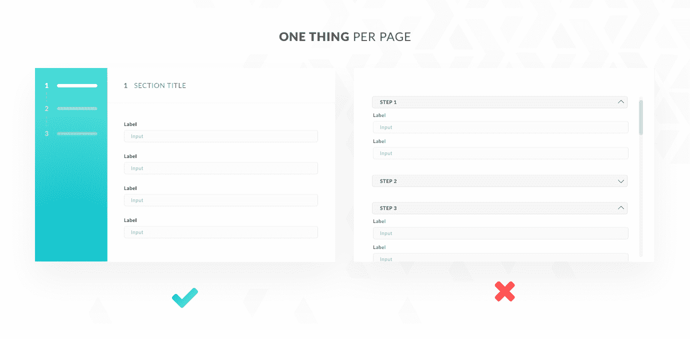
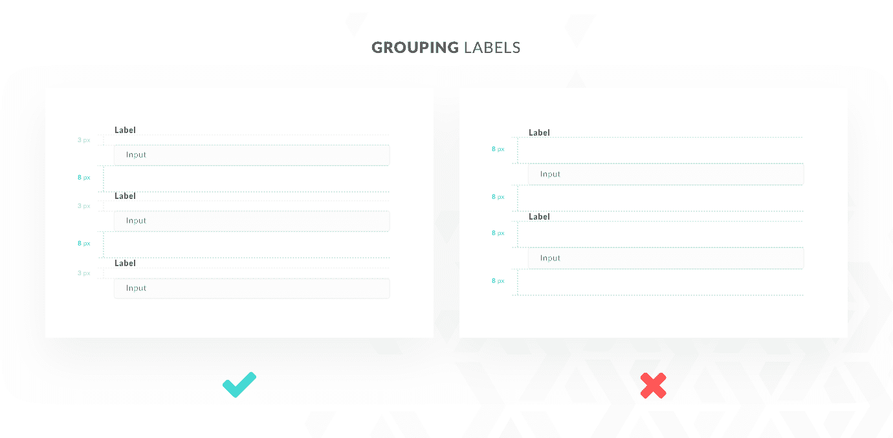
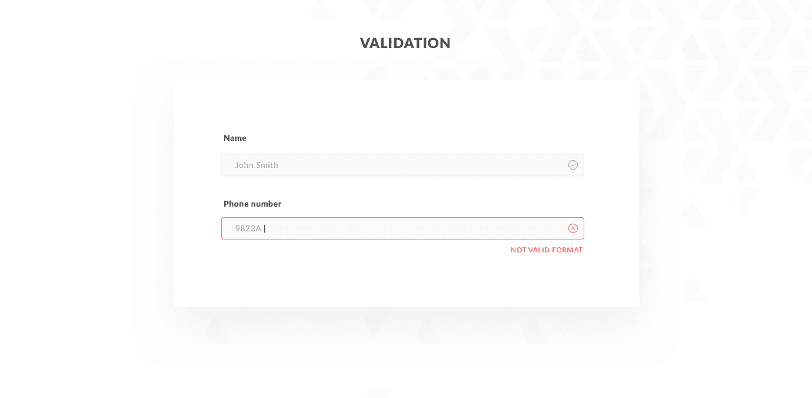
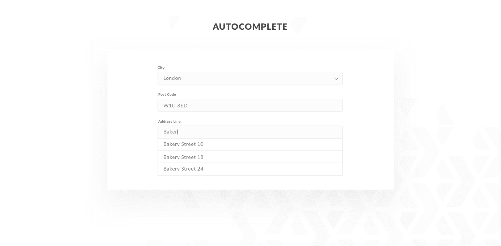
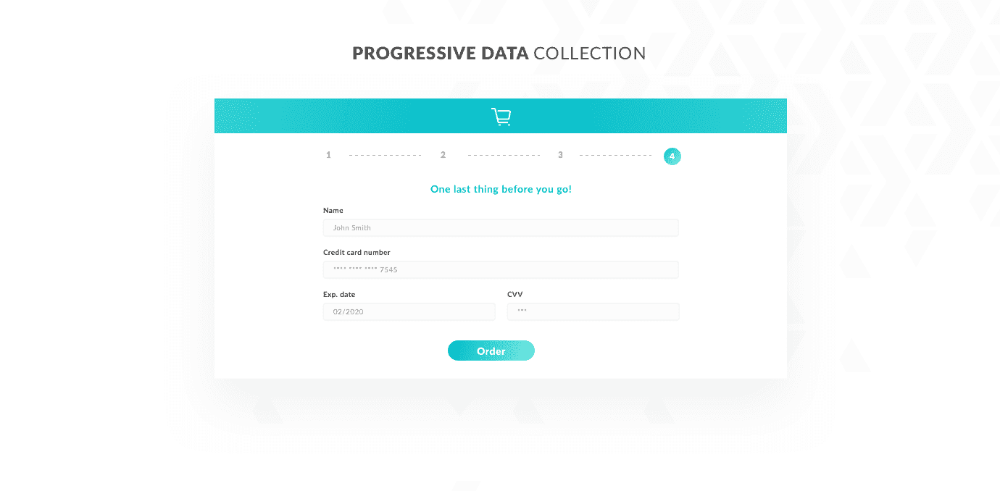

# 应用程序表单设计:最佳实践和关键要素

> 原文：<https://www.stxnext.com/blog/application-form-design-best-practices-and-key-elements/>

 互联网由输入字段组成。

无论是注册社交媒体平台、进行电子商务信用卡交易，还是在网上银行系统中申请金融产品，  **填写表格是您在互联网上执行的几乎所有操作的第一步和/或最后一步。**

在产品设计团队工作，给设计(和重新设计)应用表单带来了很多可能性。 [我们最近针对 Newable 的申请表重新设计流程只是](https://www.behance.net/gallery/66551673/Fintech-Application-Form-Newable) 的一个例子。

根据行业的不同，表单要求的数据范围也不同。无论如何，我敢冒险假设，它们中的大多数，尤其是金融科技公司，都深深植根于线下环境。这些表单通常源自金融机构，需要许多特定的数据类型。

但是将表格直接转换成数字格式是不够的。该过程仍然会像离线时一样漫长和复杂。鉴于表单是用户实现目标前的最后一道障碍，你应该在  **上努力，改善表单的用户体验，直到它变得快速、无缝和高效。**

然而，伟大的经历不会凭空出现。思考着的表单设计过程，你马上会注意到一些急需改进的方面。你应该通过减少认知负荷来帮助用户保持注意力和注意力，同时加快用户在表单中的进度。

在这篇文章中，我将介绍一些应用程序表单设计的一般准则和最佳实践。 好好利用它们，你会涵盖上述所有问题。 

#### 通过申请表设计减轻认知负荷

##### **1。“每页一件事”方法**

在长而复杂的申请表格的情况下，像金融科技中流行的那些(例如保险或贷款申请表格)，  **将它们分成多个更小的部分** 是减少用户认知负荷的一种常见方式。

呈现较小的、语义一致的部分有助于用户将注意力保持在一个特定的任务上，以及他们被要求提供的信息块上。

将表单呈现为一个多步骤的过程可以让我们不断地通知用户他们在应用程序流中的位置。如果需要，他们还可以轻松地在步骤之间切换。

例如，与折叠面板相比,“每页一件事”的方法也使得修复错误更加简单。折叠面板有它们的位置，但当你开始滚动它们寻找错误时，它们往往会变得更加令人分心。

##### **2。与标题和描述相关的标签**

用合适的标签 **对输入字段进行可视化分组，降低了用户混淆的风险。** 它还通过明确其结构和视觉层次来提高表单的可读性。

##### **3。最小化压降**

一般来说，如果你在表单的某个地方要处理 5 个以上的元素，你应该使用下拉菜单作为 UI 元素。

否则，您可以轻松地用单选按钮或分段控件替换下拉菜单。

向用户呈现所有可能的选项，而不是隐藏在下拉列表中，这带来了可扫描性的提升，进而对  **用户的性能和效率产生了巨大的影响。**

##### **4。验证(确认图标)**

内嵌验证提供即时反馈  **防止用户在填写表单时可能犯的大多数错误** 。

然而，举例来说，当你考虑到用户的色觉缺陷时，这可能还不够。在这种情况下，通过图标对按钮状态进行额外的确认可以解决这个问题。

#### 表单设计中的加速器

##### **1。帮助文本**

在支持用户填写表单输入时，最好的帮助莫过于 **让他们充分了解所需的数据。**

将输入字段与适当的标题配对是一回事，但从设计者的角度来看，另一个重要方面是给用户一个输入字段需要哪种数据格式的明确指示。例如:电话号码应不应该包含区号？

在输入字段下方或边上的工具提示中添加一个数据格式示例，可以减少用户因数据格式误解而犯的错误。当您请求的数据类型需要一些额外的解释时，详细的工具提示特别有用，比如您请求它的原因或者它将被用于什么。

##### **2。自动完成**

虽然自动完成作为一种表单功能在技术实现上可能会显得稍微复杂一些，但是如果您想要**加速表单填充过程，它绝对值得考虑。** 例如，您可以根据邮政编码或地理位置实现预填充地址详细信息输入字段。

##### 3.渐进式数据收集

没有什么比不首先面对文本和输入墙就无法与平台交互更令人恼火的了。

渐进式数据收集是一种方法，其中您先  **只向用户询问有限数量的数据类型，然后** 开始与系统交互。只有这样，您才需要基于用户将要执行的操作的附加数据。

例如，对于要在网上商店搜索一系列产品的用户来说，请求他们的电子邮件地址和姓名对于营销目的来说已经足够了，例如向他们发送时事通讯或推荐产品。就在用户开始购物之前，可以请求其他必要的数据，如地址细节或支付方式。

##### **4。文案好**

最后但绝对不是最不重要的:好的文案。清晰、不言自明的字段或部分描述以及简单的工具提示是  **让用户了解并掌控其行为的关键。**

#### 最后的想法:优秀的应用程序表单设计的好处

当用户填写表单时，支持用户性能并涵盖所有潜在问题的最大好处是什么？效率提高。

但这不是你从固体  **应用程序表单设计中获得的唯一胜利。**

无缝的用户体验也将提高表单的转化率，加速您实现业务目标的进程。

此外，如果您的表单需要敏感数据或涉及货币交易，在整个过程中让用户感到舒适是非常重要的。一次负面的经历可能会损害你公司的品牌和信誉。

最后，从更人性化的角度来看，设计良好的申请表简直就是一股清新的空气。它让每个人的日常数字生活更加轻松。

毕竟，好的产品设计不就是这样吗？

* * *

感谢你阅读我在 STX Next 博客上的第一篇文章！

如果你想看更多我们产品设计团队的酷东西，  [代表](https://www.behance.net/STXNext)关注我们。

如果你对我们博客上更多的 UX 文章感兴趣，你可以看看这个:[软件产品设计:好 UX 的投资回报率是多少？](/stx-new-blog/software-product-design-roi-good-ux/)