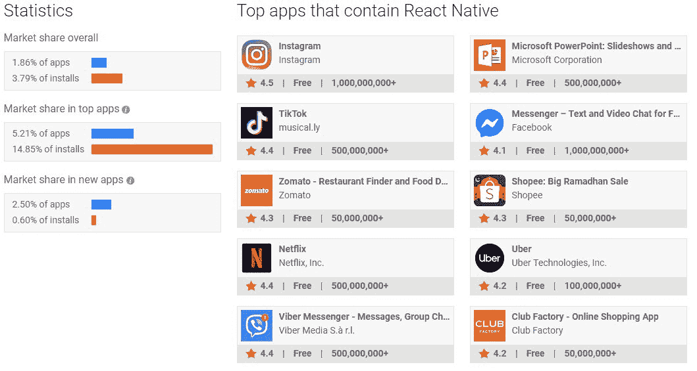
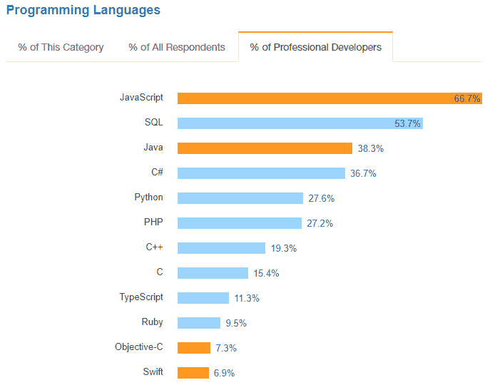

# 为什么要为你的移动应用程序使用 React Native？

> 原文：<https://www.stxnext.com/blog/why-use-react-native-your-mobile-app/>

 您有什么计划来利用不断增长的移动市场？

据[statista.com](https://www.statista.com/statistics/269025/worldwide-mobile-app-revenue-forecast/)称，到 2020 年[移动应用](https://medium.com/@arunagomathi995/list-of-top-10-iphone-android-mobile-app-development-companies-in-usa-uae-uk-c738421d38b6)将通过应用商店和应用内广告产生 1889 亿美元的全球收入。这是一个巨大的商机。

是时候开始利用移动市场了。但用户已经在智能手机上看到了几十个应用程序。您能向他们展示哪些令人印象深刻、功能强大并与他们的移动操作系统无缝集成的产品？

一个方案是  [反应原生](https://stxnext.com/services/react-native/) 。

这篇文章将告诉你  **什么反应原生是** 和  **为什么(或者为什么不)你应该为你的移动项目考虑一下** 。

为了深入探讨 React Native 这个主题，我与我们的 JavaScript 开发人员之一 Bartosz kazu za 进行了交谈。在他加入 STX Next 之前，Bartosz 已经是 React Native 的忠实粉丝，并使用它来创建基于文本的浏览器游戏的功能。现在，他用他的专业知识来解决我们客户的商业问题。 

#### 什么是 React Native？

React Native 是一个框架，允许你使用 [JavaScript](/blog/python-vs-javascript-comparison/) 构建原生移动应用。通常，你需要使用 Java(Android)和 Swift/Obj-C(iOS)来编写你的移动应用程序。React Native 消除了这一需求，只需使用一种编码语言，就能在更短的时间内在两个平台上开发出功能齐全的应用。

React Native 是一个全新的发明吗？不完全是。这个框架是几年前由一家你可能听说过的社交媒体公司开发的…

脸书是 ReactJS 和 React Native 背后的公司。事实上，脸书首先创建了 React 来构建我们都爱恨交加的社交平台。经过进一步的开发，脸书将 ReactJS 作为开源软件发布。

但脸书仍在努力开发他们的移动应用。他们需要维护两个代码库:一个用于 iOS，一个用于 Android。在 iOS 上的 Swift 中实现的功能必须在 Android 上的 Java 中单独实现，导致工作重复和不对称的应用。

React Native 巧妙地解决了这个问题。

紧随 ReactJS 之后，React Native 的目的是促进移动应用程序的创建。很简单:如果你可以用 JavaScript 编写一个应用程序，并将其部署到 Android 和 iOS 上，你的生活会变得容易得多。

如果你曾经在 Android 或 iOS 上使用过脸书官方应用，你就会看到 React Native 的实际应用。(手机 Airbnb 应用程序也是如此。)

#### 就市场份额而言，React Native 有多受欢迎？

React Native 越来越受欢迎，它是一种方便的解决方案，可以在不增加预算的情况下构建跨平台的移动应用程序。

它到底有多受欢迎？

看看 **反应本土的市场份额:**

**Source: https://www.appbrain.com/stats/libraries/details/react_native/react-native**

不错。

当你考虑应用商店和谷歌 Play 商店目前排名靠前的应用时，这些数据尤其说明问题。 **在美国排名前 500 的应用中，14.85%的已安装应用内置 React Native。**

事实上，在美国顶级 app 的类别中， **React Native 是仅次于 Kotlin 和 Android 架构组件 的第三大流行框架****[。](https://www.appbrain.com/stats/libraries/tag/app-framework/android-app-frameworks?list=top500)******

 **#### 为什么使用 React Native？

很长一段时间，React Native 被认为在商业上不可行。它没有得到足够的开发和支持来产生“类似本机”的应用程序。

但是时代变了。React Native 越来越受欢迎，获得了社区支持，并获得了更多的市场份额。使用 React Native 编写出色的应用程序变得越来越容易，全世界都在关注这一点。

##### 尝试和信任

脸书构建 React Native 的首要目的是为他们自己的社交门户创建一个出色的移动应用。更有可能的是，你已经通过脸书手机应用在手机上使用它了。感觉像不像原生 app？当然了。

但自从 React Native 开源以来，更多的公司决定押注于它，并以这种方式创建他们的移动应用程序。这里只是几个例子。

##### 流行的 React 本地应用

*   **脸书**
*   **Instagram**
*   **Skype**
*   **特斯拉**
*   **沃尔玛**
*   **不和**
*   **彭博**

把你的应用放在这样的公司里并不是世界上最糟糕的主意。

##### 两个平台一个代码库

使用 React Native，您可以创建一个在 Android 和 iOS 上都能工作的代码库。而且它不只是“工作”——**它编译成原生 Java 和 Swift 代码** **。**具体来说，React Native 在 web UI 组件和它们的本地 Java/Swift 对应物之间建立了一座桥梁。

考虑一下你的软件项目的含义。两个平台不需要两个开发团队。无需同步功能和布局。你只是发展得更快，可以从你的预算中获得更多。

##### 使用你已经知道的语言

创建 React 原生应用需要较少的专业知识。 很可能你的团队中已经有人会用 JavaScript 编程，甚至可能专门用 ReactJS 编程。与拥有 Java 或 Swift 技能的开发人员相比，JS 开发人员更容易找到。

**Stack Overflow 2017 Developer Survey**

即使你的前端开发人员从未使用过 React Native，通过一些自学，他们也可以很快上手，尤其是如果他们已经使用过 React 的话。你所需要的只是花一点时间谷歌一下，找出哪些 web 组件对应于哪些移动组件——这样就万事俱备了。

##### 一直在增长

React Native 正在积极开发中。脸书和 React Native 周围的大型社区都在不断改进这个框架。如果你现在不能解决一个问题，因为 React Native 没有解决方案，几个月后情况可能会有所不同。

例如，Bartosz 最近面临着为他的一个项目实现“速度计”组件的任务。他最初的想法是自己创造这样一个组件。但首先，他决定检查社区中是否有人过去有同样的需求。你瞧，他发现一个开放的牌照速度计准备使用，节省他的时间。

甚至微软也注意到了 React Native，促使他们创建自己的分支:[React Native for Windows](https://github.com/Microsoft/react-native-windows)。他们的解决方案允许开发人员更容易地为 Windows 10、Windows 10 Mobile 和 Xbox One 创建应用程序。

##### 使用 web 应用程序节省更多时间

如果你有一个 ReactJS web 应用程序，前端代码的片段(如业务逻辑)可以在移动和 web 之间共享，这将进一步促进开发。

#### React 原生应用的例子是什么？

商业和金融新闻提供商彭博、 [在经过初步测试和原型制作后，决定使用 React Native](https://www.techatbloomberg.com/blog/bloomberg-used-react-native-develop-new-consumer-app/) 来创建其新的消费者应用。

以前，彭博的工程师必须分别开发 iOS 和 Android 版本，不能共享他们创建的代码。切换到 React Native 节省了他们的时间，因为他们可以统一他们的开发能力，每个开发人员可以一次专注于一个功能。结果，该团队设法在五个月内创建了新的应用程序——大约是通常开发时间的一半。

使用 React Native 还允许该公司为该应用程序添加许多新的交互式功能，例如滑动标题以分享或收藏文章的功能。用户还可以访问直播电视和点播事件源。

该应用程序允许用户进行广泛的定制，包括根据他们的兴趣和位置个性化内容，以及监控他们自己的个人投资组合。

React 原生设计自动刷新代码，而不是重新编译，它会立即重新加载应用程序。

据彭博一名参与过渡的高级软件工程师称，“React Native 是最好的”，该公司将在其他移动应用程序中再次使用它。

#### 使用 React Native 时应该注意什么？

与任何解决方案一样，React Native 也有其缺点。你应该警惕什么？

##### React Native 不是 100%的 Native...

不管脸书试图告诉你什么，React 原生应用并不等同于完全用 Swift/Obj-C 或 Java 编写的真正的原生应用。

我们以原生 Gmail 为例。Gmail 应用程序包括一个检查收件箱的工作人员。您的 Gmail 帐户与整个移动系统同步，而不仅仅是应用程序。Gmail 还知道，如果你使用的是移动数据，而不是 WiFi，它应该减少同步频率。

使用 React Native，您不会与系统集成得如此紧密——至少不会开箱即用。您的帐户将存储在应用程序中，而不是系统中。与移动数据相比，考虑 WiFi 也更加困难。对于某些 app 来说，这不会是问题；对其他人来说，这可能会改变游戏规则。

##### ...但是你可以根据自己的需要把它做得很自然

当你选择使用 React Native 的时候，你不一定要独占使用。你仍然可以对大部分应用程序使用 React，对需要与原生系统 100%集成的关键部分使用 native。

我们的一个潜在客户最近反对 React Native，称它仍然不是真正的原生应用。我们的反驳很简单:不一定是一样的。只需做一点额外的工作，您就可以通过添加一些针对特定案例和功能的 Java/Swift 代码，使其“如您所需要的那样原生”。

##### 如果使用 React Native，就必须使用 React

这可能是显而易见的，但它仍然需要作为免责声明。当您选择 React Native 时，您将必须使用 ReactJS 来创建您的应用程序。React 有竞争对手是有原因的；它并不总是最好的选择。

幸运的是，有一些竞争性的解决方案可以实现类似的目的，在不锁定您的情况下进行本地反应。一个这样的竞争者是  [爱奥尼亚](https://stxnext.com/blog/2018/11/22/react-native-vs-ionic-comparison/)。他们的社区没有那么活跃，也没有发展得那么快。但是 Ionic 有一个优势:你可以用它来使用不同的 JS 框架，包括 Angular，Vue.js 甚至 React 如果你需要它的某些部分。

##### 写得不好的 JavaScript 或繁重的计算会损害你的性能

(感谢  [阿德里安·沃克兹](https://www.facebook.com/StxNext/posts/1279701738836786?comment_id=1279717692168524&comment_tracking=%7B%22tn%22%3A%22R%22%7D) 对脸书的评论促成了这一部分。)

使用 JavaScript 本身是一个有缺点的解决方案。例如，如果你的 React 原生应用中的 JavaScript 代码写得很差，你会比你的应用是纯原生应用更强烈地感受到这种差异。

然而，这是一个轻微的缺点，如果你有  [熟练的 React 本地开发者](https://stxnext.com/services/react-native/) 在你身边，你就不会感觉到。

Tim Mensch 在他的 Quora 回答中很好地描述了这种权衡:

*“写得不好的 JavaScript 是 **略** 比写得不好的原生代码更可能慢。因此，如果你的开发者处于 **、** 的边缘，那么你可能会比花将近两倍的钱来开发 **两款原生应用要好。不过，我更喜欢雇佣有实力的开发人员。”***

Quora 上的蒂姆·门施

如果你的应用程序计算量很大，JavaScript 也可能会降低性能。对于大多数移动应用程序来说，这种情况并不常见，但仍然是您应该考虑的场景。

#### React Native 对你的项目有好处吗？

你现在已经发现了 React Native 的一些好处，但是你仍然不确定是否应该在你的项目中使用它？以下是它可以帮助您实现的目标:

##### 节省时间和金钱

如果你需要为 iOS 和 Android 开发一款应用，React Native 是最好的工具。它可以减少大约 95%的代码库，为您节省时间和金钱。最重要的是，React Native 有许多预建组件的开源库，可以帮助您进一步加快开发过程。

##### 创建出色的移动应用

React Native 非常适合移动应用。它提供了一个光滑，流畅，反应灵敏的用户界面，同时大大减少了加载时间。与构建原生应用相比，在 React Native 中构建应用速度更快、成本更低，而且无需牺牲质量和功能。

##### 使用现有技能

由于 React Native 是基于 JavaScript 的，你的开发者不需要很长时间就能掌握它。话虽如此，但这是一个开源和社区驱动的框架，因此如果他们需要支持，可以在网上广泛获得。

##### 添加第三方插件

React Native 还允许您轻松整合第三方插件和 API，包括地图和支付系统。

#### 最后的想法

**那么关于 React Native 你应该知道些什么呢？** 以下是要点:

*   如果你正在使用脸书或 Airbnb 手机应用，  **你甚至不知道自己在使用 React Native。**
*   **React 原生 app 编写简单，** 为开发者节省时间，为项目经理削减成本。
*   **React 原生应用降低你的开发和维护成本，** 因为你不用处理 iOS 和 Android 两个独立的代码库。
*   由于 React Native 只是原生组件的包装器，  **没有什么可以阻止你在需要的地方添加原生 Java 或 Swift 代码。**
*   说到底，  **你还是在用 JavaScript 编码。** 没必要学习 Swift/Java，也没必要把有这种技能的开发者加入你的花名册。
*   **反应原生正在快速成长** 没有停止的迹象。

这些只是 React Native 可以提供的众多好处中的一部分。

如果你想知道这个框架与 Ionic 或 Flutter 相比如何，你会发现这些部分很有用:

*   [React Native vs. Ionic:利弊对比](/blog/react-native-vs-ionic-comparison/)
*   [React Native vs. Flutter:利弊对比](/blog/react-native-vs-flutter-comparison/)
*   [React vs . Angular:JavaScript 库和 TypeScript 框架的比较](/blog//react-vs-angular-comparison/)

在 STX Next 这里，我们提供  [React 原生移动应用程序开发服务](https://stxnext.com/services/react-native/) ，其中包括免费咨询我们的专家。请随时给我们写信——我们很乐意帮忙！

#### 来源

*   [https://www . statista . com/statistics/269025/world wide-mobile-app-revenue-forecast/](https://www.statista.com/statistics/269025/worldwide-mobile-app-revenue-forecast/)
*   https://facebook.github.io/react-native/
*   http://facebook.github.io/react-native/showcase.html
*   [https://medium . com/react-native-development/a-brief-history-of-react-native-aae 11 F4 ca 39](https://medium.com/react-native-development/a-brief-history-of-react-native-aae11f4ca39)
*   https://github.com/Microsoft/react-native-windows
*   [https://www . quora . com/Will-an-App-written-all-in-React-Native-be-lower-than-a-Native-App-What-is-the-differences](https://www.quora.com/Will-an-app-written-entirely-in-React-Native-be-much-slower-than-a-Native-App-What-are-the-differences)

**