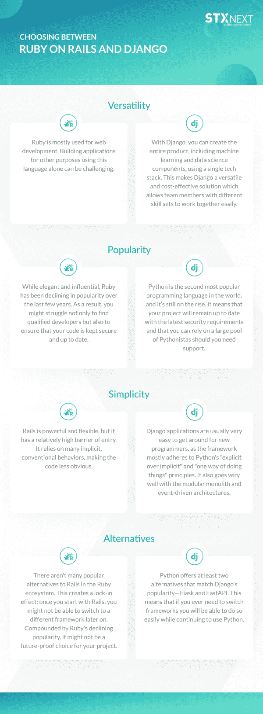

# Django 与 Ruby on Rails 框架比较:哪个更好？

> 原文：<https://www.stxnext.com/blog/django-vs-rails-comparison/>

 开发人员使用 Web 框架来创建快速、高效且易于使用的网站。但是我们到底为什么需要它们呢？为什么选择正确的产品对您的企业如此重要？

简而言之，使用一个合适的框架对于你的项目开发来说是必不可少的，因为它可以帮助你节省时间和金钱，同时也可以大大提高你的网站的安全性和性能。

当谈到各种 web 框架的流行时，Django 和 Ruby on Rails 是最突出的两个。但是哪个更好，为什么？

我们可以告诉你，两者都有各自的优点和缺点，这将使它们更适合特定的产品，但这次****这里有一个明显的赢家，那就是 Django。****

 **在本文中，我们将比较 Django 和 Ruby on Rails，并分析它们的优势、劣势和主要差异，以帮助您准确理解为什么 Django 是您项目的更好的 web 开发框架。**  **#### 为什么应该选择 Django 而不是 Ruby on Rails？

Django 和 Ruby on Rails 经常被拿来比较，因为它们有一些相似之处。你也可能想知道哪个框架最适合你的项目，我们在这里提供帮助，所以请继续阅读，找出这个问题的答案。

尽管在 STX Next，我们专门研究 Python，并延伸到 Django，但我们认识到其他解决方案也有很多好处。 [在我们提出任何技术建议之前，我们总是会深入分析客户的业务需求](/services/django-development/) 。

尽管如此，根据我们的经验，我们可以有把握地说，Django 非常适合绝大多数项目，无论它们的规模或复杂程度如何。

这种通用、灵活、自给自足的框架与现代趋势如 [机器学习](/services/machine-learning/) 和 [数据科学](/services/data-engineering/) 齐头并进，帮助您快速创建端到端的产品。

重要的是，用 Rails 开始你的项目意味着你以后可能很难切换到另一个框架。在极少数情况下，如果你改变了对 Django 的看法，你可以很容易地在将来用另一个解决方案来代替它。

如果您仍然有疑问，这篇文章将通过给你一个关于这两个框架的真实的概述来帮助你，并且希望，在文章的结尾，我们将能够向你展示 Django 仅仅是更好的选择。

#### 姜戈是什么？

Django 是一个基于 Python 的开源通用框架。这意味着如果你想用目前最好和最流行的编程语言 之一的 [开发产品，它是理想的选择。但这不是它相对于 Rails 的唯一优势。](/python-vs-other-programming-languages/)

Django 由于其难以置信的易用性，使得复杂的项目可以毫不费力地完成，所以仍然被广泛使用。它允许快速、实用的开发，这是其他框架做不到的。

#### 什么是 Ruby on Rails？

**Ruby on Rails 也是开源的，但是使用 Ruby 而不是 Python，**与 Django 相比，这限制了它的通用性。尽管如此，它仍然是一个非常受欢迎的 web 框架，因为它的默认结构可以为您节省一些时间。

Ruby 背后的主要思想是消除重复任务的需要——相反，它为您提供了工具来轻松地将您已经拥有的东西适应项目的需要。

#### Django 和 Rails 的区别

**你为你的产品使用什么样的框架将决定它的成本、速度和规模，**所以要彻底理解这些框架中的每一个如何影响你的项目，理解它们之间的区别是很重要的。

为了帮助你做到这一点，我们以易于理解的、全面的、 图形的形式，列出了 Django 和 Ruby on Rails 之间最重要的区别，向你展示 Django 在哪些方面优于 Rails。

##### 语言

我们将再次强调 [Django 基于 Python，Rails 运行于 Ruby](/blog/python-vs-ruby-comparison/) 之上。然而，我们不会太深入到技术细节，解释这两种语言之间每一分钟的技术差异。

你需要知道的是，Python 仍然是继 JavaScript 之后世界上第二流行的编程语言。另一方面，Ruby 现在越来越不受欢迎了。

这可能看起来微不足道，但是仅仅这一个特点就让世界变得不同。

Ruby 并不是没有好处，因为它给了程序员一些自由来根据他们的需要微调项目，但是由于它的受欢迎程度下降，使用它来确保你的产品的最高质量可能是一个挑战。

然而，Python 更加清晰易读，确保开发团队可以更快地完成任务，但最重要的是更安全，这要归功于大量的更新。

**再加上有超过 1000 万开发人员精通 Python 的事实，**你会得到一种语言，它允许你更容易地为任何项目组建一个高效的团队。

##### 用户体验

从用户的角度来看，这两个框架有一个共同之处，真正使它们脱颖而出:一个令人难以置信的功能 UI。

Django 和 Ruby 在设计时都考虑到了高端体验，并为插件和附加组件留出了大量空间，以实现完全个性化的体验。

Ruby 和 Django 都提供了出色的性能。 Ruby on Rails 在速度上有一点优势，比 Django 快 0.7%，但这种差异是如此之小，而且两者的表现都非常好，我们不能说这是对 Django 的一个坚实的点。

然而，安装过程有很大的不同。

为了成功安装 Ruby on Rails，需要预先了解它的各个方面。另一方面，Django 可以在眨眼之间安装。这要简单得多，如果你寻求流畅的体验，这是理想的选择。

##### 安全性

如今，安全是网上运营的一个非常重要的方面，没有一个网站能够在安全措施上偷工减料。这将意味着面临一些严重的数据泄露的风险，可能会损害那些访问你的网站的人以及你的法律费用。

Django 和 Ruby on Rails 都有令人印象深刻的安全级别。然而，Python 是由美国宇航局自己使用的，毫无疑问，当涉及到数据安全时，他们是认真的。使用中间件，Django 应用可以免受 XSS 和 SQL 注入以及其他在线威胁。

此外，正如我们之前提到的，Django 的更新更加频繁，随着语言的发展，它提供了更好的安全性。

##### 支持

Ruby 对你可以用它做什么有一些严重的限制，因为它主要用于开发 web 应用。同时，Django 提供了更多的灵活性。

不过，最终，您仍然会受到您所获得的信息和经验的限制，所以让我们来看看这两者的支持程度。

我们不会告诉你 Rails 没有一个蓬勃发展的社区，但事实是 Django 开始享受围绕 Python 的巨大社区的优势，所以有许多人会随时帮助你。

作为一个开源框架，Django 有一个活跃的用户群，他们可以提供大量的工具和库，让你的体验更加流畅。如果你遇到任何问题，你可以肯定你会找到一个已经分析了类似问题并提出了许多解决方案的社区。

Ruby on Rails 也有一个社区可以为你提供支持，只是 Django 的社区要大两倍多。

#### Ruby on Rails 的优势

到目前为止，我们已经向您展示了这两种语言之间的一些最基本的区别，这个初步的分析已经显示了 Django 相对于 Ruby on Rails 的优势。说到这里，现在让我们来关注 Rails 到底提供了什么，以及你应该知道的其他缺点。

##### 组件结构

正如我们已经提到的，Rails 不太注重灵活性和为定制解决方案提供空间，而是提供了许多以后可以定制的默认设置。

因此，Ruby on Rails 允许你在开发过程中走很多捷径，尤其是如果你没有专门的工程团队的话。在 Ruby 中你会经常看到的两个术语是“插件”和“宝石”——分别在应用程序和系统级别工作的组件。

##### 易于移植和修改

如果您使用正确的资源学习，Rails 中使用的代码非常容易阅读和编写。更重要的是，代码在迁移过程中不需要做很多改动。

因此，如果你发现自己需要在开发过程中更换团队或者增加新成员，那么微观管理就没什么必要了。也就是说，这只适用于项目开发的早期阶段，我们稍后会解释原因。

##### 活跃的社区

专注的用户在网上创建了许多资源来支持你:指南、教程、视频和其他帮助你入门的资源，以及帮助你根据自己的想法调整 Rails 的免费插件。

#### Ruby on Rails 的缺点

##### API 更难创建

虽然使用 Ruby on Rails 构建一个 API 并非不可能，但这项任务并不容易。如果 Django 没有休息来使这方面变得更容易，这就不是问题了。

##### 复杂性增加

Rails 在某种程度上更容易移植和修改，并且在编码方面有很大的自由度。然而，这种自由有一些严重的后果——很容易积累技术债务。

**代码逐渐变得更加复杂和难以阅读，**随着时间的推移，长时间从事一个项目变得越来越困难，并产生了很高的进入壁垒。

**你可能很快就会过于依赖那些对代码了如指掌的人，**并意识到培训新开发人员学习现在非常复杂的代码是非常耗时的。

##### 文档有时可能不符合标准

虽然你会在网上找到一大堆插件和宝石，但有些比其他的更受欢迎。由于 Ruby 受欢迎程度的下降，那些不太受欢迎的文档往往质量很差，如果有的话。在这种情况下，除了被告知它做什么和如何工作，你还得通过研究代码自己弄清楚。

#### Django 的优势

不可否认，Ruby on Rails 提供了一些有趣的东西，但我们不能掩盖一个简单的事实，Django 提供了更多。

看起来很多好处都是有上下文关系的，取决于你的个人需求，但实际上，Django 的优势更值得注意。这里有一些我们认为最重要的，以及一些你应该知道的缺点。

也就是说，值得注意的是，与我们反对使用 Ruby on Rails 开发相比，使用 Django 的缺点很少。

##### 久经考验的软件

Django 可以被安全地定义为成熟的软件。从最初发布到现在已经 17 年了，足够所有 Python 框架中最大的在线社区蓬勃发展了。

有如此多的插件，你可以让开发变得几乎不可能，如果你有任何问题，同样的社区会帮助你。

##### 非常好

Django 的管理面板是一个非常有用的工具，让管理你的 CMS 变得轻而易举。最重要的是，**你不必自己添加它——它是开箱即用的。**

##### 休息

REST 是 Django 独有的东西，这可能是选择它而不是 Rails 的最重要的原因之一。

本质上，它是一个允许您轻松创建 API 的工具。只需要三行代码，你就有了一个非常灵活的 API。

除此之外，还有大量的 QOL 选项，比如 JSON 序列化器和反序列化器、API 路由、文档、认证模块等。，您将拥有一个非常通用的工具供您使用。

##### 多才多艺

Django 最大的优势之一是其非凡的多功能性。这个框架允许建立各种不同的东西:从科学和金融平台或强大的网站，通过社交网络，到内容管理系统——以及许多许多其他东西。

此外，Django 在金融科技 等要求苛刻的行业中表现出色，在这些行业中，产品必须安全、值得信赖，并符合国家和国际法规。

#### Django 的缺点

##### 这是一块巨石

Django 非常容易进入，但部分原因是它的整体建筑。这里几乎没有修改的余地，同时也使得弄乱代码变得更加困难。

简而言之，如果你需要一个解决方案，让你能够真正地洞察事物的本质，解构每一个细节，Django 不会让你这么做的。

##### 在代码方面要求更高

如果你正在用 Django 开发，你需要准备好写很多你自己的代码。最终，这将带来更加个性化的结果，但您仍应考虑到额外的工作量。

#### 关于 Django vs. Ruby on Rails 的最终想法

感谢您阅读我们对 Django 和 Ruby on Rails 的比较。我们希望它能帮助你理解其中一个相对于另一个的优势。

归根结底，Ruby on Rails 有它的用处，您可能会发现在某些情况下它就足够了。然而， [我们的专业经验表明](/services/django-development/) 在大多数情况下，Django 可以完美地工作，而 Ruby on Rails 只能做得很好，甚至根本做不到。

那么，当你可以简单地选择最安全，同时也是最有吸引力的选项时，为什么要冒受挫的风险呢？

Django 拥有一个难以置信的大型社区和大量的在线资源，以及易用性和快速启动项目的能力，是大多数项目的最佳解决方案，无论是哪个行业。

[STX Next 是市面上领先的 Django 和 Python 专家](/services/python-development/) 之一。我们很乐意分享我们在 320 多个 Django 项目中的经验，并为您提供从 [代码审计](/services/code-audit/) 到 [端到端开发](/services/) 的服务。

如果你喜欢这篇文章，我们有其他有用的关于 Django 和 Python 的资源，你可能会感兴趣，比如:

*   [Python 是用来做什么的？](/what-is-python-used-for/)
*   [Python vs .其他编程语言](/python-vs-other-programming-languages/)
*   [2022 年最佳 Python Web 框架入门](/blog/beginners-introduction-python-frameworks/)
*   [【最好的 Python IDEs 和代码编辑器(根据我们的开发者和 Python 社区)](/blog/best-python-ides-code-editors/)
*   [2022 年 13 个最佳 Django 和 Django 休息教程](/blog/best-django-tutorials/)

如果您有任何其他与 Django 相关的问题或需求，为什么不联系我们呢？看看我们提供的 [软件开发服务](/services/web-development/)然后 [联系我们](/hire-us) ，我们将很乐意帮助您打造您需要的数字产品！**