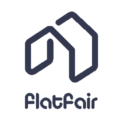
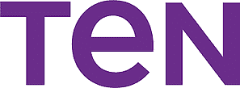

# 使用 Python 的 9 大值得关注的英国公司

> 原文：<https://www.stxnext.com/blog/top-9-noteworthy-uk-companies-using-python/>

 说在某种程度上使用 [Python](/services/python-development/) 的有趣公司数量惊人是一种保守的说法。

有人真的感到惊讶吗？据 Stackshare 报道，目前全球有近 7000 家公司在使用 Python ，实际数字可能更高。

但是这个角度在这里可能有点太宽泛了。有这么多值得关注的公司要报道，我们决定这次用一个稍微窄一点的镜头。

作为世界上最大的市场之一，英国对我们来说是一个完美的起点。由于经济基本上是各种业务的滋生地，难怪这个国家有很多很好地利用 Python 的公司。

这里有九个我们认为特别值得探索的英国公司使用 Python 的例子。 

#### 1\. Zopa

虽然我们将在本文中讨论英国的各种业务，但金融科技可能是我们将涉及的最突出的领域。我们名单上的第一家是 [Zopa](https://www.zopa.com/) ，自称“感觉不错的赚钱公司”

自 2005 年以来，Zopa 一直采用点对点模式运营，其目标是让财务管理尽可能无压力。然后一件事接着一件事，到 2020 年，他们扩大了服务范围，包括了一家真正的银行 。

这些年来，他们通过为客户提供最好的贷款和投资帮助了无数客户。有时候，如果你想生活得更舒适，妥善管理你的财务就是你需要做的一切，而这正是 Zopa 在这里的目的。

从本质上讲，他们的目标是为所有客户提供公平且可访问的服务，这一点从一开始就没有改变过。

从技术的角度来看，Python 绝对是他们的支柱。在他们的博客上，他们有一个专门的技术部分，包括一篇关于如何用 NumbaT3 加速 Python 的有趣文章。

#### 2.新商业金融

[Newable](https://newable.co.uk/) 是一家金融科技公司，其主要业务是提供便捷的商业贷款，总体目标是帮助新兴企业起步，并支持其他公司实现其目标。

他们近年来扩张了不少，现在是英国使用 Python 的最著名的金融科技公司之一。除了简单地提供便捷的贷款渠道，他们还会为客户提供专家建议，这在当前我们都在应对的疫情中尤其有用。

但是也许你已经想好了你梦想中的生意，你也有了现金，但是你正在努力寻找合适的住处？他们也可以在这方面帮助你，因为 Newable 还在其已经令人印象深刻的服务组合中增加了 workspace 服务。

由于我们过去实际上与 合作过，我们已经直接了解了他们能做什么。虽然我们不能声称所有的功劳，但我们愿意记住，他们成功背后的软件在某种程度上归功于我们的努力。

#### 3.泽加

Zego 的整个前提基于一个论点:目前可用的保险政策不能满足当今时代的业务需求。

他们的这个假设是绝对正确的。

近年来，由于技术的发展，业务呈指数级发展，而保险政策通常没有随之调整。Zego 是一家金融科技公司，其目标是将保险业推向 21 世纪。

随着职业变得更加灵活，车辆、住房等的长期保险计划。变得越来越过时。Zego 提供了一个更容易理解的模型。更重要的是，他们所有的服务都是通过应用程序、网络和手机提供的。

他们一直在寻找具有 Python 知识的开发人员，因为这是目前他们整个平台的核心。虽然他们过去只使用 Django 进行操作，但他们现在已经使他们的架构多样化，包括其他的 [Python web 框架](https://www.stxnext.com/blog/beginners-introduction-python-frameworks/) 。

Zego 的前瞻性方法并没有被忽视，因为他们最近成为第一家获得欧洲经纪牌照的英国保险科技公司 。此外，随着他们最近对 Drivit 的 [收购，他们正在迎来一个保险业的新时代。](https://www.zego.com/blog/zego-acquires-telematics-pioneer-drivit-to-the/)

#### 4.费尔特

不管你是房东还是房客，英国的租房市场都是黑暗的，充满了恐惧。它面临着与我们上面提到的保险业相似的问题:现代需求已经超出了当前系统的能力。

押金仍然是最常用的方法，以确保租金安全，这不再是一个可行的选择，任何一方的方程，尤其是面对新冠肺炎疫情。Flatfair 已经想出了解决这个问题的办法，他们正在使用 Python 来实现它。

他们的“助推”和“免押金”系统旨在最大限度地提高安全性，并最大限度地减少租户和房东在租房时遇到的麻烦。他们的目标是减少支出和迁入所需的时间，降低前期成本，并允许所有必要的文档安全存储并随时可用。

所有这些都是通过他们设计巧妙的平台来完成的，这也是帮助他们出名的原因。最重要的是，当谈到英国的房产租赁环境时，他们只是知识的源泉，正如这篇关于 [适应疫情](https://flatfair.co.uk/how-landlords-can-make-their-property-fit-for-a-post-pandemic-world-what-comes-next/) 带来的变化的文章所例证的。

#### 5.LiveMore 资本

遵循我们之前条目设定的模式， [LiveMore Capital](https://livemorecapital.com/) 是另一家公司，其使命是解决英国系统中的一个根本性问题。这一次，重点是晚年贷款。

贷款和抵押贷款是人们在生活中不同时期可能需要的东西。这包括 55 岁以上的人。也许不出所料，在那个年龄给你的选择非常有限，要求更严格，数量更少。LiveMore Capital 在这里提供了一种补救措施。

LiveMore Capital 使用 Python 作为其应用代码，Django 作为其框架，依靠强大的数据平台来确保他们能够为客户提供他们所能获得的最佳抵押贷款。他们专门从事退休利息抵押贷款，给一个被忽视的群体他们应得的选择。

贷款期限广泛，利率固定，并为其目标人群提供其他实用的解决方案，他们正在走向英国晚年抵押贷款的革命。

#### 6.分享收益

Sharegain 是我们名单上的另一家金融科技公司，这次专门处理证券借贷问题。尽管这是增加公司回报和收入的好方法，但它在传统形式下并不容易实现。

多年来，机构投资者一直牢牢控制着证券借贷，尽管这在理论上是一项基本权利。Sharegain 在这里是为了确保证券借贷的透明和可及性。

Sharegain 使证券借贷成为可能。由于他们的基于 Python 的平台，你可以管理你的投资组合到最后的细节，建立限制，管理借款人，通常能够清楚地看到发生了什么，并获得最大的利润。

此外，Sharegain 不介意分享他们在财富管理方面的广泛知识，所以一定要查看他们的博客，了解最新的技巧和行业见解 。准备好摆脱中间人了吗？

#### 7.十组

Python 确实是一份不断赠送的礼物。知道基于 Flask 或 Django 的 web 应用程序可以做几乎任何事情是一回事。实际访问使用这些框架创建的虚拟门房完全是另一回事。

这正是 Ten Group 提供的服务:为富裕的私人客户和企业客户量身定制的体验。

Ten Group 提供高级礼宾服务，这是他们帮助富裕客户管理财务的一种奇特方式。他们与许多重要的私人银行有联系，帮助客户确保他们的财富为他们服务。如果你在现金中游泳，这个基于 Python 的应用确实是你所需要的。

自 1998 年白手起家以来，Ten Group 几乎一路登顶，于 2017 年成为伦敦证券交易所的另类投资市场，此后从未离开过该职位。

因此，它是一家声誉卓著的公司，提供优质服务，不断扩张，并寻找新的人才来帮助改善服务。他们从一开始就定义了生活方式管理市场，而且没有停止的迹象。

#### 8.明特尔

作为一家历史悠久的公司，其历史可以追溯到 1972 年， [Mintel](https://www.mintel.com/) 几十年来一直是市场情报领域的权威声音。这是他们的名字——Mintel 实际上是“市场”和“英特尔”两个词的组合

使用市场研究、数据收集、市场分析和各种其他形式的专业知识，如果你想确保你的商业决策是合理和有效的，他们是可以联系的专家。

其中很大一部分是他们的 [全球新产品数据库](https://www.mintel.com/global-new-products-database) ，这绝对是自 70 年代以来就没有的东西，因为 Python 是它存在的原因之一。这是各种行业的高质量数据的杰出来源，这使得 Mintel 即使在当前技术快速发展的时代也能保持领先地位。

虽然他们在英国运营，但他们的服务覆盖了世界上几十个国家，这只会有助于进一步扩展他们的数据。

#### 9.筹资选择

我们名单上的最后一项是专门为需要资金的企业设立的。

[资金选项](https://www.fundingoptions.com/)将让世界变得更加机会均等作为他们的使命。专注于支持小型企业，他们使用基于 Python 的技术来帮助这些公司找到最适合他们的融资方案。

他们的效率为他们赢得了无数的荣誉，包括赢得了 [Nesta 的银行业开放挑战](https://www.fundingoptions.com/latest/funding-options-wins-phase-2-nestas-open-challenge/) ，他们现在是 [HM 财政部银行推荐计划](https://www.gov.uk/government/statistics/bank-referral-scheme-december-2020) 的一部分，使他们成为被银行拒绝后寻求资助其项目的中小企业的官方顾问。

#### 最后的想法

Python 确实推动了世界的发展，它无疑是我们刚刚列出的业务的坚实支柱。现在英国退出欧盟就在我们身边，这是近距离观察一些英国 Python 冠军的绝佳机会。

我们在这里提供给你的是一份精心挑选的公司名单，但是英国的 Python 生态系统如此强大的事实意味着 Python 开发者可以毫不费力地找到优秀的雇主。因此，如果你在英国，你可能很难找到一个好的软件工程师来满足自己的需求。

因此，如果你想避免在英国就业市场上遇到困难，STX Next 可能就是你下一个大项目需要的公司。给我们喊一声— [头过来](https://www.stxnext.com/hire-us) 取得联系！

当然，这篇文章只是冰山一角；从那里来的还有很多。我们尽最大努力确保我们的读者始终了解最新的技术，尤其是 Python。这里有几篇你可能会感兴趣的文章:

*   [最有趣的使用 Python 的公司](https://www.stxnext.com/blog/most-interesting-companies-using-python/)
*   [7 家基于 Python 的公司我们很高兴加入 FT1000](https://www.stxnext.com/blog/7-python-powered-companies-ft1000/)
*   [英国顶尖 Proptech 公司及其技术栈](https://www.stxnext.com/blog/top-uk-proptech-companies-tech-stack/)