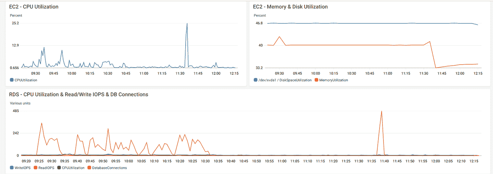
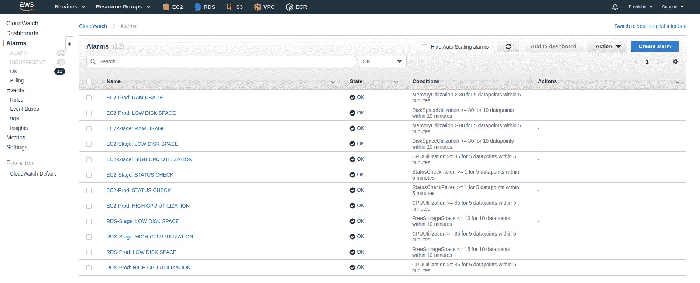
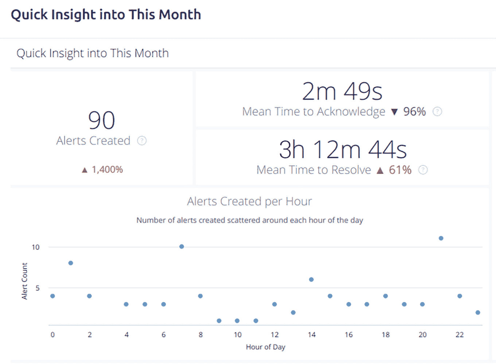
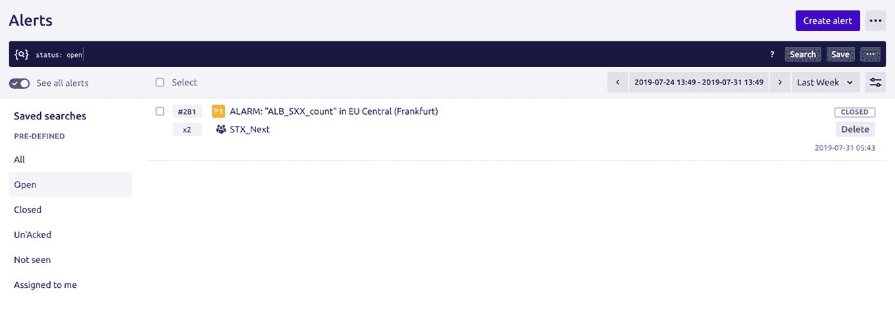

# DevOps 工具概述:使用 CloudWatch 和 OpsGenie 监控云基础架构

> 原文：<https://www.stxnext.com/blog/monitoring-cloud-infrastructure-cloudwatch-opsgenie/>

 为了让您的业务达到最佳水平，您需要采取积极主动的方法来深入监控和分析您的关键资产:您提供的产品。

服务器崩溃和意外停机意味着用户沮丧和收入损失。因此，能够在问题升级之前检测到 IT 基础架构中的任何问题并监控故障模式，将有助于确保您的  **为最终用户提供无缝性能。**

但是基础设施监控不仅仅是为了最大限度地减少中断。通过为您提供关于您产品的深入见解，它将使您能够更好地了解其日常性能，并对其未来做出数据驱动的长期决策。

[根据我们帮助客户全天候监控其基础设施的经验](https://stxnext.com/services/devops/) ，我们写了这篇文章来帮助您理解拥有可靠的监控工具和机制的重要性。

在我们与合作伙伴的合作中，我们主要使用了 Amazon CloudWatch 和 OpsGenie，所以我们将专注于这两个工具。但是，它们的许多基本原理可以在市场上的其他监控服务中复制。

 

#### 什么是基础设施监控？

基础架构监控是指收集和审查有关基础架构状态和性能的数据的过程。

一些受监控的指标包括:

*   例如，CPU 或 RAM 的负载水平；
*   服务器上运行的服务的状态(例如应用程序或数据库)；
*   某些服务中发生的错误数量(例如 NGINX 服务器上的 5xx 错误代码)。

收集的数据可能来自不同的来源:从应用程序本身到承载它的计算机。收集这些信息是基础架构监控的基础，因为它允许管理员定义服务器的状态并配置警报，以提供任何异常性能的通知。

通过收集大量数据，基础设施监控工具为管理员提供了保护业务和提前规划所需的洞察力。

#### 基础设施监控有什么好处？

持续的基础设施监控有助于您实现预期的产品性能，最大限度地提高效率，并通过在问题升级并影响您的业务之前检测问题来节省资源。

以下是您应该投资一个可靠的监控工具的许多原因中的一部分。

##### 1.快速响应事件

如果发生事故，你应该是第一个知道的人。如果您希望能够  **检测并解决任何问题，以免问题扩散并潜在地损害您与用户的关系，那么清楚地了解您的基础架构至关重要。**

不管你面临的问题是什么性质的，能够在问题一出现就做出反应将会对保护你的企业大有帮助。

##### 2.更好地了解您的基础架构

持续、主动地监控您的基础设施  **让您清楚地了解基础设施每天的运行情况，并允许您监控故障模式，及早发现任何警告信号。**

例如，如果您的应用程序突然开始性能低于预期，可视化的监控数据可能会让您对导致瓶颈的原因有有价值的了解。

##### 3.做出基于数据的明智决策

对基础设施的健康状况有清晰的、数据驱动的洞察，对于帮助您了解其持续性能并不重要。最重要的是，它让您能够  **对您的长期 it 基础设施战略和投资计划做出明智的决策。**

##### 4.节省时间和金钱

如果您想要控制与基础架构相关的成本，就必须使用监控工具。它们提供了一种简单的方法来找出您的服务器计划如何符合您的实际需求。

无论您是未充分利用现有云服务，还是即将需要更大、更贵的套餐，  **分析您的监控数据将有助于您管理预算。**

##### 5.给自己内心的平静

全天候监控您的基础架构，让您高枕无忧。如果出现任何问题，您会在第一时间收到通知，并立即着手解决问题。

分析监控数据还可以让您了解未来的长期趋势。 

#### 基础设施监控中使用了哪些工具？

要开始基础设施监控，首先您需要选择合适的工具。由于不同的系统需要不同的解决方案，所以有必要四处看看，以确保您选择的解决方案最适合您的服务器。

出于本文的目的，我们将它们大致分为两类:  **云本地和非本地。**

##### 1.云原生解决方案

如果你使用云服务来托管你的基础设施，坚持你的提供商的本地解决方案通常是最好的选择。

设置原生工具轻而易举，因为它们与您的云帐户一起提供，并且易于维护。您不需要担心您的工具托管服务器，也不需要为最基本的指标在服务器上安装额外的代理。

最受欢迎的云服务及其本机监控工具有:

*   [AWS](https://aws.amazon.com/) : [亚马逊云观察](https://aws.amazon.com/cloudwatch/)
*   [谷歌云平台](https://cloud.google.com/) : [栈驱动监控](https://cloud.google.com/monitoring/)和[栈驱动日志](https://cloud.google.com/logging/)
*   [蔚蓝](https://azure.microsoft.com/en-us/) : [蔚蓝监视器](https://azure.microsoft.com/en-gb/services/monitor/)

这些工具通常为我们提供一些 hypervisor 级别的基本数据(负责服务器虚拟化的工具)。然而，可以使用脚本或代理推送定制数据。AWS 甚至  [提供了一个](https://docs.aws.amazon.com/AWSEC2/latest/UserGuide/mon-scripts.html) 来监控 RAM 和磁盘的使用情况。

除了监控，云服务还可以使用 CloudTrail 跟踪 API 调用。这可以为您提供一些洞察力，例如，对基础设施所做的更改、用户访问的资源等。

##### 2.非本地解决方案

除了云原生解决方案，您还可以利用非原生工具。当您需要监控内部基础设施时，它们是一个不错的选择。

一些非本地解决方案需要在需要监控的每台服务器上安装额外的软件(客户端)。然后，代理将数据发送到服务器(工具),服务器随后处理信息。一些最受欢迎的包括:

*   [普罗米修斯](https://prometheus.io/) + [警报管理器](https://prometheus.io/docs/alerting/alertmanager/)
*   [Grafana](https://grafana.com/) (作为数据可视化工具并用于触发警报)
*   [纳吉奥斯](https://www.nagios.org/)
*   扎比克斯
*   Icinga / [Icinga2](https://icinga.com/docs/icinga2/latest/)
*   [石墨](https://graphiteapp.org/)
*   [感觉上](https://sensu.io/)

#### 亚马逊 CloudWatch 和 OpsGenie 概述

正如您在上面看到的，有大量的基础设施监控工具可供选择。然而，为了让您大致了解它们是如何工作的，我们将重点关注 Amazon CloudWatch 和 OpsGenie 的例子。

我们为我们的一个客户使用了这些工具，该客户选择 AWS 作为其基础架构的云提供商。虽然我们无法确定这个特定项目的客户是谁，但您可以随时探索其他客户案例的。

##### 1.亚马逊云观察

Amazon CloudWatch 是一个监控 AWS 资源的本地工具，比如 EC2、RDS、SQS、ElastiCache、SES 等等。它允许您创建仪表板来可视化指标，这些指标可以包括 EC2 实例使用的 RAM 数量或与 rds 建立的连接数。

仪表板功能非常有用，因为它可以让您即时了解基础架构的状态。它会自动刷新，因此您可以在开发人员房间的电视屏幕上显示它。

**A sample Dashboard in CloudWatch**

然而，CloudWatch 的关键功能是警报。它允许您为想要监控的指标设置警报。

尽管其中许多确实必须是特定于客户端的，但是您也应该考虑使用基本的 AWS 指标，例如 EC2 实例的 CPU 和 RAM 使用情况、数据库实例的读/写 IOPS，以及从 SES 退回的电子邮件数量。

通常，您需要在初始设置后调整警报，以避免误报。

CloudWatch 中的警报可以有以下三种状态之一:

*   OK
*   不足 _ 数据
*   错误

**Alarms in Amazon CloudWatch**

每当警报改变状态时，您需要确定采取什么措施。这让我们想到了下一个工具:OpsGenie。

##### 2.OpsGenie

OpsGenie 是一项事件管理服务，它与您的监控工具集成在一起，为您提供有关基础设施状态的全天候通知。它是由 SNS 触发的，SNS 是一种 AWS 消息服务，可以通过电子邮件、webhook 或短信发送通知。

当您希望提前应对中断并在问题升级之前解决任何问题时，像 OpsGenie 这样的工具起着至关重要的作用。它将帮助您的团队建立随叫随到的时间表，并让每个人都知道谁对出现的任何警报负责。

该平台的报告和分析工具还将帮助您深入了解警报，并分析团队的工作量和绩效。

**OpsGenie sample statistics**

一个 OpsGenie 实例可以为多个团队工作，每个团队成员都可以查找时间表、修改时间表或查看过去的警报。

该工具可作为 Android 和 iOS 的原生应用程序使用。我们经常使用它，因为它支持推送和电子邮件通知以及手机通话。

该应用程序允许您管理任何警报的通知方式。例如，我们将它定制为以推送通知的形式接收第一个通知。如果通知在三分钟内没有得到确认，该应用程序将打电话给值班工程师。如果工程师不采取行动，OpsGenie 将升级流程并提醒其他团队成员。

**OpsGenie Alerts panel**

#### 最后的想法

当涉及到确保您的业务平稳运行时，基础架构监控至关重要。它可以帮助您应对出现的任何问题，更好地了解您的系统，并做出数据驱动的决策。

拥有一个可靠的工具是至关重要的，但是能够依靠  [一个经验丰富的 DevOps 专家团队](https://stxnext.com/services/devops/) 更为重要。

**我们的随叫随到工程师随时准备满足您的所有监控需求，从根据您的要求设计服务，到服务的实施和全天候监控。**

我们采取主动的方法来监控基础架构，甚至在您收到警报之前就采取行动，以确保您的最终用户不会受到任何意外停机时间的影响。

请随意查看全套的  [我们的 DevOps 服务](https://stxnext.com/services/devops/) 和  [联系我们](https://stxnext.com/contact-us/) 了解我们如何帮助您不再担心基础设施，转而专注于业务运营。

