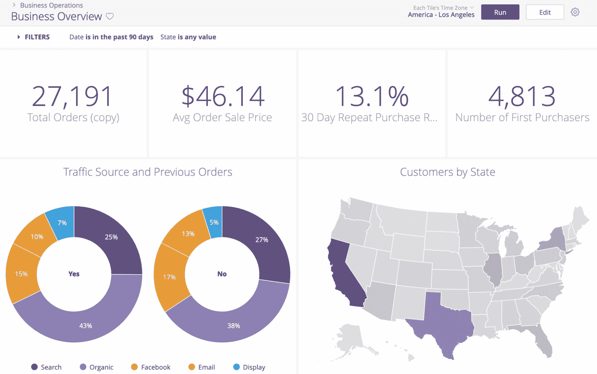
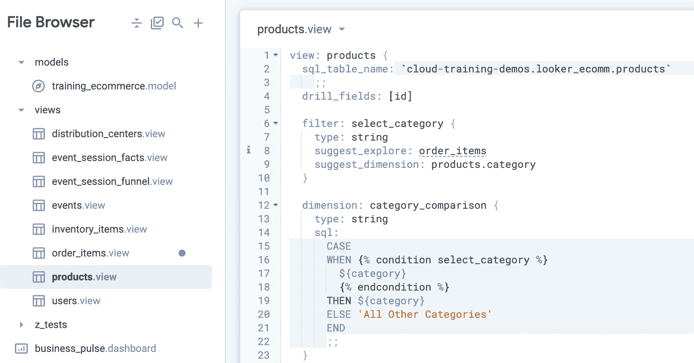
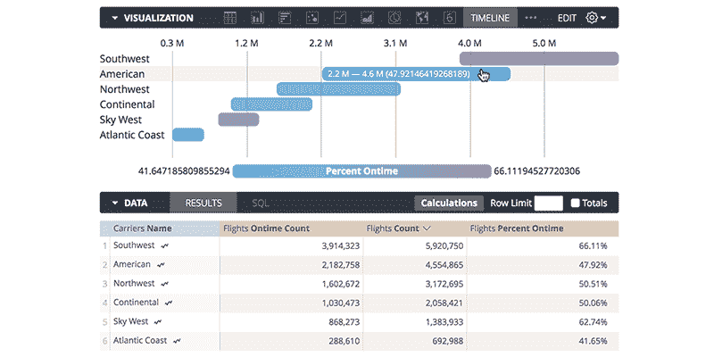
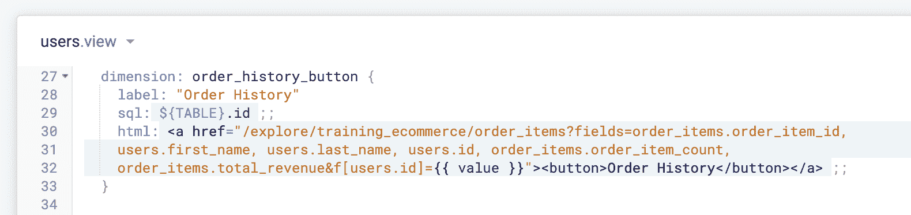
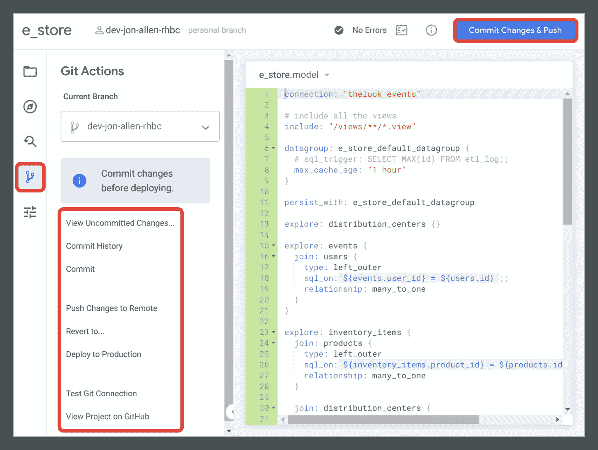

# 旁观者:如何在你的公司实施商业智能分析软件

> 原文：<https://www.stxnext.com/blog/looker-business-intelligence-analytics-software/>

 市场上有许多商业智能软件选项可以帮助您实现目标。然而，并不是所有的工具都值得你花费时间和金钱。你还应该警惕他们的营销人员经常宣传的“毫不费力且自动”的魔术。

在这篇文章中，我将分享我对 Looker— **这一商业智能软件和大数据分析平台的想法和实践经验。**以它为例，如果您正在考虑为您的公司选择 BI 工具，我将向您和您的技术团队解释实际需求。

我的目标是帮助您更好地理解在您的企业中实施 Looker 的所有实际后果，考虑其利弊，并展示其潜在的好处和局限性。 

#### 什么是商业智能？

商业智能是最受欢迎和发展最快的软件领域之一，它可以为公司的几乎所有业务流程增加实质性的价值。

BI 分析软件提供可操作的见解，并为您的组织提供有价值的数据，从而帮助您改进决策流程。它帮助你确定未来可能的市场趋势，衡量你的效率，并确定潜在的增长领域。

#### 什么是 Looker？

Looker 是一项基于网络的服务，旨在帮助企业用户从他们公司产生的数据中获取有用的见解。2012 年由一家美国创业公司创建，2019 年被谷歌收购，现在是谷歌云的一部分。

除了 Looker，市场上还有许多不同的解决方案，如 Redash、 [Tableau 或 PowerBI](/blog/business-intelligence-tools/) 。这些其他工具可能在以下方面有所不同:

*   定价模式:开源(建立并支付自己的基础设施)与商业(支付提供商托管的服务)，
*   数据访问:传统(将数据接收到平台中)与现代(在原始位置访问数据)，
*   创建仪表板所需的能力:SQL 与 excel 之类的技术技能+仅拖放技能。

不同的工具也可以具有不同的成熟度级别，从而产生各种可用的可视化、即时转换等。

**重要的是，本文关注的是 Looker，但谷歌也有产品性质非常相似的竞争对手。这使得下面的大部分分析对于所有这些商业智能工具都是通用的。**

****

**资料来源:docs.looker.com**

#### 你为什么要考虑 Google Looker？

我们的一个客户最近决定替换 Redash，这是一个运行在专用实例上的开源服务，在他们的情况下，运行在存储他们数据的同一个云中。他们选择了 Looker，它是 Redash 的现代商业和主持版。

**我们的客户开始寻找 Redash 替代品的主要原因是为了减少制作包含对其业务至关重要的所有数据的仪表板所需的时间，**从制定其业务需求一直到实际交付该仪表板。

在 Redash 的例子中，每个仪表板的每个图块都直接基于一个 SQL 查询。创建一个新的 tile 或修改一个现有的 tile 意味着编写查询代码，这使得 SQL 能力成为一项必备技能，并有效地限制了准备这些技能的人数。因此，瓶颈是数据团队所要求的处理能力。

#### Looker 软件有什么特点？

Looker 是一种连接现有数据库、数据仓库和数据湖的服务。它仍然需要在后台使用 SQL，但不同之处在于数据和仪表板之间有中间层。**Looker 最重要的特性是:“模型和视图”、“探索”、“计算”和“向下钻取”**

##### 1.模型和视图

数据模式被映射到 Looker“模型”中，后者重组“视图”“视图”可能是实际数据表的直接总结，或者是为了使业务洞察力的探索更加直接而创建的转换表。

##### 2 .探险家

业务用户在他们的界面上看到的是 Looker“explores”——带有一个字段列表的页面，您可以通过简单地单击、拖放、从调色板中选择颜色等来选择、格式化和可视化这些字段。唯一需要使用键盘的是在输入仪表板标题时。

##### 3.计算

如果您想进一步探索，只需定义一些过滤器，声明一些“计算”(类似 excel 的列操作)，或者选择一个字段作为表的枢纽。

##### 4.向下钻取

对任何业务分析师来说，最重要的特性是“深入”，即放大任何统计数据背后的细节的能力。例如，你可以通过点击图表中代表每月收入的条形来实现，这将导致更细粒度的切片，甚至是当月所有销售商品的完整列表。

#### 使用 Looker 商业智能平台的挑战

所有的商业智能工具都向他们的用户承诺，他们将能够专注于点击所有有价值的信息，而不需要技术知识，并且只需要很少的时间来交付可展示的内容。

这说服了我们的客户投资 Looker 许可证并开始迁移。现在让我们来看看 Looker 是否在实践中信守承诺。

**资料来源:docs.looker.com**

虽然旁观者“探索”的想法对分析师来说确实很方便，但如果“探索”者自己事先没有做好准备，它实际上就不会是一个如此无痛的体验。

格式化值——首先将它们用作过滤器，然后用作仪表板中的图表——如果它们被错误地定义并链接到后台数据，则根本不可能。

**不幸的是，你应该从一开始就考虑所有的限制和要求**。**它们构成了一堵真正的技术依赖墙**在仪表板能够像在 Looker 和其他类似工具中那样有洞察力之前，需要理解和解决这些问题。

现在让我来概述一下 Looker 最麻烦、最复杂的方面，它将为我们在贵公司实施几乎所有商业智能分析软件提供重要指导。

##### 1.特定于观察者的语言

我以前提到过旁观者的观点。它们是在 LookML 中定义的，LookML 是 YAML 和 JSON 的混合体，使用额外的特殊语法，例如 Liquid，来实现一些高级功能。

这不是一篇技术文章，所以我不会深入讨论实现细节和代码本身，但是您需要考虑到，当技术和数据团队第一次使用 Looker 时，需要面对一个陡峭的学习曲线。

即使您已经了解了 LookML，在商业用户获得好处之前，仍然有大量的工作要做。

##### 2.正确设置您的数据模型

有些工作实际上是由工具本身自动完成的。例如,“视图”是为 Looker 为您发现的现有表自动生成的。

这是至关重要的，因为如果您的表有几百个字段，那么可以为您预先创建用于填充 Looker“视图”的相应 Looker“维度”的代码。

由于这些“维度”被转化为你在旁观者“探索”中看到的维度，你可能会认为后端工作已经完成，但事实并非如此。首先，开发人员需要检查是否所有的“维度”都有正确的 Looker 数据类型，以及它是否与数据源中的数据匹配。

从我的经验来看，处理数据湖可能需要大量的工作，例如，在模式定义不太严格的情况下。手动更改数百个字段非常耗时。

****

**来源:cloudskillsboost.google**

##### 3.将 SQL 转换成 LookML

即使正确定义了所有的“维度”,业务用户仍然只有很少的洞察力可以挖掘。 SQL 可以执行如下转换:

*   通过公共键连接不同的表，例如将“订单”表与“产品”表连接，以了解哪些产品实际上已经售出；
*   用联合将相似的表堆叠成一个表；
*   汇总表的详细信息，例如计算每月的订单数或汇总每个销售人员的收入数。

替换 SQL 需要将这些概念转换成 LookML。

尽管有可能在 Looker 中用传统的 SQL 定义每一个这样的转换，但我们并不推荐这样做。

维护一个 SQL 代码并关注它在不同仪表板上的可重用性可能被证明是复杂的。然而，虽然“联接”可以在 Looker“模型”中定义，但表联合还不存在，需要一些特殊的技巧，这取决于用例。

##### 4.定义转换和聚合

表聚合由 Looker“measures”处理。**该词汇表需要业务用户学习，**因为“measures”与“explores”中的“dimensions”出现在相同的字段列表中，但是它们与聚合函数相关，而不是原始表中出现的原始或转换字段。

例如，“金额”可以是表示为给定订单支付的金额的字段，而“sum_amount”可以是到日期为止为所有订单支付的总金额的“度量”。

毕竟，“选择日期，订单中的**金额**与“选择日期，订单分组中的**金额**”不同。

Looker 自动将选中的“维度”和“度量”翻译成 SQL 发送到数据库，非常有用。但是，如果分析师需要知道一天的总购买量与一个月的总购买量的比率，就不能点击并从自动生成的基本“视图”中进行选择。

即使是这一事实本身也揭示了数据科学家的瓶颈承诺的绕过。

**资料来源:looker.com**

在“explore”中直接创建自定义“尺寸”对于 Looker 的“计算”来说问题不大，但是首先，您需要知道另一个特殊的 Looker 语法来定义这些“计算”其次，由于这些转换不是在数据库端执行的，使用它们会对 Looker 实例的性能产生负面影响。

##### 5.性能问题

在“explores”中使用过滤器和枢轴时，你很快就会发现在 GUI 中只有一些逻辑条件是可能的。我个人发现自己无法轻松选择与过去某个时期相关的项目，例如 3 个月前和 5 个月前之后。

枢纽是在客户端执行的操作，因此拥有太多枢纽会导致你的仪表板刷新很长时间。

除了方便的缓存机制之外，Looker 对性能问题的回应是将持久计算作为数据源中的物理表来执行。

这被打包成一个被提议由平台自动执行的特性。但是这与直接在底层数据平台上拥有各自的提取-转换-加载(ETL)机制是一回事。

如果你没有数据工程师，使用这个功能可能会很有趣。但是，为了用对您的数据执行得最好的时间表和触发器正确地设置一切，已经需要一些数据工程技能。

您可能会得出与我相似的结论:在现有基础设施中包含任何聚合管道可能比在 Looker 中做一些更有意义。

##### 6.定制深入体验

**最后，向下钻取功能也不是免费的。**当深入挖掘数据时，您希望看到的字段需要明确定义，并且不能由最终用户更改。

以这种方式显示的数据无法排序或过滤，但您可以再次单击以从该详细视图开始新的探索。默认的下钻查看器行为也是有限的，对于使用一些自定义指标的“视图”来说是不可用的——实际上对于大多数视图来说也是如此。

在这种情况下，Looker 有一个解决方案:更多的代码。

开发人员可以使用定制的 HTML 来覆盖内置功能，该 HTML 使用了流动条件语法和一组您可能会引用的系统变量进行了增强。

但这也意味着有更多的时间为业务用户交付有意义的组件。在这里，Looker 还需要技术和数据团队具备更多的技术能力，而不仅仅是编写 SQL 查询。

**来源:cloudskillsboost.google**

##### 7.长相限制

在那些给予商业用户的大承诺的背景下，我想提一下，它们可能会给你和你的开发者带来额外的挫折。

前者可能会迷失在所有与外表相关的术语中，因为从第一组基本“视图”中得不到任何东西——特别是如果这些视图一对一地映射到关系数据库，则需要知道表的模式。

**后者也将面临学习这个庞大的商业智能工具的所有功能的挑战。开发用户还会感到定义所有完美的“度量”、预先计算和预先格式化的压力，以便数据从一开始就可以理解并得到最有效的处理。**

在关系数据库中呈现几个各有数百个字段的表与将它们分组为逻辑组之间存在巨大差异。同样，为它们提供更易于阅读的标签和使更常用的字段更易于访问也是有区别的。

##### 8.一些优势

从好的方面来看，很少有事情是 Looker 办不到的。您可以在项目中学习和使用许多不同的参数。如果您在 Looker 介绍的概念中没有找到解决方案，您可能会退回到定制的 SQL/HTML/Liquid 代码。最终，你将不得不。

开发人员也可以使用内置的 IDE 和与基于 git 的代码版本服务的集成。一些操作，比如创建 git 分支、提交代码、向主分支推送和从主分支拉出，可以通过 Looker 直接执行。

**资料来源:docs.looker.com**

推/拉请求和代码审查可以被设置为强制的，但是自然地，需要在 git 存储库服务提供者端完成。更复杂的 git 操作，比如 rebases，需要命令行干预。

请注意，有文档和社区论坛可以帮助您开始工作。如果您有任何问题，他们的支持聊天也非常及时。

#### Looker 商业智能和分析软件工具的关键要点

Looker 是最流行的商业智能工具之一。它之所以受欢迎，一定程度上是因为它背后的谷歌品牌，但快速获得有关您业务的宝贵见解的承诺也非常强大。

然而，与大多数技术一样，有一个巨大的技术基础使其成为可能。为您的企业选择的解决方案肯定会影响成本和您获得的功能集。

但是，由于数据存储的基础系统没有改变，负责访问和处理数据的实际工程工作将始终是必需的。

##### 短期后果

在 Looker 和类似的 BI 解决方案中，高级数据探索功能承诺给拥有近乎零的开发技能的业务用户，但代价是让其他人执行这些开发任务。

由于引入了抽象中间层，将数据及其模式映射到该层和相关概念需要额外的初始开发工作。

##### 长期后果

**理想情况下，这些额外的入口点工作应该在以后得到回报，**当项目足够成熟，业务用户可以真正从数据探索的自由中受益时。

但即使这样，每个新的数据源和每个新的定制指标仍然需要在后端代码中引入，并且出于性能优化的原因，客户端最流行的数据转换可能需要作为 ETL 来实现。

如果你决定使用 Looker，请注意，技术团队要让它变得灵活、可维护和高效并不容易，而且数据团队和业务分析师都需要支付相当大的入门成本。

#### 关于在贵公司实施 Looker 商业智能分析软件的最终想法

感谢您阅读我关于 Looker 的文章。我希望它能帮助您得出一些有价值的结论，为您的企业选择最佳的 BI 分析软件。

最终，选择最合适的解决方案取决于您的个人需求。 你应该仔细查看产品特性，检查工具是否符合你的业务需求。

在 STX 接下来， [**我们有许多经验丰富的数据科学家和数据工程师**](/services/data-engineering/)他们将非常乐意帮助您做出选择，并指导您完成决策过程。

我们的数据工程服务是定制的，包括数据收集、存储、处理、访问管理和可视化。其结果将有助于您将企业转型为数据驱动型公司，并让您做出更明智的决策，最终推动您的增长，并为您带来长期竞争优势。

如果您有兴趣了解更多关于数据科学、数据工程或商业智能工具的知识，这里有一些资源可以帮助您:

*   [数据工程的 Python:数据工程师为什么要用 Python？](/blog/python-for-data-engineering/)
*   [顶级商业智能和分析软件工具对比:Tableau vs . Power BI vs . Domo vs . si sense](/blog/business-intelligence-tools/)
*   [如何挑选最好的分析工具:产品分析景观](/blog/how-to-pick-the-best-analytics-tools-product-analytics-landscape/)

您对商业智能工具和 大数据分析软件 还有什么问题吗？或者你需要一些帮助来开发你自己的智能平台？如果是这样，我们的软件工程专家团队将非常乐意为您提供支持。 [**联系我们**](/hire-us) 获取你寻求的所有答案！