# 让你开始学习 Python 的 14 大博客

> 原文：<https://www.stxnext.com/blog/top-10-blogs-python/>

 想着铤而走险 [**用 Python 弄脏自己的手**](https://stxnext.com/services/python-development/) **？也许你已经熟悉了这种语言，但是想更深入地了解这个兔子洞到底有多深？**

无论您是一名具有一些编程知识的开发人员，还是刚刚涉足这些领域，您都做出了正确的选择。Python 是一种易于掌握的语言，同时， [**足够灵活，你可以用**](https://stxnext.com/what-is-python-used-for/) 做一些有趣的事情。

尽管如此，决定学习如何有效地使用 Python 只是这个激动人心的旅程的第一步。一旦这一切都过去了，是时候自我教育了。

不管你是在寻找基础教程还是所有最新发展的新闻，你都需要一些高质量的资源来保持你对 Python 的了解。

为了让事情变得更加简单，我们收集了 14 个可靠的 Python 博客——这是一个很好的起点！ 

#### 值得关注的最佳 Python 博客、资源和网站

##### 1.Python 星球——Python 博客

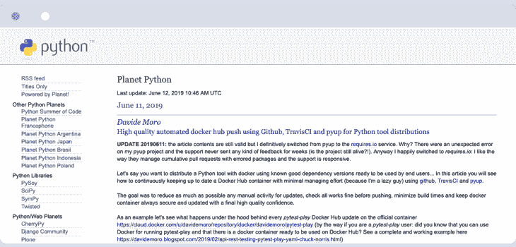

[**Planet Python**](https://planetpython.org/)可能是你所有 Python 需求的第一来源。原因很简单——它非常全面。

平均每天有几篇帖子，Planet Python 令人难以置信的范围是由于它汇集了来自各种其他博客的最近与 Python 相关的帖子。所有的资料来源都是有信誉的，文章本身也是经过精心挑选的，这就产生了一个为你提供全面的新闻和教程的博客。

##### **著名帖子**

对于像 Planet Python 这样多样化的博客来说，选择一篇文章作为该网站多功能性的例子是相当具有挑战性的，但如果我们要选择一个最近的例子，有 [**ListenData 的熊猫 Python 教程**](https://www.listendata.com/search/label/Python) **。这很好地表明了这个博客上链接的教程可以有多深入。**

##### 2.全栈 Python——由多个 Python 博客作者提供的综合资源

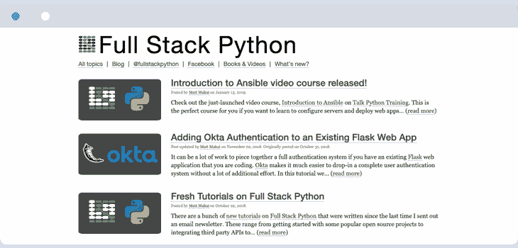

如果你正在寻找一个专门的资源来帮助你的最新的基于 Python 的应用立即启动并运行，[全栈 Python](https://www.fullstackpython.com/blog.html) 绝对名副其实。

的确，更新发生得相当偶然——有些月份有多次更新，接下来的一个月有两次或没有更新。尽管如此，每一篇新帖都是一个详细的、非常精美的教程，介绍了许多利用 Python 的平台中的一个，将帮助您启动您的项目。

##### **著名帖子**

为了最好地说明他们教程的全部范围，关于烧瓶的  [帖子](https://www.fullstackpython.com/flask.html) 就是一个很好的例子。除了提供自己的指令和指南，Full Stack Python 还链接了大量面向初学者和中级用户的资源，因此您可以阅读大量资料！

##### 3.真正的 Python——一个全面的 Python 编程博客

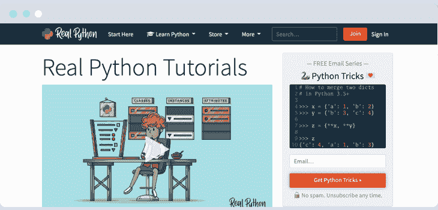

如果你想要一个非常容易消化的强大课程，那么真正的 Python 是很棒的。凭借引人注目的信息图表、视频和整体有趣的氛围，本课程(因为这正是本博客的本质)将向您展示诀窍，并为您提供开始 Python 冒险的所有必要工具，同时还能激起您更多的兴趣。

##### **著名帖子**

[Pip 是什么？](https://realpython.com/what-is-pip/) 这是一个详细的分步指南，它将教你关于 Python 的标准包管理器 pip 的所有知识。

##### 4.py bloggers——最好的 Python 博客聚集在一起

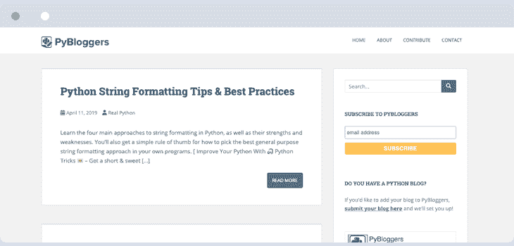

很像行星 Python，[这个博客](http://www.pybloggers.com/)汇集了来自互联网上各种 Python 博客的帖子，尽管他们仍然有自己的贡献者创建独特的帖子。它包含丰富的教程、技巧和窍门，让用 Python 编程变得轻而易举。

##### **著名帖子**

一个由网站自己的贡献者提供的帖子。这是一个全面的  [教程，讲述如何使用聚类来确定图像的主色是什么](http://www.pybloggers.com/2019/02/tutorial-find-dominant-colors-in-an-image-through-clustering/)。

##### 5.talk Python——音频形式的 Python 博客

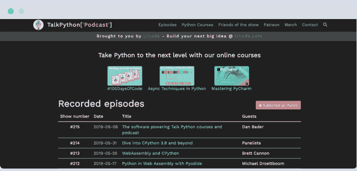

现在来点完全不同的。我们认为，可能会有这样的情况，你想了解更多，但出于这样或那样的原因——无论你是堵车还是累得睁不开眼——你现在都无法阅读博客文章。

这里是 [TalkPython](https://talkpython.fm/episodes/all) 发挥作用的地方。这和这个列表中的许多其他博客类似，但这次是播客！休息一下，听听这个领域的一些大专家谈论有用的 Python 相关话题。

##### 6.Python 软件基金会——由创作者自己提供的与 Python 相关的新内容

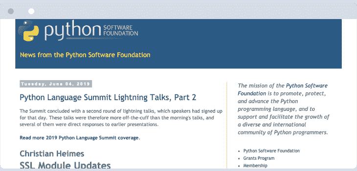

当然，如果您真的想知道 Python 世界到底发生了什么，您最好的办法是开始查看源代码。有了 [Python 软件基金会](http://pyfound.blogspot.com/)的博客，你将随时掌握最新动态、创作者自己提供的教程以及公司内部的最新消息。

##### **著名帖子**

作为一个例子，你可以在这个网站上遇到什么，  [这里有一份关于 2018 年 10 月 Python Brasil](http://pyfound.blogspot.com/2019/02/python-brasil-people-technology.html) 的报告。

##### 7.finxter——面向前瞻性人群的 Python 编程博客

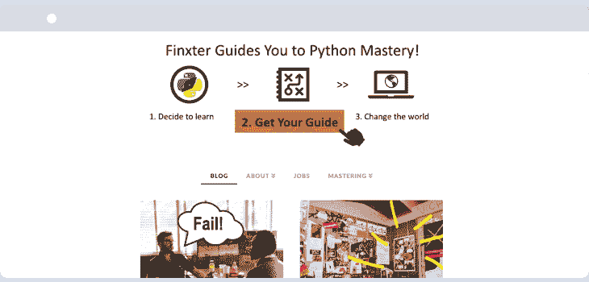

Finxter 是一个博客，提供了各种各样的 Python 相关的指南，更适合热门、时髦和潮流人群。这些指南都很小，但是它们给了你非常实用的提示，由于其格式，这些提示非常容易理解。

##### **著名帖子**

作为一个来自博客的非常具体的指南的例子，这里有一个详细而简单的关于 Python Endswith 的  [解释，它一定会给你留下一些好的、实用的知识。](https://blog.finxter.com/regex-endswith-python/)

##### 8.Python 大师——提供实用指南和解决方案的 Python 编程博客

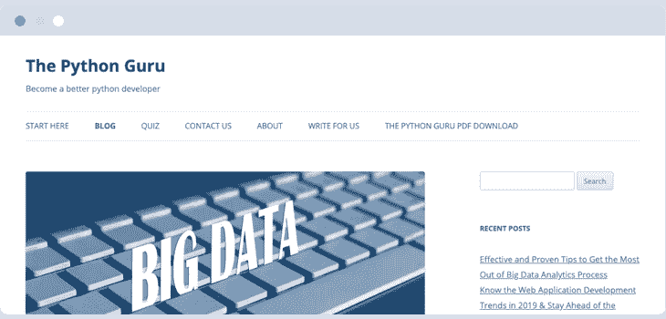

Python 大师是 Python 领域的绝对初学者和寻找有趣读物的老手的完美博客。这里有大量的指南，并不是所有的都是技术性的，因为它们主要集中在软件的实际应用上，尤其是与开展商业项目有关的应用。

##### **著名帖子**

这里有一个帖子详细介绍了[Python 如何帮助执行涉及人工智能和机器学习的项目](https://thepythonguru.com/why-python-is-an-ideal-choice-for-accomplishing-projects-involving-ai-ml/)——这绝对是一个相关的问题！

#### 值得关注的最佳 Python 博客作者、专家和影响者

下面你会发现一些已经掌握 Python 的最好的博客作者和专家的列表，他们正在与社区分享他们宝贵的知识和个人经验。

它们是作者视角、现实世界类比、个性和伟大故事的完美结合。

##### 9.鼠标大战 Python——一个魅力不可否认的 Python 博客

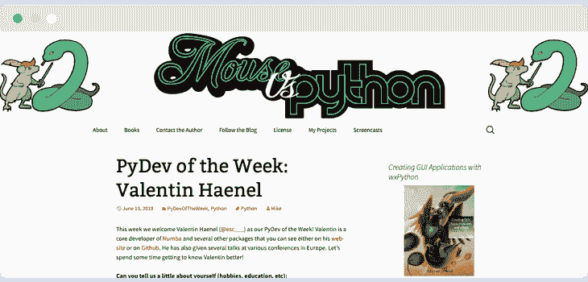

不要让这个可爱的名字欺骗了你——[Mouse vs . Python](http://www.blog.pythonlibrary.org/)是最好的资源之一，如果你正在寻找关于 Python 的最新消息。

通过所有最新更新和公告的帖子，以及对著名 Python 开发人员的采访，这个博客将让您从一个不太技术性的角度了解 Python 世界的最新动态。贯穿始终的可爱艺术也是一个优点。

##### **著名帖子**

你知道吗  [最近的黑洞照片](https://www.theguardian.com/science/2019/apr/10/black-hole-picture-captured-for-first-time-in-space-breakthrough) 就是用一堆 Python 库做成的？  [本帖](http://www.blog.pythonlibrary.org/2019/04/11/python-used-to-take-photo-of-black-hole/) 进一步详细。

##### 10.Doug Hellmann——由著名的 Python 博主运营

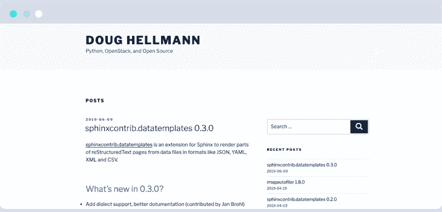

由本周 Python 模块的创建者运行的这个博客更像是许多可用 Python 库的数据库。虽然这些帖子不会定期发布，但它们总是对最新更新的内容进行了非常有力的删减。

偶尔，你会收到 Doug 写的更长的帖子，这些帖子更像是与 Python 相关的各种想法和指南。

##### 11.米格尔·格林伯格——一个真正的专家的 Python 博客，不仅仅是在 Flask 上

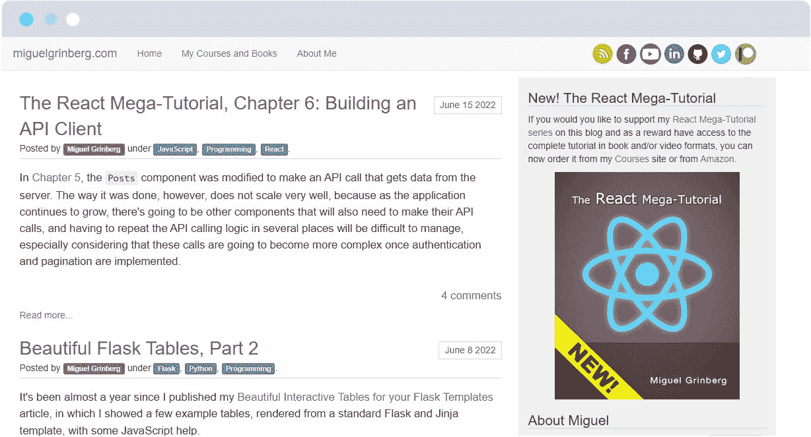

[**米盖尔·格林伯格**](https://blog.miguelgrinberg.com/) 是 Twilio 负责技术内容的首席软件工程师。他还因对 Flask API 框架的宝贵贡献以及大量关于 Python 和编写软件的书籍而闻名。

Miguel 在该行业拥有大约 30 年的经验，他涉足多个领域，从 web 开发、微服务、云、视频广播到计算机动画。

除了文章本身，Miguel 的大多数帖子都包含 YouTube 视频，所以如果你在寻找初学者的教程，这个博客会非常方便。

##### **著名帖子**

为了证明和 Miguel 一起学习 Python 是多么容易，以及他的 Flask 知识是多么有帮助，请在这里查看这篇文章:[**《Flask 巨型教程第一部分:你好，世界！**](https://blog.miguelgrinberg.com/post/the-flask-mega-tutorial-part-i-hello-world)

##### 12.py Danny——Python 老手的博客

****

[**PyDanny**](https://daniel.feldroy.com/) 是丹尼尔·罗伊·格林菲尔德(Daniel Roy Greenfeld)的博客，他是一位拥有数十年经验的软件老手。他目前是章鱼能源公司的工程总监，但也为包括美国宇航局在内的许多公司工作过。

Daniel 主要擅长 Python 和 Django 等领域，但有时也会使用 JavaScript 和 C#。

他的博客收集了大量有用的资源和书籍，但最重要的是，广泛的教育性教程将对使用 Python 有所启发。

他也是题为“姜戈的两勺”系列的合著者，这是与他的妻子奥黛丽一起创作的冰淇淋主题的书籍。

如果你是 Python 编程语言的超级粉丝，但想了解更多其他技术，这个博客将非常适合你。

##### **著名帖子**

我们强烈推荐阅读丹尼尔关于[三十分钟规则](https://daniel.feldroy.com/posts/thirty-minute-rule)的帖子——它说如果任何人在某件事情上卡住超过 30 分钟，他们应该寻求帮助。听起来很有趣，不是吗？

##### 13.matt Layman——关于 Python 和 Django 的博客

**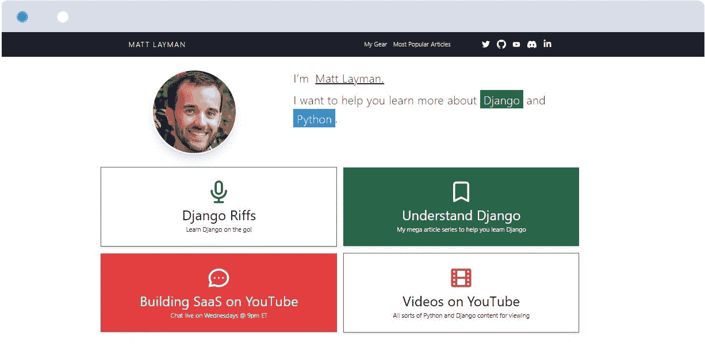**

[**马特·莱门德**](https://www.mattlayman.com/) 是按需博士的软件架构师，通晓多种语言的程序员，以及拥有十多年 web 开发经验的 Django 培训顾问。

Matt 的博客主要是关于 Python 和 Django 的，他在博客中分享了一些有用的技术、策略、教程和技巧，告诉你如何通过自动化来提高效率，但他也会帮助你学习 JavaScript 和许多其他语言。

他的帖子结合了文本、音频和视频，这使得它们易于理解，读起来也很有趣。你可以期待每个月都有一些帖子和大量有价值的 YouTube 视频在他的频道上观看。

##### **著名帖子**

需要证明？查看 Matt 在 [**上的帖子**](https://www.mattlayman.com/understand-django/debugging-tips-techniques/) ，该帖子旨在为您提供工具，以解决您在构建 Django 网站时可能遇到的实际问题。

##### 14.ned Batchelder——向拥有四十年经验的 Python 大师学习

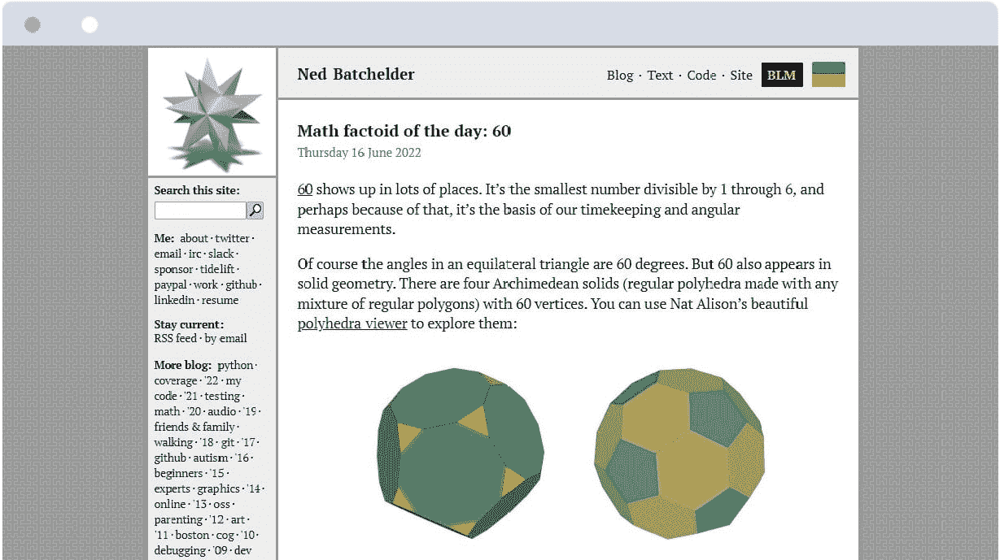

[**Ned Batchelder**](https://nedbatchelder.com/)是一名软件开发人员，拥有近 40 年的软件开发经验，通过使用各种技术来解决实际问题。他的博客是 21 世纪初最古老的活跃的 Python 博客之一。

如果这个事实本身不能说明问题，我们应该补充一下，他的博客反映了 Ned 的各种令人敬畏的兴趣:“软件工程、为人父母、数学(特别是视觉方面，如几何)、政治、极客娱乐、语言，等等。”

不用说，你会在这里找到大量真正有创意的文章，有些还夹杂着谜题。对于任何级别的 Python 爱好者来说，它们都是很棒的。我们怎么推荐他们都不为过。

虽然更频繁的帖子会更受欢迎，但 Ned 写的大量旧帖子值得研究——他在 Python 方面的实验和写作时间比列表中的大多数人都长。

##### **著名帖子**

[**“为什么你的嘲弄仍然不起作用”**](https://nedbatchelder.com/blog/202202/why_your_mock_still_doesnt_work.html) 是 Ned 有趣写作方式的一个很好的例子，但你应该特别看看他的 [**【哪些 Python 中有什么】**](https://nedbatchelder.com/text/which-py.html) 关于哪些 Python 版本中出现了哪些特性的有用总结，都在一个地方。

#### 关于顶级 Python 博客的最终想法

Python 是一个不可思议的解决方案，它开启了大量的机会，但是我们都很清楚在这个主题上寻找可靠的知识来源需要花费多少时间。我们希望我们的小清单能派上用场，以一种有组织、易于理解的形式给你提供你需要的所有信息。

如果你曾经渴望获得更多的知识，那就上 [**我们的博客**](https://stxnext.com/blog) **！毕竟，我们 STX Next 在这一领域拥有相当多的专业知识。在市场上超过 17 年，超过 400 名开发人员， [**700 多个成功项目**](https://stxnext.com/portfolio) **，** 和超过 250 个满意的客户，我们有很多知识很乐意与您分享。**

这里只是我们在 Python 上的一点经验:

*   [**最好的 Python IDEs 和代码编辑器(根据我们的开发者和 Python 社区)**](/blog/best-python-ides-code-editors/)

*   [**数据工程的 Python:数据工程师为什么要用 Python？**](/blog/python-for-data-engineering/)

*   [**40 大热门 Python 科学库**](/blog/most-popular-python-scientific-libraries/)

如果你有兴趣和我们一起工作，看看我们目前的 [**工作机会**](https://career.stxnext.com/job-offers-en/) 。我们一直在寻找有才华、有热情的 Python 开发者加入我们的行列。 自 2005 年以来，我们的跨学科团队一直在创造独特的产品，这些产品结合了良好的实践、高质量的软件和新技术。

如果您正在寻找一个 [**专业的 Python 开发团队**](/services/python-development/) 手头有各种各样的库和框架来满足您的特定需求， [**联系我们**](/hire-us) 让我们一起讨论您的下一个软件项目吧！