# 什么是数据工程？Python 中的常见挑战和解决方案

> 原文：<https://www.stxnext.com/blog/what-is-data-engineering/>

 就像不断发展和采用新技术的数据行业本身一样，数据工程挑战也在不断变化。那么，数据工程师应该期待什么呢？

[数据工程](/services/data-engineering/) 在引领数据驱动型公司走向成功的过程中起着至关重要的作用。然而，现代社会的基本技能和过去不一样了。

这意味着数据工程师的角色伴随着一些严重的障碍。为了帮助你克服它们，我们写了这篇文章。下面是你将从阅读中了解到的内容:

*   **什么是数据工程？**

*   **谁是数据工程师？**

*   **最常见的数据工程挑战是什么？**

*   Python 如何帮助您找到应对这些挑战的解决方案？

下面的指南是基于 STX Next 的数据工程师 Maksymilian Jaworski 在庆祝 Python 30 周年的 PowerIT 大会上的演讲。点击这里观看 Maksymilian 关于这个主题的网络研讨会的完整记录:

[https://www.youtube.com/embed/JbRIWW1j3Nw](https://www.youtube.com/embed/JbRIWW1j3Nw) 

#### 什么是数据工程？

根据 [Coursera](https://www.coursera.org/articles/what-does-a-data-engineer-do-and-how-do-i-become-one) 的说法，“数据工程是设计和建造大规模收集、存储和分析数据系统的实践。”

乍听起来不错。但是让我们试着用更简单的术语来理解数据工程。

企业会产生大量数据，如客户反馈、运营信息、股票价格影响和销售业绩。不幸的是，这些信息很复杂，很难理解。因此，企业需要一种解决方案来帮助他们收集和分析原始数据，并衍生出他们可以利用来蓬勃发展的实际应用程序。

这就是数据工程的用武之地。

数据工程是软件工程的一个分支学科，完全专注于数据的传输、转换和存储，它包括设计和构建将数据转换成最终用户可用格式的管道。

数据工程构成了任何 [数据驱动型公司](/blog/kpi-revolution-implementing-kpis-data-driven-business/) 的基础，这也是为什么如今数据工程师需求量很大的原因。然而，这个角色需要大量的数据素养技能。

#### 谁是数据工程师？

数据工程是一项多年来需求稳步上升的技能。 [数据工程师](https://www.coursera.org/articles/what-does-a-data-engineer-do-and-how-do-i-become-one) 负责使原始数据可用于数据科学家、业务分析师和组织内所有其他最终用户的进一步数据驱动工作。

数据工程师的职责包括但不限于:

*   训练 [机器学习【ML】](/services/machine-learning/)模型，
*   发现并纠正数据中的错误，
*   执行探索性数据分析，
*   给数据一个标准格式，
*   用外部数据填充应用程序中的字段，
*   删除数据的重复副本。

简而言之，商业智能、数据科学或任何其他与数据相关的团队都是数据工程团队的最终用户。

#### 数据工程与数据科学

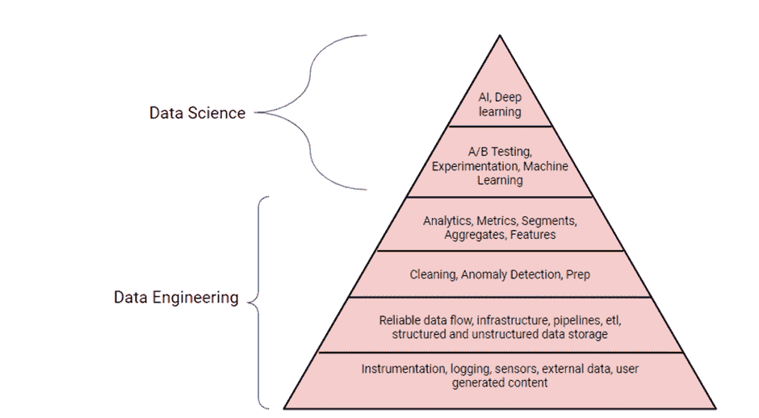

过去已经有很多关于 [数据工程和](https://www.datacamp.com/community/blog/data-scientist-vs-data-engineer) 数据科学的文章，就像上面这张由 Terence Shin 创作的图片。

实际上，它们是两种互补的技能。数据工程使数据可靠和一致，以便进行分析，而数据科学将这些可靠的数据用于分析项目，如机器学习、数据探索等。

这与人类将身体需求置于社会需求之前的方式非常相似。通常，公司必须满足数据工程保护伞下的一些先决条件，才能为数据科学家的工作奠定基础。

因此，数据科学家依靠数据工程师收集和准备数据以进行分析的说法是正确的。事实上，我们甚至可以说没有数据工程就没有数据科学。至少，理论上是这么说的，这也是 Terence Shin 写道“数据工程是成功的数据驱动型公司的基础”的原因。我们有什么资格反驳呢？

然而，你们中的一些人可能不同意上面的图像或陈述，因为有许多数据科学家执行数据工程(DE)任务，也有许多数据工程师进行机器学习。所以，我们将让你来决定你选择相信什么。

#### 最常见的数据工程挑战和任务

现在我们对数据工程本身有了更好的理解，是时候深入理解典型的数据工程任务、活动领域、数据管道等了。

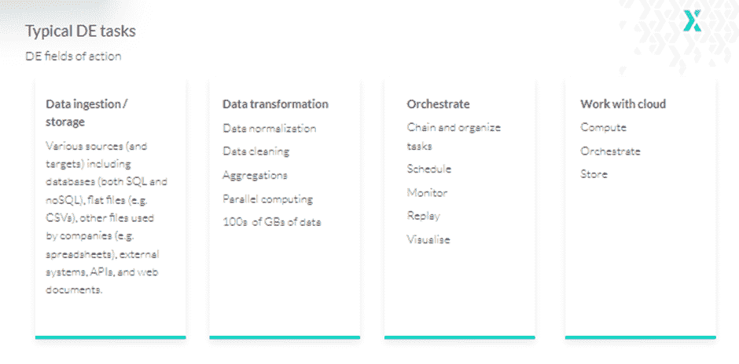

##### 数据摄取

数据工程项目生命周期的第一步——数据摄取——涉及将数据从各种来源移动到特定的数据库或数据仓库，在那里数据可用于数据转换和分析。

存储在这里也值得一提，因为数据工程的核心目的是连接到各种存储类型，从中提取数据，并保存数据。

这方面的一个挑战是数据以各种文件格式出现，比如逗号、制表符分隔、JSON 和面向列的文件，比如 Parquet 或 ORC 文件。因此，数据工程师经常需要处理结构化和非结构化数据。

此外，这些数据可能存在于各种 SQL 和 NoSQL 数据库以及数据湖中，或者他们可能不得不从网站、流媒体服务、API 等获取数据。

##### 数据转换

顾名思义，数据转换是指将数据从一种格式转换成另一种格式。通常，收集的大多数数据都需要某种调整，以便符合系统架构标准。

因此，在转换中，数据工程师将执行数据规范化和清理，以使用户更容易访问信息。这包括更改或删除数据集中不正确、重复、损坏或不完整的数据。将相同的数据转换为单一类型；确保日期格式一致；还有更多。

由于所有这些转换都是在极其大量的数据上执行的，因此也产生了对并行计算的需求。

##### 数据编排

最后一步是数据编排——组合和组织来自不同存储位置的孤立数据，并使其可用于数据分析——因为数据管道包含几个元素:数据源、转换和数据接收器/目标。

因此，数据管道不是作为一大块代码编写的，而是使用不同种类的技术从独立的、相对较小的部分构建的。

为了实现这一点，数据工程师应该将各个部分连接起来，安排流程，有时还要根据传入的数据做出决策，重放部分管道，或者对某些部分应用并行化。执行所有这些任务需要比 Crontab 等工具更大、更高效的工具。

##### 在云和与云一起工作

最后，大多数现代数据工程任务都在云中执行。因此，数据工程师还需要适当的工具来有效地使用云。

#### 什么是数据接收和存储？

如前所述，数据接收就是收集和存储数据以备将来使用。这就给我们带来了一个问题，“不同的数据库是如何连接的？”

SQLAlchemy 可能是连接数据库最常用的工具。一个对象关系模型库，它支持 MySQL、MariaDB、PostgreSQL、Microsoft SQL Server、OracleDB 和 SQLite。它由两个不同的组件组成:核心和对象关系映射器(ORM)。

核心是一个全功能的 SQL 工具包，允许用户与各种 DB APIs 进行交互。在 ORM 中，类可以映射到数据库模式。ORM 是可选的，但它可能是使 SQLAlchemy 如此受欢迎的主要特性。其他连接器包括:

*   [MySQL 连接器](https://arctype.com/blog/sql-python/) 为 Python
*   [pyodbc](https://github.com/mkleehammer/pyodbc/wiki) 为微软服务器；
*   PyMongo 为 MongoDB
*   [【redis py】](https://docs.redis.com/latest/rs/references/client_references/client_python/)用于 redis。

基本上，每个已知的数据库或数据仓库——无论是 Snowflake Elastic 还是 click house——都有自己的 Python 连接器，或者至少推荐使用通用连接器。对于网站和 API，有一些众所周知的请求库，通常与 BeautifulSoup 结合使用，beautiful soup 是一个有用的实用程序，允许您从网页中获取特定的元素，如图像列表。

还有 Scrappy，一种允许用户编写少量 Python 代码来创建“蜘蛛”的工具，这是一种可以浏览网页并抓取它们的自动化机器人。在 Scrappy 的帮助下，数据工程师可以从网上下载、清理和保存数据，而无需额外的艰苦工作。

#### 数据接收和存储:挑战和解决方案

##### 使用数据库

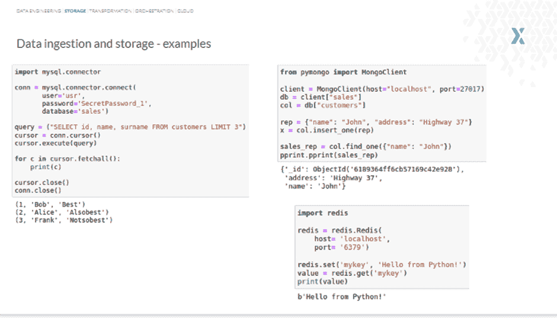

开始使用数据库相当简单。对于大多数数据库来说，这些步骤非常相似，只是略有不同。例如，使用 MySQL 连接器查询 MySQL 数据库包括以下步骤:

*   **步骤#1:** 创建连接
*   步骤 2: 编写一个查询
*   **第三步:**执行
*   **步骤#4:** 获取结果

类似地，在使用 MongoDB 时，您创建一个客户端连接，设置一个数据库，设置一个集合，插入一个销售代表，在最后一部分，尝试通过名称找到一个销售代表。另一方面，使用 Redis，您可以创建一个连接，设置一个值，然后通过关键字搜索来获取这个值。

看，只需要几行代码就可以开始处理大多数数据库。然而，值得记住的是，将您的凭证存储在代码中是一种不好的做法——始终使用配置文件。

##### 网页抓取

数据抓取是数据工程中的一个挑战。然而，BeautifulSoup 可以提供帮助。

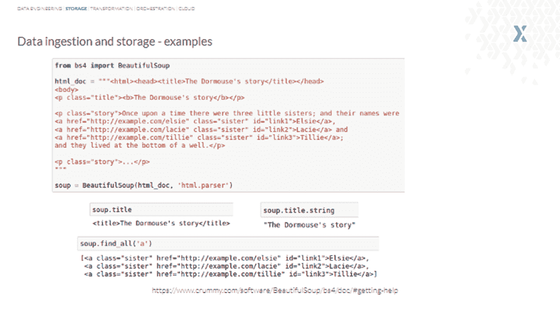

一个用于解析 HTML 和 XML 文档的 Python 包， [BeautifulSoup](https://pythonprogramminglanguage.com/web-scraping-with-pandas-and-beautifulsoup/) 相对容易使用。

看一下下面的例子，您会看到我们在第二行使用 html.parser 来获取 BeautifulSoup 对象，将文档表示为嵌套的数据结构。

类似地，title 函数可用于获取标题，title.string 可用于获取字符串，或者 *find_all()* 可用于获取与我们的过滤器匹配的所有标签和字符串。

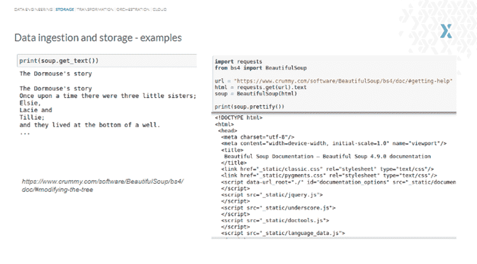

因为最后一行中使用的 html.parser 是一个内置的解析器，所以不需要额外的依赖项。但是，如果您感兴趣，请记住另外两个解析器:

*   **html 5 lib**—最宽松但最慢，在 HTML 文件损坏时使用；
*   lxml—速度最快，但是有一些外部 C 依赖。

BeautifulSoup 帮助数据工程师轻松地从页面中提取文本，修改或替换标签，插入新标签等。来自互联网的 HTML 文件可以输入 BeautifulSoup，它会将文档转换成复杂的 Python 对象树。

然而，您只需要处理大约四个对象:Tag、NavigableString、BeautifulSoup 和注释。

##### 处理多种文件格式

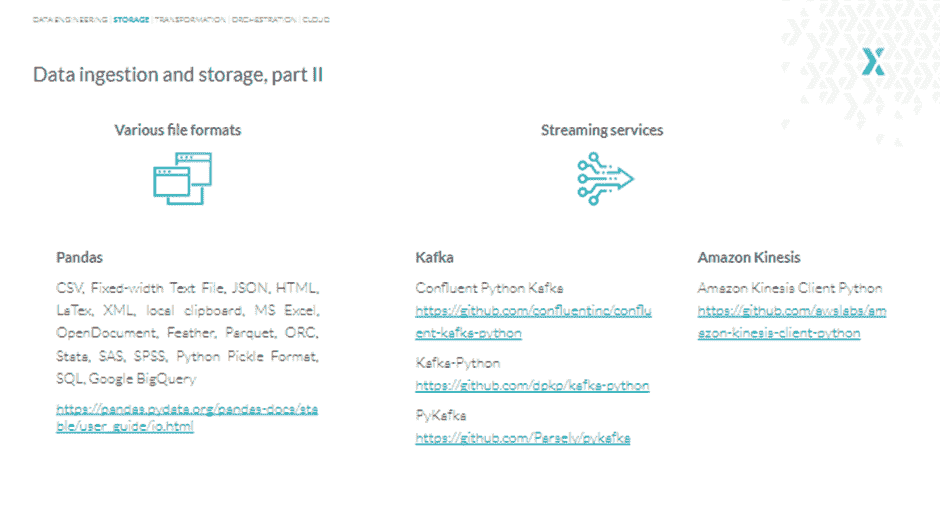

数据接收和存储阶段的另一个问题是必须处理各种文件格式。这就是熊猫的用武之地。

一个为 Python 编写的软件库， [熊猫](https://pandas.pydata.org/pandas-docs/stable/user_guide/io.html) 允许我们与几乎所有已知的文件格式进行交互。尽管如此，对于一些格式，只有 reader 函数，如 ORC、SAS 或 SPSS，而对于 Latex (Lay-tech)，只有 writer 函数。但是好消息是，即使 Pandas 不直接支持一种文件格式，也总会有一些变通的解决方案来解决如何将特定数据读取到 Pandas 数据帧中的问题。

就流媒体服务而言， [卡夫卡](https://towardsdatascience.com/getting-started-with-apache-kafka-in-python-604b3250aa05) 是最理想的选择。Kafka 有三个主要的 Python 库:

*   融合的巨蟒卡夫卡，
*   卡夫卡-巨蟒，
*   PyKafka。

汇合 Python Kafka 可能是最好的选择，因为它是由汇合创建的，与开发 Kafka 的人相同。此外，PyKafka 不再受支持，尽管它可以在许多示例和文章中看到。

对于像亚马逊 Kinesis 这样的流媒体服务，有专门的 Python 库:

*   Lay-tech—一个文档设计系统，你可以在其中定义作者、标题、副标题等等，它会为你格式化文本。
*   **Feather**—来自 Apache Arrow，有助于高效地将 Pandas DataFrame 对象存储在磁盘或通用表或数据框中。
*   **分层数据格式**—使用类似文件目录的结构，允许您以不同的结构化方式组织文件中的数据。
*   **Pickle**—主要用于序列化和反序列化 Python 对象结构。“酸洗”是将 Python 对象转换成字节流的过程。

#### 什么是数据转换？

数据转换涉及更改、消除或修复数据集的不正确、重复、损坏或不准确的数据。这可能是一项相当乏味的任务。据 IBM Data Analytics 的[称，数据科学家花费高达 80%的时间清理数据。](https://www.ibm.com/blogs/bluemix/2017/08/ibm-data-catalog-data-scientists-productivity/)

但是这个过程是如何进行的呢？

这里可以使用 Pandas，因为它有一个 [数据操作函数](https://realpython.com/python-data-cleaning-numpy-pandas/) ，可以用来访问数据和进行数据清理。然而，仍然存在一些挑战。

#### 数据转换:挑战和解决方案

在我们继续讨论挑战和解决方案之前，请看下表。这里我们有一些关于客户的一般信息，如姓名、性别、国家等。—包括其他字段，如“日期”和一个名为“参数”的列

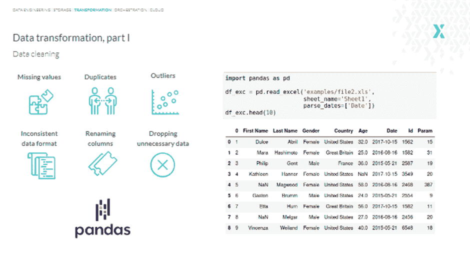

##### 查找和填充缺失值

我们可以使用“na”或“null”来查看丢失的值，但这不会立即发生。因此，在末尾添加一个“任意”函数会有所帮助。

但是，如果我们想知道特定列中缺失值的确切数量，该怎么办呢？嗯，我们可以用“sum”代替“any”，我们会得到这样的结果:

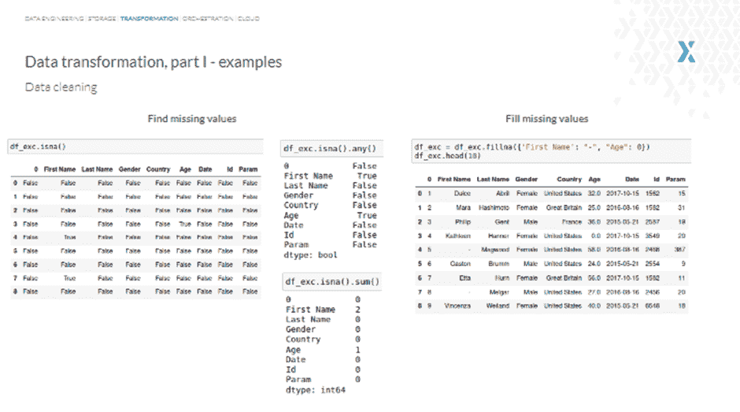

要填充缺少的值，使用“fillna”函数，对于所有缺少的名字，我们得到一个破折号，而缺少的年龄用“0”填充。或者，我们也可以将至少包含一个或所有 NaN(非数字)值的 drop 行与函数“dropna”一起使用，以此类推。

一个更好的方法是使用熊猫来寻找和填充缺失值 。

在熊猫中，缺失数据由 None 和 NaN 表示。用于检测、删除和替换 Pandas 数据帧中的空值的各种函数包括:

*   *isnull()*

*   *notnull()*

*   *dropna()*

*   *菲尔娜()*

*   *替换()*

*   *插值()*

除了查找和填充缺失值，Pandas 还可以执行计数、求和、平均、连接数据、应用条件等功能。但是，这些都是基本功能。所以，让我们转向更大的东西:Apache Spark。

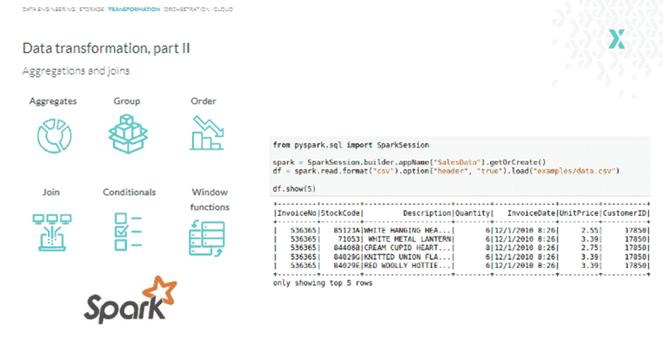

[Apache Spark 是一个极其强大和快速的分析引擎](/blog/data-validation-big-data-environment/) ，用于大数据和机器学习，特别有利于访问 CSV 文件。Apache Spark 的另一个重要用例是并行处理；该工具旨在以分布式方式处理数据。

其他特性包括延迟评估和在内存中缓存中间结果。因此，如果您要一次处理或转换数百万或数十亿行，Apache Spark 和适当的基础设施可能是完成这项工作的最佳工具。

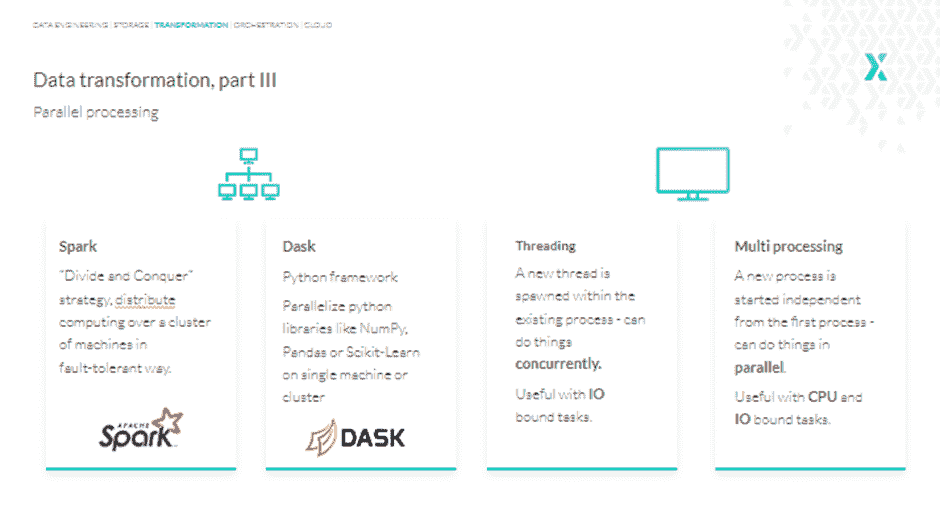

另一个我们想引起您注意的工具是 Dask，与 Apache Spark 不同，它是一个纯 Python 框架，并不旨在成为一个完整的生态系统。

Dask 的建立是因为像 NumPy 或 Pandas 这样的库最初并不是为扩展到单个 CPU 之外或处理不适合内存的数据而设计的。Dask 允许我们在本地或集群上高效地并行运行相同的代码。

现在，当严格地在一台机器上进行并行处理时，Python 有一个线程和多处理选项。

线程不能并行做事，但可以并发做事。这意味着它们可以在事物之间来回移动，因此适合 IO 绑定的任务。

另一方面，多处理是为了并行处理而设计的，所以当我们有 CPU 限制的任务时，就很方便，比如对数百万行进行聚合或处理数百张图像。

#### 什么是数据编排？

让我们从理解编排工具的重要性开始这一部分。

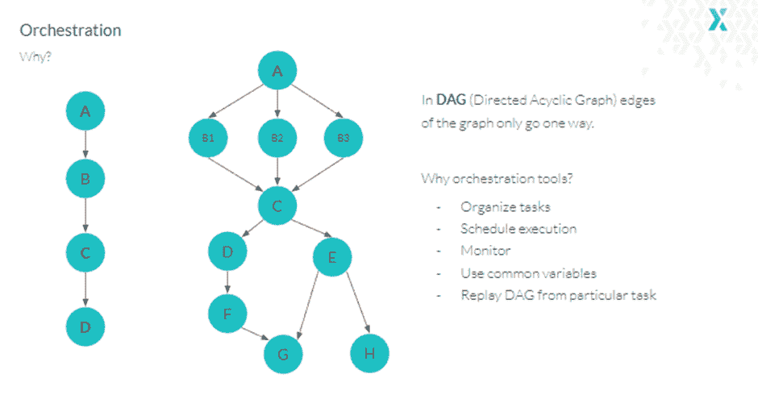

想象一下应该每天或每周运行一次的任务流水线。这些任务应该按照特定的顺序运行。然而，它们会成长并成为一个具有动态分支的任务网络，称为 Dag——有向无环图。因此，编排工具对于确保 Dag 中的数据单向流动是必不可少的，或者换句话说，确保它没有循环。

但这还不是全部。除了将任务组织到 Dag 中并对其进行调度，我们还经常希望:

*   能够轻松监控它们；
*   动态并行一些任务；
*   等待文件出现，然后才能对其进行处理；
*   使用一些公共或共享变量；
*   如果失败，从特定任务开始重放 DAG。

那么，应该使用哪种基于 Python 的工具来应对这一挑战呢？

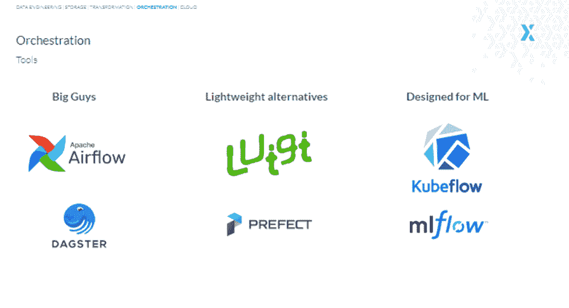

嗯，你有很多选择。你可以使用阿帕奇气流，Dagster，Luigi，Prefect，Kubeflow，MLflow，Mara 或者 Kedro。然而，气流碰巧是最受欢迎的选择，因为它有一系列广泛的功能。另一方面，Luigi(由 Spotify 设计)和 Prefect 更容易上手，尽管它们缺乏 Airflow 的一些功能。

例如，Airflow 可以一次运行多个 Dag，并在指定的时间间隔或时间触发工作流。此外，构建更复杂的管道要简单得多，例如，我们希望一个任务在前一个任务结束之前开始。

另外，提督是开源的，而 [Luigi 和气流](https://www.upsolver.com/blog/workflow-management-review-airflow-vs-luigi) 都是开源的。

现在，如果你想要一个替代气流或任何其他工作流引擎，我们的选择是 Dagster。Dagster 是一个相对较新的工具，用于调度、排序和监控计算。

最后， [Kubeflow 和 MLFlow](https://www.datarevenue.com/en-blog/airflow-vs-luigi-vs-argo-vs-mlflow-vs-kubeflow) 服务于更多的小众需求，更与部署机器学习模型和跟踪实验有关。

#### 在云中使用 Python

到目前为止，Python 已经证明了自己足够优秀，足以鼓励云平台提供商使用它来实现和控制他们的服务。

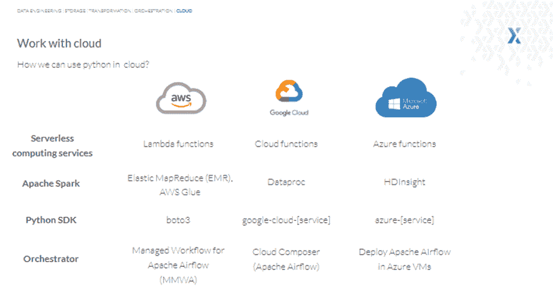

因此，我们应该更仔细地看看 Python 是如何在云上运行的。你可能已经知道，市场上有三家领先的云提供商:AWS、谷歌云平台和微软 Azure。

说到计算服务，这三个提供商都有称为函数的服务(Lambda、Cloud 和 Azure)，并且都支持 Python。这意味着我们几乎可以在云端运行任何 Python 代码。

例如，一旦某个特定文件被添加到 S3，我们可以使用 AWS Lambda 函数来触发 Apache Airflow DAGs。或者，我们可以在照片上传到 S3 存储桶后简单地运行一个图像大小调整代码，然后将其保存回 S3，甚至可以将一些关于此事件的元数据保存到 RDS 中，比如 AWS 关系数据库系统。

你可能会问自己的另一个问题是，“我们可以在云中使用 Apache Spark 吗？”

是的，我们可以。这三家云提供商都为我们提供了旨在运行和管理大数据框架的服务，其中包括 Spark。

此外，如果您希望编写自定义代码来创建、管理和使用云服务，AWS 提供了一个 Boto3 库。然而，GCP 和 Azure 的事情变得有点复杂，因为它们都有单独的库来提供单独的服务。例如，在 Google 云平台中，我们必须安装一个单独的包来处理 BigQuery、Cloudspaner、BigTable 等等。

最后，谈到编排器，AWS 提供了一个名为 Apache Airflow 托管工作流的服务，因此我们不必手动安装 Airflow 调度器和工作器。同样，GCP 有一个云作曲家，这也是一个阿帕奇气流。

Azure 可能没有任何基于 Python 的 orchestrator，但在 Azure 虚拟机中设置 Airflow 或任何其他您喜欢的工具非常容易。

简而言之，所有大的云玩家都在他们的解决方案中极大地容纳了 Python 用户。

#### 关于 Python 中常见数据工程挑战及其解决方案的最终想法

感谢您阅读本文！我们希望它对理解 Python 如何帮助您解决最常见的数据工程挑战有所帮助。

如果您希望了解更多关于 Python 的数据工程知识，我们网站上有一些资源值得一试:

*   [数据工程的 Python:数据工程师为什么要用 Python？](/blog/python-for-data-engineering/)
*   [大数据环境下的数据验证以 Apache Spark 和远大前程T3 为例](/blog/data-validation-big-data-environment/)
*   [AWS Glue Studio 指南—不写代码如何搭建数据管道](/blog/aws-glue-studio-tutorial/)

在 STX Next， [我们从 2005 年](/services/python-development/) 开始使用 Python，那时我们刚开始开发软件。也就是说，我们一直在寻求支持企业利用这种奇妙的编程语言挖掘新的可能性。

作为我们愿景的一部分，我们已经开始用 Python 降低数据工程的挑战性。因此，如果您有兴趣了解更多有关我们如何帮助您加快数据工程流程以提高效率的信息， [只需点击这里的](https://stxnext.com/services/data-engineering/) 。

我们还提供广泛的 [其他软件工程服务，如果您需要的话，我们可以为您提供](/services/) 。如果您有任何疑问或问题，请随时通过 [联系我们](/hire-us) ，我们将尽快回复您！