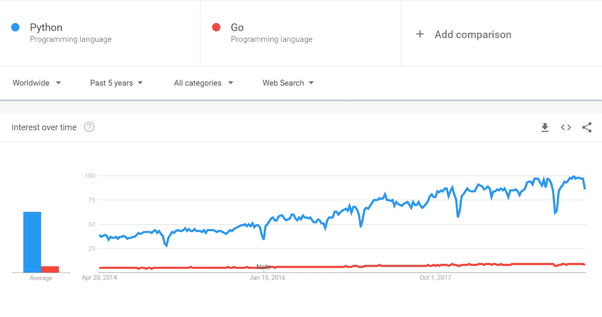
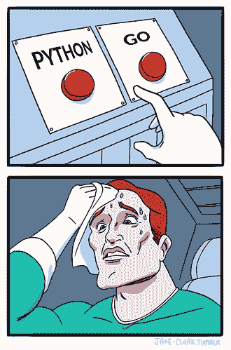

# 去吧去吧蟒蛇游骑兵队！比较 Python 和 Golang

> 原文：<https://www.stxnext.com/blog/go-go-python-rangers-comparing-python-and-golang/>

 围棋(又名 Golang)是 *牛逼！*

让我解释一下为什么一个多年的 Python 粉丝会这么想——尤其是在 Python 和其他编程语言之间的 T2 竞争如此激烈的情况下。

在这个过程中，您将了解这两种语言中的哪一种最适合您的项目。或者也许有第三种方法可以让你两全其美？

为了向你展示我的意思，我们将沿着记忆的小路进行一次小小的旅行，探索一下 我对  [Python](https://stxnext.com/ebooks/what-is-python-used-for/) 的迷恋是如何开始的。

[](https://cta-redirect.hubspot.com/cta/redirect/4542168/dfc7061b-1a6c-40c6-8752-871f5425acf3) 

#### 我的蟒蛇故事——一见钟情

让我们回到 2002 年，当时大多数人都在用 56 kbps 的调制解调器在 AIM 或 Gadu-Gadu 上聊天，从 Kazaa 或 eMule 上下载 MP3。我刚刚开始学习计算机科学，第一次看到了 Linux。

我惊讶得像一个在糖果店的孩子。与我当时使用的老式 Windows 98 相比，你可以在 Linux 上做更多的事情。所以我想把它安装在家里自己的电脑上。

我用零花钱买了 Linux 杂志，附带红帽 7.3 安装光盘。想象一下，当我在安装过程中，光驱开始变慢并最终停止时，我有多失望。

那是我第一次看到*Python trace back*的时候。我认为这是一个 IOError，因为 CD 已经损坏，无法加载一些文件。

我很难过。我试着安装了一次又一次。每次都出现相同的异常。

开源软件的一个缺陷…这不是问题，而是挑战:)

幸运的是， *Python traceback* 显示文件名和行号。所以我可以很容易地在用 Python 写的红帽安装程序 [Anaconda](https://en.wikipedia.org/wiki/Anaconda_%28installer%29) 的源代码中找到错误。

当我打开。py 文件，我很惊讶我能看懂。我甚至可以在没有读过 Python 教程的情况下理解它。那时我只会用 C++和 Pascal 语言编程，但是学习这些语言对我来说需要付出很多努力。

为了结束这个故事，我不得不夸耀我修改了安装程序，删除了损坏的文件，我终于可以在家里使用 Linux 了。Python 的可读性和灵活性给我留下了深刻的印象，以至于在那一天，我成了 Python 的终身粉丝。

****

#### “这不是问题，这是挑战”:我是如何发现 Golang 的

几个月前，我搬到了另一个城市，开了一家新的 STX Next 办事处。在我在格但斯克新租的公寓里，我再也没有智能电视了。没那么糟糕，因为在我的树莓派 3 上运行的免费开源媒体播放器[【Kodi】](https://kodi.tv/about)是一个非常好的替代品。

不幸的是，Kodi 的 YouTube 插件中缺少了[链接电视和电话](https://www.youtube.com/pair)的功能。(如果你还没有用过这个功能，我绝对推荐你试试。)

开源软件中缺失的功能…这不是问题，而是挑战！


我听说 Kodi 的附加软件是用 Python 写的，所以我想这应该很简单。电视和电话的配对过程非常简单，并且有很好的文档记录()，甚至还有 Python 实现(例如 [xbmc-dial](https://github.com/ercoppa/xbmc-dial) )。

但是配对设备之间的命令交换并不容易。令人惊讶的是，谷歌没有发布任何文档。

找了很久，终于找到了 [plaincast](https://github.com/aykevl/plaincast/) ，一个用 Go 写的工具，只播放 YouTube 视频中的声音。当我打开。我很惊讶我能读懂它。更重要的是，我甚至不用看围棋教程就能理解它。

所以我以此为基础，创建了 [kodicast](https://github.com/sargo/kodicast/) ，一个介于 YouTube 和 Kodi 之间的独立服务。正如您在 [提交历史](https://github.com/sargo/kodicast/graphs/commit-activity) 中看到的，我总共只花了大约 24 小时。

那还不错，尤其是如果你考虑到我不得不熟悉两种不同的协议，并对用我只听说过的语言编写的程序进行修改。

[](https://cta-redirect.hubspot.com/cta/redirect/4542168/ccf9def3-1cba-4781-a997-a8c43f67adca) 

#### Golang 和 Python 的比较:性能、生产率和速度

尽管我的故事，让我们进入比较 Python 的正题。

##### **运行时性能**

首先，让我们关注一下通常理解的性能:运行时的性能。哪种语言运行速度更快？

没有别的说法: **Go 比 Python 跑得快，** 在某些用例中甚至比[快 30 倍](https://getstream.io/blog/switched-python-go/)。

在计算机语言基准测试中，Go 完成`mandelbrot`测试快了 48 倍，`spectral-norm`快了 43 倍，`n-body`快了 38 倍。

Golang 对并发的内置支持也有助于它比 Python 更快地完成计算。

但是对于许多用例来说，  **运行时性能可能没那么重要** 因为语言通常只是应用程序和数据库之间的粘合剂。

这让我们从另一个角度来思考性能。

##### **开发人员生产力**

运行时性能对于某些应用程序来说可能很重要，但是还有一个指标适用于任何软件项目:开发人员的生产力。

最终，您希望在项目截止日期前完成项目，并让您的代码能够为最终用户带来好处。对于大多数应用程序来说，这比某个功能是在 10 毫秒还是 100 毫秒内执行更重要。

那么哪个开发团队会得到更快的结果，一个用 Python，一个用 Go？

显而易见的答案是“视情况而定”，但是让我们仔细看看 Python 和 Go 的哪些方面会影响结果。

##### Python 的优势:大量的框架和库

Python 以其 [丰富的框架选择](https://stxnext.com/blog/2018/09/27/beginners-introduction-python-frameworks/) 和 [大量有用的库](https://stxnext.com/blog/2018/09/20/most-popular-python-scientific-libraries/) 而闻名，帮助开发者更快地启动任何项目。

从 Django 这样的“包含电池”产品到 Flask 这样更“简约但可扩展”的框架，Python 将在几乎任何情况下给你的开发团队一个良好的开端。

当您查看 Python 传奇般的库列表时，情况会变得更好:

*   **Numpy** 对于数组处理和复杂矩阵函数，
*   **Tensorflow** 和 scikit-learn 进行深度学习
*   **OpenCV** 用于图像处理、
*   **熊猫** 进行数据分析、
*   **matplotlib** 用于可视化、
*   这样的例子不胜枚举。

作为一门年轻的语言，Golang 还没有时间积累如此令人印象深刻的预建解决方案。

但这并不是说 Golang 没有任何优势。下面是几个**Golang 框架的例子:**

*   [Gin](https://github.com/gin-gonic/gin) (目前 GitHub 上最受 26k 明星欢迎)
*   [回音](https://github.com/labstack/echo) (13k 颗星星)，
*   [狂欢](https://github.com/revel/revel) (11k 星)。

##### Golang 的优势:简单

在 stream.io 的博客上，Thierry Schellenbach 提到了 [为什么 stream 从 Python 转向了](https://getstream.io/blog/switched-python-go/) 。其中一个原因是 Go 提供了某种简单性 ，它不会让你在编写代码时变得如此“有创造力”。

在 Python 中，情况恰恰相反。例如，使用 Python 你可以:

*   在代码初始化时使用元类自注册类；
*   调换真假；
*   向内置函数列表中添加函数；
*   通过魔术方法重载操作符；
*   通过@property 装饰器使用函数作为属性。

问题是:您需要这些高级特性来交付功能性代码吗？

大多数情况下，你不会。这对 Golang 有利。

Go 开发人员保持简单——他们几乎没有其他选择——所以他们的代码在转手时会更容易理解。当程序员一眼就能理解彼此的工作时，他们可以更快地做出改变，生产力也就提高了。

#### Python vs. Go:语法、结构和哲学

在语法、结构和哲学方面，这里有一个比较 Python 和 Go 的最短方法:


##### **相同…**

Go 和 Python 有一些相似之处。你可以在高级类型之间找到一些相似之处— *切片* 和 *地图* 就像 *列表* 和 *字典* ，但是具有静态类型。围棋的 *范围* 作品如同 Python 的 *列举* 。仅此而已。

##### **…但不同…**

这两种语言之间的差异要多得多。其中一些对于 Python 开发人员来说可能是令人震惊的。例如，在围棋中没有  *尝试——除了*。相反，Go 允许函数除了返回结果之外还返回错误类型。

```
// getUUID returns a stable UUID based on the first MAC address
func getUUID() (*uuid.UUID, error) {
    itfs, err := net.Interfaces()
    if err != nil {
        return nil, err
    }
    // get the first interface with a MAC address
    for _, itf := range itfs {
        if len(itf.HardwareAddr) == 0 {
            continue
        }
        id := []byte(itf.HardwareAddr.String() + "-" + NAME)
        return uuid.NewV5(uuid.NamespaceOID, id)
    }
    return nil, errors.New("could not find interface with MAC address")
}
```

因此，当使用一个函数时，你首先要检查是否返回了一个错误。

```
deviceUUID, err := getUUID() if err != nil { logger.Fatal(err) }
```

静态打字是你必须习惯的另一件事。当然，有些情况下，您不能完全确定数据类型。对于这样的情况，Go 提供了一个空接口(*接口{}* )。它可以保存任何类型的值，但是当你想要使用它时(例如，对它进行一些操作)，你必须使用类型断言来获得底层的值。

作为一个例子，我们来看一些 JSON 数据的解析。

```
func (kodi *Kodi) getPlayerId() (int) {
    resp, err := kodi.sendCommand("Player.GetActivePlayers", nil)
    if err != nil {
        return -1
    }
    // resp is a JSON [{"type":"video","playerid":0}]
    result := resp.([]interface{})
    for _, i := range result {
        // a map with string keys but values can be a string or a number
        // so we have to use empty interface as a value type
        item := i.(map[string]interface{})
        playerType := item["type"].(string)
        if playerType == "video" {
            return int(item["playerid"].(float64))
        }
    }
    return -1
}
```

还有几个 **是 Python 开发者要学习的新奇事物，** 如:

*   *指针*
*   *关闭*
*   *结构* (复合类型)
*   *goroutines* (舒适并发)
*   *频道* (在 goroutines 之间发送消息)
*   *方法* (Go 没有类，但是可以在类型上定义方法)
*   *延期* (替换为试用-最终)

##### …但还是一样

**那么为什么 Python 开发者能这么容易理解围棋呢？我觉得是因为 Go 的设计遵循了类似的原理。**

让我们比较一下 [围棋指导原则](https://golang.org/doc/faq#principles) 和[Python 的禅宗](https://www.python.org/dev/peps/pep-0020/) 。在这两种语言中，减少混乱和复杂性是首要任务。

Go 干净的语法规则带来了很高的可读性，这一点是 Pythonistas 非常看重的(*可读性在 Python 的禅宗里算*)。此外，Go 的[正交性](https://en.wikipedia.org/wiki/Orthogonality_(programming))，一种保持相对较小的基本构建模块集的趋势，倾向于简单而不是复杂(*简单比复杂*)。静态类型也符合显式规则(*显式优于隐式*)。

#### Go 和 Python 的进一步比较:未来趋势和预测

最后，让我们看看这两种语言的未来会如何。这对双方来说都是光明的。

2019 年第一季度，Python 是 GitHub 上拉请求速度最快的编程语言 (+17%)，但 Golang 紧随其后，排名第四(+8%)。

最近在 Go 博客上发布的[调查结果也提供了对 Golang 发展的洞察:](https://blog.golang.org/survey2018-results)

*   2018 年，首次有一半的受访者将围棋作为日常生活的一部分。
*   将围棋作为工作一部分的受访者数量也大幅增加。
*   与 2017 年相比，“在工作和工作之外编程”的受访者数量从 36%跃升至 46%。
*   16%的受访者现在已经使用 Go 超过 4 年(相比之下，2017 年为 13%，2016 年为 9%)，这意味着开发人员在最初学习语言后没有退出生态系统。
*   有趣的是，受访者首选的第二语言(仅次于 Go)是 Python。

**Python 为什么在成长？** 原因众所周知:

*   得益于许多现有的库和框架，Python 的生产力非常高。
*   作为一种高级语言，Python 易于阅读，使得开发团队更容易协作。
*   Python [有非常活跃的社区](https://www.kdnuggets.com/2017/07/6-reasons-python-suddenly-super-popular.html)；如果您在项目中遇到问题，Python 可能已经有了一个记录良好的解决方案。
*   Python 是目前非常流行的  [机器学习](https://stxnext.com/machine-learning-applications-examples-industries/)和数据科学的首选。
*   Python 容易理解，对于初学者来说是一门很棒的语言；许多开发人员只是开始并坚持使用这种语言。
*   这对创业公司来说是完美的，因为 Python 非常适合构建快速 MVP 和原型。
*   在企业环境中，它是可靠的，可以更快地获得业务成果。
*   往往，其表现较慢的  [无所谓](https://medium.com/@trungluongquang/why-python-is-popular-despite-being-super-slow-83a8320412a9)。

**而 Golang 为什么会崛起？** 也许是因为:

*   这种语言是由谷歌开发的，这总是有帮助的。
*   Go 的简单性使得它非常适合最大化开发人员的生产力和可读性。
*   静态类型使 bug 更容易被捕获。
*   Go 非常适合当今的微服务架构。
*   Go 是 [在数据科学](https://hackernoon.com/top-3-programming-language-to-watch-out-in-2019-95995e81ad2b) 中越来越受欢迎，因为它结合了整体性能和“从分析师的笔记本电脑到全面生产”的能力
*   它是开源的。
*   它有一个庞大的官方指南图书馆。
*   它编译很快。
*   它在 CPU/多线程和内存效率方面表现非常好。
*   在前面提到的调查中，68%的受访者“可能会建议去找朋友或同事”，所以这很可能会像野火一样传播开来。

然而，这两种语言在受欢迎程度上仍有很大差距。只要看看过去 5 年的谷歌趋势:



总而言之，这两种语言都在上升，尽管方式不同，但都将是您的软件项目的有效选择。Python 仍然是更成熟的选择，有更好的库和框架选择，但 Go 提供了诱人的性能和简单性。

[](https://cta-redirect.hubspot.com/cta/redirect/4542168/0234a030-b669-4efc-af8d-baa810d43217) 

#### "永远不要让我做出选择，因为我可能会做出错误的选择。"

许多首席技术官和软件架构师在开始一个新项目或创建一家初创公司时，不得不选择一种编程语言。 Python 非常适合[web](https://stxnext.com/blog/2017/03/22/beginners-introduction-python-frameworks/)和  [数据科学](https://stxnext.com/blog/2017/04/12/most-popular-python-scientific-libraries/)。 然而，Go 在性能上比 Python 等任何解释型语言都要快得多。



引用我最喜欢的乐队 Happysad 的话，“ [从来不会让我做出选择，因为我可能会做出糟糕的选择](https://www.youtube.com/watch?v=wQ2-YLzW7Ms) ”在这种情况下，我觉得可以不用选择。

在我看来 **同时使用 Python 和 Go 将是一个强大的组合。** 你可以使用 Go 来编写性能至关重要的代码，然后使用 Python 来完成其余的工作。微服务架构甚至无服务器方法可能是将 Go 和 Python 混合在一起的最佳方式。

#### 去吧去吧蟒蛇游骑兵队！关于 Golang vs. Python 的最终想法

Go 和 Python 相似的设计原则使得从 Python 到 Go 的过渡相当愉快。希望看到更多混合 Python 和 Go 的项目。

所以，如果你是一名 Python 护林员，为什么不试试呢？

或者，你也可以学习[Python 如何与 Node.js 或 Java](https://stxnext.com/ebooks/python-vs-other-programming-languages/) 相比较。

[](https://cta-redirect.hubspot.com/cta/redirect/4542168/1ec1ddae-fe98-45ce-ad83-e2e4a20ca20e)