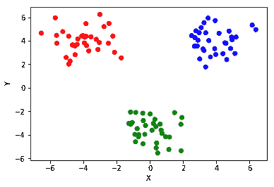
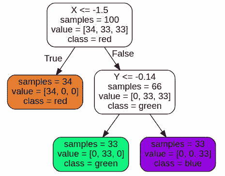
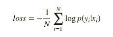
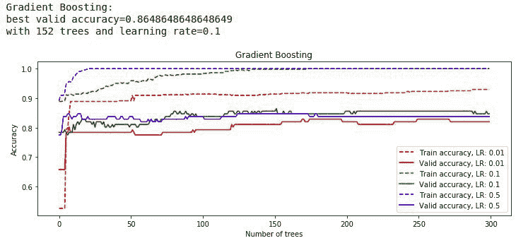
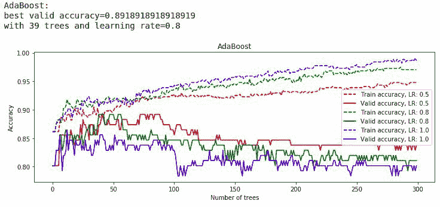

# 来自树林的机器学习:探索 Python 中基于树的集成模型

> 原文：<https://www.stxnext.com/blog/machine-learning-from-the-woods-exploring-tree-based-ensemble-models-in-python>

 [Python](https://stxnext.com/ebooks/what-is-python-used-for/) 是现在的热门话题。  [机器学习](https://stxnext.com/services/machine-learning/)也是如此。和集合模型。

将这三者结合在一起，你就拥有了强大技术的强大组合。

**这篇文章提供了基于树的集成模型的广泛概述，以及 [Python 在机器学习中的许多应用](https://stxnext.com/what-is-python-used-for/#machine-learning)。请继续阅读，了解为什么这些模型是众多机器学习问题的完美解决方案。**

以下是我们将要讲述的内容:

*   先给大家讲一些  **三个系综模型背后的基础理论:** 随机森林、AdaBoost、渐变树 boosting。
*   接下来，我将教你如何使用最流行的 Python 库之一来实现那些系综模型 【机器学习】 : scikit-learn。
*   最后，我将向您展示  **如何提高您的集合模型的开箱即用性能** 。 

#### 1.简短的介绍

尽管它们相对容易理解，但集成模型是许多数据科学竞赛(由 Kaggle 或 DrivenData 组织，仅举几例)中的获奖算法。更重要的是，它们通常不需要大型 GPU 加速机器集群来实现合理的结果。

你不需要成为机器学习专家或数学天才来理解这篇文章。集合模型背后的总体想法非常简单——甚至连鸽子都能理解。

这里有一个诀窍:获得一组模型，汇总它们的预测，就这样，你就可以开始了！

当然，从合奏中获得最佳效果有许多技巧，我们将在后面讨论这些技巧。此外，我大部分时间都会变得相当专业，所以如果你至少熟悉监督学习背后的一些核心原则，那会更容易。但是现在，你已经有了你需要的一切。

在我们开始之前，你可能想知道的最后一件事也是我想解决的:这个标题是怎么回事？

“来自树林的机器学习？”为什么是“树林”？后续问题:模型“基于树”是什么意思？

事实证明，最常用的组合算法是*决策树。*懂了吗？

*注:本文有两个版本:here 和上  [STX 下一个 GitHub](https://github.com/stxnext/ml-from-woods) 。*

#### 2.机器学习背景

我先简单介绍两个至关重要的概念:  **偏差和方差。** 它们描述了模型复杂度和数据之间的依赖关系。

高偏差意味着你的模型过于笼统，忽略了很多重要的模式。相反，当一个模型过于“关注”表面的细节，忽略了数据方面的大画面时，就会出现高方差。  **寻找一个最优模型永远是偏差和方差的权衡。**

在下面的章节中，我们将解决  **分类问题**。这意味着我们将根据描述一个观察类的某些特征，给它分配一个标签。

在我们的例子中，观察是一个申请信用卡的人。这个人是通过年龄、收入和孩子数量等来描述的——所有这些都是我们的特征。我们将构建一个模型，根据指定的功能决定该人是否应该获得信用卡。换句话说:我们将给这个类一个“接受”或“拒绝”的标签。

事不宜迟——在我们深入研究随机森林、AdaBoost 和梯度树提升的工作原理之前——让我们花一分钟来讨论一下它们的构建模块:决策树。

##### a)决策树

简单来说，  决策树是用一组布尔条件构建的模型，由数据特征 (如“如果年龄小于 18”)定义。这些条件以二叉树的形式呈现。

*训练*决策树意味着使用给定的[标准](http://scikit-learn.org/stable/modules/tree.html#classification-criteria)来定位这些条件(决策边界)。让我们看一个样例树来展示这些边界是如何相互作用的。

我们将创建一个简单的数据集，其中 100 个样本仅由两个特征(维度)定义:X 和 y。将有三个类别:“红色”、“绿色”和“蓝色”

scikit-learn 库中的`make_blobs`函数使我们的工作变得简单。

1 2 3 4 5 6 7 8 9 10 11 12 13 14 15 16 17 18 19 20

```
import matplotlib.pyplot as plt

from sklearn.datasets import make_blobs

%matplotlib inline

RANDOM_STATE = 0  # Ensure repeatability when using randomness
COLORS = ["red", "green", "blue"]
FEATURES_NAMES = ["X", "Y"]

features, labels = make_blobs(
    centers=[(-4, 4), (0, -4), (4, 4)],
    random_state=RANDOM_STATE
)
labels_colors = [COLORS[label] for label in labels]

plt.scatter(features[:, 0], features[:, 1], c=labels_colors)
plt.xlabel(FEATURES_NAMES[0])
plt.ylabel(FEATURES_NAMES[1])
plt.show()
```



然后，我们可以创建我们的树分类器。

所有 scikit-learn 模型共享相同的 API 进行训练:  `fit(features, labels)`。

1 2 3 4

```
from sklearn.tree import DecisionTreeClassifier

decision_tree = DecisionTreeClassifier()
decision_tree.fit(features, labels)
```

1 2 3 4 5 6

```
DecisionTreeClassifier(class_weight=None, criterion='gini', max_depth=None,
            max_features=None, max_leaf_nodes=None,
            min_impurity_decrease=0.0, min_impurity_split=None,
            min_samples_leaf=1, min_samples_split=2,
            min_weight_fraction_leaf=0.0, presort=False, random_state=None,
            splitter='best')
```

最后，我们使用 graphviz 库来研究我们的树分类器的结构。

1 2 3 4 5 6 7 8 9 10 11 12 13 14

```
import graphviz
from sklearn.tree import export_graphviz

tree_data = export_graphviz(
    decision_tree=decision_tree,
    out_file=None,
    feature_names=FEATURES_NAMES,
    class_names=COLORS,
    rounded=True,
    filled=True,
    impurity=False
)
tree_graph = graphviz.Source(tree_data)
tree_graph
```



节点中的第一行描述了决策边界，并且不存在于叶子中，因为它们不分裂。

下一个是落入该节点的样本数，后面是类别间的样本分布。

最后一个是节点中最常见的类，它在叶子中被解释为树输出标签。

如你所见，决策树很好地处理了这个小例子；事实上，他们可以处理许多现实生活中的问题。更有甚者，车型有**便于形象化。**

决策树也不需要大量的数据预处理。例如，您不需要对数据进行缩放，因为树不会关心特征量来寻找决策边界。

另外，  **决策树既可以处理数值型数据，也可以处理分类型数据，** 虽然它们很容易过拟合，也就是说 **它们是高方差模型。**

因此，对训练集的微小改变会导致重大的决策边界变化。解决这个问题的一个最成功的方法就是用很多树来做决策。

下面是这一节中你最想记住的:  **如果你回答了许多简单的是/否问题，决策树就会告诉你真相。**

##### b)随机森林

您可能会问自己: **使用许多过度拟合的模型如何减少分类器误差？** 好吧，让我来试着回答一下。

过度拟合的树基于一些通常不常见的观察做出决策。然而，他们仍然持有有价值的数据见解。

当大量使用这种树时，最罕见和最怪异的情况就消失了。不过，更常见的分类器仍然存在，并在使分类器更加“开放”方面发挥着重要作用

**把这想象成一群人通过抛弃自己最极端的观点达成共识。** 在人类的世界里，并不总是那么管用，但决策树是更稳健的生物。

我们已经看到，树分类器的多样性是一个相当理想的特性。如果我们有来自多个来源的多个数据集，我们可以使我们的树更加倾斜。但是我们如何在只有一个数据集可用的情况下做到这一点呢？

这就是  **装袋(或自举聚集)** 的想法的由来。

假设您的训练集中有 1000 个样本。您希望创建 25 个新的训练集来训练 25 个不同的决策树。你所做的只是简单地从你的训练集(包)中随机选取 1000 个样本 (带替换)。

在新的训练集中，原始集中的一些样本会出现多次，而一些样本则根本不会出现。如果你重复这个过程 25 次，你将有 25 个不同的训练集来构建你的树。为了得到一个集合的最终预测，你只需要选择所有树中最常见的输出。

你也可以使用类别的概率，而不仅仅是标签。您可以从最终树节点(叶)中的类代表分布中获取它们。使用这种方法，您的模型将倾向于更可靠的树，这是唯一合理的。

但是随机森林不仅仅是给树装袋。还有一个技巧可以让每棵树变得更加多样化。您可以  **随机限制在拆分一个节点时可用的功能集** 。

这样，每当一棵树试图找到一个最佳决策边界时，它就会“看到”所有特征的一个子集。每次拆分一个节点时都会进行该绘制。一种常见的措施是随机取 *sqrt(n)* 或  *log [2] (n)* 特征进行拆分，其中 *n* 是特征的原始数量。

长话短说:  **取很多不同的树，将它们的结果叠加；最不受欢迎的案件将会半途而废，而更常见的案件将会越来越多。**

##### c) AdaBoost

还有另外一种组合方法叫做  **助推**。 解决了对方大量量词叠加的问题。

这一次，我们将使用多个弱学习者，这仅比随机猜测略有改进。再次，合作决策使它强大，因为个人分类器往往太原始。然而，如果有足够的数量，频繁的洞察力可以被视为有价值的。  **这种方法帮助我们使用许多高偏差模型来减少一般偏差。**

构成 AdaBoost 系综的树是按顺序创建的。一旦一棵树被训练，它在整体训练的剩余部分保持不变。训练新的分类器以减少先前模型中的错误数量。

AdaBoost 用的树比较浅；它们被称为“决策树桩”，通常只有两片叶子。AdaBoost 算法并不要求使用树作为基础学习器，但这是最常见的做法。

创建 AdaBoost 模型时，所有训练样本都分配有权重。最初，所有的权重都是相同的，并且等于 *1/N* ，其中 *N* 是样本的数量。

在训练一棵树后，错误分类样本的权重增加。然后，具有更新的权重的数据集用作来自集合的另一个树的输入。

**重复该过程，直到添加新的树导致训练误差减少。** 或者，一旦达到树的最大数量，训练可以停止。

输出预测是浅采油树预测的加权平均值；分类器权重是它们的训练精度。如果你想要 AdaBoost 中使用的精确公式，我强烈推荐 Jason Brownlee 的这篇博文。

给你的建议是:  **建立小树，一个接一个，并专注于过去的错误。**

##### d)梯度树提升

梯度树提升是提升算法家族的下一个成员。

与 AdaBoost 类似，梯度树增强是从一组小树中构建的，尽管通常  **比决策树桩**略深。 树是按顺序训练的，就像 AdaBoost 中一样，但是  **单个树的训练是不一样的。**

构成梯度树提升的树是[回归树](http://scikit-learn.org/stable/auto_examples/tree/plot_tree_regression.html)。它们与前面描述的分类树非常相似，只有一个关键区别:它们被训练为输出实数，而不是每个样本的标签。

他们将相似(理想情况下相同)的实值绑定到叶子样本中。  **给定叶子的输出值是训练期间得到的所有样本的平均值。**

在梯度推进的情况下，每个类都有自己的回归树。经过训练的树输出给定样本属于该类别的概率。用于训练的值当然只有 1 和 0，一个完美训练的树将只输出这些值。

在现实生活中，当一些训练样本落入错误的叶子时，输出将落在 1 和 0 之间。注意，对于二进制分类，没有必要为每个类建立一个单独的树。一棵树就足够了，因为低概率输出意味着样本属于另一类。

该算法背后的主要思想是迭代地寻找最小化损失函数的新树——一种衡量模型有多差的方法。 这个函数必须是可微的，它是根据需要解决的问题来选择的。

对于分类问题，我们通常使用对数损失函数，它只是对数概率的负均值，其中样本*x[I]被分类为其标签*y[I；]**

*[]*

知道了损失值，我们就可以计算所谓的  **“伪残差”** 它们是相对于来自先前树的预测的损失梯度。  **残差越大，错误越大。** 然后在训练新树时使用伪残差代替标签。

这非常有意义，因为新的树将更加关注在以前的树中被完全错误分类的样本。

此外，树结构是参数化的。为了减少损失，这些结构参数也在训练期间被优化。新树的影响在逐渐减小，这样就不会忽略先前的预测。

如果你渴望更多解释整个过程的数学知识，我推荐你阅读这篇维基百科文章。一个真正的 ML 极客可能也想看看这个方法的创始人之一[写的白皮书](https://statweb.stanford.edu/~jhf/ftp/trebst.pdf)。

TL；DR: **渐变树 boosting 类似于 AdaBoost，但它不是只看失败的*，它还会让你注意到*失败了多少*。***

#### 3.资料组

为了测试我们的算法，我们将使用澳大利亚信贷审批的普通旧数据集。

基于客户特征，我们的模型将尝试预测是接受还是拒绝信用卡申请。出于隐私考虑，删除了原始的功能名称。

由于只有两种可能的输出，我们在这里处理二进制分类。你可以在这里下载原始数据集[。](http://mldata.org/repository/data/viewslug/australian/)

为了简单起见，我们将使用 scikit-learn 的一个实用函数，`fetch_mldata`。这是一个方便的从 mldata.org 下载数据集的一行程序。我们还混洗数据并将其分割以训练和测试数据集，目的是在看不见的数据上评估我们的模型。

1 2 3 4 5 6 7 8 9 10 11 12 13 14 15

```
from sklearn.datasets import fetch_mldata
from sklearn.model_selection import train_test_split
from sklearn.utils import shuffle

DATASET_NAME = "australian"
TEST_SIZE = 0.2

data_bunch = fetch_mldata(DATASET_NAME)
features, labels = shuffle(
    data_bunch.data,
    data_bunch.target,
    random_state=RANDOM_STATE
)
features_train, features_test, labels_train, labels_test = train_test_split(
    features, labels, test_size=TEST_SIZE, random_state=RANDOM_STATE)
```

#### 4.scikit-learn 中的集合模型

Python 的核心原则之一是，“简单比复杂好。”scikit-learn 的创建者当然把它放在心上。

尽管集成方法通常比单个树更复杂，但在 scikit-learn 中并非如此。该库为训练它们提供了相同的 API。你导入一个合适的模块，创建一个对象，并使用  `fit`方法训练它。简单，但功能强大！

我们将在这里测试的所有模型都在`sklearn.ensemble`模块中运行。为了总是用相同的数据得到相同的结果，我们在创建它们之后设置了`random_state`。

1 2 3 4 5 6 7 8 9 10 11

```
from sklearn.ensemble import (
    AdaBoostClassifier,
    GradientBoostingClassifier,
    RandomForestClassifier
)

models = [
    RandomForestClassifier(random_state=RANDOM_STATE),
    AdaBoostClassifier(random_state=RANDOM_STATE),
    GradientBoostingClassifier(random_state=RANDOM_STATE)
]
```

#### 5.结果

现在，让我们检查所有三个模型的准确性。所谓“准确性”，我指的是正确标记样本的比率。然后我们会把它放到熊猫的 `DataFrame` 里，看看我们的模型表现如何。

1 2 3 4 5 6 7 8 9 10 11 12 13 14 15 16 17 18 19

```
import pandas as pd

TRAIN_SCORES_ROW = "Train accuracy"
TEST_SCORES_ROW = "Test accuracy"

def evaluate_models(models, model_names=None):
    if not model_names:
        model_names = [type(model).__name__ for model in models]

    scores = pd.DataFrame(index=[TRAIN_SCORES_ROW, TEST_SCORES_ROW])
    for model, model_name in zip(models, model_names):
        model.fit(features_train, labels_train)
        scores.at[TRAIN_SCORES_ROW, model_name] = \
            model.score(features_train, labels_train)
        scores.at[TEST_SCORES_ROW, model_name] = \
            model.score(features_test, labels_test)
    return scores

evaluate_models(models)
```

|   | 随机应变分类器 | AdaBoostClassifier | 梯度增强分类器 |
| --- | --- | --- | --- |
| 列车精度 | 0.992754 | 0.900362 | 0.969203 |
| 测试精度 | 0.876812 | 0.847826 | 0.898551 |

还不错！

正如你所看到的，随机森林和梯度提升在训练集上表现得几乎完美。全新数据的结果略差，这是意料之中的。

但是，除了准确性，还有更多值得检验的指标。让我们看看最佳模型的混淆矩阵:

1 2 3

```
best_model = models[2]
predictions_train = best_model.predict(features_train)
predictions_test = best_model.predict(features_test)
```

1 2 3 4 5 6 7 8

```
from sklearn.metrics import confusion_matrix

def confusion_matrix_as_data_frame(labels, predictions):
    return pd.DataFrame(
        data=confusion_matrix(labels, predictions),
        index=["Actual rejected", "Actual accepted"],
        columns=["Predicted rejected", "Predicted accepted"]
    )
```

1

```
confusion_matrix_as_data_frameconfusi (labels_train, predictions_train)
```

|   | 预言
被拒绝 | 预测
接受 |
| --- | --- | --- |
| 实际
被拒 | 295 | 10 |
| 实际
接受 | 7 | 240 |

1

```
confusion_matrix_as_data_frame(labels_test, predictions_test)
```

|   | 预言
被拒绝 | 预测
接受 |
| --- | --- | --- |
| 实际
被拒 | 70 | 8 |
| 实际
接受 | 6 | 54 |

混乱矩阵说明了我们的模型失败的地方。

例如，我们可以看到梯度推进模型已经决定接受 8 个信用卡请求，这些请求应该是  *而不是* 已经被接受。

使用来自混淆矩阵的值，我们可以计算有用度量的数量，例如或  **召回**。如果你还没有熟悉它们，我鼓励你去熟悉它们。

#### 6.模型调整

##### a)引入超参数

**超参数是明确选择的模型的一部分，而不是在训练期间设置的。** 它们因型号而异，应谨慎使用。Scikit-learn 的缺省值是合理的，但是通常还有改进的空间。

**要充分利用 ML 模型，就不应该把它们当成神奇的黑匣子。** 它们有许多“旋钮”，你可以调整它们使之变得更好。对它们如何工作的高层次理解允许你这样做。

让我们来描述三个模型中最重要的超参数:

##### **树木数量**

无疑是至关重要的，如果不是最重要的超参数。它适用于所有三种算法。一般来说，集合中使用的树越多越好，但这不是一个通用的解决方案。

当使用太多模型时，Boosting 算法可能会过拟合。使用更多的树也会导致更长的训练和预测时间。

树的数量可以通过构造函数使用  `n_estimators`关键字来设置。

##### **树的大小**

我们不希望我们的树过于复杂。自然地，随机森林依赖于高方差的树，但是足够就像盛宴一样好(例如，由于时间限制)。

另一方面，提升算法需要浅树，甚至树桩。感觉我们应该有能力控制它。幸运的是，scikit-learn 允许我们以多种方式做到这一点:

首先，我们可以设置最大树深度(`max_depth`)。

其次，最大叶子节点数(`max_leaf_nodes`)。

最后，在节点中执行分割所需的最小样本数(`min_samples_split`)。

建议将前两种方法用于增强，后一种方法尤其适用于随机森林。在使用 AdaBoost 时，它们不能通过构造函数直接设置，所以需要在`base_estimator`对象的构造函数中指定。

##### **学习率**

它只存在于 boosting 方法中，并定义了每个新添加的树的收缩率。换句话说，它是每个树贡献所乘以的因子。

学习率与树的数量有很大的关系。  **使用较小的学习率会迫使你使用更多的树。** 在我们描述的两种增强方法中，它的值都是通过`learning_rate `关键字设置的。这个小家伙的值应该在 0 到 1 之间。

##### **子采样**

**二次采样控制分割节点时选择的特征子集大小**。 它是随机森林必不可少的超参数，在梯度树提升中也能起到重要的调节作用。这个超参数的关键字是`max_features`。

您可以使用浮点数(分数)或整数(精确值)来决定选择多少个要素。也可能是字符串:`"sqrt"`、`"log2"`或`"auto"`。前两个不言自明，而`"auto"`与`"sqrt"`相同。

而且，`GradientBoostingClassifier`支持`subsample`关键字。这是一个浮点数，告诉我们所有样本中有多少将用于训练一棵树。  **将其设置为低于 1.0 的值可以减少方差并获得更好的结果。**

##### b)超参数搜索

有许多不同的方法来搜索最佳超参数。因为树的数量是决定性因素，与学习速度紧密相关，所以我们将从这两个开始。

我们将用大量的树来训练 boosting 算法。在这个例子中，300 被认为是大的，但是对于更困难的任务，它可能是几千。我们将在训练期间尝试不同的学习率值，以选择最佳的一对。

在开始训练之前，我们将从训练集中提取一个所谓的“验证集”。

**验证集的目的是什么？**

我们希望继续添加新的树，只要这样做能主要提高测试集的质量，而不仅仅是训练集。为了避免在实际测试集上过度拟合，我们从训练集中提取一个验证集。这样，我们可以观察我们的算法(在训练集的剪切版本上训练)何时开始过度拟合。

**过拟合从训练精度上升的点开始，但验证精度不再提高。** 然后我们可以假设类似的行为会发生在完整的训练和测试集上。

你很快就会明白我在说什么了。现在，让我们从训练集中提取验证集开始:

1 2

```
features_train_, features_valid, labels_train_, labels_valid = train_test_split(
    features_train, labels_train, test_size=TEST_SIZE, random_state=RANDOM_STATE)
```

之后，我们定义一个函数，它将采用一个 boosting 模型，并列出要测试的学习率。

它适合由许多具有不同学习速率的树组成的集成，并计算将树添加到集成的每一步的准确性。

这个过程很简单，因为 boosting 算法使用了  `staged_predict`方法。这种方法产生由中间模型给出的输出。

*N*-第 N 阶段预测将是我们第一次使用 *N* 树后的输出。在输出上，我们得到 Panda 的`DataFrame`。它的行对应于给定的学习率，而列代表训练和有效集。每个单元格包含一个具有中间模型精度的列表。

1 2 3 4 5 6 7 8 9 10 11 12 13 14 15 16 17 18 19 20 21 22 23 24 25 26 27 28 29

```
from sklearn.metrics import accuracy_score

N_TREES = 300
TRAINING_COLUMN = "training"
VALIDATION_COLUMN = "validation"

def get_staged_accuracies(model_class, learning_rates):
    staged_accuracies = pd.DataFrame(
        columns=[TRAINING_COLUMN, VALIDATION_COLUMN]
    )
    for learning_rate, color in zip(learning_rates, COLORS):
        model = model_class(
            n_estimators=N_TREES,
            learning_rate=learning_rate,
            random_state=RANDOM_STATE
        )
        model.fit(features_train_, labels_train_)
        predictions_train = model.staged_predict(features_train_)
        predictions_valid = model.staged_predict(features_valid)
        staged_accuracies.at[learning_rate, TRAINING_COLUMN] = [
            accuracy_score(labels_train_, prediction)
            for prediction in predictions_train
        ]
        staged_accuracies.at[learning_rate, VALIDATION_COLUMN] = [
            accuracy_score(labels_valid, prediction)
            for prediction in predictions_valid
        ]
    return staged_accuracies
```

下面的函数是不言自明的。

给定上面函数的精度`DataFrame`,它返回最高精度的元组，以及相应的树的数量和学习率。

1 2 3 4 5 6 7 8 9 10 11 12 13 14 15 16

```
def get_best_params(staged_accuracies):
    best_params_all_lrs = [] 
    for learning_rate, accuracies in staged_accuracies.iterrows():
        accuracies_valid = accuracies[VALIDATION_COLUMN]
        best_n_trees, best_accuracy = max(
            enumerate(accuracies_valid, start=1),
            key=lambda x: x[1]
        )
        best_params_all_lrs.append(
            (best_accuracy, best_n_trees, learning_rate)
        )

    # Get set of params with highest accuracy and pick one
    # with less trees when draw occurs
    best_params = max(best_params_all_lrs, key=lambda x: (x[0], -x[1]))
    return best_params
```

最后，我们定义一个函数来绘制超参数搜索的结果。

1 2 3 4 5 6 7 8 9 10 11 12 13 14 15 16 17 18

```
def plot_accuracies(staged_accuracies, title, colors=("r", "g", "b")):
    for (learning_rate, accuracies), color in zip(staged_accuracies.iterrows(), colors):
        plt.plot(
            staged_accuracies.at[learning_rate, TRAINING_COLUMN],
            linestyle="--",
            color=color,
            label="Train accuracy, LR: {}".format(learning_rate)
        )
        plt.plot(
            staged_accuracies.at[learning_rate, VALIDATION_COLUMN],
            color=color,
            label="Valid accuracy, LR: {}".format(learning_rate)
        )
        plt.title(title)
        plt.xlabel("Number of trees")
        plt.ylabel("Accuracy")
        plt.legend()
    plt.show()
```

通常，值得尝试的学习率会低于 0.1。然而，由于我们正在处理一个小数据集，我们可能不需要数百棵树。

少量的树往往需要更高的学习率，所以我们也会尝试更大的(0.5)。

此外，为了可读性，让我们把 matplotlib 的图做得宽一点。

1 2 3 4 5 6 7 8 9 10 11 12 13 14

```
wide_fig_size = (16, 4)
plt.rcParams["figure.figsize"] = wide_fig_size

staged_accuracies_gb = get_staged_accuracies(
    GradientBoostingClassifier,
    learning_rates=[0.01, 0.1, 0.5]
)
accuracy_gb, n_trees_gb, lr_gb = get_best_params(staged_accuracies_gb)
print(
    "Gradient Boosting: best valid accuracy={}"
    "with {} trees and learning rate={}"
    .format(accuracy_gb, n_trees_gb, lr_gb)
)
plot_accuracies(staged_accuracies_gb, title="Gradient Boosting")
```



正如所怀疑的，我们不需要所有的 300 棵树都表现良好。152 个学习率为 0.1 的基础模型就可以了。

我们还将在 AdaBoost 模型上调用该函数。请记住，它通常倾向于稍微高一点的学习率。

1 2 3 4 5 6 7 8 9 10 11

```
staged_accuracies_ab = get_staged_accuracies(
    AdaBoostClassifier,
    learning_rates=[0.5, 0.8, 1.0]
)
accuracy_ab, n_trees_ab, lr_ab = get_best_params(staged_accuracies_ab)
print(
    "AdaBoost: best valid accuracy={}"
    "with {} trees and learning rate={}"
    .format(accuracy_ab, n_trees_ab, lr_ab)
)
plot_accuracies(staged_accuracies_ab, title="AdaBoost")
```



我们’已经得到了最优的树数和学习率，所以现在 是我们 调优其他超参数的时候了。让 ' s 再一次求助于我们牛逼的 Python 和 scikit-learn 一前一后的做绝招。

关于选择正确的参数，有很多不同的建议。我们 ' 将使用表格中的一组潜在的好参数 [这里](https://machinelearningmastery.com/configure-gradient-boosting-algorithm/) 。

我们将执行所谓的“网格搜索”，这意味着我们尝试这些参数的每一种可能的组合，并挑选出表现最好的一个。

网格搜索时， [交叉验证](http://www.ritchieng.com/machine-learning-cross-validation/) 。首先，一个训练集被分成 *n 个*偶数部分(由 `cv` 关键字定义)。那么当一部分被用作验证集而其余部分被用作训练集时，有 *n 个* 回合。

在 *n* 验证轮次之后，计算一个平均分数(例如准确度)，因此可以挑选出最佳模型。Scikit-learn 为此提供了一个方便的 API。我们可以很容易地让表现最好的模型在完整的训练集上重新训练。

注意:这段代码可能需要更长的时间(最多 90 秒)。如果您不耐烦，请删除一些值以尽量减少组合的数量(例如， `max_depth` 和 `max_features` 的最大值)。

1 2 3 4 5 6 7 8 9 10 11 12 13 14 15 16 17 18 19 20 21 22

```
from sklearn.model_selection import GridSearchCV

NUM_FOLDS = 5

gradient_boosting_params = {
    "n_estimators": [152],
    "learning_rate": [0.1],
    "max_depth": [4, 6, 8, 10],
    "subsample": [0.4, 0.6, 0.8, 1.0],
    "max_features": [0.5, 0.75, 1.0]
}

random_search = GridSearchCV(
    estimator=GradientBoostingClassifier(
        random_state=RANDOM_STATE
    ),
    param_grid=gradient_boosting_params,
    cv=NUM_FOLDS
)
random_search.fit(features_train, labels_train)
best_gb_model = random_search.best_estimator_
best_gb_params = random_search.best_params_
```

| 最佳 gb 参数 |
| --- |
| `learning_rate` | Zero point one |
| `max_depth` | Zero point six |
| `max_features` | Zero point seven five |
| `n_estimators` | One hundred and fifty-two |
| `subsample` | One |

为了增加赌注，我们将留待以后评估我们调优的模型的准确性。首先，我们来调一下随机森林和 AdaBoost。

如果您没有这样一个包含超参数的表，或者它对您的数据完全无效，那么有一个替代方法:  **随机搜索。**

这个算法很琐碎。您只需定义搜索范围，然后随机选择几组参数。更重要的是，它甚至可以给你比网格搜索更好的结果！

起初，这听起来可能很奇怪，但看看下面的图片，取自[这篇论文](http://www.jmlr.org/papers/volume13/bergstra12a/bergstra12a.pdf)。顶部的绿色曲线和左侧的黄色曲线是每种情况下精度的函数。

网格搜索确保了这个二维空间的均匀覆盖，然而它只覆盖每个超参数空间上的三个点。当我们使用随机搜索时，我们可以更好地搜索每个单独的超参数。当给定的度量函数相对于某些超参数具有明显的峰值时，这尤其有用。


现在，让我们为剩余的分类器定义感兴趣的范围，以及随机试验的数量(等于先前网格搜索中的组合)。

1 2 3 4 5 6 7 8 9 10 11 12 13 14 15 16 17 18 19 20 21 22

```
from functools import reduce
from operator import mul

random_trials = reduce(
    mul,
    (
        len(values)
        for _, values in gradient_boosting_params.items()
    )
)

random_forest_params = {
    "n_estimators": range(5, 500),
    "min_samples_split": range(2, 50),
    "max_features": [x / 10 for x in range(1, 11)]
}

adaboost_params = {
    "n_estimators": range(25, 50),
    "learning_rate": [x / 100 for x in range(80, 101)],
    "base_estimator__max_depth": range(1, 3),   
}
```

让我们也定义一个函数来检索基于随机搜索的最佳模型。

1 2 3 4 5 6 7 8 9 10 11 12

```
from sklearn.model_selection import RandomizedSearchCV

def find_best_model_random_search(model, params):
    random_search = RandomizedSearchCV(
        estimator=model,
        param_distributions=params,
        n_iter=random_trials,
        cv=NUM_FOLDS,
        random_state=RANDOM_STATE
    )
    random_search.fit(features_train, labels_train)
    return random_search.best_estimator_
```

最后，让我们找到随机森林和 AdaBoost 的最佳超参数。然后，我们将与梯度增强进行比较。

注意，我们必须定义 AdaBoost 基本模型，以便修改它的参数。

同样，超参数搜索可能需要一些时间(最多 170 秒)，所以在运行时要有耐心。

1 2 3 4 5 6 7 8 9 10 11 12 13 14 15

```
best_rf_model = find_best_model_random_search(
    model=RandomForestClassifier(
        random_state=RANDOM_STATE
    ),
    params=random_forest_params
)
best_ab_model = find_best_model_random_search(
    model=AdaBoostClassifier(
        DecisionTreeClassifier(),
        random_state=RANDOM_STATE
    ),
    params=adaboost_params
)

evaluate_models([best_rf_model, best_ab_model, best_gb_model])
```

|   | 随机应变分类器 | AdaBoostClassifier | 梯度增强分类器 |
| --- | --- | --- | --- |
| 列车精度 | 0.956522 | 0.896739 | 1.000000 |
| 测试精度 | 0.884058 | 0.869565 | 0.905797 |

万岁！我们对每个分类器都有轻微的改进。

当然，你可以尝试不同的超视距范围或使用梯度增强的随机搜索。此外，我们不要忘记还有很多参数可以优化。

但我认为这些是你应该开始做的。它们代表了我们模型的不同方面，非常容易解释。

还有一种更智能的方法来进行超参数搜索。它使用贝叶斯优化，并且作为一个额外的奖励，允许您  [使用 scikit-learn 来实现](https://thuijskens.github.io/2016/12/29/bayesian-optimisation/)。这个主题超出了本文的范围，所以我就讲到这里，但它绝对是值得探讨的。

#### 7.摘要

阅读完本文后，您应该对集成方法有了一些高层次的理解。此外，我希望您同意使用 scikit-learn 进行实现非常有趣！

以下是我们所学内容的简短回顾:

1.  决策树是高方差模型，但是我们可以通过使用集成来解决这个问题。
2.  **两种主要的集合方法是 bagging(随机森林)和 boosting (AdaBoost 和梯度树 boosting)。**
3.  Scikit-learn 提供了一个简单的 API 来训练具有合理的开箱即用质量的集合模型。
4.  **一点点挖掘模型超参数可以帮助我们改进模型。**

如果这篇文章激励你深入 Python 中机器学习的广阔世界，请务必查看我在整篇文章中为你留下的链接。我发现他们非常有用和有帮助，当我把这一块放在一起。

但是，如果你是机器学习游戏的新手，并且正在寻找一个起点，  [看看这篇教程就知道了，它是由我的两位同事和 STX Next 的 ML 专家编写的](/stx-new-blog/getting-started-machine-learning-python/) 。它们涵盖了您开始 Python ML 之旅所需的一切。

[](https://cta-redirect.hubspot.com/cta/redirect/4542168/b78873fb-4ec5-464f-b446-596458732930)