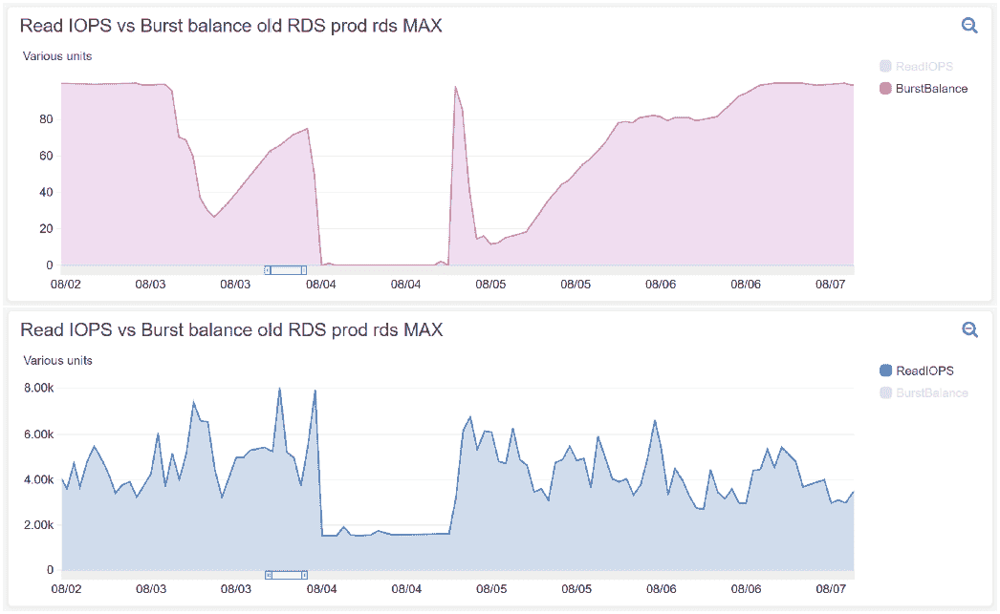
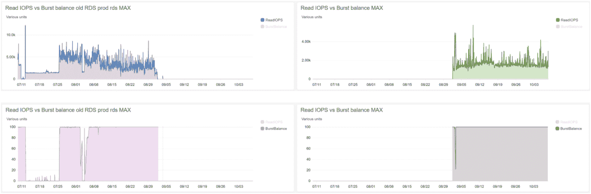
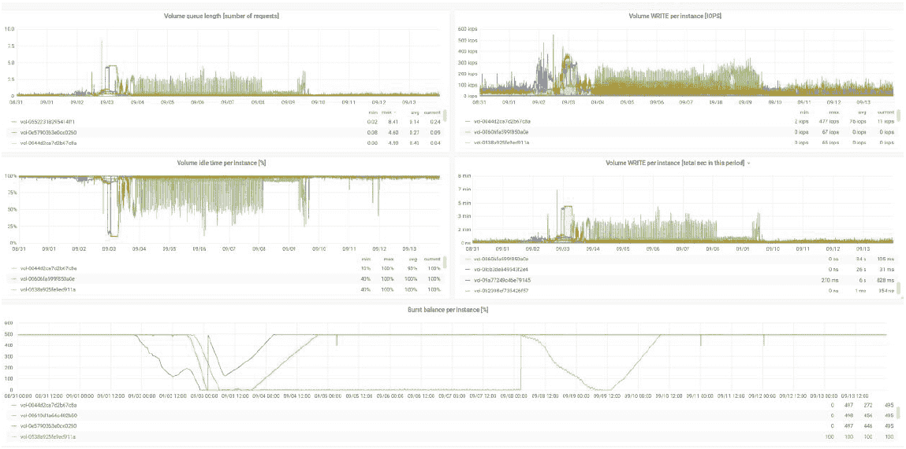
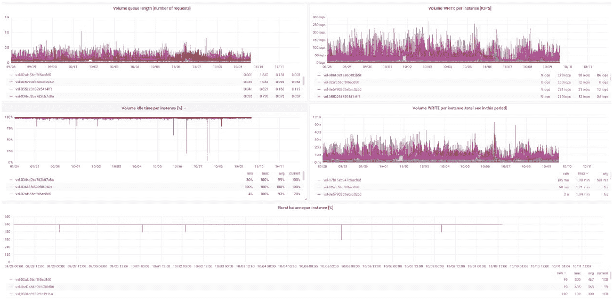
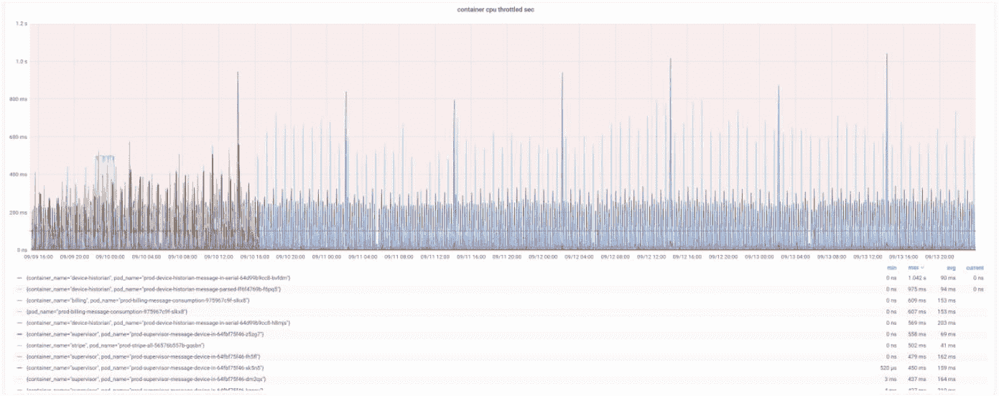
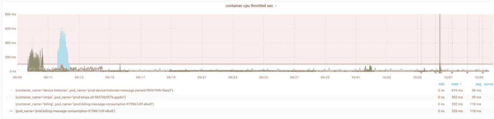
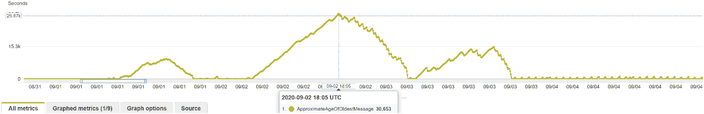

# 案例研究:借助 DevOps 云基础架构，网络供暖提供商的性能提升 1000%，成本优化 40%

> 原文：<https://www.stxnext.com/blog/case-study-devops-cloud-infrastructure-for-network-heating-provider/>

 当你操作大规模工业软件时，有很多事情会出错。棘手的部分是在代码和基础设施的复杂迷宫中找到问题所在。

我们的一个客户就是这种情况。他们注意到他们的应用程序存在以下问题:

1.  表演落后了。
2.  流程会在队列中滞留太长时间。
3.  应用程序开始成为运营瓶颈。

我们的任务是找到应对这些挑战的解决方案，最终将客户的基础设施成本降低 40%。在这个过程中，我们从代码优化开始，然后进一步优化应用的底层云基础设施。

但是我们到底是如何解决他们的问题的呢？请继续阅读，寻找答案！ 

#### 关于我们的客户

首先，先了解一下我们客户的背景。

他们是英国的一家工业公司，为新的和现有的开发项目设计、建造和运营定制的区域能源网络。

在整个合作过程中，我们为他们提供了后端开发、QA 和 DevOps 服务。继续阅读，了解细节。

#### 通过基础设施优化实施 DevOps

我们从分析客户应用程序的代码开始，并尽可能地进行优化。令人惊讶的是，这并没有解决我们的应用程序性能问题。

当软件出现问题时，代码是你首先要找的地方。代码库至关重要。然而，这并不是可能问题的唯一来源。任何现代应用程序背后的基础设施迷宫中都隐藏着大量的潜在问题。

具有原始代码的软件，但是部署在未扩展的基础设施上，将永远不会有它应有的性能。这就像把一个高端的摩托车引擎放在一辆又旧又重的汽车车身上——物理学不会让它跑得很快。

即使当您在云基础架构上工作时，您仍然在机器上运行，并且这些机器可以重新配置，以便为您的特定应用程序提供最佳性能。当需要优化基础设施时，即使是精通实现业务逻辑的开发人员也可能会失败。

有大量关于基础设施优化的知识，当谈到云时，工具相对较新。很多开发者根本不认识他们。

因此，为了解决 IT 项目中的这些问题，一种新的理念和专业化应运而生: [DevOps](https://www.stxnext.com/services/devops/) 。

##### DevOps 是什么？

如果你不是一名开发人员，那么很难准确指出开发人员专家做什么。在我们继续之前，让我们澄清一下——**但是如果你不需要解释，那就直接跳到下一点吧！**

“devo PS”[一词起源于 2008 年](https://www.atlassian.com/devops/what-is-devops/history-of-devops) 前后。它与敏捷密切相关，因为它是关于在部署和长期维护中采用敏捷原则，并在编写代码之外应用它们。

传统上，IT 部门是分开的。有:

*   开发人员，他们创建代码库并确保应用程序在封闭的环境中工作；
*   IT/运营专家，负责托管应用程序、长期维护和支持。

对许多人来说，这显然是不正常的。他们团结在 DevOps 事业的周围，将其作为 it 部门的一个重要补充来宣传。

##### 为什么需要 DevOps？

DevOps 是软件开发和 IT 运营之间的桥梁。

DevOps 专家的工作是创建和/或实施工具和工作流，以减少部署软件、进行更改、添加新功能以及确保所有用例的平稳性能所需的手动任务数量。这被称为持续集成和部署(CI/CD)。

这只是可能的工作之一，因为 DevOps 专家还可以处理:

*   解决问题——当软件不能正常工作时，DevOps 会找到问题并解决它；
*   IT 管理—不仅管理部署的软件和底层基础设施，还管理开发人员使用的硬件。

有点像军队里的特别行动特工。这项工作很微妙，需要广泛的专业知识，微小的错误会造成严重的后果。

现在我们已经讨论过这个问题了，让我们回到我们的客户。

##### 当你的项目中没有 DevOps 时会发生什么？

最后，这个案例是一个很好的例子，说明当您将 DevOps 添加到项目中时会发生什么。

正如您所记得的，我们从优化应用程序的代码开始。这并没有产生我们想要的结果。因此，下一步是从 DevOps 的角度检查软件。很快，我们得到确认，这是正确的方向。

我们首先关注的是基础设施中的几个关键配置项目。这导致了明显的改善，所以我们继续沿着这条路走下去。

如果我们的客户决定继续寻找代码库的改进，他们会浪费很多时间。此外，DevOps 问题会不断蚕食他们的预算，因为云计算绝不便宜——尤其是当它没有针对您的独特情况进行优化时。

#### 使用 DevOps 解决系统问题

我们客户的基础设施由几个单独的节点/机器组成，这些节点/机器在**单个集群中链接在一起，提供运行应用程序所需的计算和存储能力**。

我们知道集群和数据库都需要优化。但是我们还有一些侦查工作要做。现在我们知道我们在正确的道路上，我们开始部署我们的 [完整的 DevOps 工具集](https://www.stxnext.com/blog/monitoring-cloud-infrastructure-cloudwatch-opsgenie/) 。

我们所做的主要工作之一是创建一个**强大的监控解决方案**来精确分析应用程序和基础设施之间的对话。我们为什么要这么做？因为 DevOps 的支柱之一是**可观测性。**

可观察性是这样一个原则:你实现的每件事都应该被适当地监控。至少这是它的简化版。

这个概念来自于 [控制理论](https://en.wikipedia.org/wiki/Control_theory) ，是对工程过程和机器中控制系统的研究。其中， [可观察性](https://en.wikipedia.org/wiki/Observability#:~:text=In%20control%20theory%2C%20observability%20is,Hungarian%2DAmerican%20engineer%20Rudolf%20E.) 是一种度量，根据系统生成的输出来描述系统的内部工作情况。

这就是为什么我们必须实施复杂的监控，以确切了解我们客户的系统发生了什么。这使我们能够从基础架构中收集指标并查明问题。我们发现了什么？

##### 问题#1:不稳定的关系数据库

我们注意到关系数据库服务(RDS)配置不正确。事情是这样的:

*   云 RDS 可以做一个叫做 IOPS 突发(每秒输入/输出操作，当请求数量增长时，数据库随之伸缩以满足需求)的事情。
*   这是基于突发信用的，如果没有适当的优化，突发信用会很快耗尽。
*   当突发信用用完时，RDS 默认为基线性能，如果没有正确配置，这可能会导致应用程序停止。

你可以在这些图表中看到这种情况。第一个显示突发信用用完的时间，第二个显示它如何影响数据库:

这导致了非故意的节流，限制了应用程序想要做的事情的可用资源量。在这些情况下，应用程序将停止响应。

我们通过对 RDS 配置的一些更改解决了这个问题。优化后，新数据库的基准性能最低为 6，000 IOPS(而不是 2，000)，并且不使用 IOPS 猝发。**这样，运营分布更加均匀，性能保持稳定。**

****

##### 问题#2:排队过多的工作节点

优化 RDS 后，我们发现负责存储的工作节点跟不上进出数据库的数据量。

客户端应用对 IOPS 和延迟非常敏感，因此底层基础设施不能停顿。这里，由于次优配置，工作节点——实际上是处理数据写/读的机器和驱动器——排队操作的时间太长了。应用程序必须等待，直到物理驱动器旋转所有排队的请求。

更具体地说，将数据写入驱动器平均需要 6.6 分钟，经过我们的优化后，这一时间降至 1.04 分钟。**这是 635%的改善，同时在排队方面也有 807%的改善。**

最终，该解决方案实施起来相当简单，但很难找到—我们必须纵向扩展工作节点存储。

##### 问题#3:超负荷的中央处理器

随着存储的优化，是时候看看处理器了。我们的监控工具显示这里也有很多节流。

问题是过程限制没有正确设置。当限制设置得太低时，应用程序无法利用集群的整体能力，因此它会停滞。这就像试图把一整条面包放进一个小小的帕尼尼制作机——这不是制作烤奶酪的好方法。

有一种叫做 CFS(完全公平调度器)的东西，它自动做一些分配 CPU 时间给进程的工作。但它的主要目标是保护基础设施免遭崩溃。不考虑 CFS，当限制设置得太低时，CPU 的功率就浪费了。

经过优化后，CFS 调度程序开始更均匀地分配计算时间。在那之后，我们只看到了一个我们很快解决的 CPU 节流实例，之后就再也没有节流了。

##### 优化结果:检查 SQS 队列以进行改进

我们已经解决了存储写/读队列的问题，所以现在我们必须检查更新后 SQS(简单队列服务)处理时间是否有所改善。

这些队列使应用程序能够以异步方式处理请求，并以智能方式对请求进行排队，以保持系统以最佳性能运行。

当您看到队列处理时间大幅增加时，这意味着有些事情不对劲。这使得 SQS 队列处理时间成为基础设施端到端测试的一个很好的目标。

这里，在我们改进之前，最老的排队消息是 8 小时 51 分钟前的。总处理时间大约为 22 小时和 15 小时，直到最后一个排队的消息。

**在我们进行改进后，以及在我们优化后的一个月内，处理时间下降到了 2 小时——提高了 1，100%。**

****

#### 客户的利益和未来计划

如你所见，DevOps 确实是一种需要广泛知识的特工角色。

在此项目中，我们优化了客户的应用程序代码，为底层基础架构构建了强大的监控功能，并消除了几个关键瓶颈。

**最终，我们在某些领域将应用的性能提高了 1000%以上，并将客户云集群的每月成本降低了 40%。**

我们仍在与该客户合作，不断寻找优化和改进他们系统的方法。

#### 总结和最终想法

作为本案例研究的总结，我们来快速回顾一下:

*   他们希望提高应用程序的性能。
*   我们从优化代码开始，但这并没有解决问题。
*   我们的 DevOps 专家实施了一个强大的监控解决方案，以查看应用程序和底层基础架构之间到底发生了什么。
*   我们找到了几个瓶颈，并对它们进行了优化，最终提高了性能，并将客户的云成本降低了 40%。

我们可以利用 DevOps 专家的技能来优化您的基础架构并降低成本。如果你注意到你的应用程序的滞后性能，我们将非常乐意帮助你。你所要做的就是 [告诉我们你的项目](https://www.stxnext.com/hire-us) 。