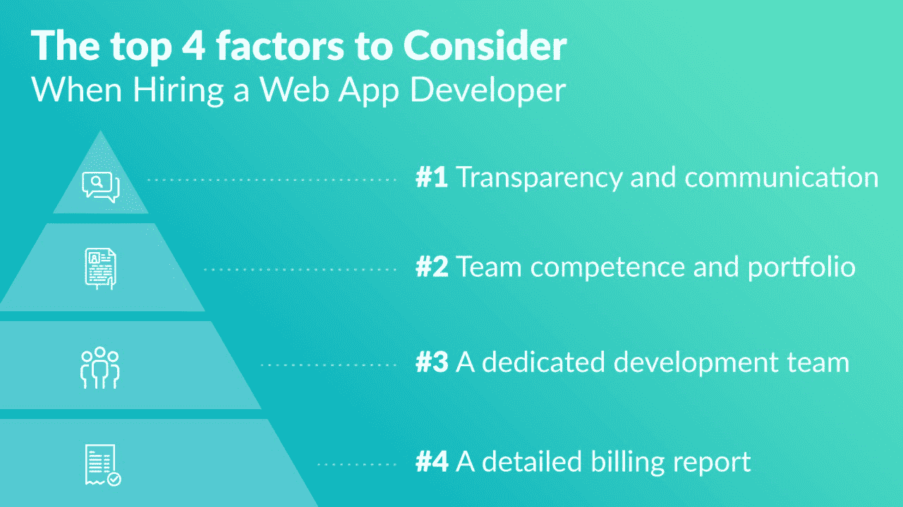

# 雇用 Web 应用程序开发人员时要考虑的四大因素

> 原文：<https://www.stxnext.com/blog/top-4-factors-consider-when-hiring-web-app-developer/>

 选择一家公司来开发你的网络应用程序可能是一项艰巨的任务。毕竟，你脑子里可能有你的应用程序的完美愿景，一清二楚。你能信任谁来实现这一愿景？ [在选择完美的 web 应用厂商](https://blog.hubstaff.com/how-to-hire-web-developers/) 时，应该考虑哪些因素？

在本帖中，我们将向您展示在我们的客户中开展的一项调查的结果，包括他们对以下问题的回答:

> 在选择 web 应用程序供应商时，您会考虑哪些因素？

我们的客户提供了各种各样的答案，但我们设法将它们归纳为对他们的决定最重要的四个因素。它们在这里:

让我们来分析这些结果，并试图揭示为什么它们会影响我们客户的决策。 

#### 透明度和沟通

透明度和沟通在我们的调查中名列前茅，这是有充分理由的。没有什么比缺乏来自供应商的关于项目进展和所处阶段的信息更令人沮丧的了。有时候，透明度的唯一标志是某个随机项目管理系统中随意的任务列表，没有关于项目的哪些部分已经完成的信息，也没有任何可能出现的有问题的任务的指示。

但是，也许有缺陷的沟通最明显的症状是一份每周的电子邮件报告，报告称:“一切都在按计划进行。我们没有任何问题。一切都清楚了。”不幸的是，没有比这更糟的了。

那么，您应该从您的供应商那里寻求什么样的透明度和沟通呢？考虑一家使用 Scrum 框架的公司。Scrum 采用每日“站立会议”,即帮助团队了解开发进度的短会。有了一个见多识广的团队，Scrum 还允许客户在每次有时间限制的开发冲刺后，总是能够获得关于进度、潜在问题和预期的信息。

透明度的另一个指标是使用跟踪软件，如[吉拉](/blog/practical-tips-jira-software/)来管理“用户故事”和包含产品的积压以及当前 Sprint 的信息。使用吉拉的开发人员定期更新任务，并将当前状态通知发送给[产品所有者](/blog/why-do-you-need-product-owner-5-ways-improve-your-software-development-project/)或客户端的任何其他负责方。

让客户保持最新的另一种方法是所谓的演示，团队在演示中展示应用程序的最新版本。目标很简单:他们想为自己的所作所为感到骄傲，并得到客户的认可。使用这样的方法，紧张的客户可以在两周之后验证产品的视觉效果。

#### 团队能力和投资组合

乍一看，许多人会把开发者的能力作为选择过程中最重要的因素。的确，一个强大、有才华的团队甚至可以解决最困难的任务。然而，在我们的调查中，能力排在第二位；可能是因为即使是最有才华的程序员也无法在不知道如何在团队中工作以及如何正确沟通的情况下交付 100%适合客户需求的项目。

如果没有一个清晰完整的客户 web 应用程序的图像，一个通过交流聚焦的图像，开发者只能实现他们自己对客户“可能”想要什么的设想。

因此，完美的 web 应用程序供应商应该是一个结合了软沟通技巧和硬技术技巧的供应商。只有这两种技能协同工作，客户才能放心，他们的项目得到了很好的管理。

#### 专门的开发团队

想象一下，100 名开发人员一起坐在一个[开放空间](/blog/why-open-space-workplace-doesnt-work-developers/)中。乍一看:太棒了！然而，沟通在每个项目中都是至关重要的。当其他人都在听的时候，你怎么能讨论正在发生的事情呢？你不能专注于任何事情，因为你周围的每个人都在“谈判”和“同意”某些事情。

拥有自己的团队，坐在一个房间里，没有人打扰他们，不是更好吗？这让团队专注于他们项目的结果，而不是他们周围一百个人的问题。你可以在任何时候安排与团队的会议，而不需要寻找空间和和平与安静来交谈，因为他们都可以在一个单间里获得。

现在想象另一种情况:产品负责人在一个城市，两个开发人员在家远程工作，另外两个在另一个城市的不同办公室，还有一个作为自由职业者，只有在他有时间的时候才做出贡献。没错，不可能的任务！

虽然不应该把所有可用的开发人员放在一个地方，但也不能把他们分散到世界各地。这就是为什么有一个专门的开发团队，有自己的开发空间是如此有益，并受到客户的追捧。团队的一致性对其成功有很大的影响，改善沟通，帮助团队更快地融入。

#### 详细的账单报告

比方说，你已经决定了一个 web 应用程序供应商，工作似乎进展顺利。即使在这种情况下，仍可能出现计费问题，这在我们的调查中排在第四位。

你能想象不知道程序员在做什么吗？你怎么能确定他没有在做其他项目，声称他在为你工作？

你确定他没有花一半时间玩游戏？

有些人可能会称这种想法配得上一个政权——没有什么比这更偏离事实了。开发过程中有娱乐的地方，甚至是工作时间。但是没有人应该为那段时间付钱，当然客户也不应该。

一份详细的账单报告是理想的解决方案。客户机接收到每个开发人员工作时间的打印输出，并且可以看到一项任务花费了多长时间。任何可疑的“缓慢发展”阶段都可以立即在报告中看到。这是展示透明度的另一种方式，我们的客户认为透明度是最重要的决策因素。

#### 通过我们的免费电子书了解更多信息

显然，外包是您软件开发需求的潜在解决方案。但是你应该从哪里选择最好的网络应用供应商呢？

一种可能是  **近岸**——想法找一家外包软件公司，不仅可靠，而且地理位置离你近，降低成本，方便沟通。

事实上，我们已经为高管们编写了一份“近岸工作”的分步指南- [点击这里免费获取。](https://stxnext.com/ebooks/c-level-guide-to-software-development-nearshoring/)

除了成本，您在选择供应商时还会考虑哪些因素？请务必给我们留言，并与任何希望外包 web 应用程序开发的人分享这篇文章。