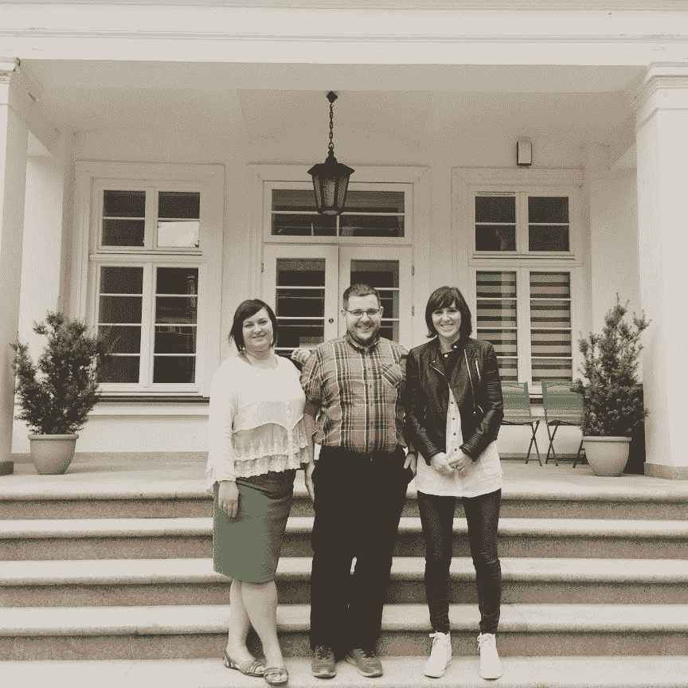
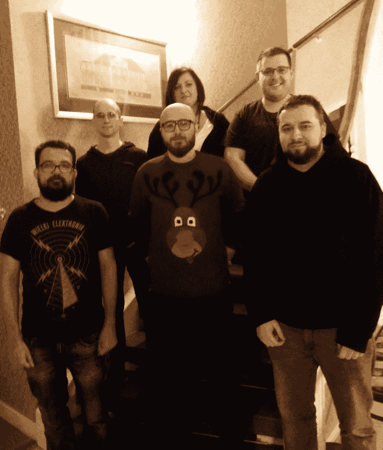

# 在格但斯克建一个新办公室:沃伊泰克·利乔塔如何把 STX 带到这个城市旁边

> 原文：<https://www.stxnext.com/blog/building-new-office-gdansk-wojtek-tricity/>

 你有没有想过在一个陌生的城市里，从零开始建立一个全新的公司办公室是什么感觉？

你可能认为在一个已经存在的公司里经营一个新的办公室要容易得多。但是它也有自己的一系列挑战，你必须面对这些挑战才能成功。

最近，我有幸采访了我们新成立的格但斯克办事处的服务交付主管 Wojciech Lichota。他分享了他的经验，并给了我一些建议，概述了开设新办公室时要避免的陷阱。

Wojciech Lichota 在我们的博客上已经很出名了。他是我们一些顶级文章的作者，包括:

*   [无服务器计算讲解-比较 SaaS、IaaS、PaaS 的功能和定价](/stx-new-blog/serverless-computing-explained-comparing-features-and-pricing-saas-iaas-paas/)
*   [Go Go Python Rangers——比较 Python 和 Golang](/stx-new-blog/go-go-python-rangers-comparing-python-and-golang/py)
*   [雇佣高影响力软件开发人员的终极指南，第一部分](/stx-new-blog/ultimate-guide-hiring-high-impact-software-developers-part-one/) 和  [第二部分](/stx-new-blog/ultimate-guide-hiring-high-impact-software-developers-part-two/)

这些文章大多基于他对商业和 IT 的了解。但今天我想向你们展示沃伊泰克故事的另一个篇章:在格但斯克开设我们的新办公室。作为格但斯克办事处提供服务的负责人，Wojtek 是这种情况下最大的信息来源。

**你会学到:**

*   为什么我们选择格但斯克作为我们的新址，
*   Wojtek 在开办新办公室时遇到了什么障碍，
*   最佳实践如何应对建立新办公室的前几周，
*   在一个新的地方，你最重要的第一份工作是什么，
*   格但斯克的故事是如何一步步展开的。

我们开始吧！ 

#### 从 Python 开发者到软件公司 CTO

Wojtek 在 10 多年前加入了 STX Next。他在全剧组算 6 个人的时候就开始在这里工作了(现在，快 300 了！).

在最初的 6 年里，他是一名 Python 开发人员，但他也参与了整个公司的创建。这就是他成为 CTO 的原因——他负责管理技术问题，但也联系客户和帮助项目。

**Wojtek 成为 CTO 两年后，公司增长了 90 名员工。** 与此同时，我们在弗罗茨瓦夫和皮耶阿开设了两个新办事处。在接下来的两年里，公司的员工数量翻了一番，共有 180 人。

这样的增长意味着更多的技术、更多的领导者和更多的人需要管理(包括一对一的会议)。随着公司的成长，专注于所有任务变得越来越困难。几乎不可能控制公司的每一个流程。

幸运的是，我们的首席执行官 Maciej Dziergwa 有一个在łódź.开设另一个办事处的想法这对沃伊泰克来说是一个绝佳的机会，也是一个面对新挑战的机会。

#### 获得开设新办公室的经验

大量的项目和公司的持续增长是我们需要开设新办公室的主要原因。 **我们选择łódź**是基于对竞争对手、劳动力和办公地点的市场调查。

管理一个新的办公室是一年左右的任务。在此期间，Wojtek 白手起家，创建了一个拥有 40 名员工的团队。

一年后，沃伊泰克回到波兹南与马切伊·杰尔格瓦会面，后者对他在łódź.取得的成就印象深刻  **马上，他接到另一个提议，去经营另一个新办公室。然而，这一次，这是一个永久的提议，意味着沃伊泰克不得不搬出波兹南，搬到另一个城市。**

想法是在格但斯克开设一个新的办事处。在考虑了优势和劣势之后(优势之一是 Wojtek 的家人在那里)，他决定住在格但斯克，并创建了新的办公室。

#### 为什么选择格但斯克建设新办公室？

我们选择格但斯克作为下一个办事处所在地的主要原因是，该地区是波兰发展最快的地区。

格但斯克----或者采取一种更传统的分类，整个三城地区:格但斯克、格丁尼亚和索波特----吸引了几乎所有来自波兰北部的人，因为他们有很好的工作和发展机会。市政府采取措施，为新公民提供适当的条件，并通过诸如" [Gdańsk "之类的运动促进这种条件。你好żyje！](http://www.gdansk.pl/tu-sie-zyje/)(移至格但斯克)。

*One of the most important criteria when choosing the new location was that in Gdańsk there is a strong emphasis on developing the IT community.*Wojtek Lichota, HSD at STX Next in Gdańsk**The STX Next team decided to actively contribute to special events in the city.** For example, not so long ago Wojtek had a presentation about Management 3.0 on 3camp.pl, a place for tech geeks to meet.What is more, despite the well-developed IT community, there is no other company in Gdańsk whose main area of interest is Python. Other companies may have Python in their tech stack, but STX Next represents a strong brand focused mainly on this programming language. Since the first days of our new office in Gdańsk, the team has been involved in the local Python community PyGda, where we’ve already had 2 presentations.

#### 开设格但斯克办事处的最大挑战

沃伊泰克在开始新办公室时面临的最大挑战是找到一名好的招聘人员。

他说，他的成功秘诀是创建一个优秀的团队，不仅包括专家，还包括相互理解的人。

招聘人员在这里起着至关重要的作用，因为这个人必须找到并鼓励开发人员与我们合作。正如沃伊泰克所说，“员工塑造了办公室，这就是我们非常关注招聘流程的原因”。

Wojtek 承认，一个 **透明的薪酬模式****详细的职位描述** 包括薪酬范围(这在格但斯克并不典型)很快为成功鼓励潜在候选人铺平了道路。

#### 格但斯克的前进道路

就目前而言，主要目标是  **找到高素质的高级开发人员** (查看我们的  [招聘页面](https://career.stxnext.com/job-offers-en/?department=all&location=gdansk-en) 如果听起来像你的话！).

幸运的是，沃伊泰克对招聘略知一二，正如你在他的 [雇佣高影响力软件开发人员终极指南](/stx-new-blog/ultimate-guide-hiring-high-impact-software-developers-part-one/) 中所看到的。他说，在我们的工作中，开发人员与客户密切合作，这就是为什么我们必须选择符合客户高期望的最佳人员。

#### 认识格但斯克的工作人员

此刻有 6 个人在 Gdańsk 办公室一起工作:两个开发人员，一个测试人员，一个项目经理，一个顶尖的招聘人员和 Wojtek。

他们都在一个房间里工作，形成了一个很好的团队。Wojtek 补充说，他们甚至不需要在下班后进行任何团队活动，因为他们一起度过工作日。

当然， **该团队对 2018 年有着雄心勃勃的计划** **:** 在目前的办公室不可避免地变得太小时，再雇佣大约 20 人，并在格但斯克找到另一个办公室。

#### 总结:开设新办公室的最佳技巧

第二次创建新办公室似乎更容易。例如，沃伊泰克已经有了在łódź开设办事处的一些经验。

**但是每个城市都不一样。** 你必须面对新的挑战，在新的环境中与新的人一起工作——前提是你能找到优秀的员工并把他们带进来。当然，这并不无聊。

沃伊泰克告诉我，在łódź和格但斯克开设办事处的主要区别在于，现在他更清楚该做什么，也知道自己的期望。他仍在学习，但他已经知道，对于如何开始一间办公室，没有通用的建议。

当然，也有一些指导原则。总而言之，你必须注意的最重要的事情是:

*   寻找那些不仅适合你的办公环境，还能创造良好氛围的人
*   **找到一个好的招聘人员** ，帮助挑选合格的专家；这个人支持经理，当你想开一个新办公室时，他是至关重要的，
*   把你的办公室设置在一个  **的好位置** (之前有  **深度市场调研** )，
*   准备  **强有力的工作机会** 可以吸引潜在的候选人。

沃伊泰克说，在格但斯克这样的小办公室里，你不仅仅是一个老板。视情况而定，你可能会发现自己在做开发人员、秘书甚至杂工的工作。Wojtek 在格但斯克的经历让他对组装宜家家具的挑战有了一些思考…

但即使任务很艰难，它也会给你带来很大的满足感，因为你创造的不仅仅是产品。你正在创造一个巨大的机器，包括商业、技术和人。你在从头开始建造它。

对沃伊泰克的采访给我留下了深刻的印象。我所能说的是，我祝他好运，我相信他能重现łódź办事处的成功。

