# 案例研究:构建一个用 41 种语言传播佛陀智慧的渐进式网络应用程序

> 原文：<https://www.stxnext.com/blog/case-study-building-progressive-web-app-spread-wisdom-buddha-41-languages/>

 你有没有因为最好的理由而永远忘不了的客户？

如此强大的合作关系超越了职业合同的界限？

一次如此积极的工作经历，看到它结束你真的很难过？

这当然是一项艰巨的任务。大多数人很幸运，在他们的职业生涯中能说一次这样的话。

我想这让我成为了幸运儿之一。

即使是现在，当我输入这些文字时，当我回想起我在 STX Next 让我为一个名为  [SuttaCentral](https://suttacentral.net/) 的客户进行项目交付的那一分钟开始的产品所有者之旅时，我的心跳有点快。

这是一个独一无二的客户——至少在我的经历中是这样。

我将尽我所能来讲述我们合作的故事，展示使我们公司的这一伟大实验最终取得辉煌成功的决定性因素。

首先，让我们从头开始。 

#### 项目描述和范围

这个项目开始时并不引人注目:一位佛教僧侣向我们寻求支持， **一个收集早期佛教文献及其翻译的网站。他的最终目标是提供一个包含 41 种语言约 20，000 种文本的图书馆。他有一个功能性网站，他希望用他的重新设计想法和模型来改进，为此他寻求外部帮助。**

SuttaCentral 没有一个确切的路线图  [项目应该去哪里](https://stxnext.com/ebooks/what-is-python-used-for/)，所以我们帮助他们设计产品的开发工作。它允许团队从一开始就达成一致，并对我们要完成的目标有一个清晰的理解。

尽管最初我们应该只处理后端，但由于工作量和新的设计方案，我们很快就结束了前端工作。我们没有从头开始构建产品，而是采用 SuttaCentral 已经拥有的产品并对其进行修改。

#### 渐进式网络应用

客户有兴趣构建一个  [渐进式 Web 应用程序(PWA)](/stx-new-blog/progressive-web-apps-features-and-business-advantages/) 来实现离线功能。这一点和移动组件对 SuttaCentral 来说都很重要，因为他们希望自己的产品能够  **易于访问，易于使用，并且可供所有人** 【使用】—尤其是在互联网连接不良或缺乏互联网连接的地方。

我们担心这个挑战对我们来说太大了，因为我们以前没有做过这样的应用。我们从一开始就对客户坦诚相待；他们仍然信任我们。

最终，这对双方都创造了奇迹，给了客户他们所希望的，同时给了 STX Next 一个独特的机会来证明我们在未知领域的价值。

#### 团队组成

**我们在一个 7 人的国际团队中工作:** 我们这边 4 人，客户那边 3 人。

分配到该项目的 4 名 STX Nexters 是: **于贝尔·德沃尔琴斯基、雅各布·塞米克、克日什托夫·woźniak、** 和 **本人。**

休伯特和雅各布分别负责**前端和后端，**，每天都带着满满的精力和热情投入工作。

Krzysztof 处理**测试**并提供**质量保证支持，**密切关注我们的进展，并总是寻找每一个错误或不一致之处。

最后，**产品负责人**的角色由我来担当，我充分利用了我所有的产品和项目技能来为客户提供最好的服务。

在第一个月，我们也得到了**维奥利塔·jaźwiecka 的一点帮助，**但我们这边的核心团队是我们四个人。

SuttaCentral 的团队由公司的联合创始人 **Bhante Sujato，**领导，他在项目期间是我们所有人的伟大导师。支持他的是后端开发人员**布莱克·瓦尔施**和前端开发人员**艾亚维玛拉。**

#### 成功的故事

与 SuttaCentral 合作绝对是我职业生涯中的一个亮点，我已经这样做了一段时间了。

那次经历是如此的有意义，以至于它一直伴随着我直到今天，带着最美好的回忆在我的脑海中反复出现。不仅仅是我。我们整个团队都这么认为。一个成功的故事，如果曾经有过的话，在任何意义上。

但是，就像每一个伟大的成功故事一样，这一个也是众多因素的产物，只有通过  **做好许多事情并作为一个团队来实现我们的目标，才有可能实现。**

如果你想了解 STX Next 和 SuttaCentral 成功的因素，请继续阅读。

#### 使用 Scrum 的三大支柱敏捷工作

我们与客户讨论的第一件事就是我们如何作为一个真正融合的团队一起工作。我们很快很容易就达成了一致，我们未来日常合作的最佳实践是**Scrum 的三大支柱:透明性、检查和适应。**

**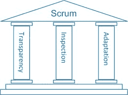**

我们将 Scrum 的哲学应用到我们的开发过程和我们的讨论中。让我告诉你更多关于每个支柱的信息，以及它对所有相关人员的意义。

##### **透明度**

我们每天都和客户进行 Scrum 会议，会议完全透明。工作的每个方面都是公开的:

*   **我们不能做什么以及为什么；**
*   **我们以前从未做过，但乐于尝试的事情；**
*   我们犯过的错误和吸取的教训。

这个过程是我们和客户之间不断的反复。所有 7 名团队成员互相支持和帮助 **更好地执行，更好地交付，做得更好。**

还有最精彩的部分？这一切都是自然而然的。保持开放、尊重、忠诚——有时甚至是勇敢——从来都不是问题，也不会妨碍完成工作。相反，它让我们成长和学习，从那以后，我就一直受益于那个项目的教育。

##### **检查**

全面的反馈是我们与 SuttaCentral 合作的核心。 我们 STX Next 这边的 4 个人和来自 SuttaCentral 的 3 个团队成员相处的非常好；我们给出并接受建设性的批评，交换意见，并定期检查彼此的代码。

事实上，我们致力于的持续绩效改进，在团队和客户之间就每项任务进行了 1 天的反馈循环。但这还没完！我们又前进了一步。

我们正在根据从 SuttaCentral 话语论坛收集的反馈对网站进行修改。老实说，如果没有这些可爱的人的投入，这个产品就不会有今天的样子。因此，毫不夸张地说，客户的网站不仅是为其设计服务的  *和* 人群而创建的。

##### **适应**

当反馈从未停止时，你的适应能力成为你最大的财富。 没有后续，所有的笔记和建议都只是空话。重要的不是理论，而是实践。

有了 SuttaCentral，我们不得不一直适应——我们喜欢它。走廊测试给了我们新的发现，还是选项分析产生了新的结果？我们与客户一起审查了它们，决定了要实现的那些，并且就这样做了。

反馈从未停止，我们的适应能力也没有停止。 在每个开发周期后，解决方案都会发生变化，我们会尽力满足客户的期望。

最终，他们的快乐就是我们的快乐，我们使用的敏捷方法导致双方所有团队成员之间真正的伙伴关系。

#### 产品发现

SuttaCentral 是我在 STX Next 的第一个项目。光是这一点就让我兴奋地马上开始工作，但是想象一下，当我得知我们公司的第一个项目将是一个  **非营利组织时，我是多么高兴！**

然而，这种意识伴随着对重新排序的需要。在此之前，我们需要确定方法，并问自己:

我们对待非营利组织和营利组织的方式应该有什么不同？ 哪种产品技术最适合该客户？我们如何衡量成功？诸如此类。

很快，在 Wiktor Pawlik 领导的产品设计团队的帮助下，我有了很多想法。谢天谢地，他们做得很好。

以下是我们用来构建产品工作的技术，以及我们如何从中受益的简短描述。

##### **产品愿景板、目标原型人物和用户旅程映射**

我们从产品愿景板和竞争分析开始。为了这个项目的目的，我们称后者为“可比较的网站分析”，这是在对佛教徒来说什么是“竞争”进行了令人大开眼界的讨论之后。

这为我们提供了急需的  **对我们正在打造的** 产品的理解，并为产品开发 打下了坚实的基础。

接下来，我们的下一步是为 SuttaCentral 提供的服务创建目标原型人物，并规划用户旅程。

在过程的早期就做好这两项工作，并在整个项目交付过程中随时将它们放在手边，这是一个很好的实践。这样做帮助我们  **在整个过程中的每一步都将我们的重点放在需要的地方——关键用户需求上。**

此外，它允许我们从最初的假设后退一步，  **重新思考一些特性** ，这些特性并不像我们最初想象的那么重要。

##### **用户故事映射**

一旦我们对产品及其用户有了足够的了解，我们就准备进入下一个开发阶段，这意味着:

*   **拆分范围；**
*   **创建用户细分和用户故事；**
*   **起草第一张故事地图。**

有了这些信息，我们可以运行我们的第一次评估，并开发我们的第一个故事地图和路线图。感谢故事地图，我们能够确定任务之间的依赖关系，以及稍后要回答的开放点或问题。另一方面，路线图让我们清楚地看到了未来的工作。

所有这些都非常有价值。

定义良好的用户故事对于  **高效的团队合作来说至关重要，** 帮助我们在有疑问的时候保持警惕。另一方面，直截了当的路线图为  **客户的信任和信心创造了奇迹，** 让他们充分了解工作进展如何。

我真的无法想象没有这两个人的工作。

但你不需要相信我的话；看看我们在[探索研讨会](/services/discovery-workshops/)的第三天制作的故事地图草稿，亲自看看。

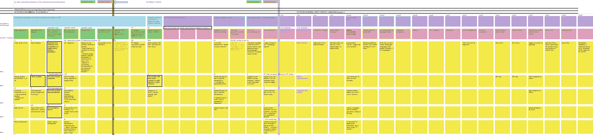

我听人们说过，这种类型的研讨会只有在项目开发的早期阶段才有意义——如果你问我，我会说这是完全错误的。

无论何时我们考虑实现新的特性，我们在过程早期发现和建立的一切都为我们带来了长期的回报——可以说比开始时更多。话虽如此，但我确实看到了在工作仍处于起步阶段时，将更多的重点放在研讨会上的价值。

##### **了解渐进式网络应用的需求**

由于用户故事映射的发现研讨会是一份持续赠送的礼物，我们决定在时机成熟时重复举办，开始在产品中实现渐进式 Web 应用程序的功能。本质上，这意味着不仅在网上，而且在网下提供佛陀的话语。

我们受益最大的是定义 PWA 功能的 3 种技术: **问题/解决方案契合度、最小可行产品，以及划分为阶段的详细渐进式 Web 应用故事图。**

##### **问题/解决方案契合度**

问题/解决方案匹配方法回答了我们的一个基本问题:

**为什么 SuttaCentral 需要一个渐进式 Web 应用程序？**

答案很简单:  **无限制访问。**

想象一下，生活在一个互联网连接极其昂贵的地区。或者你需要步行几个小时到最近的村庄才能获得免费无线网络。或者根本没有互联网的地方。

这些都是我们必须解决的问题，因为这正是我们的客户和我们的目标人物角色一直在处理的问题。PWA 是完美的解决方案。

##### **最小存活产品**

使用问题/解决方案拟合的另一个有益方面是缩小我们对最终最小可行产品(MVP)的关注。

建立一个成功的 MVP 的能力，尤其是在严格的时间限制下，是一个不小的成就。幸运的是，STX Next 在这个领域拥有丰富的经验，SuttaCentral 只是众多例子中的一个。

让我特别自豪的是，当我们着手为 SuttaCentral 做 MVP 时，我们的团队已经很好地了解了什么是 MVP，如何构建它，以及如何将其与产品增强区分开来。

##### **渐进式网络应用故事地图**

利用所有的知识和经验，我们毫不费力地概述了 PWA 开发的 5 个步骤。MVP 是第一步，接下来是专门为该功能定制的 4 个产品增强。

对我个人来说，另一个值得骄傲的地方是我们的方法影响了我们与客户的关系:  **在每一步之后，我们都有了一个工作产品，无需任何进一步开发就可以发布。** 很自然，这样做是为了进一步的透明和对 SuttaCentral 的最大利益。

然而，如果我们没有尝试许多不同的方法来解决故事分割，在这个过程中做了大量的改进，或者对我们的 PWA MVP 的工作有了真正坚实的理解，这是不可能的。

“一张图片胜过千言万语”，为了让您更好地了解我们的工作方式，以下是 PWA 故事地图的概述:

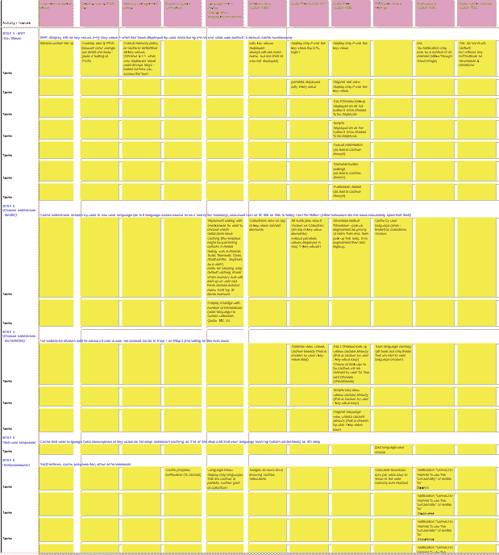

#### 克服文化障碍

我不想撒谎——在为 SuttaCentral 工作的最初几天里，我迷失了自我，力不从心。

**外国性质的项目** 在其中起了主要作用。我的意思是，只要看看我们经常使用的一些术语:Sutta，Vinaya，Abhidhamma，dghanikāya，sī lakkhandha vagga，比丘 Vibhaṅga，Pārājika，Dhammasaṅgaṇī等等。这足以让你头晕目眩，尤其是如果你像我一样来自波兰！

有鉴于此，一个紧迫的问题出现了:

我们如何在这些新信息中找到自己？

内化这种未知的文化语境是至关重要的，无论它可能带来多大的挑战。感谢上帝(在这里可能不是最好的选择)，我遇到了一个思维导图技术，它极大地帮助了我和我的团队构建所有的故事片断。

##### **思维导图**

使用思维导图，我开始把所有的拼图拼在一起——一点一点，一个接一个——不久我们就设法理解了主题，并且  **熟悉了以前不熟悉的东西。**

这并不容易。早期，我的团队会不止一次地问我，我是如何处理好这种情况的。但是他们的不安全感只持续了这么长时间，很快他们就比我做得更好了。

冒着听起来显而易见的风险，让我们问问自己:

**为什么这是成功的因素？**

因为  **生意从来不只是生意；你越了解你的客户、他们的产品以及双方的需求，你们在各个层面的合作就会越好。**

感谢我们掌握了我们正在处理的主题和它的文化背景，我们能够和我们的客户说同样的语言。这允许我们分而治之，在业务逻辑中分割我们的工作，这反过来导致更有效的迭代交付和更高的业务结果。

作为参考，以下是我们 PWA 内容思维导图的第一个版本:

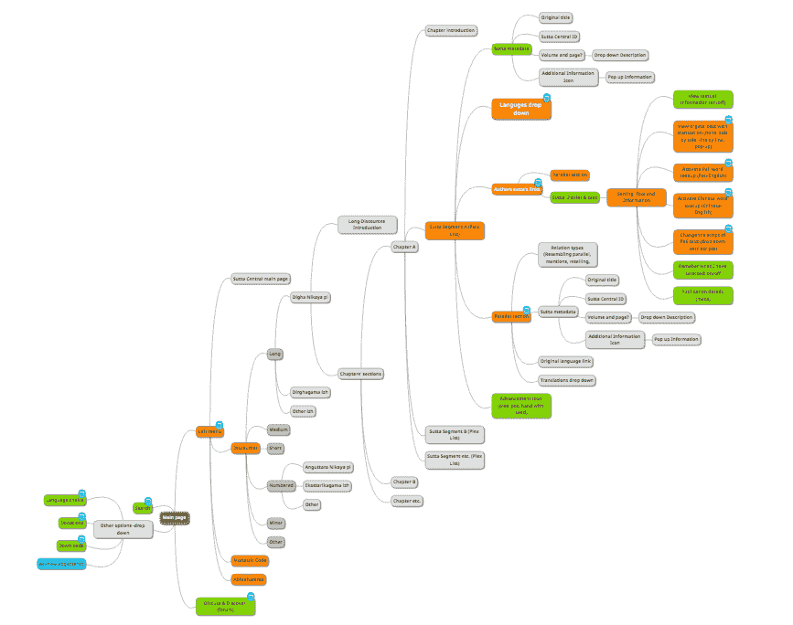

看起来很复杂？相信我，这只是冰山一角。

这种高水平的介绍最多只能让我们对内容有一个初步的理解。下一步要困难得多，因为我们必须理解  **平行线。**

##### **纬线**

**平行线是文本之间的关系。** 它们允许读者通过经文中发现的相互关系来浏览佛经中收集的佛陀教导。Parallels 为该产品的中级和高级用户提供了最大价值。

猜猜网站上有多少平行线。

100? 1,000? 10,000?

可能 10 万？

没有。答案是...415,621.

让我给你解释一下。下面是纬线的一个很小很小的部分的图形表示(由于我们为这个项目实现了一个新的图形数据库，所以成为可能)。

你可能会问，有多小？这是  **纬线的 6‰，确切地说是** 。

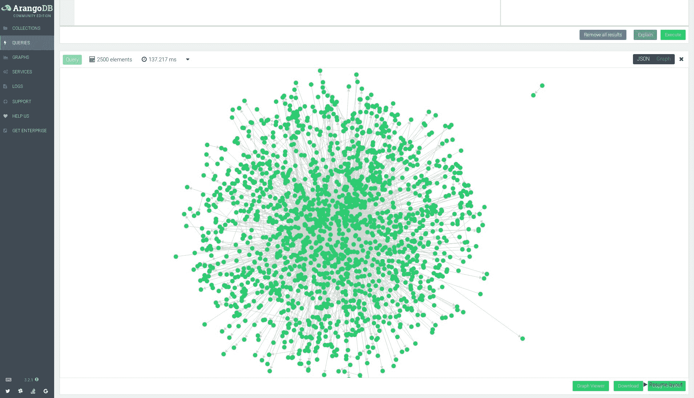

我衷心祝贺整个 SuttaCentral 团队，他们花了数年时间最终找到并匹配了所有现存的相似之处。是你们让这一切发生的；我们所做的就是把这些碎片拼在一起，输入到 ArangoDB 中。

#### 通过在旅途中学习和适应来改进软件开发

正如我之前提到的，在整个 SuttaCentral 项目的持续过程中——从开始到结束——每次冲刺后，我们都强调从我们的错误中学习并适应不断变化的环境。

这样做直接影响了我们软件开发的质量，极大地提高了软件开发的质量，让我们和客户都很满意。所有这一切都是本着  **持续绩效改进的理念完成的。**

我想在这个节骨眼上，我最好停止描述我们用来改进我们表现的许多方法。与其告诉你，不如我演示给你看？

下面你会发现表格和图表说明了我们与 SuttaCentral 的工作流程。

我会让图像自己说话。

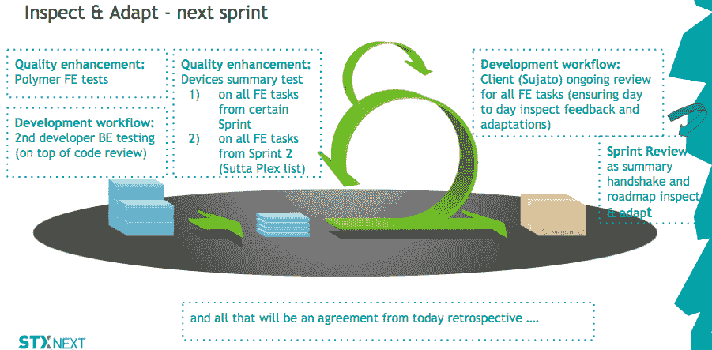 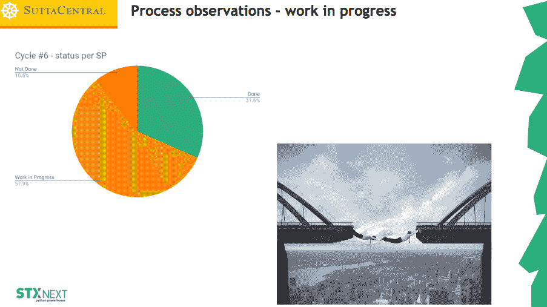 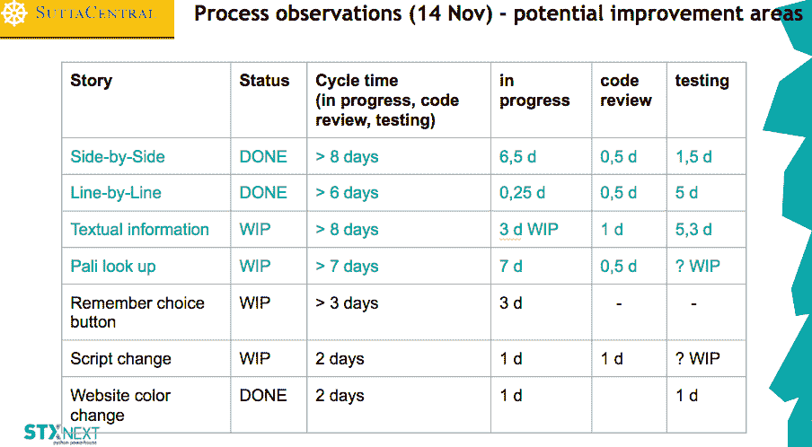 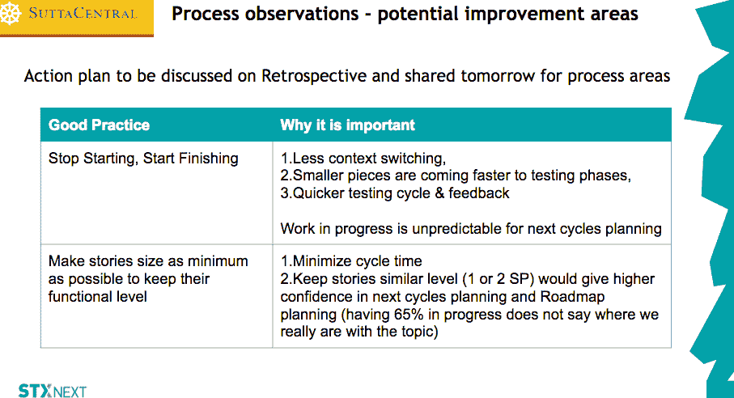 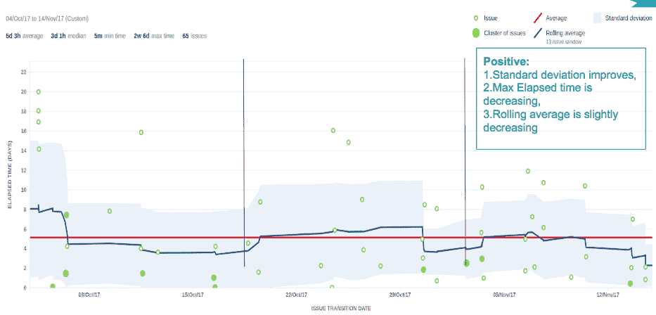 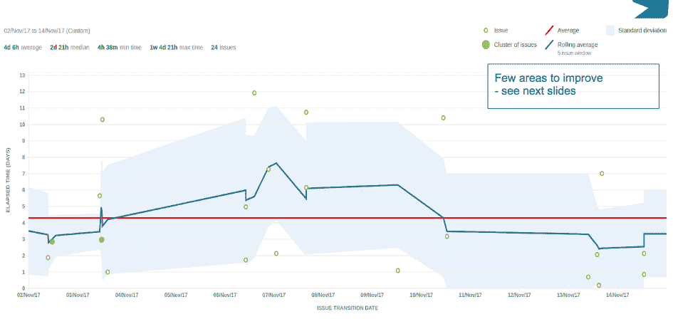 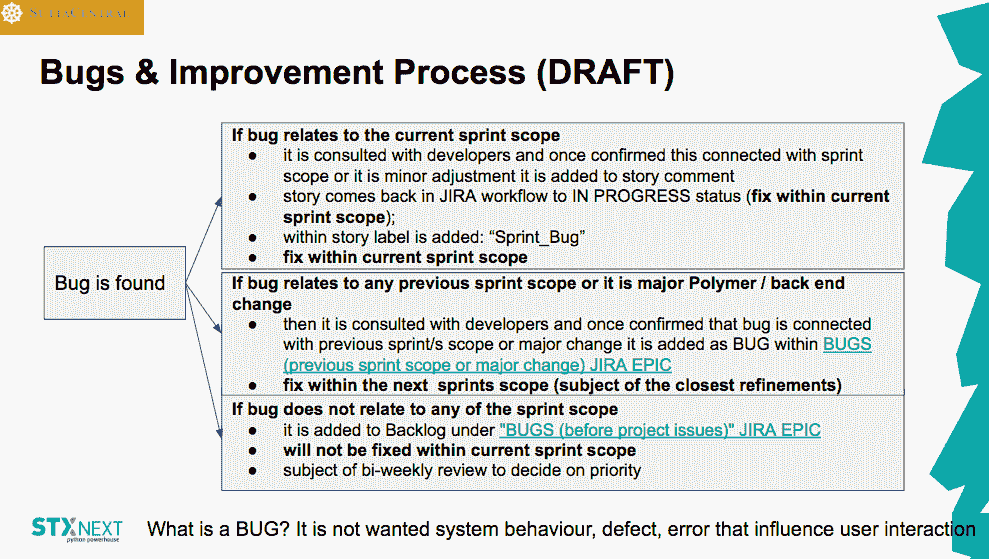 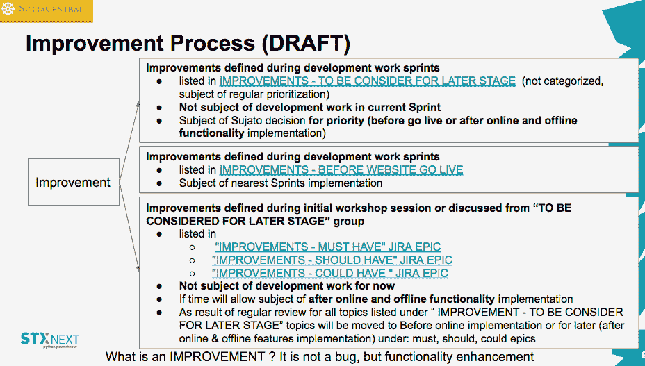

#### 产品增量评审和敏捷路线图

在每次产品增量审查期间，我们都花时间仔细查看我们的路线图，并对其进行相应的调整。重新优先排序经常发生，并且进行了大量的估计来支持所述重新优先排序。

这样做的目的是  **给客户定期更新，为他们提供讨论的新鲜材料。** 这也给了 SuttaCentral 一定的回旋余地  **做出明智的决定，并建议继续工作的最佳方式。**

Scrum 在每一步都在那里，指导我们前进，我们强调尽可能保持过程的敏捷。

同样，不要相信我的话——自己看看我们的发展路线图。

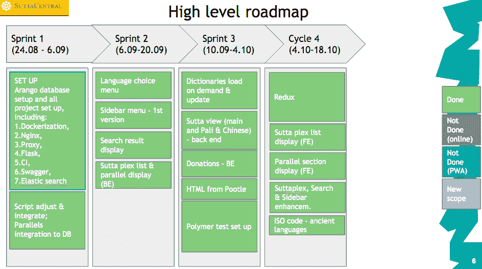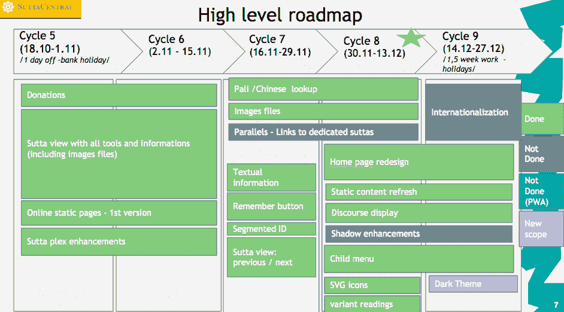

#### 最终用户的视角

最后但同样重要的是，最终用户的观点。

对于 SuttaCentral 项目，我们决定尽可能简单地进行用户测试。考虑到这一点，我们转向  **走廊测试** ，以便以印象和意见的形式快速获得用户的反馈。

我们适应并遵循这样的原则:最好的结果将来自于测试少数用户和运行尽可能多的小测试。

我们从潜在目标用户的全球化细分市场中挑选了几位波兰代表作为我们的样本目标群体，并与他们一起进行了测试。

八人小组的发现非常有趣和有用。事实证明，他们中的 5-6 个人能够立即查明阻碍他们用户体验的具体挑战。

有了这些结果，我们将从我们的样本用户组中挑选出 2 个最迫切的建议，并着手实施改变。

#### 最后的想法

唉，我们与 SuttaCentral 的合作终有结束的一天。

我们上线了。

在我们的最终审查会议上，我们收到了第一批参与现场版本演示的用户的掌声。

太棒了。我还是觉得挺感动的。

这是那个快乐时刻的纪念品:

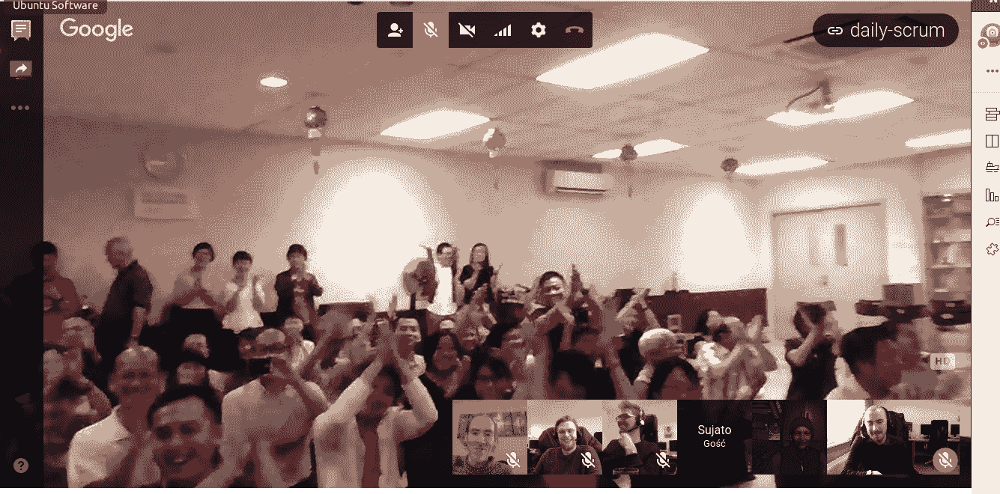

正如他们所说，那就是。

SuttaCentral 项目可能已经结束，但在我看来，毫无疑问，我们在途中留下的难以置信的记忆——无论是职业还是个人——将伴随我们很长很长时间。

我知道一个事实，我将永远带着微笑回顾我们在一起的时光。我敢说客户也有同感。他们甚至  [在完工现场对我们 STX Nexters 的团队](https://suttacentral.net/acknowledgments) 表示感谢！

最后一件事:客户最近在斯里兰卡庆祝了 SuttaCentral。这里有几张这次活动的照片:

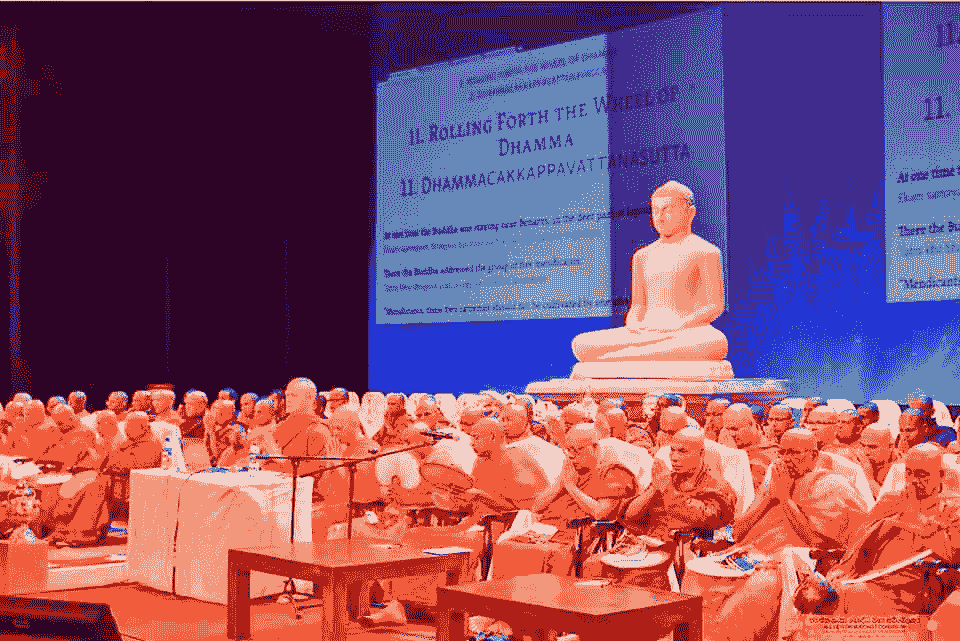

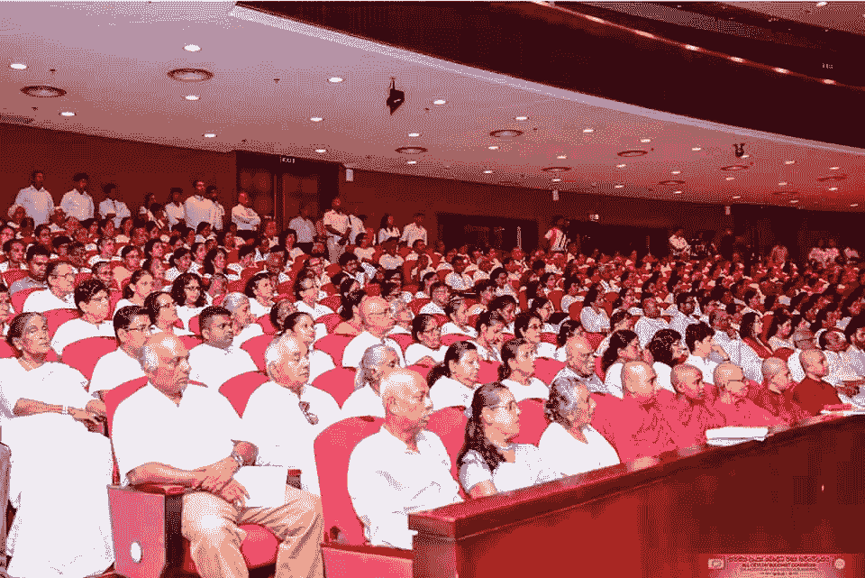

感谢您阅读我们对 SuttaCentral 项目的案例研究。写下它和实际去做它一样令人愉快。

如果您想进一步了解我们在 STX Next 提供的服务，请访问我们的  [产品组合](https://stxnext.com/portfolio/) ，并阅读与我们客户成功合作的其他案例。

如果你喜欢这篇博文本身，请随时  **订阅我们的时事通讯** 并在我们为你准备好最新消息时立即获取。

