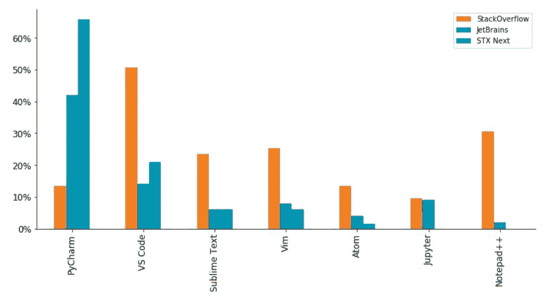
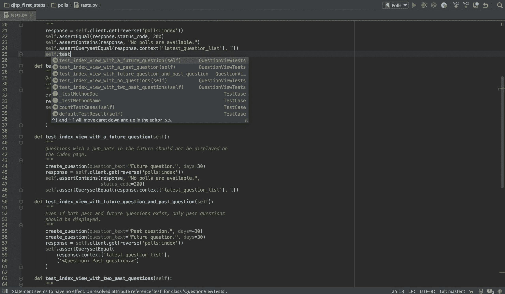
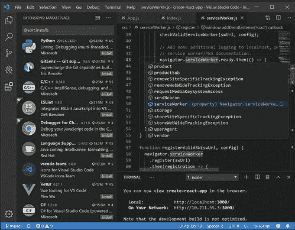
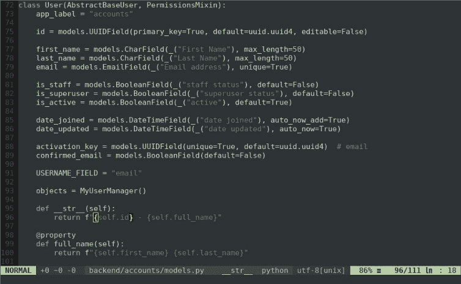
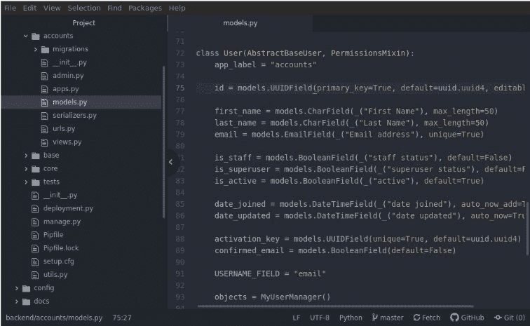
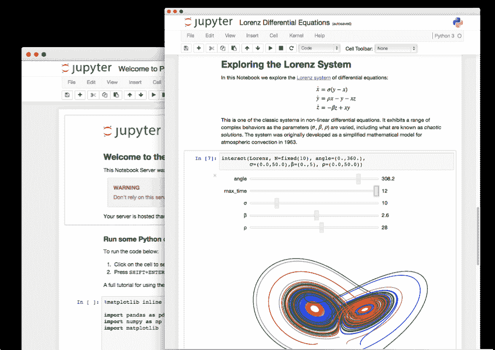
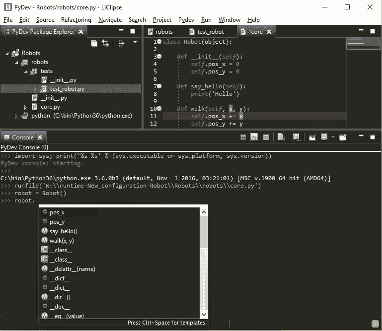
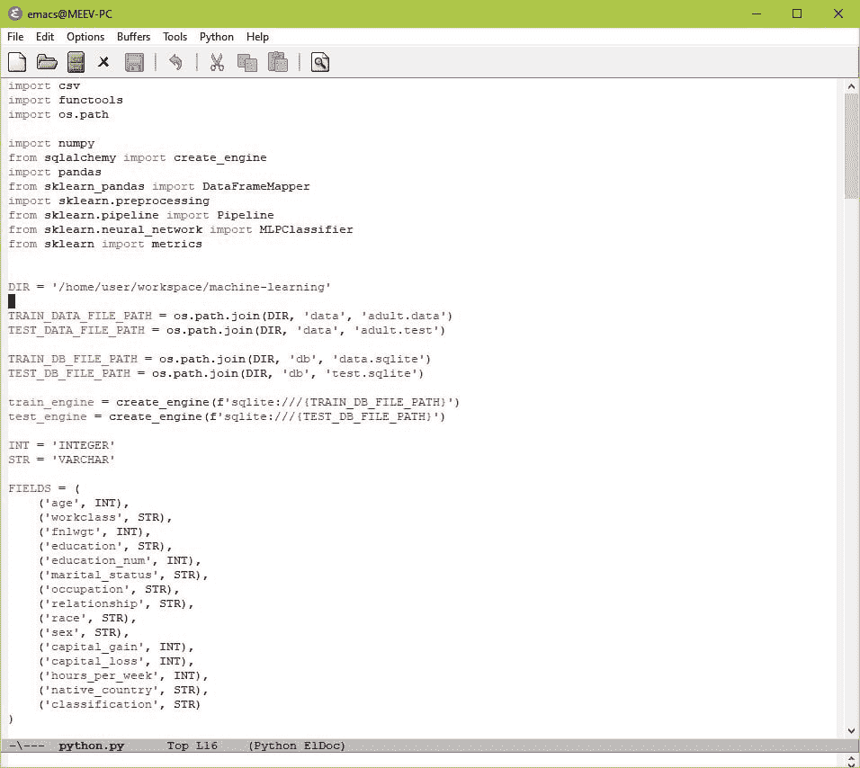
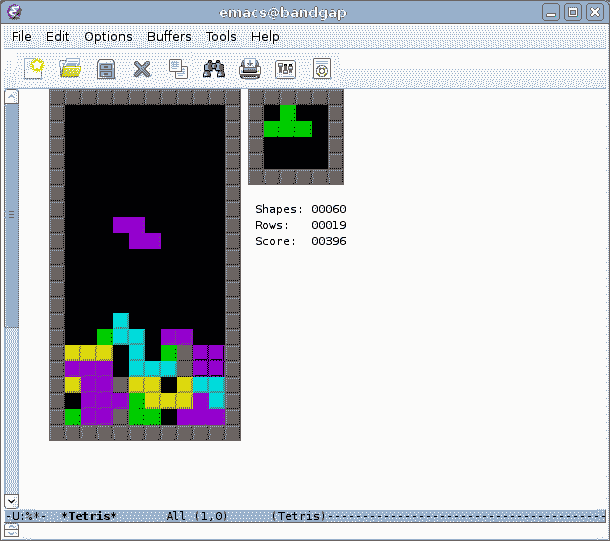
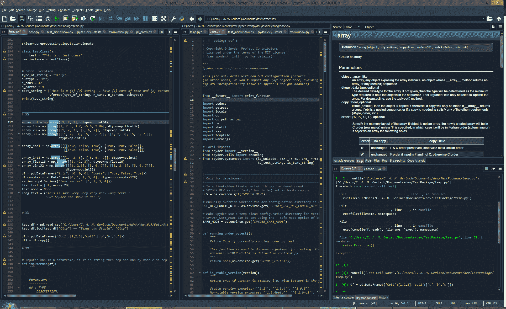

# 最好的 Python IDEs 和代码编辑器(根据我们的开发者和 Python 社区)

> 原文：<https://www.stxnext.com/blog/best-python-ides-code-editors/>

 如果没有 ide 和代码编辑器，我们会怎样？

当然，我们会处理好的。将代码输入记事本，然后自己完成所有工作是完全可能的。

但是，即使对于最熟练的开发人员来说，代码编辑器和 ide 也可以极大地提高使用代码的舒适度和效率。

如果你是一个实践派托尼斯塔，你可能很清楚这个事实。但是随着 Python 的受欢迎程度不断提高，Python 相关工具的选择也越来越多。

于是，问题就来了:  **“为了获得最优的结果，我应该选择哪个 IDE 或者代码编辑器？”**

在这篇文章中，我们将介绍其中最好的。

 

#### 什么是 IDE？

IDE(集成开发环境)是开发人员用来创建程序的软件应用程序。ide 旨在通过组合软件开发过程中必需的工具，使开发人员的工作变得更加容易。典型的 IDE 将包含以下工具:

*   文本编辑器；
*   编译器和/或解释器；
*   调试器和代码分析器；
*   版本控制集成；
*   许多支持实用程序与外部工具(Docker、云部署等)接口。)

…全部组合成一个单一的用户界面。

许多 ide 还包括额外的可选特性和工具包。有些是特定于单一语言的，有些则支持你能想到的每一种语言，不管是开箱即用还是通过插件。

有一点是肯定的:选择面如此之广，你一定会找到一款可以覆盖你所有需求的 ide。

#### IDE 与代码编辑器

IDE 是一个复杂的工具，它将在软件开发的整个过程中支持你。然而，对于较小的项目，或者那些重视定制胜过一切的人，代码编辑器可能就足够了。

代码编辑器的名字中没有“集成”这个词是有原因的；它只是一个编辑器，具有语法高亮和代码格式化等附加功能。

但是代码编辑器确实有其优势。它们更轻量级，更高级的编辑器允许你用精选的插件和工具定制你的软件开发体验。那些重视可定制性并且不介意在找到幸福之前做一点调整的人更喜欢它们。

一些代码编辑器非常复杂，提供了如此多的扩展，以至于它们可以很容易地取代一个 IDE。

#### 最好的 Python IDEs 和代码编辑器

我们收集的列表是基于 STX Next 的 [Python 开发者](/services/python-development/)的意见(他们有 200 多人！)，以及人气指数根据  [栈溢出开发者调查](https://insights.stackoverflow.com/survey/2019#development-environments-and-tools) 和[Jetbrains](https://www.jetbrains.com/lp/devecosystem-2019/python/)的开发者生态系统状态。请注意，堆栈溢出调查的数据涉及使用所有编程语言的开发人员，而 Jetbrains 和 STX Next 只考虑了 Pythonistas 的意见。

**Popularity of environments and tools among Python developers**

就 Python 开发者而言，PyCharm 赢得了流行度竞赛，Visual Studio 代码是亚军。但是由于 ide 和编辑器是高度专业化的，这两个可能不适合您的个人需求。

为了帮助您在多个编辑器之间做出艰难的选择，我们准备了一个详细的选项列表，重点是跨平台的选项。

 [##### 1.皮查姆](https://www.jetbrains.com/pycharm/) 

**Source: https://www.jetbrains.com/pycharm/**

**免费或付费:**py charm[有免费的社区版，但其全、专业版是付费的](https://www.jetbrains.com/pycharm/download/#section=windows)。可以免费试用。针对学生，有  [PyCharm 教育版](https://www.jetbrains.com/education/#lang=python&role=learner)。

**系统兼容性:** Windows、macOS、Linux

**描述和特性:** 由 JetBrains 开发， [PyCharm](https://www.jetbrains.com/pycharm/) 是一个全面的、Python 专用的 IDE。

PyCharm 将所有的 [Python 工具](/blog/top-python-apps/)组合在一起。它提供:

*   一个智能代码编辑器，
*   导航和重构工具，
*   调试器，
*   试跑者。

它还允许代码检查并支持 VCS。PyCharm 的代码检查是所有 Python IDEs 中最先进的，这使得通过静态和运行时代码分析引入可预防的错误变得更加困难。

付费版本还提供:

*   Python 分析器；
*   远程开发；
*   数据库工具；
*   协助 web 开发(支持金字塔、 [Flask 或 Django](/stx-new-blog/flask-vs-django-comparison/) 等[框架](https://stxnext.com/blog/2018/09/27/beginners-introduction-python-frameworks/)，以及 JavaScript、CoffeeScript、 [TypeScript](/stx-new-blog/typescript-pros-cons-javascript/) 、HTML/CSS、AngularJS、Node.js 等)；
*   科学工具(它与 IPython Notebook 集成，支持 Matplotlib 和 NumPy 之类的包)。

**使用它如果:** 你正在寻找一个全面的 Python 开发工具，它不仅能让你更有效率，还能提高你代码的质量。尤其是如果你在 ML/AI、数据科学或 web 开发领域！

 [##### 2.Visual Studio 代码](https://code.visualstudio.com/#alt-downloads) 

**Source: https://code.visualstudio.com/**

**免费或付费:** [Visual Studio 代码免费下载](https://code.visualstudio.com/#alt-downloads)和[开源附带免费二进制。](https://github.com/Microsoft/vscode/)

**系统兼容性:** Windows、macOS、Linux

**说明及特点:** [Visual Studio 代码](https://code.visualstudio.com/)是微软开发的一个完整的代码编辑器。虽然它有许多高级功能，并可定制，但它有一个清晰而简单的 UX，安装新的扩展非常容易。

Visual Studio 代码提供:

*   语法突出显示，
*   括号匹配，
*   自动缩进，
*   框选，
*   内置对智能感知代码完成的支持，
*   丰富的语义代码理解和导航，
*   代码重构工具，
*   调试器。

它集成了构建和脚本工具，并支持 Git。

Visual Studio 代码以其创新功能而闻名，如 Live Share，它允许您远程进行真正的结对编程。它独特的架构也使得微软可以用它创建一个基于云的服务，让你无论在哪里都能利用 VS 代码的特性。

Visual Studio 代码是  [可扩展的](https://marketplace.visualstudio.com/) 和可定制的，让你添加更多的特性和连接到附加的服务([一个这样的扩展是 Python 包](https://marketplace.visualstudio.com/items?itemName=ms-python.python))。

**使用它如果:** 你想要一个轻便、快速的编辑器，有一个简单的界面和定制选项。VSC 有一些独一无二的功能，比如上面提到的实时分享，你可能会觉得有用！

 [##### 3.崇高的文本](https://www.sublimetext.com/3) 

**免费或付费:** [崇高文字是共享软件](https://www.sublimetext.com/3) (可以免费下载和评估，但必须购买许可证才能继续使用)。

**系统兼容性:** Windows、macOS、Linux

**描述和特性:** [崇高文本](https://www.sublimetext.com/2)是一个轻量级、跨平台的代码编辑器，以简单易用、快速、易于定制而闻名。

崇高的文本提供:

*   拆分编辑，
*   语法突出显示，
*   自动完成，
*   命令面板，
*   “转到”选项旨在最大限度地提高您的效率，例如:
    *   Goto Anything(“只需几个按键就可以打开文件，并立即跳转到符号、行或单词”)，
    *   Goto Definition(允许编辑器“自动生成每个类、方法和函数的项目范围的索引”)。

Sublime Text 拥有强大的 Python API，保证用工具和包轻松定制(得到  [包控制](https://packagecontrol.io/)管理器后)。

**使用它如果:** 你不是初学者，正在寻找一个漂亮、高性能、可定制的编辑器，同时又是轻量级的。

 [##### 4.精力](https://www.vim.org/download.php) 

**免费或付费:** [Vim 完全免费开源。](https://www.vim.org/download.php)

**系统兼容性:** macOS，Windows，Linux

**说明及特性** : [Vim](https://www.vim.org/) 是一个可扩展的基于终端的编辑器。

Vim 的核心是可配置性，正如其官方网站所说，“它不会握着你的手。”虽然它的准入门槛不是最低的，但你的准备会有回报的。Vim 快速、有效，并且 100%适合您的需求。

在其核心，Vim 是一个文本编辑器，配备了所有的基本功能，以方便编写代码。它:

*   突出显示语法，
*   指出错误，
*   查找语法匹配，
*   提供代码完成，
*   还有更多！

Vim 以其简单的命令而闻名，但要有效地使用这一功能，你必须  [“启动插入模式输入文本，并返回正常模式执行命令。”](https://www.vim.org/others.php) 这种“拆分”模式可能需要一段时间来适应。但最终，它会让你的工作更快，因为你可以将双手放在键盘上！

Vim 在 Python 开发人员中如此受欢迎的原因是它高度可定制。它提供了大量不同的扩展和插件。

**使用它如果:** 你是一个有经验的开发者，你知道你想要什么——或者你有时间阅读相当多的指南。如果您喜欢的工作方式不包括鼠标，或者您在远程服务器上做很多工作，那么 Vim 是一个不错的选择。

 [##### 5.原子](https://atom.io/) 

**免费或付费:** [Atom 是免费开源的。](https://atom.io/)

**系统兼容性:** Windows、macOS、Linux

**说明及特点:** [Atom](https://atom.io/) 是一款开源的文本编辑器，以其简单的界面和广泛的可定制性著称。它可以在专门的 GitHub 上下载，并欢迎用户自制的内容。

Atom 自我标榜为可黑客。它甚至提供了类似 IDE 的功能包，以获得更全面的体验。

文本编辑器本身提供:

*   智能自动完成，
*   多个窗格，
*   一个内置的包管理器，
*   文件系统浏览器，
*   查找和替换功能，
*   能够直接从 Atom 使用 Git 和 Github，
*   能够与他人实时共享您的工作空间。

Atom 最大的优势就是包的多样性，可以让编辑器完美贴合你的需求。它提供了许多主题，很容易定制和风格化。因此，您可以为自己创建一个 Python 友好的环境，用您需要的任何特性来丰富它。

**如果:** 你想要一个开源的、快速的、可定制的编辑器而又不牺牲美观，就使用它。

 

 [##### 6.Jupyter 笔记型电脑](https://jupyter.org/) 

**Source: https://jupyter.org/**

**免费或付费:** [Jupyter 笔记本免费开源。](https://jupyter.org/)

**系统兼容性:** Windows、macOS、Linux、云托管实例

**说明及特点**:[Jupyter Notebook](http://jupyter.org/)是一款开源的 web app，支持多种编程语言。

Jupyter Notebook 允许创建和共享包含实时代码、公式、可视化和叙述性文本的文档。其用途包括:

*   数据清理和转换，
*   数值模拟，
*   统计建模，
*   数据可视化，
*   机器学习，
*   还有更多。

有许多类似 Jupyter 的平台，您可以通过网络浏览器访问，而无需在您的机器上进行任何设置。其中包括 Azure 笔记本、谷歌 Colab 或沃森工作室云。

有趣的事实:我们的一些文章甚至是从 Jupyter 笔记本文件开始的！

**使用它如果:** 你在  [机器学习](https://stxnext.com/machine-learning-applications-examples-industries/) 和数据科学领域工作，或者只是想要一个随时可用的快速工具来处理小型数据脚本。

 [##### 7.Eclipse + PyDev + LiClipse](https://www.eclipse.org/downloads/) 

**Source: https://www.pydev.org/screenshots.html**

**免费或付费:** [Eclipse](https://www.eclipse.org/downloads/) ， [PyDev 和](https://www.pydev.org/index.html)[LiClipse](https://www.liclipse.com/download.html)都是免费开源的。

**系统兼容性:** Windows、macOS、Linux

**描述和特性:** 由 Eclipse 基金会开发， [Eclipse IDE](https://www.eclipse.org/) 是其中最引人注目的一个。虽然主要用于 Java，但当与 PyDev 结合使用时，它非常适合 Python 开发。强烈建议用户也安装 LiClipse 以获得最佳性能。

PyDev 可用于 Python、Jython 和 IronPython 开发。它包括代码编辑器、导航和重构工具，以及一个调试器。

它还为代码完成、代码分析和代码覆盖提供了一个交互式控制台和工具。

借助 LiClipse，PyDev 支持其他编程和模板语言，如 Django 模板、樱井真子、RST、C++、CoffeeScript、Dart、HTML、JavaScript、CSS 等等。

**使用它如果:** 你正在寻找一个开源的、成熟的 IDE 来帮助提高你的代码质量，不管使用什么编程语言。

 [##### 8.GNU Emacs](https://www.gnu.org/software/emacs/) 

**免费或付费:** [GNU Emacs 是完全免费开源的。](https://www.gnu.org/software/emacs/)

**系统兼容性:** Windows、macOS、Linux

**描述和特性:** [Emacs](https://www.gnu.org/software/emacs/) 被描述为“可扩展、可定制、自文档化的实时显示编辑器”它是由 GNU 项目创始人理查德·斯托尔曼开发的。

GNU Emacs 为许多文件类型提供了内容感知编辑模式，包括语法着色。它有内置的文档，完整的 Unicode 支持，以及除了文本编辑之外的一系列功能。一个这样的包是  [elpy](https://elpy.readthedocs.io/en/latest/) ，它可以很容易地把你的编辑器变成一个 IDE 等价物。

与 Vim 一样，Emacs 的设计也考虑到了终端和无鼠标操作，但它也为那些希望获得更现代 UI 体验的人提供了图形界面。

Emacs 指南承诺“无论你想做什么，所有基本的编辑命令(有很多)都是可用的”，同样，“Emacs 提供的所有打开、保存、搜索和处理文本的工具也是如此。”这意味着您在使用 Emacs 时不必切换到其他软件。

它还有一个清晰的打包系统，用于下载和安装扩展。

额外收获:可以在 Emacs 里玩俄罗斯方块。

**Source: https://www.gnu.org/software/emacs/tour/**

**如果:** 你重视极简主义，但你也希望你的编辑器高度可扩展，允许你自由选择，就用它。

 [##### 9.Spyder](https://www.spyder-ide.org/) 

**Source: https://www.spyder-ide.org/**

**免费或付费:** [Spyder 免费开源。](https://www.spyder-ide.org/)

**系统兼容性:** Windows、macOS、Linux

**说明及特点:** [Spyder](http://www.spyder-ide.org/) 是一款由科学领域的人开发并为其服务的 IDE。它可以通过 Anaconda 获得。

它包括:

*   一个编辑器(带有语法高亮、内省、代码完成、实时分析等等)；
*   调试器；
*   侧写员；
*   可变的探索者；
*   IPython 控制台；
*   静态代码分析；
*   文件浏览器；
*   历史日志；
*   许多其他特性构成了一个全面的 IDE。

然而，使它适合科学领域的是它与许多流行的  [科学包](/stx-new-blog/blog/2018/09/20/most-popular-python-scientific-libraries/)的内置集成，包括 NumPy、SciPy、Pandas、IPython、QtConsole、matplotlib、SymPy 等等。由于第三方插件，它还可以高度定制，并且可以用作 PyQt5 扩展库。

**使用它如果:** 你在机器学习或数据科学领域，你正在寻找一个全面的工具来加快你的工作，并节省你自己寻找库和工具的时间。

 [##### 10.托尼](https://thonny.org/) 

**Source: https://thonny.org/**

**免费或付费:** [Thonny 免费开源](https://thonny.org/)

**系统兼容性:** Windows、macOS、Linux

**描述和特性:** [Thonny](http://thonny.org/) 在这个列表中值得特别一提，因为它是一个面向 Python 初学者的 IDE，是出于教育目的而创建的。它是由爱沙尼亚塔尔图大学开发的，得到了 RaspberryPi 基金会和 Cybernetica AS 的特别帮助。

Thonny 已经内置了 Python 3.7，所以只需安装一次就可以开始了。它的整个界面清晰，易于导航。在代码编辑器中，语法错误被突出显示，调试器非常简单。您也可以尝试代码完成。此外，它与  [MicroPython](https://stxnext.com/what-is-python-used-for/#internet-of-things) 配合得非常好。

谈到教育方面，Thonny 允许您查看您的程序和 shell 命令如何影响 Python 变量，以及 Python 如何计算您的表达式。您可以使用单独的局部变量表和代码指针访问一个新窗口，并解释您的作用域和引用。

**使用它如果:** 你是一个新的 Python 爱好者，并且想在编码的时候对 Python 操作的基础有更多的了解。

#### 在 Twitter 上加入讨论吧！

> 拥有 200 多名 Python 开发人员的巨大好处？我们可以问他们一些问题——我们确实这么做了！那么，当我们问他们有什么最好的[# Python](https://twitter.com/hashtag/Python?src=hash&ref_src=twsrc%5Etfw)ide 和代码编辑器时，他们怎么回答呢？嗯……以下是他们的一些选择。
> 
> 蟒蛇线👇👇
> 
> — STX Next (@STXNext) [April 8, 2022](https://twitter.com/STXNext/status/1512451509748908034?ref_src=twsrc%5Etfw)