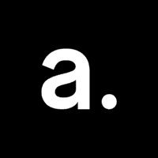

# 2021 年值得关注的 10 多家英国保险科技公司和初创公司

> 原文：<https://www.stxnext.com/blog/10-noteworthy-uk-insurtech-companies-and-startups-to-look-out-for-in-2021/>

 保险行业的公司能创新和领先吗？我们决定通过查看保险技术行业的一些例子来找出答案。

我们下面列出的公司是当创新、有创造力的人着眼于(并成功地)颠覆保险业务时会发生什么的例子。

那么，是什么让他们鹤立鸡群，为什么我们觉得他们很牛逼？请继续阅读，寻找答案。 

#### 1.人工实验室

****

*   **成立于** : 2013 年
*   **总部位于**:伦敦
*   **关注他们上** [**领英**](https://www.linkedin.com/company/artificiallabs/) **和** [**推特**](https://twitter.com/artificiallabs)

##### 他们是做什么的？

人工实验室为保险公司制造工具。它提供的一系列功能令人印象深刻，包括与保险商平台的集成、从电子邮件、附件和文件中提取数据、识别风险威胁等等。

##### 为什么我们认为他们很棒

很高兴看到公司将人工智能驱动的创新引入保险业务，尤其是这项技术在那里还不常见。ArtificialOS 是 Artificial Labs 的数字平台，它将数据收集、合同谈判和定价所需的所有工具集中在一个地方。

##### 网络对他们的描述

人工实验室的首席商务官王冠淇最近接受了 Trends InsureTech 的采访，他谈到了自己的责任、在疫情期间发展一家初创公司等等。

#### 2.被许多人购买

****

*   **成立于** : 2012 年
*   **总部位于**:伦敦
*   **关注他们上** [**领英**](https://www.linkedin.com/company/bought-by-many/) **和** **[推特](https://twitter.com/boughtbymany)**

##### 他们是做什么的？

你可能有保险，对吗？你的宠物呢？如果答案是“不”，许多人都在这里购买帮助。该公司提供透明、易懂、无格式的宠物保险。

##### 为什么我们认为他们很棒

除了提供各种政策来满足您的宠物可能有的任何需求之外，buy by Many 还提供与兽医的视频通话，并编写任何与宠物相关的宠物指南。

我们最喜欢的条目？ [**为什么办公室里的狗和宠物工作福利越来越多**](https://boughtbymany.com/news/article/dogs-in-office-and-pet-work-benefits/) 。这不仅仅是因为那个完美的双关语！

##### 网络对他们的描述

不仅仅是我们对这项保险技术印象深刻。在 2020 年的 [**保险选择奖**](https://insurancechoiceawards.co.uk/previous-winners/) 中获得两个奖项:年度创新和最佳宠物保险提供商。

> @boughtbymany 昨天刚刚为我的狗申请了过敏治疗。索赔今天获得批准。太棒了，该表扬就表扬。24 小时周转真是太棒了。做得好，你的宠物保险团队。
> 
> — Dave Hamilton Jr. (@DaveHJnr) [April 1, 2021](https://twitter.com/DaveHJnr/status/1377620842981568527?ref_src=twsrc%5Etfw)