# CTO 必读的 10 多本书

> 原文：<https://www.stxnext.com/blog/10-must-read-books-ctos/>

 作为首席技术官(CTO ),无论是在技术领域还是商业领域，都需要洞察力和远见。CTO 既是经理，又是软件工程师和企业家，他可以从广泛的资源中受益，既可以了解技术的最新发展，也可以塑造公司的软件哲学。

我们知道为新任命的首席技术官寻找[有用的阅读材料](https://stxnext.com/ebooks/what-is-python-used-for/)或一个强有力的起点可能很困难——这就是为什么我们为首席技术官们创建了这份必读书籍清单。我们开始吧！

#### CTO 必读的 14 本书 

#### 凤凰计划:一部关于它的小说，DevOps，并帮助你的企业获胜

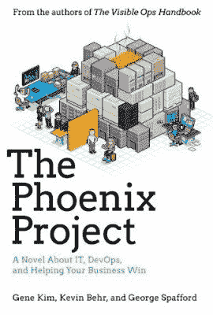

别让小说格式忽悠了你；这是帮助您改善 it 组织的绝佳资源。我们自己的 [马修·哈里斯](https://www.linkedin.com/in/matthew-harris-270322b/) 说他“爱不释手”。Goodreads 上的读者也很热情:

“我很高兴能把(书中的)许多教训付诸实践”——[索尔斯滕](https://www.goodreads.com/review/show/523219724?book_show_action=true)([http://theb0ardside.com/](http://theb0ardside.com/))

“我真的学到了很多关于 IT 需要如何整合到业务目标中才能真正实现的东西”——[迈克](https://www.goodreads.com/review/show/916838365?book_show_action=true)([https://paranoidmike.wordpress.com/](https://paranoidmike.wordpress.com/))

#### 上钩:如何建立习惯形成的产品

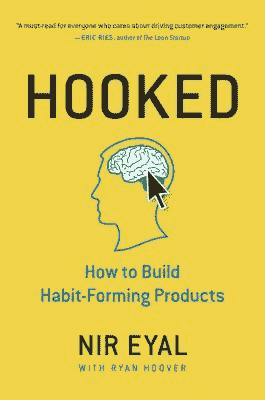

谁不想创建一个让用户着迷的应用或服务呢？这本书可能是你迈向那个目标的第一步。由 [瑞安·胡佛](https://www.goodreads.com/review/show/791439643?book_show_action=true)[产品猎奇](https://www.producthunt.com/) 创始人极力推荐(此处的 [他的中等简介](https://medium.com/@rrhoover) )，并由 Goodreads 创始人 [奥蒂斯·钱德勒](https://www.goodreads.com/review/show/815344876?book_show_action=true) 亲自出马，后者称此书:“极有价值(...)对于任何开发旨在频繁吸引人们的产品的人来说。”

#### Jason Fried 返工

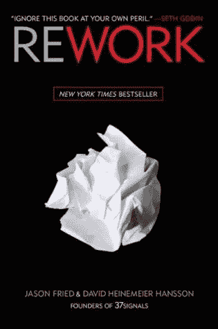

这是这份榜单上众多关于企业家精神的书籍之一。寻找商业成功的新方法既是首席技术官/首席信息官的工作，也是首席执行官的工作。(不信我？这里有一个关于 [首席技术官真正在做什么](http://www.saccade.co/cto/what-does-a-cto-do) 的很好的资源。返工是一个伟大的第一步，它对生产力提出了建议，在不倾家荡产的情况下获得了更多的曝光率，以及它的“越简单越好”的方法。

“返工是快速和容易阅读的，这说明了这本书的哲学是先令:把事情做好”——[路易斯](https://www.goodreads.com/review/show/94422912?book_show_action=true)([http://www.nakedsushi.net/](http://www.nakedsushi.net/))

“阅读《返工》可以成为更聪明地开始工作(而不是更努力)、寻求长期可持续业务(而不是实现本季度更好的财务业绩)和真正服务客户需求(而不是试图欺骗他购买不相关的产品)的巨大动力。”- [阿尔吉尔达斯·拉修斯](https://www.goodreads.com/review/show/456056466?book_show_action=true)，[KAYAK](https://www.linkedin.com/in/algirdasrascius/)的软件架构师

#### 乔尔·比斯利的《现代首席技术官》

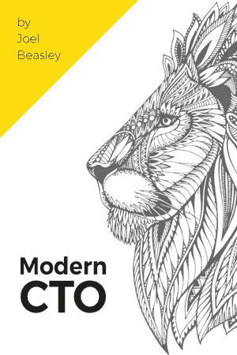

这是现代首席技术官播客[主持人乔尔·比斯利最近写的一本书。Joel 专注于引导读者完成从开发人员到 CTO 的转变，解决诸如策略、重写系统和处理“意大利面条代码 MVP 流行病”等领域的问题。](https://moderncto.io/)

“这本书是一个很好的起点，可以让你从典型的开发人员转变为首席技术官。这是一个很大的启发！乔尔很直率，他会提供切合实际的建议。-蒂莫西·麦戈文

这是我读过的第一本“商业/技术”书。因为我总是听乔尔(现代首席技术官)的播客，所以我最终提前订购了它。如果你认为他的播客有趣又吸引人，你不会对他的书失望的！他给人的印象也是如此——就好像你是他节目的嘉宾一样。”劳伦·m。

#### 持续交付:Jez Humble 通过构建、测试和部署自动化发布可靠的软件

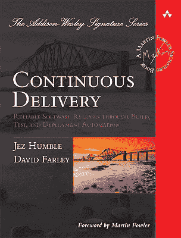

这本面向首席技术官的重要书籍阐述了一些原则和技术实践，这些原则和技术实践通过构建、部署和测试流程的自动化，以及开发人员、测试人员和运营人员之间更好的协作，支持向用户快速、增量地交付高质量、有价值的新功能。

“这是我迄今为止读过的关于部署的最好的书。”- [安德烈·法利亚·戈麦斯](https://www.goodreads.com/review/show/394626944?book_show_action=true)([http://blog.andrefaria.com/en](http://blog.andrefaria.com/en))

“眼开。IT 部门的每个人都应该阅读这本书，无论他是程序员、测试人员还是运营专家。”- [霍尔格·马蒂斯](https://www.goodreads.com/review/show/1235926822?book_show_action=true)，[全球谷歌计划-新服务生命周期经理](https://www.linkedin.com/in/holgermatthies/)，

#### 代码:计算机硬件和软件的隐藏语言

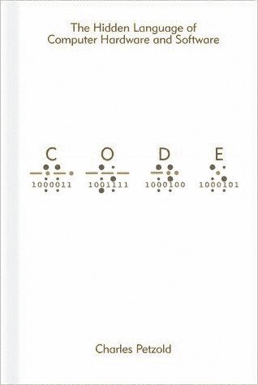

*Code* 不仅深入研究了计算机代码，还深入研究了盲文和莫尔斯等系统，帮助首席技术官了解当今世界的 PC、数字媒体和互联网的真实背景。

“Petzold 通过一种简洁的线性故事叙述格式打开了计算世界。”——[克雷格](https://www.goodreads.com/review/show/198450682?book_show_action=true)([http://cargowire.net/](http://cargowire.net/))

“如果你和电脑打交道，却没有读过这本书，那你就是个瘸子。”- [亚历克斯·帕尔库伊](https://www.goodreads.com/review/show/583105304?book_show_action=true)，[谷歌](https://www.linkedin.com/in/alexpalcuie/)网站可靠性工程师([https://blog . palcu . ro](https://blog.palcu.ro/))

#### 本·霍洛维茨的《艰难的事情》

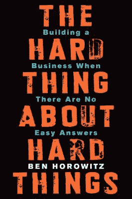

本·霍洛维茨(Ben Horowitz)直接从硅谷为首席技术官们提供创业建议，涵盖了诸多挑战，比如降级(或解雇)一位忠诚的朋友、与糟糕员工中的聪明人打交道，以及在公司依赖你的时候管理自己的心理。

“这是我读过的最好的商业书籍。”——[克里斯·约翰森](https://www.goodreads.com/review/show/914752628?book_show_action=true)([http://simplifilm.com/](http://simplifilm.com/))

这是你读过的关于企业家精神的最好的书之一...)如果你想更好地理解它，请阅读这本书。”- [布拉德·菲尔德](https://www.goodreads.com/review/show/878081329?book_show_action=true)，[铸造集团常务董事](https://www.linkedin.com/in/bfeld/)([https://www.feld.com/](https://www.feld.com/))

#### 神话中的人月:弗雷德里克·布鲁克斯的软件工程论文

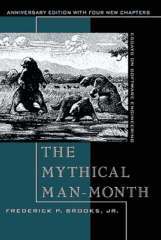

结合了软件工程事实和发人深省的观点的经典之作。从技术和管理的角度来看都很有用。对一些人来说，这似乎有些过时了，但是里面描述的软件开发错误还没有被全世界熟练的 CTO 和软件工程师根除。

“有些部分显然已经过时了，但它包含了许多智慧，我认为它仍然很值得一读。即使是比较过时的部分，有时读起来也很有趣，与今天的情况相比也很有趣”——[汉普斯·韦斯曼](https://www.goodreads.com/review/show/730495638?book_show_action=true)，[谷歌](https://www.linkedin.com/in/hampusw/)的软件开发人员

在这本关于软件开发过程的经典著作中，Fred Brooks 推翻了几个长期存在的神话。它们永远不会完全消失:每一代新人都必须重新学习它们。”- [曼尼·雷纳](https://www.goodreads.com/review/show/80389042?book_show_action=true)，[口语对话系统研究员/顾问](https://www.linkedin.com/in/manny-rayner-b822/)，

#### 埃里克·里斯的《精益创业》

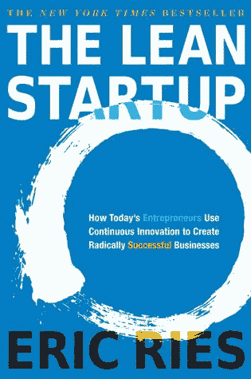

精益创业公司 在软件企业家的众多书籍中随处可见，在这个公司比以往任何时候都更需要创新的时代，首席技术官们肯定可以从其创建和管理成功创业公司(和产品)的科学方法中受益。

“我喜欢 Eric 分享的精神……当一个新员工犯了一个错误时:“我们为让你容易失败而感到羞耻。”——[克里斯·约翰森](https://www.goodreads.com/review/show/294410136?book_show_action=true)([http://simplifilm.com/](http://simplifilm.com/))(第二次评论他的《我们在引用——谢谢克里斯！)

"外卖: (...)要精干。向丰田的制造学习，快速响应客户反馈，为您的产品提供每月、每周甚至每天的迭代。”- [安迪·斯坦格](https://www.goodreads.com/review/show/309069810?book_show_action=true)，[希尔城教堂的种植园主兼牧师](https://www.linkedin.com/in/andrew-stager-18b18715/)([https://www.thecordialchurchman.com/](https://www.thecordialchurchman.com/))

#### 《务实的程序员:从熟练工到大师》,作者 Andrew Hunt，迪夫·托马斯

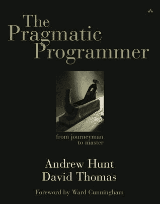

这是 CTO 可以推荐给他们的开发人员来提高他们的技能的书籍之一，并且通过与开发人员一起阅读它来获得额外的洞察力。

本书所包含的信息对于那些想把自己的技能和知识发展成一门名符其实的手艺，成为该领域的大师的软件开发人员来说是必不可少的——([https://about.me/tamouse](https://about.me/tamouse))

“《实用程序员》这本书的美妙之处在于，当你阅读它的时候，它会激发你的灵感。你能更有效地做某事吗？能不能做的优雅一点？你能让计算机代替你工作吗？”——([http://ratfactor.com/](http://ratfactor.com/))

#### Peopleware:汤姆·狄马克的生产项目和团队

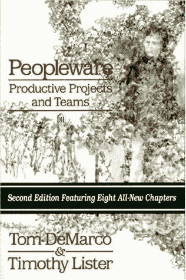

“Peopleware 是开发管理领域的一个经典，这是有道理的。这本书直截了当，短小精悍，实用而有影响力。”——[本哈利](https://www.goodreads.com/review/show/95229994?book_show_action=true)([http://benjaminhaley.blogspot.com/](http://benjaminhaley.blogspot.com/))

任何和工程师一起工作的人都必须阅读。这本书的前提是我想钉在墙上的东西，用 200 号字体:我们把大部分时间花在管理项目的技术方面，而大多数导致项目失败的问题都是人为的，而不是技术的。”——[克里斯](https://www.goodreads.com/review/show/496336680?book_show_action=true)

“如果你在管理岗位上，我会说这是你的必读宝典。”- [阿尔维达斯·西多伦科](https://www.goodreads.com/review/show/1077888334?book_show_action=true)，[互联网象棋俱乐部](https://www.linkedin.com/in/arvydassidorenko/)软件开发人员 

#### 工作中的创业者:创业初期的故事

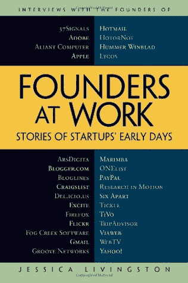

*工作中的创始人:初创公司早期的故事* 收集了对著名科技公司创始人的采访，讲述了早期发生的事情。很多时候，一家科技创业公司诞生于两个人的合作:首席执行官和联合创始人首席技术官(例如，见 [这个 Quora 讨论](https://www.quora.com/What-makes-someone-an-awesome-co-founder-CTO) )。因此，所有级别的 CTO 都可以从阅读这篇文章中学到一些东西。

“喜欢这本书的每一秒钟。每一章都是一个不同的创业创始人的故事。我读得很慢，这样就不会结束了，很多章节读了两遍。”- [奥蒂斯·钱德勒，Goodreads 创始人](https://www.goodreads.com/review/show/38876?book_show_action=true)

“没有结构，没有主题，但对科技企业创始人进行了 30 多次采访，但这很有效，值得一读。”- [穆罕默德·迪亚卜安博亚](https://www.goodreads.com/review/show/1842096552?book_show_action=true)、  [独立企业财务顾问](https://www.linkedin.com/in/mohamed-d-embbya-2a12667/)

#### 克莱顿·M·克里斯坦森的《创新者的困境》

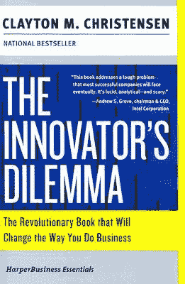

《创新者的困境》《T2》是本世纪最受关注的书籍之一。任何一个精明的企业家或首席技术官都不应该没有它。它专注于颠覆性技术，并回答发人深省的问题，如“什么时候不倾听客户的意见是正确的？”或者“什么时候投资开发利润率较低的低性能产品？”

“这是过去 20 年里关于创新的最好的书籍之一。2000 年读的，现在还在参考。”- [尼科·麦克唐纳](https://www.goodreads.com/review/show/189159942?book_show_action=true)，[研究&发展协会](https://www.linkedin.com/in/nicomacdonald/)([http://www.spy.co.uk/](http://www.spy.co.uk/))首席执行官

#### 《从零到一:创业笔记》或《如何打造未来》作者:彼得·蒂兰尼我们错过了什么？

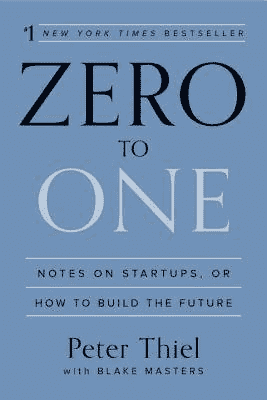

有争议，但仍有价值。

“特别是在‘商业’类别中，《零对一》是一本特别的、发人深省的书。强烈推荐。”- [安德鲁·加文](https://www.goodreads.com/review/show/1041428588?book_show_action=true)

“我喜欢它发人深省的特点；这是一次引人入胜的阅读:不同意，同意，学习新的观点。”-，[安博软件创始人](https://www.linkedin.com/in/jacek-ambroziak/)

##### 我们错过了什么吗？

在这个列表中，你还能看到其他对 CTO 有用的书籍吗？欢迎[联系我们](/contact/)；我们定期更新名单。快乐阅读！

