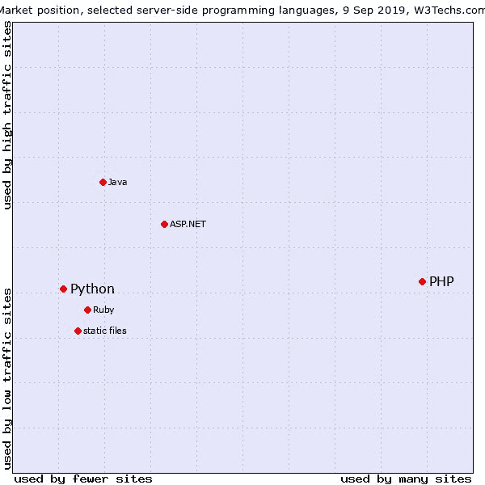
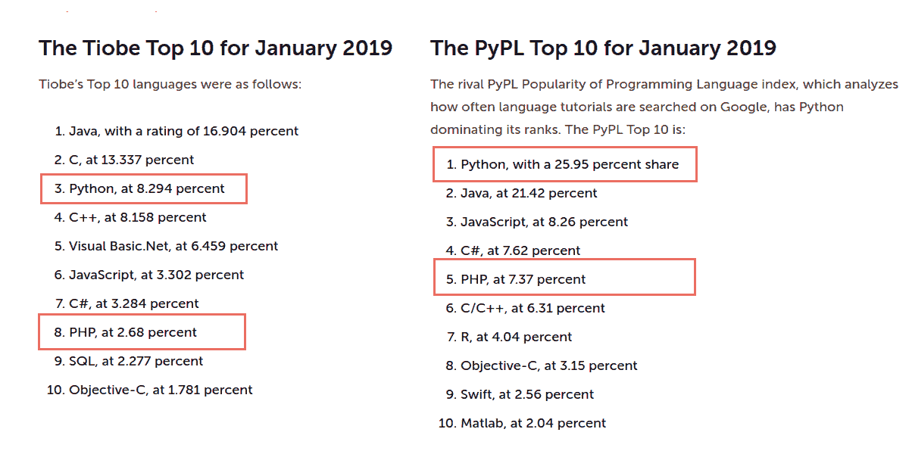
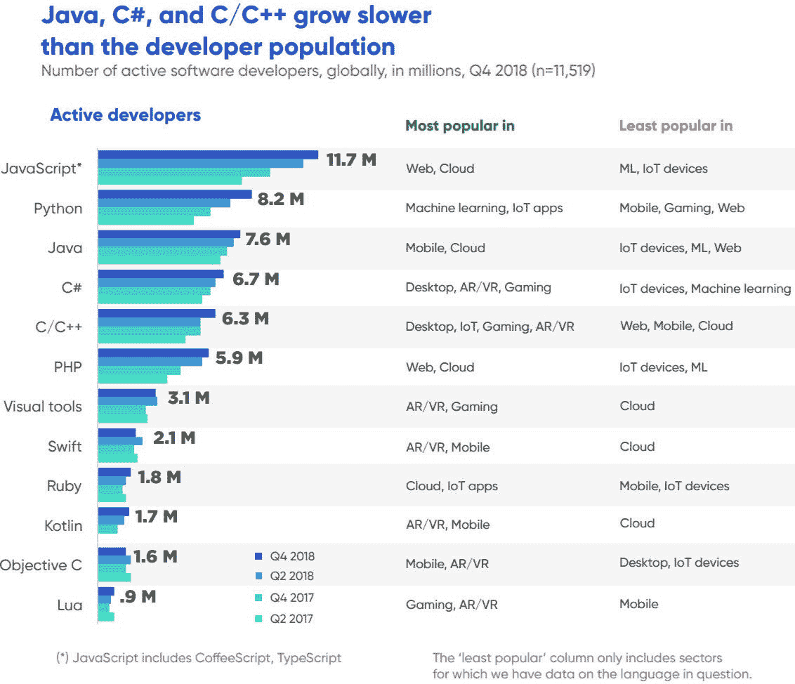

# Python 与 PHP:利弊和差异的商业指南

> 原文：<https://www.stxnext.com/blog/python-vs-php-comparison/>

 对于软件开发人员来说，比较编程语言就像比较苹果和橘子。熟练的程序员有他们最喜欢的行业工具、强烈的观点和个人偏好。

但是对于项目经理来说，这是一个合理的担忧。明智地选择技术基础会对您管理 web 应用程序开发过程的方式产生重大影响。

如果有必要，你能快速雇佣新的开发人员吗？一种技术比另一种更经得起未来考验吗？哪些受欢迎的公司使用哪些语言？你能用每种技术制造出什么样的产品？哪个有更好的长期支撑？

这些都是重要的问题。本文将为您解答这些问题。

过去我们讨论过  [Python](https://stxnext.com/services/python-development/) 如何与  [其他编程语言](https://stxnext.com/python-vs-other-programming-languages/)，比如  [Go](/stx-new-blog/go-go-python-rangers-comparing-python-and-golang/py) 、  [Java](/stx-new-blog/python-vs-java-comparison/) ，或者  [Node.js](/stx-new-blog/python-vs-ruby-comparison/) 相抗衡。  现在，是时候把 Python 比作 web 开发的黑马:PHP 了。

 

#### PHP 与 Python:总结

如果你时间紧迫，我们已经准备了一个 TL；你的博士版本。

以下是我们文章的要点:

1.  PHP 从一开始就是以 web 为中心的，目前支持大约 80%的网站服务器，因为它是默认的 web 服务器技术。
2.  因此，PHP 有点像是一种遗留技术。这意味着更容易找到 PHP 开发人员进行维护、更新网站、添加新功能或从过时版本迁移。
3.  尽管 PHP 拥有强大的 web 框架，但它是最适合传统 web 项目的技术:以有限的复杂性或计算提供内容和博客。
4.  另一方面，Python 是一种通用脚本语言，从一开始就有科学背景。
5.  [Python](https://stxnext.com/what-is-python-used-for/)的常见应用包括大学水平的编程教育，编写数据抓取和计算的脚本，管理复杂的大数据模型，以及[人工智能](/stx-new-blog/will-artificial-intelligence-replace-developers/)、[机器学习](https://stxnext.com/services/machine-learning/)，以及[物联网](https://stxnext.com/what-is-python-used-for/#internet-of-things)。
6.  Python 在过去几年中人气暴涨，并提供了多种完全适合不同开发者需求的 web 开发框架。这些丰富的 Python 工具使得[能够快速构建 MVP](/stx-new-blog/build-your-mvp-right-way-common-mistakes/)，并简化了 web 应用的开发过程。
7.  用 Python 编写简单的应用程序并不费力，尽管这种语言在 web 开发中最适合构建执行大量计算的复杂应用程序。Python 对于使用 AI/ML 以新的方式提供新型服务或传统服务的软件产品来说也很棒。

如果你想知道我们是如何得出这些结论的，请继续阅读！

我们将从一些背景知识开始，这对理解 PHP 和 Python 的流行很有用。这两种语言是如何加入 web 开发最突出工具的行列的？他们以前在哪里，现在在哪里？

 

#### PHP 的简短故事:事实、数据和用例

##### 1.PHP:从 1994 年到 2019 年的基本信息和里程碑

PHP 通常被称为“web 脚本语言”，但实际上它也可以用于其他目的。然而，这个定义确实给了我们一个关于 PHP 起源的暗示，因为这种语言确实是在考虑 web 的情况下创建的。

第一个版本是一组用通用脚本语言 c 编写的脚本，PHP 的创始人拉斯马斯·勒德尔夫将其命名为“个人主页工具”他在 1994 年写了这些脚本，以跟踪对他在线简历的访问。直到 1998 年，PHP 才成为真正的编程语言。

PHP 随后越来越受欢迎，2011 年，PHP 开发团队制定了发布新版本的时间表。随之而来的要求是  **每个版本都应该有至少两年的安全和漏洞修复支持，以及至少一年的安全修复。**

这个假设有好有坏。支持总是受欢迎的，但是两年时间并不多。在长期项目中，这意味着维护代码库和保持产品更新的成本更高。【T2

##### 2.PHP 是用来做什么的？

PHP 的最新版本是 PHP 7。所有使用 PHP 的网站中有 38.7%使用它。

相反，60.8%使用 PHP 的网站仍然使用 5.6 或更旧的版本，这些版本都不再受 PHP 开发团队的支持。不过，其他公司的团队，比如 Debian，继续支持旧版本。

各种各样的网站都使用 PHP。可以说，PHP 组合中最耀眼的明星之一是 Wordpress。世界上最大的博客平台上的所有数据都被用 PHP 编写的系统移动和管理。

但是不仅仅是 Wordpress 开发团队喜欢 PHP。语言也是背后的引擎:

*   脸书，
*   懈怠，
*   9gag，
*   字体，
*   Hootsuite，
*   有了它，
*   把它抬起来。

最重要的是，根据  [Stackshare](https://stackshare.io/php) 的数据，PHP 被 42，260 家其他公司使用。使用它的公司的实际数量肯定比这还要多。

##### 3.PHP 的普及

多达 80%的网络服务器使用 PHP。是的，你没看错:  **就服务器端脚本的流行程度而言，PHP 击败了所有其他语言。**

看一看:

**Source: https://w3techs.com/technologies/comparison/pl-php,pl-python**

PHP 在 web 服务器端如此受欢迎有几个原因:

1.  它的构建和发布早于今天使用的大多数其他可行的 web 服务器开发技术；
2.  这种语言是几个内容管理系统——Wordpress、Drupal、Joomla——的核心，所以它为所有建立在这些系统上的网站提供动力；
3.  每个虚拟主机服务器都安装了 PHP。

所有这些——历史和受欢迎程度——使得 PHP **成为一项稳定、成熟的技术，这要归功于它的开发团队和大量使用它的开发人员的努力。**

**** 

#### Python 的简短故事:事实、数字和用例

##### 1.Python:从 1991 年到 2019 年的基本信息和里程碑

Python 的第一个版本是在 1991 年由吉多·范·罗苏姆发布的。直到 2018 年 7 月，van Rossum 还保有 Python 语言“终身仁慈的独裁者”的称号。这意味着任何关于 Python 的决定和改变都必须得到他的批准。

这与本文并不相关——但不提及它就太酷了。

虽然 PHP 从一个简单的 web 开发工具成长为一种通用编程语言——通过分散在不同团队和公司的开发— **Python 是一种完全不同的野兽。**28 年来，Python 的发展一直受到其创造者的密切关注，他至今仍是团队的一部分，只是更多地处于观望状态。

Python 从一开始就是一种通用编程语言，用来替代一种叫做 ABC 的语言。在 2000 年发布 2.0 版本后，2.1 和随后的所有版本都是在 Python 基础下构建的。

Python 的最新主要版本是 Python 3，3.7 是最新的稳定版本，目前有 34.6%的网站在服务器端使用 Python。 **65.4%的 Python 项目仍在使用 2 版，即将于 2020 年 1 月 1 日失去支持。**

如果您正在从头构建一个新的 Python 应用程序，Python 2 失去支持并不是太大的问题。然而，对于长期使用版本 2 的团队来说，事情可能会变得不确定。  [阅读本文](/stx-new-blog/why-migrate-from-python-2-to-python-3/) ，了解为什么应该从 Python 2 迁移到 Python 3。一旦你确信这是一个好主意，但不知道从哪里开始，  [这里有一个全面的指南](/stx-new-blog/python-3-migration-guide/) 来帮助你上路。

我们现在不想进一步讨论 Python 3 迁移。相反，让我们把重点放在 Python 的用途和常见应用上。

##### 2.Python 是用来做什么的？

[https://stxnext.com/what-is-python-used-for/](https://stxnext.com/what-is-python-used-for/)

Python 的主要焦点从来不是 web 开发。然而，几年前，软件工程师意识到 Python 在这方面的潜力，这种语言经历了一次大规模的流行。

截至 2019 年，  **Python 分别在 TIOBE 和 PyPL 编程语言流行度排名中占据第 3 和第 1 位 —** 领先 PHP 几个位次。

**Source: https://www.infoworld.com/article/3331603/pythons-popularity-surges-as-a-mainstay-language.html**

Python 很容易学，但是很难掌握。正因为如此，世界上许多大学都用它来教授软件开发和数据科学。这种语言使学生和研究人员能够为复杂的计算任务编写简单的脚本——而这只是冰山一角。

**Python 的应用不胜枚举:**

*   网页开发；
*   [数学、科学和工程中的科学和数值计算](/stx-new-blog)；
*   教授编程的基本概念；
*   在软件开发中建立控制和管理、测试和其他类型的支持；
*   构建企业和电子商务系统。

Python 可以为您和您的软件项目做的事情几乎是无止境的— [您只需要知道去哪里找](https://stxnext.com/services/python-development/)。

##### 3.Python 的流行

Python 是  [人工智能](/stx-new-blog/will-artificial-intelligence-replace-developers/)、  [机器学习](https://stxnext.com/services/machine-learning/)、统计、系统测试、脚本以及——截至过去几年——[web 开发](/stx-new-blog/flask-vs-django-comparison/)等领域的领先技术。

1.2%的网站在服务器端使用该语言。与 PHP 相比，这个数字似乎很小，但它仍然是 web 的重要组成部分。当你考虑到 web 开发不是 Python 的主要目的时，这是很容易理解的。

不管怎样，Python 为 5839 家数字公司提供了动力(根据  [StackShare](https://stackshare.io/python) )，其中包括科技巨头，如:

*   优步，
*   网飞，
*   Spotify，
*   Instagram，
*   Dropbox，
*   谷歌，
*   Pinterest，
*   Reddit，
*   Instacart。

想象一下:研究人员用来编写数据采集脚本的语言也是同一种语言，它使你有可能在网飞上观看  *【陌生人事物】* ，在 Instagram 上发布自拍，或者在与朋友外出一夜后乘坐优步回家。

引用我们敬爱的西斯尊主的话:

**Source: https://www.flickr.com/photos/147231942@N02/34754877531**

#### 程序员可用性:Python 或 PHP 开发人员容易找到吗？

选择正确的技术只是等式的一部分。还有另一个非常重要的问题需要回答:你找到使用你选择的技术的熟练开发人员有多容易？我们来分析一下数据。

在他们  [2019 年对全球近 9 万软件开发者的](https://insights.stackoverflow.com/survey/2019#technology)**栈溢出调查中发现，39.4%的开发者使用 Python。在 PHP 的例子中，百分比是 25.8。** 然而，光是这些数字，并不能告诉我们市场上有多少开发商。

幸运的是，ZDNet 提供了相关估计数据的概要。根据他们的说法， **有 820 万 Python 开发者，** 其中大部分从事 ML 和物联网应用的开发。

**对于 PHP 来说，有 590 万开发者，** 大多从事 web 和云方面的工作。

下面是 ZDNet 收集到的数据(注意，JavaScript 数据包括  [CoffeeScript 和 TypeScript](/stx-new-blog/typescript-pros-cons-javascript/) ):

**Source: https://www.zdnet.com/article/programming-languages-python-developers-now-outnumber-java-ones/**

显然，寻找 Python 开发人员应该容易得多，因为他们的数量更多，对吗？

不完全是。

考虑目前最流行的用例:web 开发。PHP 在这一领域的应用比其他任何服务器端技术都要广泛，而且使用的时间也比 Python 长。因此，有理由认为  **找 PHP web 开发者其实更容易。**

对  [自由职业者](https://www.freelancer.com/) 的短暂搜索印证了这一点。对于由 Python 过滤的关键字“web developer”，它显示了 5388 名自由职业者。PHP 过滤的同一个关键词？8982 名自由职业者。

**然而，我们还需要考虑 PHP 开发人员被雇佣最多的项目类型。在当前形势下，it 部门通常不会建设新项目。**

记住:目前 80%的 web 服务器使用 PHP。这些需要维护，错误修复，新特性，其中很多可能还需要升级到版本 7。许多 PHP 开发人员都是 Wordpress 开发人员，所以他们非常适合处理这样的任务。

找到维护旧网站的 PHP 开发人员不成问题。寻找用 PHP 开发新产品的 web 开发人员？那是另外一个故事。

另一方面， **Python 开发者为未来的 web 做了更好的准备，由  [人工智能](/stx-new-blog/will-artificial-intelligence-replace-developers/) 和  [机器学习](https://stxnext.com/services/machine-learning/)，并与  [物联网](https://stxnext.com/what-is-python-used-for/#internet-of-things)相连接。他们还精通最大数据集的数据采集和数据科学，也称为大数据。**

因此，很容易找到 Python 开发人员从事与  [机器学习](https://stxnext.com/machine-learning-applications-examples-industries/)相关的 web 开发工作，以及为 web 构建复杂的创新产品。

 

#### 你的下一个 web 开发项目应该选择 PHP 还是 Python？

让我们来解决本文核心的最重要的问题:对于您的软件项目，您何时应该使用 PHP，何时应该使用 Python？

如果你足够努力，你将能够使用任何一种技术构建相同的 web 应用程序，并且从用户的角度来看，两者看起来是一样的。

Python 和 PHP 都有使这成为可能的 web 开发框架。排名前两位的 Python 框架是  **Django 和 Flask** — [到这里](/stx-new-blog/flask-vs-django-comparison/) 来看看它们之间的比较——而最流行的 PHP 框架是  **Laravel。**

##### 1.Python 和 PHP web 开发框架

##### a) Python

*   姜戈
*   金字塔
*   瓶
*   瓶子

##### (b) PHP

*   代码点火器
*   symphony
*   拉勒韦尔
*   Yii 2

这个列表并不详尽，但是它确实显示了两种语言都有突出的 web 开发工具。

说完这些，现在让我们问自己:Python 和 PHP 适合什么类型的项目？

##### 2.Python 有什么用？

目前的情况是，就构建 web MVP 的  [和构建复杂 web 应用程序的能力而言，Python 和 Django 的组合仅次于 JavaScript。这对 Python 来说是个好地方，因为 JavaScript 是目前 web 开发中的领先技术。](/stx-new-blog/build-your-mvp-right-way-common-mistakes/)

**但是 Python 的应用远远超出了 web 开发**。 Python 非常适合利用人工智能、机器学习和数据科学的创新项目。它允许您创建新类型的数字服务或以全新的方式提供标准服务。

##### 3.PHP 有什么用途？

PHP 一直是为网络而设计的，它是许多老牌互联网巨头的基础，如脸书或 Wordpress。

PHP 的应用更多的是在遗留软件方面。 这种语言在网络上随处可见，而且不会消失，所以有人必须维护它的所有用例。然而，PHP 显然不是当今大多数程序员用来构建创新的 web 应用程序的首选武器。

总而言之，PHP 非常适合我们称之为“传统”的 web 项目:内容、社交平台、博客。本质上，不需要大量计算或尖端功能的项目。

 

#### Python 和 PHP 的优缺点

我们已经对这两种技术进行了广泛的研究:它们发展的关键事实，对它们目的的洞察，以及它们的受欢迎程度。

那么，Python 和 PHP 有什么相似之处，又有什么不同呢？

##### 1.PHP 和 Python 的异同

**就** 而言，Python 和 PHP 得分都很高

*   **成熟期**

尽管 PHP 和 Python 在常见的应用程序上有所不同，但它们都是最成熟、最安全、最流行的技术之一，构成了复杂的 IT 行业的基础构件。

*   **人气**

如果我们比较一下 80%的网站都有 PHP 后台，而只有 1.2%是用 Python 构建的，那么 Python 似乎以很大的优势输掉了流行竞赛。但是当你考虑到 Python 的各种应用，而不仅仅是 web 开发，那么当谈到流行时，这两种技术真的是势均力敌。

*   **社区**

Python 有 Python 软件基础，而 PHP 有几个不同的团队支持和开发它的不同版本。同时，这两种语言都有大量开源贡献者。

*   **Web 框架**

如果您的重点是 web 开发，那么这两种技术都会很好地为您服务，因为它们都有强大的 web 框架，可以简化和加速 web 应用程序的开发。

根据这个纲要，Python 和 PHP 似乎有很多共同点。  根据你的项目，这些可能被视为优势或劣势。

##### 2.比较 Python 和 PHP 的优缺点

##### Python 的利与弊

*   **全能**

科学计算、强大的 web 应用、机器学习模型、复杂的大数据管理——Python 可以做到这一切。就多功能性而言，它显然是赢家。

*   **有组织有结构**

Python 的开发在历史上比 PHP 更结构化，所以拥有更好支持的 Python 版本更少，使得维护和安全性更容易。

*   **上升中的**

由于 Python 在人工智能、人工智能和物联网领域的强大应用，近年来 python 的人气飙升。

*   **凌乱的图书馆**

由于 Python 是一种开源语言，任何人都可以对它做出贡献并创建自己的库。尽管这在本质上是积极的，但也意味着一些库及其文档的质量没有达到标准。与 PHP 不同，Python 库的组织也有很多不尽人意的地方。Anaconda 和 PyPi 这两个主要的 Python 包管理器之间经常存在差异。

##### PHP 的利与弊

*   **专用**

PHP 是 web 上最受欢迎的服务器端技术，所以它目前的开发目标是最大化语言在这方面的可用性。

*   **凌乱的**

PHP 的开发分散在多方，不同的团队开发了几个版本，这可能会很麻烦。

*   **失去人气**

不可否认，最新版本的 PHP 非常强大，而且这种语言不会很快消失。但是这项技术的总体受欢迎程度已经停滞不前，如今它被认为是一项非常普遍的传统技术。

#### 关于 PHP 和 Python 的最后一点思考:你的软件项目总是放在第一位

说实话，如果你想创建的软件产品是一个公司网站、一个博客或一个简单的 web 服务，那么如果你用 PHP、Python、Ruby on Rails 或任何其他著名的 web 开发技术来构建它，你会同样富裕。您的最终用户将无法辨别这种差异。

**你的决定其实应该完全取决于两个因素:**

1.  **你的软件项目的个别需求，**
2.  开发团队的技能。

这就是为什么软件项目的计划阶段确实是最关键的部分。

如果您对应该使用的技术有任何问题或疑问，  [随时联系我们](https://stxnext.com/contact-us/)！在 STX Next，我们是 Python 的忠实粉丝，但是如果我们认为 Python 不是您的软件项目的最佳选择，我们会很乐意将您介绍给我们的一个专门研究不同技术的合作伙伴。

而如果你想进一步了解 Python，  [看](https://stxnext.com/services/python-development/) [不](https://stxnext.com/python-vs-other-programming-languages/) [更进一步](https://stxnext.com/what-is-python-used-for/)。

