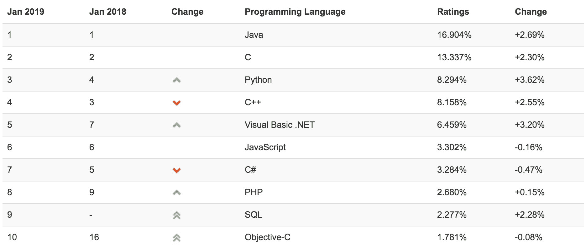
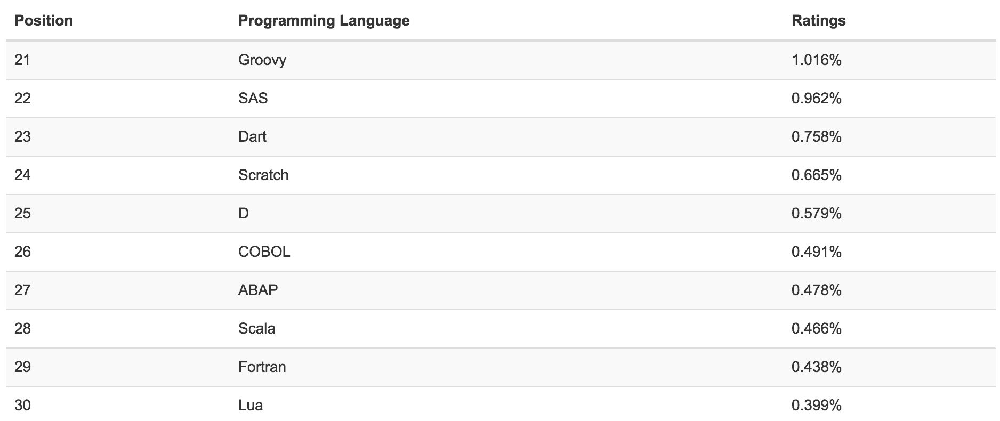
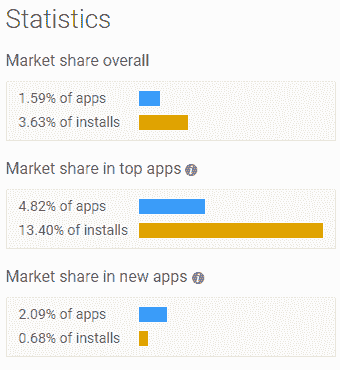
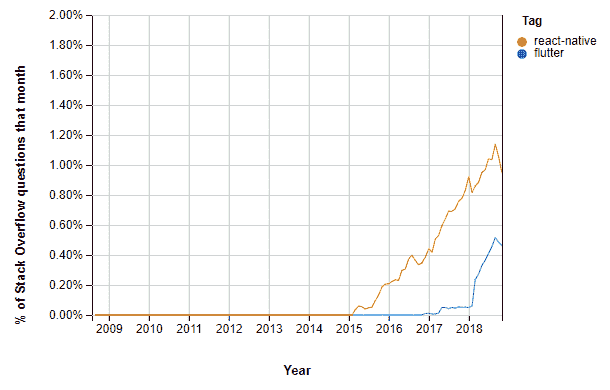
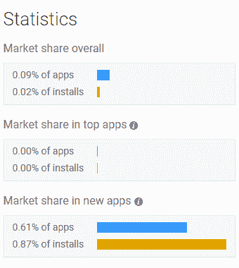
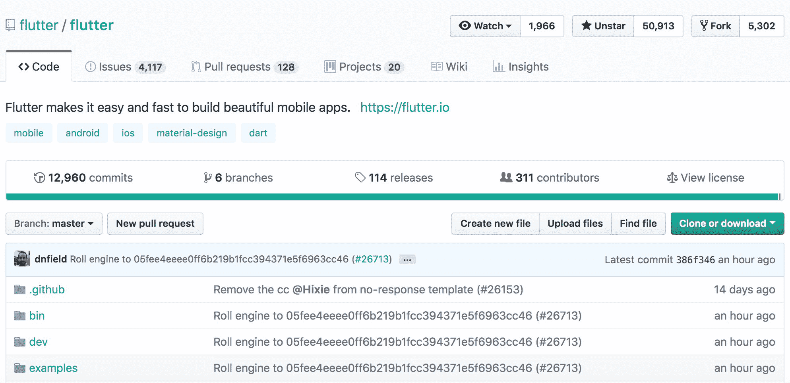
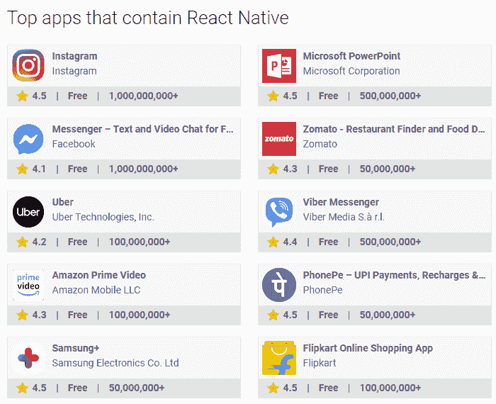
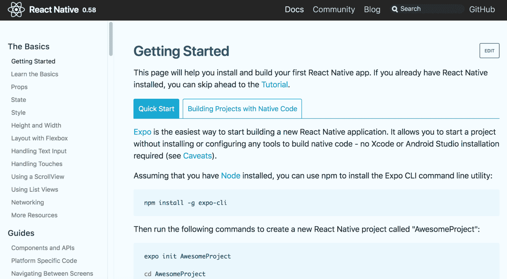
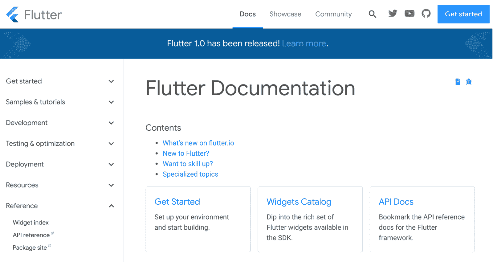

# React Native vs. Flutter:利弊比较

> 原文：<https://www.stxnext.com/blog/react-native-vs-flutter-comparison/>

 [React Native 是一项趋势技术](https://stxnext.com/services/react-native/)，其受欢迎程度持续增长。

然而，越来越多的竞争者正在加入  [的移动开发竞赛](https://stxnext.com/services/mobile-development/) 来抢一些 React 本土的风头。

最近崛起的一个竞争对手是**。**

 **考虑到这一点，我们决定利用我们在这两种技术方面的专业知识，写一篇我们不久前发表的[React Native 和 Ionic](/stx-new-blog/react-native-vs-ionic-comparison/) 的比较的后续文章。

**继续阅读，了解 React Native 与 Flutter 的对比，各自的优缺点，以及哪个更适合您的移动应用。【T2**

******  **#### 快速小结

我们知道您时间紧迫，所以让我们试着马上回答这篇文章的核心问题。

**用哪种技术来构建你的手机 app 比较好:React Native 还是 Flutter？**

不出所料，回答这个问题比看起来更难。每个框架都带来了不同的东西，您的选择应该主要取决于您的个人需求和您的软件项目的精确需求。

在选择一个选项之前，问问自己:

1.  **你的开发团队有经验丰富的 JavaScript 开发人员吗？**
2.  你关心使用原生 UI 组件构建你的应用程序的 GUI 吗？
3.  **你的应用在不同平台上应该看起来一样吗？**

如果你对这些问题中的任何一个或全部的回答是“是”，那么你可能应该选择  [React Native](https://stxnext.com/services/react-native/) 。您当前的  [JavaScript 开发人员](https://stxnext.com/services/javascript-development/) 将能够快速掌握新技术，而不必学习 Dart——一种他们可能不熟悉的语言。此外，您将能够利用 React Native 对 OEM 小部件的使用来使您的应用程序在每个平台上看起来不同。这两点都是有效的，并与您的具体业务环境相联系。

但是，如果您的开发团队在面向对象语言(如 Java 或 C#)方面经验丰富，那么 Dart 似乎更适合他们。此外，如果跨平台、品牌第一的设计是你的优先事项，那么 Flutter 的目标与你的一致。该框架从第一天起就非常强调这一点，根据我的经验，使用 Flutter 在多个平台上准确地定制您想要的设计要比 React Native 容易得多。

然而，还有最后一个关键问题你应该问自己:  **你是早期采用者吗？**

Flutter 还是一个很年轻的框架，承受着很多成长的烦恼。没有多少应用程序使用它，社区支持可以更好。因为它太新了，现在摘简直是冒险。对你的开发人员来说很有趣，但对你来说可能很昂贵。

因此，如果你在寻找这个大问题的具体答案，仅仅出于这最后一个原因，我们建议:  **选择 React Native。** 等一会儿再试出旋舞。在这一点上，这只是一个更聪明的商业决策。

#### 本文的目标:对自然与颤动作出反应

如果你正在读这篇文章，这意味着 TL；博士没有耗尽你的好奇心。太棒了。我们继续。

这篇文章的目的是详尽地比较  **React Native 和 Flutter——这两种类似的技术可以用来构建跨平台的原生移动应用。**

React Native 因其在市场上的持续存在和在社区中的深入采用而为技术导向型个人所熟知。很多时候，当人们想到跨平台的单一代码库的移动应用时，他们首先想到的是[【React Native】。](/stx-new-blog/why-use-react-native-your-mobile-app/)

Flutter 还没有获得这样的认可，但它通过对移动应用程序的构建方式进行大量改变而迅速成名。在几个方面，它似乎已经比 React Native 更成熟，尽管它比它的对手年轻得多。

从本质上来说，**React Native 和 Flutter 之间的技术大战是脸书和谷歌**、 这两个框架各自开发者之间的冲突。

这没什么好抱怨的。恰恰相反， **这样的竞争推动创新，并对开发人员可以使用的工具的整体质量做出巨大贡献。**

**** 

#### 搭建舞台:从 web 开发到移动开发

不久以前，网络是发布软件产品的最重要渠道。

为了接触到他们的客户，公司会用一致的技术栈(HTML，CSS，JS)来写一个网站，并且主要担心如何使它兼容不同的浏览器。主要关心的是让它看起来全是一样的，不管是什么系统或浏览器。

情况不再是这样了。

时代在变，公司正把注意力转向让移动应用成为他们产品的主要访问点。 绝大多数用户总是随身携带智能手机，只需轻轻一点就能打开任何应用。

访问所有原生手机功能——加速度计、推送通知或在后台运行——是移动应用的一个巨大优势。

但是没有不带刺的玫瑰。虽然你只需要一个具有 web 技术专业知识的开发团队来创建一个 web 应用程序，但是移动应用程序的世界被分成两个主要的操作系统:iOS 和 Android。

这些系统中的每一个都有完全独特的技术体系。创建两个独立的应用程序来实现相同的目的，只是在不同的平台上，可能会证明成本太高——尤其是对于初创公司或预算有限的公司。

这个问题有许多解决方案:

*   [渐进式网络应用](/stx-new-blog/case-study-building-progressive-web-app-spread-wisdom-buddha-41-languages/)，
*   混合 app，
*   **跨平台原生 app。**

这 3 种中的最后一种是目前市场上最广泛采用的。

我们对此反应自然要感谢；该框架降低了创建跨平台原生应用程序的起点，并使许多 web 应用程序开发人员能够转向移动应用程序开发。

然而，每一个被证明是有吸引力的市场解决方案的利基市场都将不可避免地面临替代技术的竞争。

颤振是这种类型的最新技术。尽管它解决的问题与 React Native 相同，但它的解决方式完全不同。

#### 什么编程语言对本地使用有反应？

React Native 由 JavaScript 提供支持，JavaScript 是世界上最流行的编程语言之一。

除了移动应用程序，JavaScript 还可以用于构建:

*   桌面应用程序(电子)，
*   [后端应用(Node.js)](/stx-new-blog/python-vs-ruby-comparison/) ，
*   网络应用。

**高人气和立足市场是 JavaScript 无可争议的优势。** 这就是为什么大量开发 web 应用程序的开发人员非常了解这种语言，并发现进入移动应用程序相对容易——他们没有必要学习一门新语言。

根据下面的 TIOBE 排名，看看 10 种最受欢迎的编程语言。

如你所见，JavaScript 排在第六位，领先于 C#或 PHP 等语言。

#### Flutter 用的是什么编程语言？

虽然 React Native 有一个非常流行的语言作为支持，但 Flutter 是一个完全不同的故事。

Flutter 使用 Dart，这是一种尚未在市场上广泛采用的语言。

您的开发人员了解 Dart 的可能性很低，即使是基础水平，主要是因为到目前为止，这项技术还没有在商业市场上以主流规模使用。

然而，这不会造成大问题，因为 Dart 的语法很直观，类似于其他编程语言的组合，如 Java、JavaScript 或 C#。

Dart 是一种面向对象的强类型语言，支持两个关键功能:

1.  基于实时(JIT)的快速开发周期，允许在类型化语言中热重装；
2.  为生产版本编写高效 ARM 代码的超前(AoT)编译器。

我们也不应该忘记，Flutter 和 Dart 都是由谷歌开发的。这使得这个技术巨头能够按照他们希望看到的方式在框架中应用这种语言。

我建议关注 TIOBE 排名，关注 Dart 是否越来越受欢迎，尤其是在 Flutter 被市场采用的背景下，因为该框架可以被视为该语言的主要驱动电机。

#### 比较 JavaScript 和 Dart

JavaScript 最大的优势是  **你的开发者很大可能已经有了这方面的经验。**

相反，许多人认为这种语言的一个缺陷是  **JavaScript 应用程序通常不是用纯 JavaScript 编写的。** 更确切地说，这些 app 要么内置在 TypeScript 中，要么内置在 Flow 中。

TypeScript 将这种语言变成了一种更加面向对象和类型化的语言，而 Flow 在类似的基础上运行。解决方案并不是现成的，更糟糕的是，我们不得不额外选择走哪条路。

说到 Dart，它最大的缺点就是 **人气低。** 这意味着更差的支持，更小的社区，更少的现成解决方案。

然而，Dart 通过成为一种综合语言弥补了这一点，它不需要额外的抽象层，让一个典型的对象开发人员有家的感觉。

不过，总而言之，我可以从经验告诉你，  **语言只是语言；如果你用心的话，你可以很快学会任何控制它的语法或模式** 。

 

#### 生态系统和 React Native 的采用

**React Native 成熟且市场占有率高**—2015 年 7 月是该框架的首次发布。

[据 AppBrain](https://www.appbrain.com/stats/libraries/details/react_native/react-native) 报道，在不到 30 天前推出的应用中，有 2.09%使用 React Native:

由于其成熟度和相对寿命，  **React Native 已经产生了一个巨大的工具和库生态系统，使开发变得更简单和容易，** 同时也使框架更好用。

这一点很好地说明了，特别是与旋舞相比，由  [栈溢出趋势](https://insights.stackoverflow.com/trends?tags=flutter%2Creact-native):

有了 React Native，您的开发人员几乎可以使用他们觉得最舒服的任何编辑器或 IDE。他们所要做的就是安装正确的插件来让它工作。

此外，社区提供的第三方 React 原生包已经涵盖了要求访问原生模块的大多数业务需求。

#### 生态系统与颤振的采用

旋舞上市的时间还没有 React Native 长。 它的第一个版本是 2017 年 5 月，而第一个完全稳定的版本是 2018 年 12 月才发布的。

[AppBrain 报告称](https://www.appbrain.com/stats/libraries/details/flutter/flutter) 在过去 30 天内发布的应用中有 0.61%使用了 Flutter:

**旋舞可能还年轻，但它的生态系统正在迅速扩大，** 的出现并不令人惊讶。

该框架提供的解决方案的质量也在不断提高，这主要归功于向现有模块添加的新功能。

谷歌开发者博客清楚地展示了旋舞人气的上升:

大量针对 Flutter 的开源包正在开发中，任务是解决经常性的项目挑战，如地图和传感器维护或对 Firebase 服务的全面支持。

可以肯定地说，2019 年将会验证 Flutter 是否会坚持下去。我们也有可能看到一个更强大的社区围绕这个框架建立起来。

#### 用 React Native 编写的应用示例

React Native 已经存在了一段时间，并得到了社区的大力支持。

正因为如此，一些真正的重量级人物，如 Facebook Messenger、Instagram 或优步，已经将 React Native 纳入了他们的技术堆栈。

AppBrain 为我们提供了这些应用的的简洁概述:

#### 用 Flutter 编写的应用程序示例

可以理解的是，颤振就不一样了。

除了阿里巴巴和谷歌的广告——谷歌使用他们自己的解决方案一点也不令人震惊——这个框架还没有多少值得夸耀的地方。

让我们拿  [再来看一下 AppBrain](https://www.appbrain.com/stats/libraries/details/flutter/flutter) :

#### 对比:React Native 和 Flutter 的图形用户界面

这两个框架解决设计和呈现图形用户界面(GUI)问题的方式是它们之间的主要区别之一。

##### **React Native 的 GUI**

React 原生作品依靠给定系统的  **原生 UI 组件**、 也称为**OEM widget、** 或原始设备制造商 widget。

根据运行 React 原生应用的平台——iOS 或 Android——屏幕将显示用户熟悉的其他应用的原生 UI 元素。

这给 React 原生应用一个彻底的  **原生观感。**

##### **颤振 GUI**

Flutter 不使用原生系统组件。相反，它提供了一套自己的  **自定义小部件目录**、 由框架的图形引擎渲染和管理。

支持 2 组元素:  **材质设计和库比蒂诺** (后者自然是受 iOS 启发)。由您的开发人员决定哪一组更适合特定的应用程序。

然而，值得一提的是，Material Design 目前包含更多的小部件，主要是因为它是由谷歌创建的，而 Cupertino 仍在开发中，以提供更广泛的可用组件。

##### React Native 和 Flutter 有更好的 GUI 吗？

很难判断这两种 GUI 方式是好是坏。

我能想到的 Flutter 唯一明显的缺点是用户没有能力使用众所周知和广泛认可的 UI 组件。

除此之外，一款 Flutter 应用在 iOS 和 Android 上看起来都一样，底层操作系统的版本也不同。

就 GUI 而言，Flutter 相对于 React Native 的一个可能的优势可能是  **更注重视觉细节。** 既然 Flutter 是为了驱动像素而不是内置系统小工具，那么它似乎更适合体现像素完美的设计。

**你对想要构建的移动应用的期望，应该决定你对框架的选择** 就像 React Native 和 Flutter 之间的实际差异一样多。

如果你希望应用程序的设计依赖于原生 UI 元素，那么 Flutter 就不是合适的选择。

有很多方法可以在 Flutter 中嵌入本地系统小部件，但是这不是默认的开发途径，而且在这个过程中你会失去框架提供的很多好处。

 

#### 比较:React Native 和 Flutter 的文档

在为您的软件项目选择目标技术时，考虑其文档方面是至关重要的。

当我们希望了解一个给定的功能是如何工作的，或者一个给定的机制包括哪些配置选项时，文档是我们通常使用的官方文档。

不像分散在多个平台(如博客)的个别帖子会随着时间的推移而过时，  **文档总是最新的，应该被视为可靠的、单一的真实来源。**

##### **React Native 的文档**

尽管 React Native 的市场存在时间更长，市场采用率更高，但它的文档不是很吸引人，也不容易使用。

元素的组织方式似乎有点混乱。准确地找到您要找的东西也很困难，因为它没有明确指出框架的哪些组件仍然受支持，哪些组件已经被否决。

##### **颤振文件**

尽管 Flutter 是一个年轻的框架，但它拥有广泛而全面的技术文档。除其他外，它提供:

*   API 参考，对颤振的具体部件进行详细和低层次的描述；
*   完整的官方教程列表，深入介绍了移动应用的核心元素，如建筑布局、交互、导航、动画等；
*   测试和调试应用程序的最佳实践；
*   框架本身的技术概述，以及 FAQ 部分；
*   关于构建和发布生产构建的手册，包括使用  [fastlane](https://fastlane.tools/) 的持续部署；
*   帮助您的开发人员学习 Dart 的有用资源；
*   对谷歌技术栈的后端支持，尤其是 Firebase
*   面向不同平台开发人员的迁移指南，如 React Native 或 web。

如果利用得当，所有这些都可以为您的开发速度创造奇迹。

##### React Native 或 Flutter 是否有更好的文档？

React Native 的文档本身并不差，即使有稍微混乱的结构和不清楚的支持指示。我每天都和它一起工作，在大多数情况下，它都能很好地完成工作。

然而，在使用 Flutter 的文档一段时间后，我得到的印象是，它比 React Native 的文档更详细，并且更彻底地描述了框架的某些方面。简而言之，更多的问题得到解决。

这部分是因为 Flutter 努力成为一种“全栈框架”，提供比 React Native 更多的内置功能。这里的例子包括导航、翻译或一系列现成的 UI 组件。

 

#### 比较:反应自然和颤振的性能

React Native 和 Flutter 都由类似于 Native 的性能驱动，旨在提供恒定的每秒 60 帧。

就最终用户的角度而言，区分你的应用是使用本地技术还是跨平台框架编写的几乎是不可能的。

这可以说是将你的软件构建为跨平台原生应用的最强有力的理由。如果你能得到一个质量相当的产品，但是有单一代码库的优势，为什么不赌一把呢？

##### **React Native 的性能**

React 本机应用的性能源于两个主要因素:

##### **1。UI 组件被编译成纯本机等效项(本机代码)，并在主线程(也称为 UI 线程)中运行。**

该功能负责 iOS 和 Android 渲染。例如，ScrollView 小部件完全在这个线程中运行。结果是流畅的滚动体验，即使业务线程被锁定。

##### **2。所有剩余的代码都不会被编译，而是在一个单独的 JavaScript 线程中运行。**

该线程是应用程序的所有业务逻辑所在的位置。运行 API 调用、处理触摸事件和管理应用程序的状态都在这里进行。

同样值得注意的是，尽管 React Native 使用 JavaScript，但它并不在 WebView 中运行。与 [Ionic](/stx-new-blog/react-native-vs-ionic-comparison/) 或 Cordova 等技术相比，这给 React Native 带来了巨大的性能提升，尤其是在更复杂的应用程序中。

##### **颤振性能**

Flutter 处理性能的方式与 React Native 略有不同。

该框架的引擎已提前编译成一个原生 ARM 库，使用 Android NDK 和 LLVM 以及 Dart 代码，适用于 devkit 和我们的应用程序。

事实上，整个应用程序都被编译成本机代码。您可以直接访问本机模块，无需 Dart 和本机代码之间的任何桥梁。

**这个把一切都编译成原生代码的过程，正是从性能的角度让 Flutter 离原生应用更近了一步。**

##### 【React Native 和 Flutter 哪个性能更好？

很难，如果不是不可能的话，选择一个框架并说它每次都比另一个执行得更好。

性能是一个棘手的因素。它取决于许多大相径庭的方面:

1.  **什么设备在运行你的 app？**
2.  **您的开发人员使用的是什么操作系统？**
3.  你的开发人员交付的代码质量如何？

更重要的是，没有两个用 React Native 和 Flutter 编写的完全相同的应用程序足够复杂，可以进行基准测试并准备一份比较报告。

不过我个人觉得没必要。  **这两种技术都是高性能的，而且非常好用，所以我不认为性能会成为瓶颈。**

#### 关于颤振和反作用力的最终想法

感谢您阅读我们对 React Native 和 Flutter 的对比。我们在 STX Next 做了很多  [移动开发](https://stxnext.com/services/mobile-development/) ，特别是在  [React Native](https://stxnext.com/services/react-native/) 中，所以我们很高兴能与你们分享我们的一些专业知识。

我们 React 的两个本土项目让我们充满了一种特别的自豪感:  [平手网球](https://stxnext.com/portfolio/deuce-tennis/)和  [扎皮](https://stxnext.com/portfolio/zappi/)。我们强烈建议您查看我们的  [作品集](https://stxnext.com/portfolio/)。

如果您想了解更多关于 React Native 的信息，我们还有两个资源可能会吸引您的注意力:

*   [为什么要为你的手机 App 使用 React Native？](/blog/why-use-react-native-your-mobile-app/)
*   [React Native vs. Ionic:利弊对比](/blog/react-native-vs-ionic-comparison/)

如果您有任何关于 React Native 或 Flutter 的问题在本文中没有得到解答，请在下面给我们留下评论，我们会尽快回复您！

**