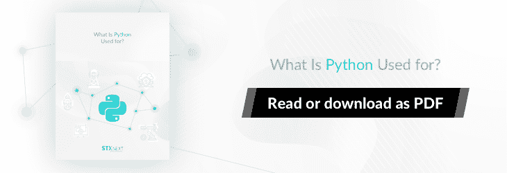
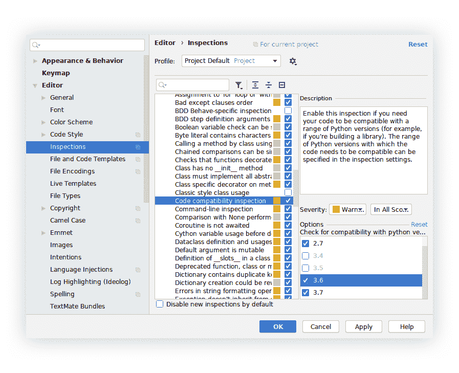

# Python 2.7 到 3。x 迁移指南:如何从 Python 2 移植到 Python 3

> 原文：<https://www.stxnext.com/blog/python-3-migration-guide/>

 Python 2 于 2020 年 1 月 1 日失去支持。升级到 [Python](/services/python-development/) 3 的时候到了。

但是，有没有一种方法可以在不中断应用程序开发和操作的情况下做到这一点呢？

本指南将向您展示如何快速、轻松、经济地升级到 Python 3。

我们假设您已经有了最新的 Python 2.7，并且目标是 Python 3.6 或更新版本。

低于 Python 3.5 的任何版本都是不明智的，因为它已经是仍受支持的最老版本，其生命周期将于 2020 年 9 月 13 日结束。

在我们开始我们的迁移指南之前，最后一件事:  **如果您想知道为什么您应该迁移到 Python 3， [这篇文章就在这里](/stx-new-blog/why-migrate-from-python-2-to-python-3/)** 肯定能回答您可能有的所有问题。它是下面指南中“如何做”的“为什么” 

#### Python 3 兼容性的第一步

##### 1.每一个新的代码都必须与 Python 3 兼容

即使您刚刚开始考虑迁移到 Python 3，有一个策略您应该马上引入到您的代码开发中:  **提交到您的存储库中的每个新代码都需要是 Python 3，至少在理论上是这样。** 这里说的是“尽力而为”式的交易。

如果您的产品正在开发中，仅仅遵循这个原则将会使实际的迁移更加顺利。也超级便宜。

没有必要修改你的  [持续集成管道](https://dzone.com/articles/learn-how-to-setup-a-cicd-pipeline-from-scratch)，尽管它会很好。仅仅因为你目前没有能力对管道实施改变而推迟规则的引入是没有意义的。

您可能正忙于引入新功能。通过使您的所有新代码都与 Python 3 兼容，您已经在进行迁移，而不需要专门为此花费开发时间。

这真的是一个完美的起点。

##### 2.质量保证工具是您的朋友

每当您对应用程序引入深远的变化时，良好的测试覆盖、linters 和在您的持续集成系统下运行的其他工具都是救命稻草。

如果你没有使用这些，我们强烈建议你考虑一下。

这里有几个质量保证工具，在移植到 Python 3 时非常有用:

##### **a)棉绒**

棉绒是最容易引入的，但这并不意味着它们没有什么价值。它们将为您的迁移工作提供一个受欢迎的推动力。

##### **b)测试**

测试是非常必要的，不幸的是需要一定的时间投入，尤其是在开始的时候，但是非常值得。对于一个相当大的应用程序，即使是最基本的  [快乐路径测试](https://www.h2kinfosys.com/blog/happy-path-testing/) 也会为您节省无数的时间，否则您将会花费在费力的手工测试和对抗回归上。

##### **c)持续集成**

[持续集成以自动化的方式将你所有的软件开发工作集中在一起](https://stxnext.com/services/devops/)。再说一次，这是一个节省时间的措施，尤其是当不止一个人在你的产品上工作的时候。

##### **d)错误跟踪**

错误跟踪是另一个工具，如果在生产前测试中出现问题，它会非常有用。

举个例子，  [哨兵](https://sentry.io/welcome/) 在出现故障的情况下为你提供全面的错误报告。这包括  [堆栈跟踪](https://www.techopedia.com/definition/22307/stack-trace)，它允许您在几分钟内  **修复常见的与过渡相关的错误。**

迁移到 Python 3 并不严格要求这些质量保证工具。然而，如果没有它们，就很难保证你的软件平稳运行。引入 QA 工具也将改善你的标准开发工作流程。

总而言之，你越快实现这些工具，对你越好。

[](https://cta-redirect.hubspot.com/cta/redirect/4542168/70673cfa-2089-46d5-a7af-25b9b668f19e) 

##### 3.安全兼容性修复

为了快速启动你的努力，使用自动代码转换。

为此，我们建议使用[【python】](https://python-modernize.readthedocs.io/en/latest/)，它构建在  [2to3](http://python3porting.com/2to3.html) 工具和流行的  [六个](https://pypi.org/project/six/) 包之上。

以下是你应该一步一步做的事情:

1.  **给你的应用程序添加一个新的“六”依赖关系。**
2.  **运行“pip 安装更新”**
3.  **在你的项目目录下运行“python-genesize-w”。**
4.  **回顾变化。它们应该是相当安全的，但有时明显低效——根据你认为合适的方式调整它们。**
5.  **在 Python 2 上测试你的 app。**

如果一切顺利，您应该已经对代码库应用了相对安全的兼容性修复。您可以在添加新代码时将它们作为参考点，直到您完全切换到 Python 3。

##### 4.更新依赖关系，第一部分:轻松取胜

您的应用程序已经开始完全兼容 Python 3，但是它的依赖性问题仍然存在。

项目积累不再维护的依赖关系并因此缺乏 Python 3 支持的情况并不少见。

在某些情况下，您需要做的只是将一个依赖项更新到一个  *更新的* 版本；在其他情况下，你必须确保更新是最新的版本，兼容 Python 2 和 3。那是因为  [某些包可能已经掉了 Python 2](https://python3statement.org/) 。

不管怎样，此时，最好集中精力  **轻松取胜。**

您的大多数软件包可能已经兼容，或者只需要更新到一个新版本。根据经验，为了安全起见，我们建议将  **更新到每个依赖项的最新版本。**

在较大的项目中，逐个检查每个依赖项可能很耗时。您可以通过在您的“requirements.txt”上运行“caniusepython3”来简化这个过程(如果您没有“pip freeze”>“requirements . txt”来创建一个)。

这个工具远非精确，但它足以实现我们这里的主要目标:  **评估在最终切换到 Python 3 之前还有多少工作要做。**

##### **兼容 Python 3 的分叉**

了解到一个包被它的原作者完全抛弃是很平常的事情。然而，浏览软件包的 GitHub 库问题跟踪器或 PyPI 索引仍然是一个好主意，因为其他人可能遇到了与您相同的问题，并且已经  **创建了一个与 Python 3 兼容的分叉。**

如果您不能确定一个工作的 Python 3 包替换，请推迟升级或在稍后阶段替换它。你有更重要的事要做。

##### **处理反向端口**

Python 3 中添加的一些特性已经被  [后移](https://www.webopedia.com/TERM/B/backport.html) 为单独的可安装包。常见的例子包括“子流程 32”和“功能工具 32”

这些反向端口往往与 Python 3 不兼容，即使您试图安装它们，也会失败。您可以使用  **环境标记** 来确保这种情况不会发生。

以下是如何在 Python 2 上有条件地安装“functools32”、“T0”、“T1”、“T2”、“T3”、“T4”、“T5”的方法:

###### **functools 32；python _ version<**

这个语法可以应用于“requirements.txt”和“setup.py”

当涉及到代码时，对这样的包使用“try-except”语法:

1 2 3 4

```
try:
   from functools import lru_cache
except ImportError:
   from functools32 import lru_cache
```

##### 5.Python 3 兼容性林挺

一旦您将我们建议的所有修正付诸实践，您和您的团队应该已经熟悉了编写在 Python 3 和 Python 2 上都能运行的代码。

也就是说，我们强烈建议您使用代码 linters 来支持您完成这项任务。

##### **PyCharm 代码检查**

[py charm 8 年前开始支持兼容性静态分析](https://blog.jetbrains.com/pycharm/2011/02/pycharm-1-2-eap-build-105-13-python-version-compatibility-inspection/)。如果您是使用 Python 2 代码库的 PyCharm 用户，请确保启用了该特性。

但是如果您没有使用 PyCharm，这个特性本身就是一个足够好的理由。



##### **pyint-py 3k**

众所周知，Pylint 非常冗长，有时过于热心，但它仍然是在小问题变成大问题之前找到它们的优秀工具。

安装“pylint”并运行“pylint - py3k application/*”以获得代码中可能存在的问题的报告。记得至少检查每一条独特的信息。

在这个过程中，您可能会对 Python 3 中引入的变化和新特性有所了解，这本身就很有价值。

##### **pylint 的 Python 2 到 3 迁移备忘单**

下面是最常见的 pylint 消息和修复的快速备忘单。

我们忽略了可以用“python-现代化”自动修复的常见错误

###### **1。长后缀(e 1606)；内置(w 1608)**

*使用长后缀；龙内置引用*

1 2 3

```
# Python 2
123L
long(123)
```

1 2 3 4 5 6 7 8 9 10 11

```
# Python 3
123

# or if you indeed need the long type when using Python 2

try:
   long
except NameError:
   long = int

long(123)
```

###### **2。异常-消息-属性(w 1645)**

*Python 3 中删除了异常消息*

1 2

```
# Python 2
exception.message
```

1 2

```
# Python 3
exception.args[0]
```

###### **3。使用-CMP-argument(w 1640)**

*使用 list.sort/sorted 的 cmp 参数*

1 2

```
# Python 2
sorted(iterable, cmp=cmp_func)
```

1 2

```
# Python 3
sorted(iterable, key=functools.cmp_to_key(cmp_func))
```

###### **4。CMP-built(w 1604)**

*Cmp 内置参考*

1 2

```
# Python 2
cmp
```

1 2 3 4

```
# Python 3
# use key function if possible, otherwise use
**def cmp**(x, y):
   **return** (y > x) - (y < x)
```

###### **5。**

*不含 __ 未来 _ _ 报表的分部*

1 2

```
# Python 2
1 / 3 == 0  # True
```

1 2 3 4 5

```
# Python 3
from __future__ import division

1 // 3 == 0  # True
1 / 3 == 0.3333333333333333  # True
```

###### **6。停止-迭代-返回(r 1708)**

*不要在生成器中引发 StopIteration 使用 return 语句代替*

1 2 3 4 5

```
# Python 2
def gen():
   yield 1
   raise StopIteration()
   yield 2
```

1 2 3 4 5

```
# Python 3
def gen():
   yield 1
   return
   yield 2
```

#### 运行 Python 3

##### 1.更新依赖关系，第二部分:完成工作

一段时间后，欢迎您再次寻找以前找不到的兼容 Python 3 的依赖项的替代品。

如果您仍然一无所获，那么明智的做法是考虑是否要继续使用一个不受支持和维护的包。如果从你的代码库中删除它会占用你太多的时间——叉开它，应用完全相同的过程。在大多数包的情况下，运行一次“python-现代化”就可以很好地解决这个问题。

一旦你完成了，要么在 PyPI 上发布你的 fork 让其他人受益，要么  [直接从库](https://pip.pypa.io/en/stable/reference/pip_install/#git) 中安装它并使用它。请务必注明作者，并记住包括原始许可证，因为这是大多数开源许可证所要求的。

[](https://cta-redirect.hubspot.com/cta/redirect/4542168/dfc7061b-1a6c-40c6-8752-871f5425acf3) 

##### 2.Python 3 迁移的最后步骤

在这个阶段，您非常接近 100%准备好 Python 3。但是，仍然有几个步骤可以帮助您避免生产部署期间的潜在问题。

##### **a)持续集成**

如果您还没有这样做，请在您的持续集成环境中，在 Python 3 下并行运行您的应用程序。即使测试开始失败，它也有助于衡量你的进步和防止退步。

如果没有成熟的持续集成，可以考虑使用[【tox】](https://tox.readthedocs.io/en/latest/)在多个版本的 Python 下进行本地测试。

##### **b)缓存和共享应用状态**

记得在部署之前刷新缓存。有了如此重大的变化，除了空白之外的应用程序状态将使调试变得非常麻烦。

对于使用 Python 2 下的“pickle”模块 pickle 的对象来说尤其如此；它们与 Python 3 不兼容，所以在部署之前一定要删除或重新创建它们。否则，您的应用程序可能会彻底失败，即使它在干净的测试环境中运行良好。

##### **c)手动回归测试**

无论您的测试有多全面，您总是会遗漏一些东西，比如配置或处理的数据的差异。为了确保不出现这种情况，在开始生产部署之前，必须对回归进行最后的手动检查。

除了最重要的快乐路径之外，请记住测试最常被忽略的内容，这些内容在生产设置过程中可能会成为一个真正的问题。您的应用程序需要在以下情况下正常工作:

1.  WSGI 生产服务器(相对于开发模式中的内置服务器)；
2.  在开发/测试设置中可能被嘲笑的电子邮件和其他外部通信方式；
3.  类似生产的数据以及空数据库。

##### 3.逐步部署还是信念的飞跃

根据许多因素，如可用的资源或您的服务级别协议，您应该考虑逐步部署。

如果您的服务在多个服务器实例之间是负载平衡的，那么只在其中一个实例上启动 Python 3 可能是个好主意，然后随着您对迁移的信心增加，开始增加 Python 3 的作用。

这是最安全的选择，但是它需要额外的工作，特别是因为一些工件，比如前面提到的缓存，必须在 Python 2 和 Python 3 实例中分开保存。

或者...您可以尝试一下，一次性部署整个系统！

无论哪种方式，都必然会出现一些小 bug，所以要做好快速响应的准备。一个错误聚合工具或完善的日志管理应该允许您在问题出现的第一时间解决它们。

#### 最后的想法

如果你想加快你的 Python 3 移植，找一个对 Python 2 和 3 代码库都有经验的人会很有帮助。

尽管这个过程的很大一部分是自动化的，但它仍然远非完美。更糟糕的是，如果没有很高的工作知识，诸如更新甚至交换某些依赖项这样的步骤是无法完成的。

出于这个原因，当涉及到较大的应用程序时，我们建议  [雇佣外部专家](https://stxnext.com/services/) 如果你目前没有合适的内部人员。

[](https://cta-redirect.hubspot.com/cta/redirect/4542168/9f52debf-f498-4faf-9ecf-dbe0f2f3e7ab)