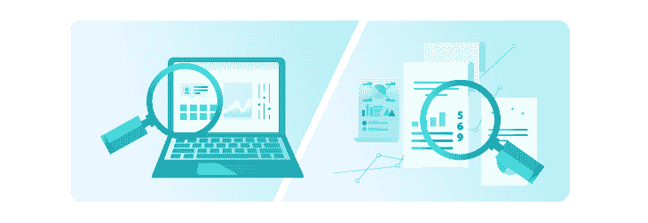
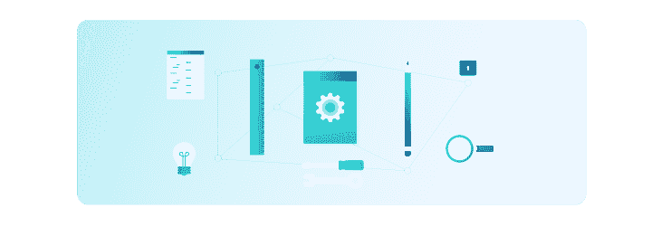
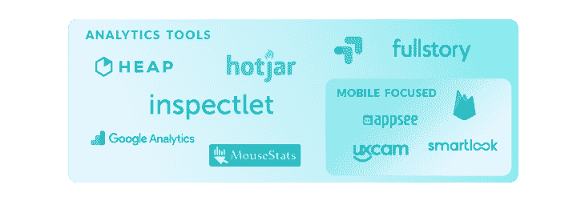

# 如何利用 UX 分析进行数据驱动的产品设计

> 原文：<https://www.stxnext.com/blog/how-leverage-ux-analytics-data-driven-product-design/>

 一个常见的误解是，你的数字产品的大部分工作是在发布日之前完成的。

没有什么比这更偏离事实了。事实上，这才是真正的工作开始的时候。

一旦你  [推出你的产品](https://stxnext.com/ebooks/what-is-python-used-for/)，你就开始得到大量的反馈，有正面的也有负面的。这是非常令人兴奋的，因为实际的人终于在使用你努力构建的这个东西，但这也意味着有大量的错误需要修复和更改需要实现。

那么你该如何着手呢？您如何选择要优先考虑的功能？或者决定跟踪什么指标以及如何跟踪？

别担心。我们会告诉你一切。

请继续阅读，了解 UX 分析的来龙去脉，以及如何将它们用于您的  [产品设计](https://stxnext.com/services/product-design/)。

我们将告诉您  什么是 UX 分析及其重要性， 如何最好地做您的研究， **您的过程应该是什么，和您可以使用的工具。**

最后，我们还会给你一个  **的例子，说明 UX 分析如何帮助我们完成自己的一个项目。** 

#### 什么是 UX 分析？为什么 UX 分析很重要？

UX 分析是产品开发中一个至关重要但经常被忽视的元素。

将 UX 分析视为一个持续的过程，即  **验证您当前的开发努力****帮助您在必要时做出转向** 的决定。

这些数据  **帮助您专注于您的业务目标** 来驱动分析度量计划，而不是跟踪表面的指标。

话虽如此，在产品开发的整个过程中，确定设计的核心目标也很重要。这是在设计的整个生命周期中有意义地衡量设计的唯一方法。

#### 定性和定量研究

有两种主要的研究方法:定性和定量。

让我们花点时间来讨论一下它们。

##### 1.什么是质的研究？

定性数据提供了对给定产品设计可用性的直接评估。

设计师观察参与者与特定 UI 元素的斗争，并推断设计的哪些方面有问题，哪些工作良好。

会议记录是定性研究的一个例子。

##### 2.什么是定量研究？

定量数据提供了对给定设计系统可用性的间接评估——换句话说，我们在谈论数字。

这些数字可以是:

1.  基于用户对给定任务的表现(例如，任务完成时间、成功率、错误数量)；
2.  反映参与者对设计可用性的看法(例如满意度)。

定量研究的一个很好的例子是  [谷歌分析](/stx-new-blog)。

##### 3.定性研究和定量研究哪个更好？

这个问题似乎很直观，但事实上是不正确的。

答案是:两者都不好。因为这不是重点。

**你应该做的是结合定性和定量数据** 以便充分理解你所观察的趋势和行为模式背后的原因和动机。

这种定性和定量方法的结合使您能够以整体和一致的方式评估您的 UX 设计和整个应用的性能。

##### 4.如何将定性研究和定量研究结合起来？

定性和定量研究可以一起使用，以进一步推动产品开发的方向。

将它们结合起来的一个好方法是使用这两组战略问题:

1.  **发生了什么？→为什么会发生？**
2.  **这不寻常吗？→是否发生在更多用户身上？**

请注意，每个集合都假设了两种研究之间的不同关系。

**发生了什么？→为什么会发生？**

这种类型的研究代表了从定量研究向定性研究的转变。

定性研究可以帮助你发现变量，在你通过统计分析发现变量之后，解释某些事情为什么会发生。

**这不寻常吗？→是否发生在更多用户身上？**

相反，第二类研究是从定性研究转向定量研究的一个例子。

这样做可以让你发现个人趋势和/或偏好，然后使用更大的样本来支持这些主张。

#### 利用 UX 分析

##### 1.通常是怎么做的

使用 UX 分析最常见的场景是什么？按原样安装谷歌分析跟踪代码。

然而，这样做有几个问题:

1.  **它只给你量化的数据，**告诉你“是什么”而没有“为什么”；
2.  **谷歌分析需要正确设置** 才能给出有价值的见解(事件、片段等)。);
3.  **管理 it 通常需要一个全职的分析师职位** 来理解所有的数据；
4.  **这就像大海捞针**——追踪错误的度量将是徒劳的，最终证明毫无意义。

##### 2.应该如何做

幸运的是，有一种更好的方法可以做到这一点。

这里的经验法则应该是:首先定义你的目标，然后决定衡量标准。

如果你没有明确定义目标，就不可能确定跟踪性能或用户体验的最佳方法。

以下是您可以采取的更具体的步骤:

##### **a)定义关键绩效指标**

通过设定分析目标来制定策略。

##### **b)选择工具箱**

为特定环境选择合适的工具集—桌面用户与移动用户、新用户与现有用户等。

##### c)创建场景

根据现有的用户流绘制测量结果的场景。

##### **d)发展团队合作**

为开发团队创建一份实施简报，然后检查可行性。

##### **e)处理数据**

得出结论，并制定新的测试假设，以供进一步探索。

#### UX 分析工具概述

各种分析工具的最新知识确保团队的时间和资源得到最佳利用。

| **有用的功能** | **工具** |
| **问** **定量** |  |
| **热图**通过可视化地表现用户的点击、轻击和滚动行为，理解用户想要什么、关心什么、在你的网站上做什么。 | [FullStory](https://www.fullstory.com/) ， [Hotjar](https://www.hotjar.com/) ， [Inspectlet](https://www.inspectlet.com) ， [Mousestats](https://www.mousestats.com) ， [UXCam](https://uxcam.com/) ， [AppSee](https://www.appsee.com/features) ， [Smartlook](https://www.smartlook.com/?utm_source=uxtools.co&utm_medium=website&utm_campaign=uxtools.co) |
| **转换** **r** **吃了** **f** **松绑**通过识别大多数访问者在哪个页面和哪个步骤离开你的站点，找到最大的改进和测试机会。 | [Googl](https://analytics.google.com/analytics/web/)[e](https://analytics.google.com/analytics/web/)[Analytics](https://analytics.google.com/analytics/web/)， [Hotjar](https://www.hotjar.com/) ， [Heap](https://heapanalytics.com/) ， [AppSee](https://www.appsee.com/features) ， [Smartlook](https://www.smartlook.com/?utm_source=uxtools.co&utm_medium=website&utm_campaign=uxtools.co) |
| **形式**T2 一**分析**通过发现访问者放弃表单的时间和原因，提高在线表单完成率。 | [【hot jar】](https://www.hotjar.com/)、[【检验】](https://www.inspectlet.com)、[苔藓](https://www.mousestats.com) |
| **反馈** **p** **工具**通过针对基于时间或事件的问题，了解您的 web 和移动访问者想要什么，以及是什么阻止他们实现这些目标。 | [热罐](https://www.hotjar.com/) |
| **调查**使用在任何设备上都能工作的响应性调查，在客户转换时从他们那里收集更深入的见解，或者在访问者离开之前从他们那里收集见解。 | [热罐](https://www.hotjar.com/) |
| **甲/乙** **甲** **乙**它可以让你比较两个版本的网页的性能，给一半的访问者看一个版本的网站，给另一半的访问者看另一个版本的网站。 | [谷歌优化](https://optimize.google.com/optimize/home/#/accounts)、 [Inspectlet](https://www.inspectlet.com) 、 [Firebase](https://firebase.google.com/) |
| **用户** **f** **低** **/** **B** **行为** **r** **报告**这个特性让你对用户如何在你的应用中导航有一个大致的了解。有了这个工具，你可以很快了解大多数用户在不同屏幕之间的移动方向。 | [Googl](https://analytics.google.com/analytics/web/)[e](https://analytics.google.com/analytics/web/)[Analytics](https://analytics.google.com/analytics/web/)， [AppSee](https://www.appsee.com/features) ， [Smartlook](https://www.smartlook.com/?utm_source=uxtools.co&utm_medium=website&utm_campaign=uxtools.co) |
| **基本** **n** **数值** **d** **数据**流量分析、用户细分和页面浏览量分析都是你的受众数字数据的基本来源。 | [Googl](https://analytics.google.com/analytics/web/)[e](https://analytics.google.com/analytics/web/)[Analytics](https://analytics.google.com/analytics/web/)， [Heap](https://heapanalytics.com/) ， [UXCam](https://uxcam.com/) ， [AppSee](https://www.appsee.com/features) ， [Firebase](https://firebase.google.com/) |
| **问** **资格** |  |
| **用户** **r** **记录**通过观察真实访问者点击、轻击、移动光标和浏览页面的记录来识别可用性问题。 | [FullStory](https://www.fullstory.com/) ， [Hotjar](https://www.hotjar.com/) ， [Inspectlet](https://www.inspectlet.com) ， [Mousestats](https://www.mousestats.com) ， [UXCam](https://uxcam.com/) ， [AppSee](https://www.appsee.com/features) ， [Smartlook](https://www.smartlook.com/?utm_source=uxtools.co&utm_medium=website&utm_campaign=uxtools.co) |
| **开启** **-e** **关闭** **f** **反馈**让你的访客在你的网站或应用上留下即时的书面反馈。了解人们的爱憎，发现问题，寻找发展机会。 | [Hotjar](https://www.hotjar.com/) ， [Mousestats](https://www.mousestats.com) |

#### 研究实施:项目实例

|  | 推出新功能 | 解决反馈问题 |
| 方法 | 定量研究→定性研究发生了什么事？→为什么会发生？ | 定性研究→定量研究这很不寻常？→是否发生在更多用户身上？ |
| 工具 | 谷歌分析→完整故事 | Mousestats → AppSee |
| 初级触发器 | 一项统计分析(转换漏斗)向我们表明，在最初决定使用 Apple Pay 支付方式后，用户正在放弃这一支付方式。 | 该应用程序中的开放式反馈意见表明，如何继续设计主要用户流并不完全清楚。 |
| 更深入的分析 | 这个特定屏幕的视频记录显示了一个被窃听的扩展面板，它应该包含支付选项描述的摘要。 | 用户流分析显示，上个月 84%的活跃用户不断在一个动作的两个步骤之间来回移动；他们被困住了。 |
| 发现的问题 | 用户无法获得关于这种支付方式的重要信息，因此决定使用更熟悉的方式。 | 用户被主要按钮的颜色弄糊涂了。尽管它们与该品牌的企业标识一致，但基于色彩心理学，它们是在表示危险或警告(红色)。 |
| 结果 | 去除一个简单的 bug，在接下来的一个月里，这种方法的适应性增加了 900%。 | 改变颜色并稍微调整按钮内的标签可以减少 54%的来回移动。 |

##### **正确的分析测量计划可以支持哪些其他问题或机会领域？**

UX 分析的潜力不止于此。这里还有几个问题，您可以通过实现上面的一些工具和方法来回答:

1.  **如何设置成功？**
    *为最近新推出的产品*
2.  如何将大的挑战领域分解成可操作的小任务？
    *为成熟产品演进和路线图规划*
3.  **如何知道先做什么？**
    *为数据驱动的设计和开发努力*

如果你想让我们更深入地了解这些，请在评论中告诉我们！

#### 最后的想法

为了对 UX 分析进行有意义的衡量，你不应该关注那些容易跟踪的目标，而应该关注那些:

*   高层，
*   面向 UX，
*   以商业为中心。

如果您在选择指标和报告数据时没有考虑到这些更深层次的目标，您就有可能忽略对有效的产品设计至关重要的统计数据。

* * *

感谢您阅读我们的文章。如果您发现这很有帮助，您还应该:

*   阅读[软件产品设计:好的 UX 的投资回报率是多少？](/stx-new-blog/software-product-design-roi-good-ux/)
*   阅读[申请表设计:最佳实践和关键要素](/stx-new-blog/application-form-design-best-practices-and-key-elements/)
*   看看我们的  [行为简介](https://www.behance.net/STXNextTeam)

如果您正在为您的产品寻找优秀的设计和分析，  [为什么不聘请我们的产品设计团队来完成这项任务](https://stxnext.com/services/product-design)？

