# 如何构建一个不会让你尴尬的好 API

> 原文：<https://www.stxnext.com/blog/how-to-build-a-good-api-that-wont-embarrass-you>

 如今，每个人和他们的小狗都想要一个 API。API 在大约 20 年前开始流行。Roy Fielding 在 2000 年的博士论文中引入了术语 REST。同年，亚马逊、Salesforce 和易贝向全世界的开发者介绍了他们的 API，永远改变了我们构建软件的方式。

在 REST 之前，Roy Fielding 博士论文中的原则被称为“HTTP 对象模型”，您将很快看到它为什么如此重要。

当你继续阅读时，你还会看到如何确定你的 API 是否成熟，一个好的 API 的主要品质是什么，以及为什么你在构建 API 时应该关注适应性。 

#### RESTful 架构的基础

REST 代表具象状态转移，它一直是服务 API 的圣杯，最早是由 Roy Fielding 在他的论文中定义的。这不是构建 API 的唯一方法，但由于它的流行，它是一种甚至非开发人员都知道的标准。

RESTful 软件有六个关键特征:

1.  客户机-服务器体系结构
2.  无国籍
3.  可缓存性
4.  分层系统
5.  按需编码(可选)
6.  统一界面

但这对于日常使用来说太理论化了。我们想要更具可操作性的东西，那就是 API 成熟度模型。

#### 理查森成熟度模型

该模型由 Leonard Richardson 开发，将 RESTful 开发的原则结合成四个易于遵循的步骤。

你在模型中的位置越高，就越接近 Roy Fielding 定义的 RESTful 的最初概念。

##### 0 级:痘之沼泽

0 级 API 是一组普通的 XML 或 JSON 描述。在引言中，我提到在 Fielding 的论文发表之前，RESTful 原则被称为“HTTP 对象模型”。

这是因为 HTTP 协议是 RESTful 开发中最重要的部分。REST 围绕着尽可能多地使用 HTTP 固有属性的想法。

在 0 级，你不会用到任何东西。您只需构建自己的协议，并将其用作专有层。这种架构被称为远程过程调用(RPC ),它适用于远程过程/命令。

您通常可以调用一个端点来接收大量 XML 数据。这方面的一个例子是 SOAP 协议:

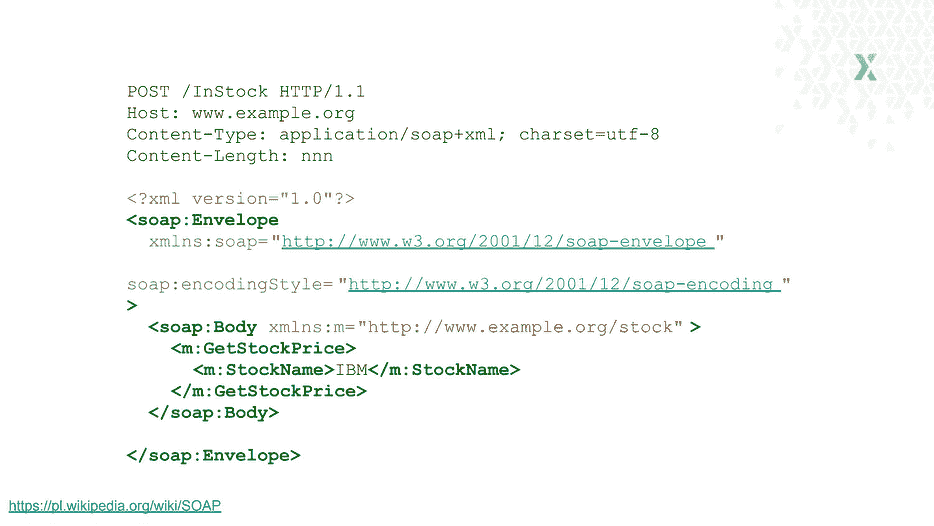

另一个很好的例子是 Slack API。它更加多样化，有几个端点，但仍然是 RPC 风格的 API。它公开了 Slack 的各种功能，中间没有添加任何特性。下面的代码允许您将消息发布到特定的频道。

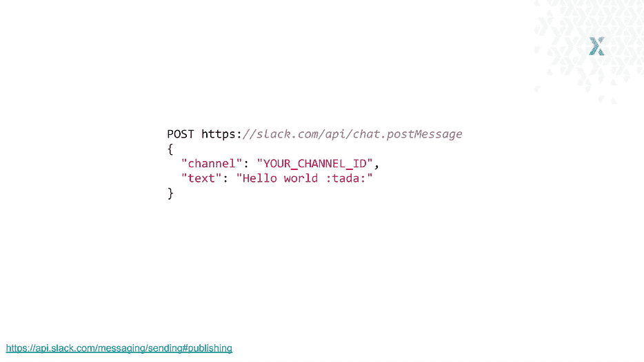

即使按照 Richardson 的模型是 0 级 API，也不代表它不好。只要它是可用的，并且恰当地服务于业务需求，它就是一个伟大的 API。

##### 级别 1:资源

要构建 1 级 API，您需要在系统中找到名词，并通过不同的 URL 公开它们，如下例所示。

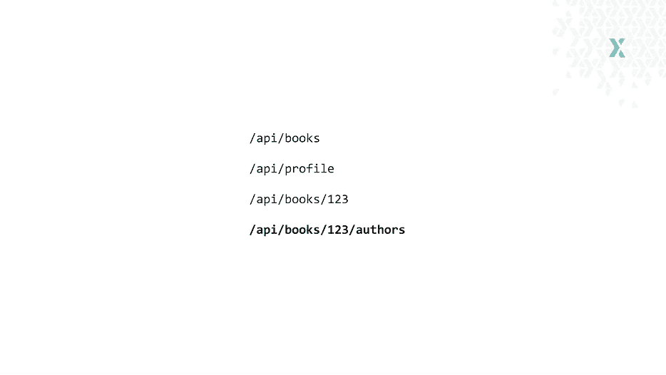

/api/books 将带我到通用图书目录。/api/profile 将带我到那些书的作者的个人资料—如果只有一本的话。为了获得资源的第一个特定实例，我向 URL 添加了一个 ID(或另一个引用)。

我还可以在 URL 中嵌套资源，并显示它们是按层次结构组织的。

回到 Slack 的例子，下面是它作为 1 级 API 的样子:

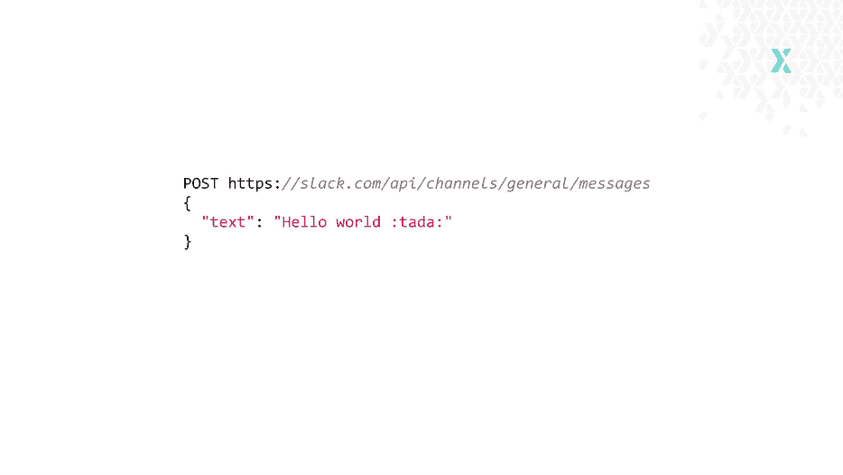

URL 已更改；取代了 */api/chat.postMessage* ，现在我们有了*/API/channels/general/messages。*

信息的“渠道”部分已经从正文移到了 URL。字面意思是说，使用这个 API，您可以期望一条消息被发布到*通用*通道。

##### 第二层:HTTP 动词

二级 API 利用 HTTP 动词来增加更多的含义和意图。这些动词有很多，我只使用一个基本子集:PUT / DELETE / GET / POST。

对于这些动词，我们期望包含它们的 URL 有不同的行为:

*   发布—创建新数据
*   上传—更新现有数据
*   删除—删除数据
*   GET—查找特定 id 的数据输出，获取资源(或整个集合)

或者，使用前面的/api/books 示例:

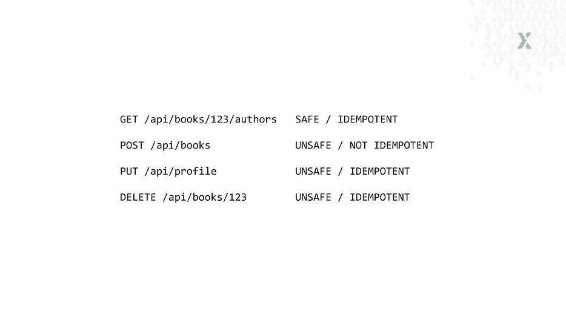

**“安全”和“幂等”是什么意思？**

“安全”的方法是永远不会改变数据的方法。REST 建议 GET 应该只获取数据，所以它是上面集合中唯一安全的方法。无论您调用多少次基于 REST 的 GET 方法，它都不会改变数据库中的任何内容。但它不是动词固有的——而是你如何实现它，所以你需要确保这是可行的。其他所有方法都会以不同的方式改变数据，不能随意使用。在 REST 中，GET 既安全又幂等。

“等幂”方法是一种多次使用不会产生不同结果的方法。根据 REST，delete 应该是幂等的——如果您删除一次资源，然后第二次调用相同资源的 DELETE，它应该不会改变任何东西。资源应该已经没有了。POST 是 REST 规范中唯一的非幂等方法，因此您可以多次发布同一个资源，并且会得到副本。

让我们重新看看 Slack 的例子，看看如果我们在其中使用 HTTP 动词来做更多的操作会是什么样子。

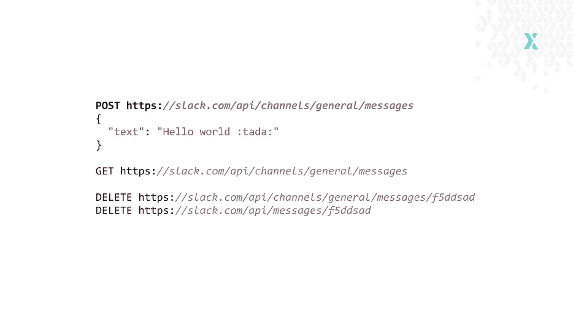

我们可以使用 POST 向通用频道发送消息。我们可以用 GET 从通用通道获取消息。我们可以用 delete 删除具有特定 ID 的消息——这很有趣，因为消息并不绑定到特定的通道，所以我可能想设计一个单独的 API 来删除消息。这个例子表明设计一个 API 并不总是容易的；有很多选择和权衡要做。

##### 第三级:HATEOAS

还记得只有文字，没有任何图形的电脑游戏吗？你只是有很多文字描述你在哪里，你下一步可以做什么。要前进，你必须键入你的选择。这就是 HATEOAS。

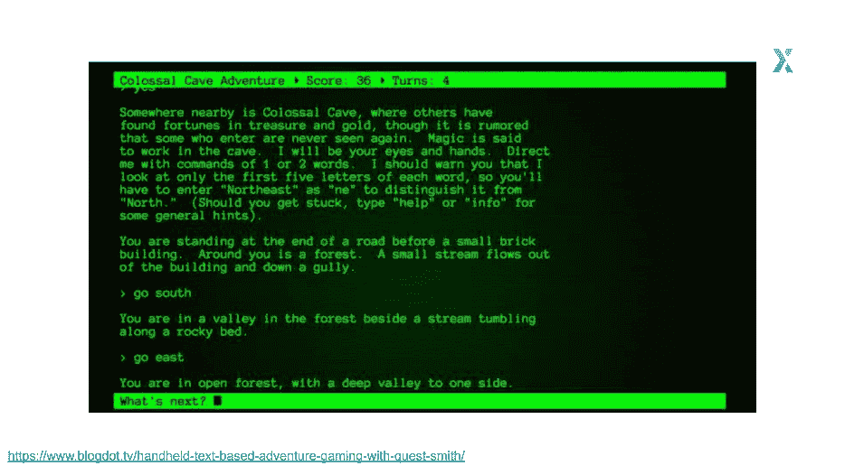

**HATEOAS 代表“作为应用状态引擎的超媒体”**

当你有了 HATEOAS，无论何时有人使用你的 API，他们都可以看到他们可以用它做的其他事情。HATEOAS 回答了这个问题，“我能从这里去哪里？”

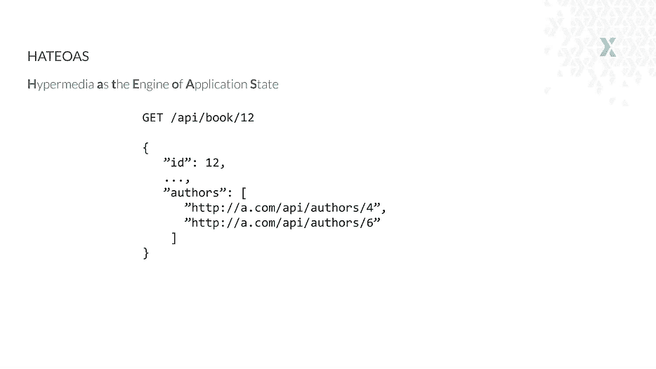

但这还不是全部。HATEOAS 也可以建模数据关系。我们可以有一个资源，我们没有嵌套在 URL 中的作者——但是我们可以发布链接，所以如果有人对作者感兴趣，他们可以去那里探索。

这不像成熟度模型的其他级别那样受欢迎，但是一些开发人员使用它。一个例子是吉拉。下面是他们搜索 API 的一个片段:

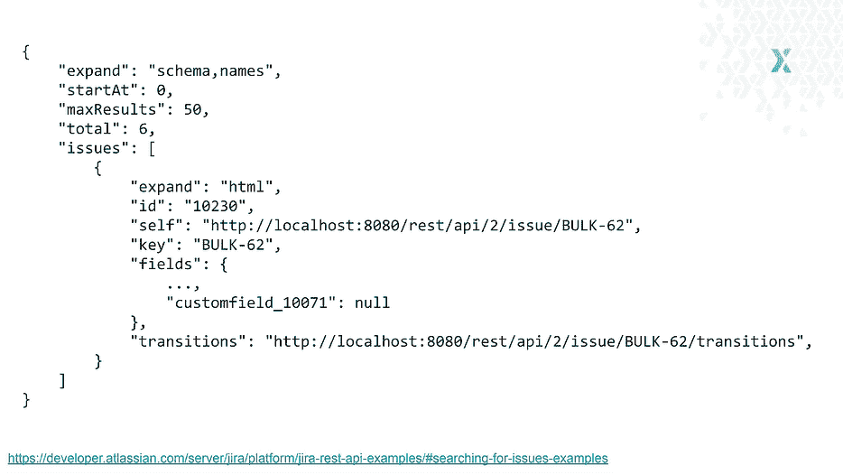

它们嵌套了您可以探索的其他资源的链接，以及本期的过渡列表。他们的 API 相当有趣，因为顶部有*“expand”*参数。它允许你选择不需要链接的字段，而更喜欢完整的内容。

使用 HATEOAS 的另一个例子是 Artsy。他们的 API 严重依赖 HATEOAS。他们还使用 JSON Plus call 规范，这种规范强加了一种特殊的构造链接的惯例。下面是分页的例子，这是使用 HATEOAS 最酷的例子之一。

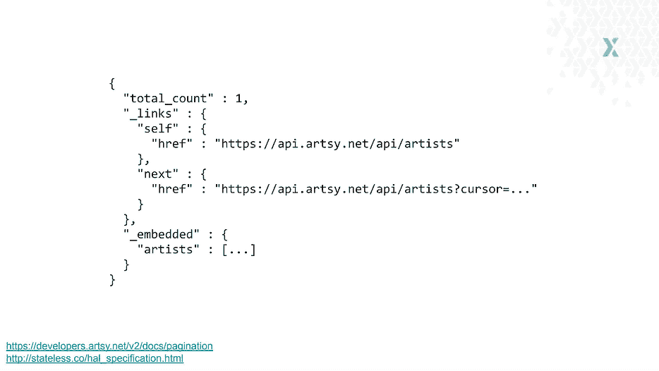

您可以提供下一页、上一页、第一页、最后一页以及您认为必要的其他页面的链接。这简化了 API 的使用，因为您不需要向客户端添加 URL 解析逻辑，也不需要添加页码。您只需让客户端准备好使用已经结构化的链接。

#### 什么是好的 API

Richardson 的模型到此为止，但这并不是一个好的 API 的全部。其他重要的品质是什么？

##### 错误/异常处理

我希望从我使用的 API 中得到的一个基本东西是，需要有一个明显的方法来判断是否有错误或异常。我需要知道我的请求是否被处理。

瞧，HTTP 也有一个简单的方法:HTTP 状态代码。

管理状态代码的基本规则是:

*   2xx 可以
*   3xx 意味着你的公主在另一座城堡里——你要寻找的资源在另一个地方
*   4xx 表示客户做错了什么
*   5xx 表示服务器出现故障

至少，您的 API 应该提供 4xx 和 5xx 状态代码。 5xx 有时会自动生成。例如，客户端向服务器发送了一些东西，这是一个无效的请求，验证有缺陷，问题出现在代码中，我们有一个异常—它将返回一个 5xx 状态代码。

如果您想承诺使用特定的状态代码，您会发现自己在想，“哪种代码最适合这种情况？”这个问题并不总是容易回答的。

我建议你去指定这些状态代码的 RFC，他们给出了比其他来源更广泛的解释，并告诉你什么时候这些代码是合适的等等。幸运的是，网上有一些资源可以帮助你选择，比如 Mozilla 的这个 [HTTP 状态代码指南。](https://developer.mozilla.org/en-US/docs/Web/HTTP/Status)

##### 证明文件

优秀的 API 有优秀的文档。随着 API 的增长，文档的最大问题通常是找人来更新它。一个很好的选择是不脱离代码的自我更新文档。

例如，注释与代码没有联系。当代码改变时，注释保持不变并变得过时。他们可能比没有评论更糟糕，因为过一会儿他们会提供错误的信息。注释不会自动更新，所以开发人员需要记住在代码旁边维护它们。

自我更新文档工具解决了这个问题。一个流行的工具是 [Swagger](https://swagger.io/docs/specification/about/) ，这是一个围绕 OpenAPI 规范构建的工具，它使得描述你的 API 变得容易。

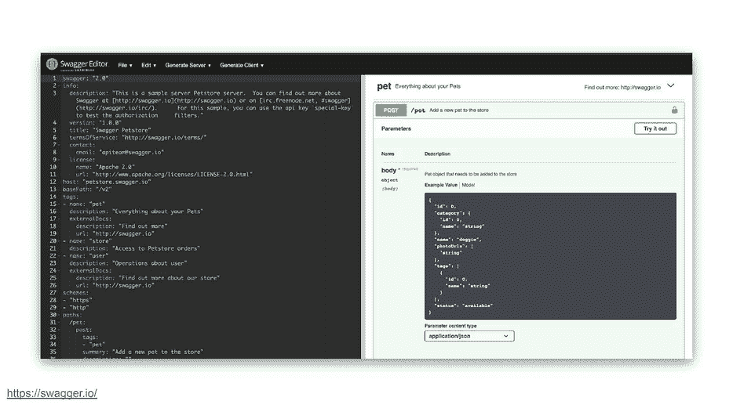

Swagger 很酷的一点是它是可执行的，所以您可以使用这个 API，并立即看到它做了什么以及它是如何变化的。

要在 Swagger 中加入自我更新，需要使用其他插件和工具。在 Python 中，大多数主流框架都有插件。它们生成 API 请求应该如何构造的描述，并定义什么数据进来，什么数据出去。

如果你不想招摇过市，更喜欢简单的东西呢？一个流行的选择是[Slate](https://slatedocs.github.io/slate/#introduction)——一个静态 API，你可以在你的 URL 上构建和公开。

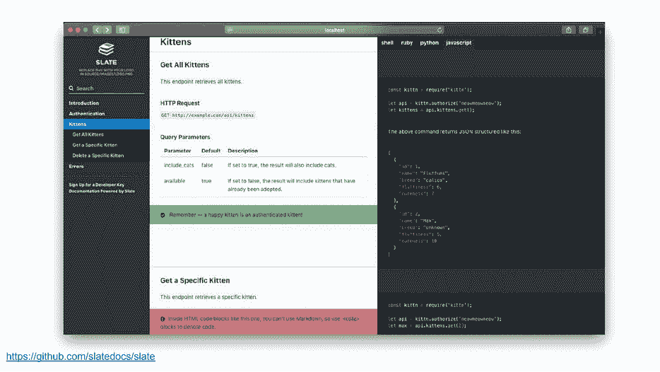

介于两者之间的东西也值得推荐，那就是 [widdershins](https://github.com/Mermade/widdershins) 和 [api2html](https://api2html.com/docs/overview/) 的组合。它将允许您根据 Swagger 的定义生成类似 Slate 的文档。

##### 可缓存性

在某些系统中，可缓存性可能不是什么大问题。您可能没有太多可以缓存的数据，一切都在不断变化，或者您没有太大的流量。

但是在大多数情况下，可缓存性对于良好的性能至关重要。它与 RESTful APIs 相关，因为 HTTP 协议与缓存有很大关系，例如 HTTP 头允许您控制缓存行为。

您可能希望在客户端缓存东西，或者如果您有注册表或值存储来保存数据，则在应用程序中缓存东西。但是 HTTP 允许你免费获得一个好的缓存，所以如果可能的话——不要放弃免费的午餐。

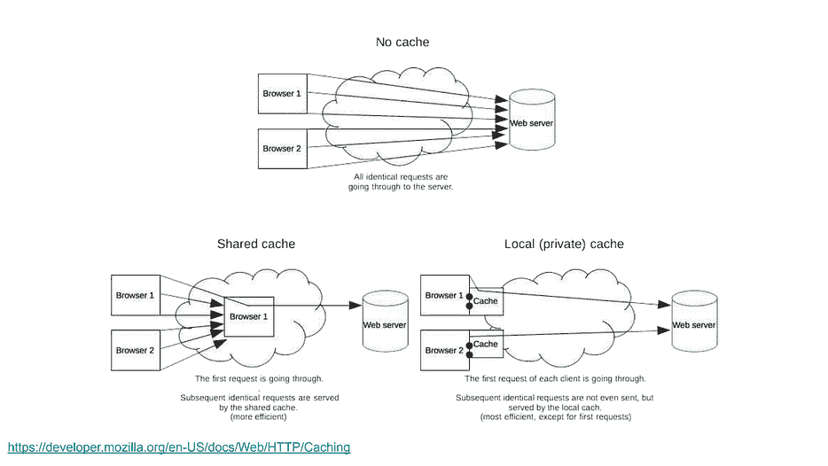

此外，由于缓存是 HTTP 规范的一部分，许多参与 HTTP 的东西都知道如何缓存:浏览器，它本身支持缓存，以及您和客户端之间的其他中间服务器。

#### 进化 API 设计

构建 API 和现代软件最重要的部分是适应性。没有适应性，开发时间会变慢，在合理的时间内发布特性会变得更加困难，尤其是当你面临最后期限的时候。

“软件架构”在不同的上下文中有不同的含义，但是现在让我们采用这个定义:

软件架构:回避阻止未来变化的决策的行为/艺术。

记住这一点，当你设计你的软件，并且必须在具有相似优势的选项中做出选择时，你应该总是选择更经得起未来考验的选项。

良好的实践并不代表一切。用正确的方式建造错误的东西不是你想做的。最好采取一种成长的心态，接受改变是不可避免的这一事实，尤其是如果你的项目要继续成长的话。

为了使您的 API 更具适应性，要做的一件关键事情是保持您的 API 层较薄。真正的复杂性应该降低。

#### API 不应该决定实现

一旦你发布了一个公共 API，它就完成了，它是不可改变的，你不能碰它。但是，如果你除了致力于一个设计古怪的 API 之外别无选择，你又能做什么呢？

您应该始终寻找简化实现的方法。有时，与构建另一个 API 并将其命名为 v2 相比，使用特殊的 HTTP 头来控制 API 响应格式是一个更精简的解决方案。

API 只是另一层抽象。他们不应该规定实施。为了避免这个问题，您可以应用几种开发模式。

##### API 网关

这是一种门面式的开发模式。如果你将一个整体拆分成一堆微服务，并希望向外界公开一些功能，你只需构建一个 API 网关，其作用就像一个门面。

它将为不同的微服务(可能有不同的 API，使用不同的错误格式等)提供统一的接口。

##### 后端对前端

如果您必须构建一个 API 来满足一堆不同的客户，这可能会很困难。一个客户的决策会影响其他客户的功能。

后端对前端说——如果你有喜欢不同 API 的不同客户端，比如喜欢 GraphQL 的移动应用，就为他们构建它。

只有当你的 API 是一个抽象层，并且很薄的时候，这才有效。如果它耦合到您的数据库，或者它太大，有太多的逻辑，您将无法做到这一点。

#### GraphQL 与。restful 风格

GraphQL 有很多宣传。这是一个新手，但它已经聚集了很多粉丝。以至于一些开发者声称它将取代 REST。

尽管与 RESTful 规范相比，GraphQL 要新得多，但它们有很多相似之处。GraphQL 最大的缺点是可缓存性——它必须在客户端或应用程序中实现。有内置缓存功能的客户端库(如 [Apollo](https://www.apollographql.com/docs/react/caching/cache-configuration/) )，但这仍然比使用 HTTP 提供的几乎免费的缓存能力要难。

从技术上讲，GraphQL 是 Richardson 模型的 0 级，但是它具有良好的 API 的品质。您可能无法使用一些 HTTP 功能，但是 GraphQL 是为解决特定问题而构建的。

GraphQL 的一个致命用途是聚合不同的 API，并将它们作为一个 GraphQL API 公开。

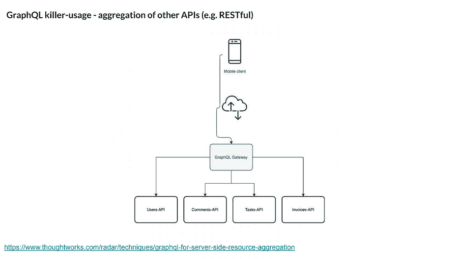

GraphQL 在欠蚀刻和过蚀刻方面创造了奇迹，这些是 REST APIs 难以管理的问题。这两者都与性能有关——如果您进行了内存不足处理，您就不能有效地使用 API 调用，所以您必须进行大量的 API 调用。当您过度提取时，您的呼叫会导致不必要的数据传输，这是对带宽的浪费。

REST 和 GraphQL 的比较是总结一个好的 API 最重要的品质的一个很好的开端。

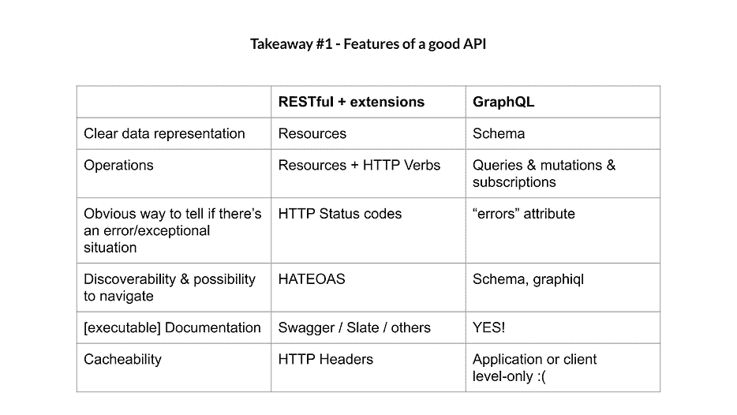

您需要数据的清晰表示——RESTful 以资源的形式为您提供了这种表示。

您需要一种方法来显示哪些操作是可用的——RESTful 通过将资源与 HTTP 动词相结合来做到这一点。

需要有一种方法来确认是否存在错误/异常——HTTP 状态代码可以做到这一点，可能会有解释它们的响应。

有可发现性和导航的可能性是很好的——在 RESTful 中，HATEOAS 负责这一点。

拥有优秀的文档很重要——在这种情况下，可执行的、自我更新的文档可以解决这个问题，这超越了 RESTful 规范。

最后但同样重要的是，优秀的 API 应该具有可缓存性，除非您的具体情况表明没有必要。

REST 和 GraphQL 最大的区别在于它们处理可缓存性的方式。当您以 REST 方式构建 API 时，您基本上可以免费获得 HTTP 缓存。如果您选择 GraphQL，您需要担心为您的客户端或应用程序添加缓存。

#### 进一步阅读

本文基于 Sebastian Buczyński 最近的演讲。查看他的博客[面包屑收集器](https://breadcrumbscollector.tech/)并获取他的电子书[实现清洁架构](https://cleanarchitecture.io/)。

更多关于 API 的阅读，请查看菲利普·斯特金的博客或他的巨著《T2 构建你不会讨厌的 API T4》。