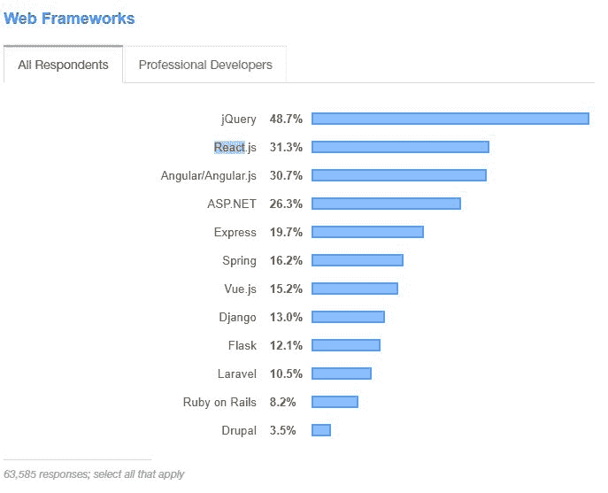
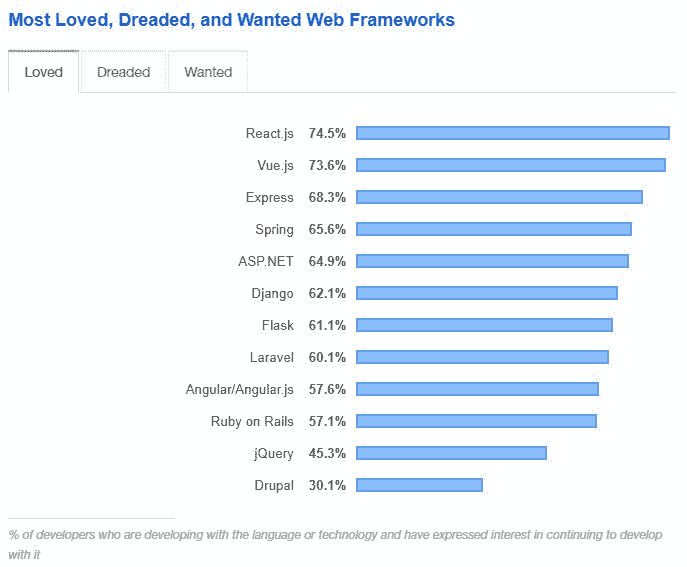

# React 与 Angular:JavaScript 库和 TypeScript 框架的比较

> 原文：<https://www.stxnext.com/blog/react-vs-angular-comparison/>

 无论是[Python](https://stxnext.com/services/python-development/)还是[JavaScript](https://stxnext.com/services/javascript-development/)开发，我们经常会比较  [编程语言或框架](https://stxnext.com/python-vs-other-programming-languages/) 看哪一种更好。

有时，有压倒性的证据表明，由于其特殊的好处，一种比另一种更受青睐。然而，在其他时候，选择并不那么明确。

反应与角度明显属于第二类。

首先，  **Angular 是一个完全成熟的框架，React 是一个库。**其次，这两种工具都可以用来按照相同的标准创造出功能强大且极具美感的产品。

当面临两个或更多工具的选择时，选择正确工具的关键不是看技术有多令人印象深刻或受欢迎，也不是看最大的技术公司在使用什么。相反，您应该考虑它将如何满足您自己项目的特定需求，以及您的开发人员是否拥有成功应用它的必要技能。

**在这篇文章中，我们不会着手挑选一个胜利者；我们的目标是介绍 React 和 Angular** 的主要优点和用途，以便您做出明智的决定，选择哪一款更适合您的项目。

 

#### 什么是反应？

做出反应。JS，通常被称为 React，是一个基于 JavaScript 和 JSX(一个 PHP 扩展)的开源库。它由脸书于 2013 年发布，旨在创建灵活、动态的用户界面，自那以后，它被社交媒体网络广泛使用。

React 是 JavaScript 最受欢迎和发展最快的库之一，已被其他科技巨头采用，包括 WordPress、雅虎和 Instagram。其最新版本 16.8.5 于 2019 年 3 月发布。

**React 最有用的两个特性是:**

*   **使用虚拟 DOM** (文档对象模型)，有利于创建快速响应的 ui，同时保持较高的 app 性能；
*   基于组件的架构，比其他架构更容易维护。

自从发布以来，React 已经影响了其他框架，包括 Angular，并从其他人那里获得了灵感，特别是在 JS 生态系统中。

#### React 的优势是什么？

为什么要使用 React？让我们快速了解一下它的一些主要优势。

##### 1.简单

React 非常易于学习和应用，因为它具有:

*   依赖 JavaScript，
*   易于与 HTML 混合，
*   基于组件的架构。

任何对 JavaScript 有基本了解的开发人员都能够在几天内  **熟悉 React 并开始创建高度响应的应用程序。**

##### 2.生产力

在 JavaScript 中，可重用代码被提取到一个函数或类中。在 React 中，它可以写成一个组件。通过集成可重用组件，并因此帮助限制对 DRY 规则的违反， **React 加速了开发并使其更高效。**

##### 3.快速渲染

React 的虚拟 DOM 有助于实现  **的高 app 性能和令人满意的用户体验** ，同时让你的开发者工作更快。

##### 4.社区支持

网上有丰富的 React 资源和教程，还有一个活跃的社区随时准备为您提供帮助。

#### React 用在哪里？

从第一天开始，React 就被用来创建市场上一些最受欢迎的应用程序的核心功能。随着顶级科技公司争相抢购 React 的好处，他们传播了对该图书馆的认识，并帮助它获得了动力。

在其技术堆栈中整合了 React 的一些应用包括:

*   脸书，
*   Instagram，
*   网飞，
*   WhatsApp，
*   推特，
*   优步，
*   Codecademy，
*   Dropbox，
*   雅虎！邮件，
*   Asana。

#### 什么是有角？

Angular 是一个基于类型脚本的开源前端框架，主要用于构建单页面应用程序(spa)。

它于 2010 年发布，由谷歌提供支持，并在大约 3000 个自己的项目中使用。

该框架的最新稳定版本是 Angular 8。

Angular 已被 Autodesk、Apple 和 Microsoft 等公司使用。该框架在 2018 年  [栈溢出调查](https://insights.stackoverflow.com/survey/2018/) 最受欢迎的框架、库、工具中排名第二。

#### 有棱角的优点是什么？

Angular 是 web 应用程序最流行的 JavaScript 框架之一。请继续阅读它的一些主要优点。

##### 1.清晰简洁的代码

Angular 的简单组件架构消除了对不必要代码的需求，使开发更加顺畅。

用 TypeScript 构建意味着框架  **帮助开发人员在开发过程的早期发现并消除错误。**

##### 2.一致性

**独立的逻辑和功能组件是 Angular 的构建模块。** 它们是可重用的、内聚的类似乐高积木的代码块，可用于快速扩展新的和现有的应用。

此外，每个组件的独立性使得开发人员很容易测试应用程序的错误。

##### 3.文档和社区支持

在 Angular 官方网站上，有大量的  [文档](https://angular.io/docs) ，开发者在熟悉框架或者编码时遇到问题时可以依赖。该网站也是一个了解最新消息或更新的好地方。

Angular 和 React 一样，也享有积极的社区支持，包括 Gitter、Stack Overflow、脸书和 Reddit 等平台上的讨论板。

##### 4.易于测试

Angular 将 Jasmine 与 Karma test runner 一起使用，并提供了一个测试库(TestBed ),允许开发人员轻松地对他们的组件进行单元测试。

此外，它还配有量角器，便于 e2e 测试。

#### Angular 用在哪里？

Angular 可读性强、易于维护的代码已经被许多公司采用，包括:

*   贝宝，
*   Gmail，
*   卫报，
*   双击，
*   向上工作，
*   HBO，
*   索尼，
*   通用汽车公司，
*   耐克。

 

#### Angular 和 React 有什么区别？

##### 1.库与框架

先来个最简单的区分吧:  **React 是库，Angular 是框架。**

但是这到底意味着什么，对你的团队有什么影响？

框架是一种软件环境，有助于为移动和网络平台开发复杂的应用程序。它是提供构建和部署应用程序的标准方法的基础，它可以组合库来增强其功能。

另一方面，库是预先编写的代码的集合，可以调用它来构建产品。

在实践中，这意味着 Angular 带有预装的库，而在 React 中，你可以在创建类似于你自己的框架时挑选它们。

##### 2.入口点

在 Angular 中，每一点代码都像一块乐高积木——被创建来实现其特定的目的并与其他人和谐地工作。该框架是一个自给自足的“包含电池”的系统，为开发人员提供他们需要的东西，并可以选择添加他们认为合适的额外功能。

然而，这意味着想要使用 Angular 的开发人员需要先熟悉整个框架，然后才能开始编码。

相反，在 React 中，这些构建模块是独立的实体，开发人员可以根据期望的结果进行混合和匹配。

React 可以描述为一个生态系统；它由一系列不同的元素组成，这些元素组合在一起形成了一个架构。因此，  **React 对于开发人员来说更容易上手** ，因为除了完成手头的任务之外，不需要他们学习任何东西。

##### 3.重点领域

在 Angular 中，团队围绕其他语言中的最佳概念和实践来构建项目(例如 MV、依赖注入、类型系统或关注点分离)。

在 React 中，团队专注于 web 的可视化方面，同时使用其他人开发的解决方案和功能，如状态管理或表单。

不管这些差异，请记住，使用任何一种工具都可以获得几乎相同的结果。

#### 我的软件项目应该选择 React 还是 Angular？

这个问题没有简单的答案，选择很大程度上取决于开发人员的规模、技能和偏好，以及项目的范围。

如果您的开发人员以前没有 React 或 Angular 的知识，他们可能会发现，由于 React 简单、基于组件的架构，开始使用它会更容易、更快。如果你的目标是在最短的时间内  [创造一个 MVP](/stx-new-blog/5x5-5-tips-building-successful-minimum-viable-product-5-weeks/) ，那就更是如此。

同样，如果您的开发人员熟悉 JavaScript，他们也会发现 React 更容易掌握。Angular 中使用的 TypeScript 一般被认为比 React 的 JSX 更难学。如果您需要快速开发和快速变更，React 也将是答案，因为它将允许您的团队在更短的时间内构建产品。

然而，那些开始使用 Angular 的人将受益于设计和架构模式的知识，以及对强类型的偏好。由于其良好定义和标准化的设计，您可能特别想考虑使用 Angular，如果您:

*   在大型、企业级公司工作；
*   旨在长期开发和维护产品；
*   从一开始就拥有投资发展的资源。

最终，你应该把 React 和 Angular 之间的选择看作是两条不同的路线，它们将带你到达本质上相同的目的地。 这两种工具自推出以来都有了巨大的发展，并相互影响，就目前情况来看，它们可以用来产生非常相似的结果。他们两个都不会去任何地方，即使面对来自不断出现的新框架的激烈竞争，React 和 Angular 都已经在世界各地的开发人员中建立了良好的声誉。

无论你决定使用哪一个，记住你  **将不能改变你的想法，除非你不得不重新开始编码。**

#### Angular 和 React 的流行:哪个工具更流行？

既然您已经了解了 React 和 Angular 的优缺点、它们之间的差异以及它们的使用场合，那么它们在开发人员中非常受欢迎并且采用率很高就不足为奇了。

几年前，Angular 是 JavaScript 框架中无可争议的领导者。但自从 React 在六年前发布以来，它的人气暴涨，最终超过了 Angular。

不过，不要相信我们的话。以下是支持这一结论的一些数字。

##### **npm 下载量**

Npm 是世界上最大的软件注册中心，它编译开源代码包并进行开发者偏好调查。全世界有超过 1100 万的 JavaScript 开发者在使用它，他们每月下载超过 300 亿个包。

据 nmp 称，React 不仅继续在网络领域占据主导地位，而且在下载量方面也遥遥领先 Angular。虽然 Angular 在过去两年中保持了稳定的下载率，React 却呈现出总体上升的趋势。

然而，应该指出的是，国家预防机制的数字经常受到 Angular 社区的批评，因为它没有反映该框架的实际受欢迎程度。

由于 Angular 经常被企业选择，它的大量下载是通过内部 npm 代理技术进行的；也就是说，他们没有出现在 npm 的官方统计中。

**Source: https://www.npmtrends.com/react-vs-@angular/core**

##### **GitHub《星星》**

另一种衡量工具受欢迎程度的方法是通过查看他们在领先的软件开发平台 GitHub 上积累的“星级”数量。它们表示有多少人“喜欢”一个平台。

然而，这个度量应该有所保留，因为它不一定与工具的持续流行和使用相对应。

在撰写本文时，React 有超过 132，000 颗“星星”，而 Angular 有 49，400 颗。

##### **堆栈溢出调查**

栈溢出调查是对全世界开发者最全面的调查。

在 2019 年参加调查的 63，500+人中，31.3%的人表示他们在工作中使用 React，而 30.7%的人表示他们使用 Angular。

**Source: https://insights.stackoverflow.com/survey/2019**

就个人对这些工具的看法而言，React 被评为最受欢迎和最受欢迎的框架，而 Angular 的表现要差得多。

**Source: https://insights.stackoverflow.com/survey/2019**

#### 反应与角度:最终想法

Angular 和 React 都在发展，并被科技领域的大公司所采用。一个是稳定的、定义良好的、标准化的框架，非常适合长期项目，而另一个是一个库，可以用来在几天内用可重用的组件组装原型。

在没有了解 React 和 Angular 的独特优势和劣势的情况下，就武断地判断哪一个“更好”是无益的，而且会产生误导。你决定选择哪一个最终取决于:

*   你项目的细节，
*   您的开发人员的当前技能组合，
*   你的预算。

我们希望这篇文章有助于澄清围绕这两种技术的一些困惑。我们也明白还有很多问题，一篇博客文章可能无法解决你所有的问题和疑虑。

或者也许你正在考虑另一种  [语言](https://stxnext.com/what-is-python-used-for/) 或  [框架](https://stxnext.com/services/javascript-development/) 并想知道它们是否适合你。

如果这些听起来很熟悉，  [为什么不和我们联系呢？](https://stxnext.com/contact-us/) 我们拥有 100 多名 JavaScript 开发人员，在帮助您为项目选择合适的技术方面拥有得天独厚的优势。

