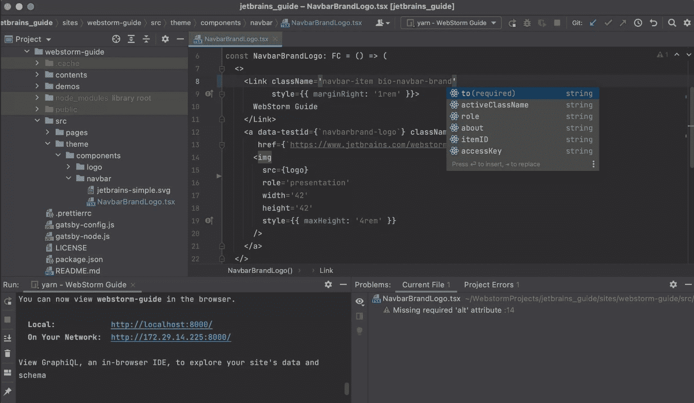
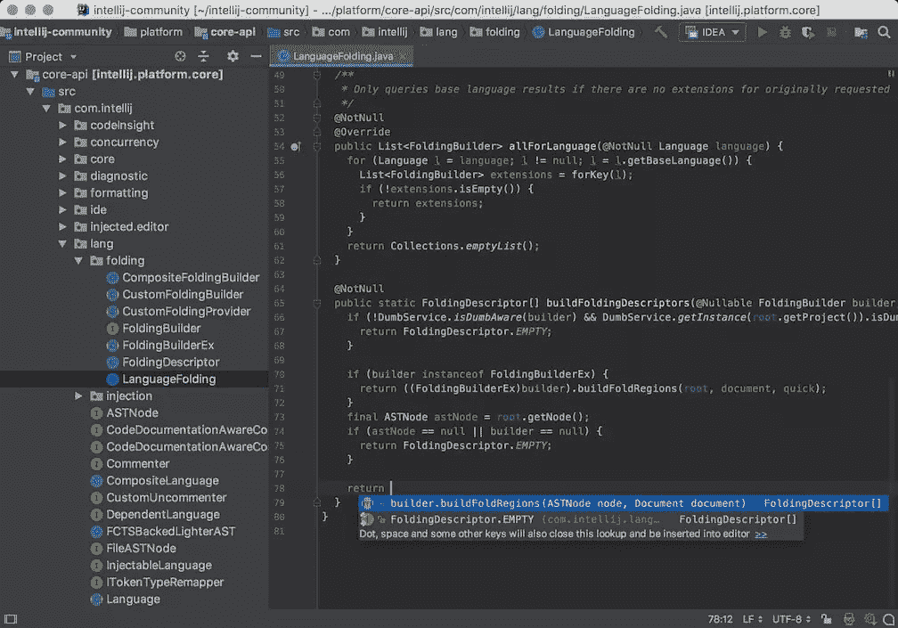
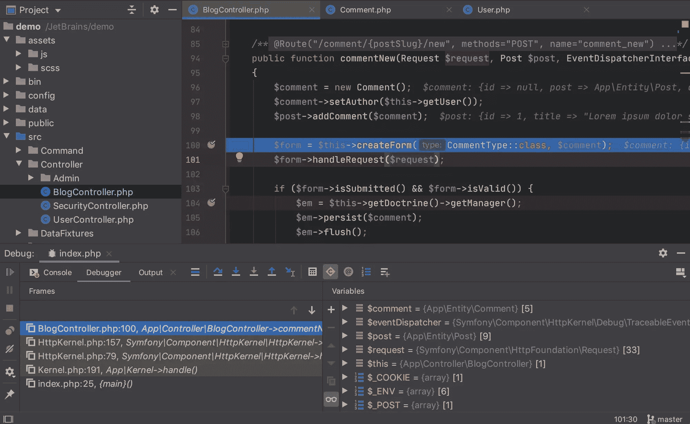
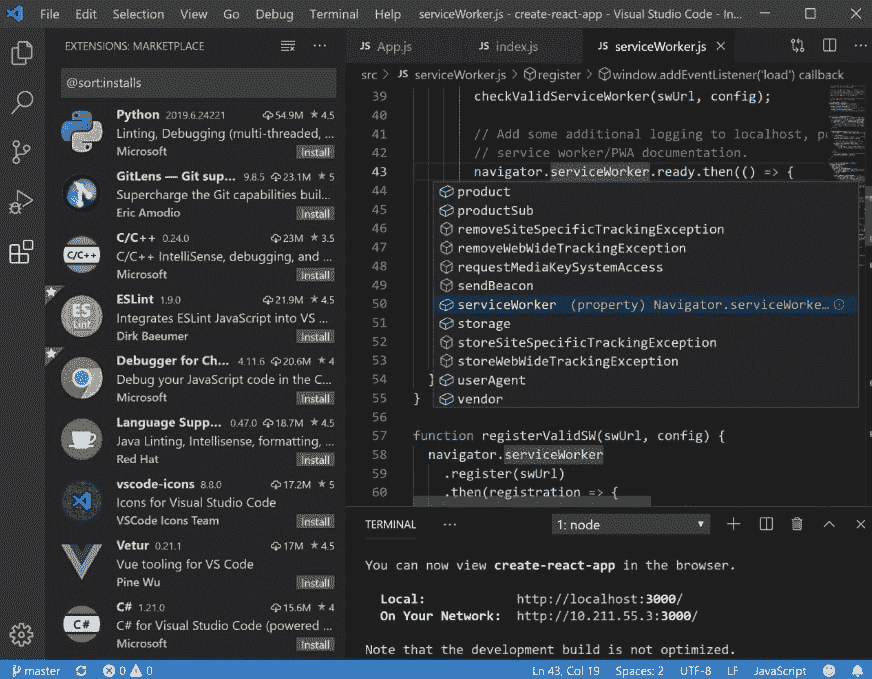
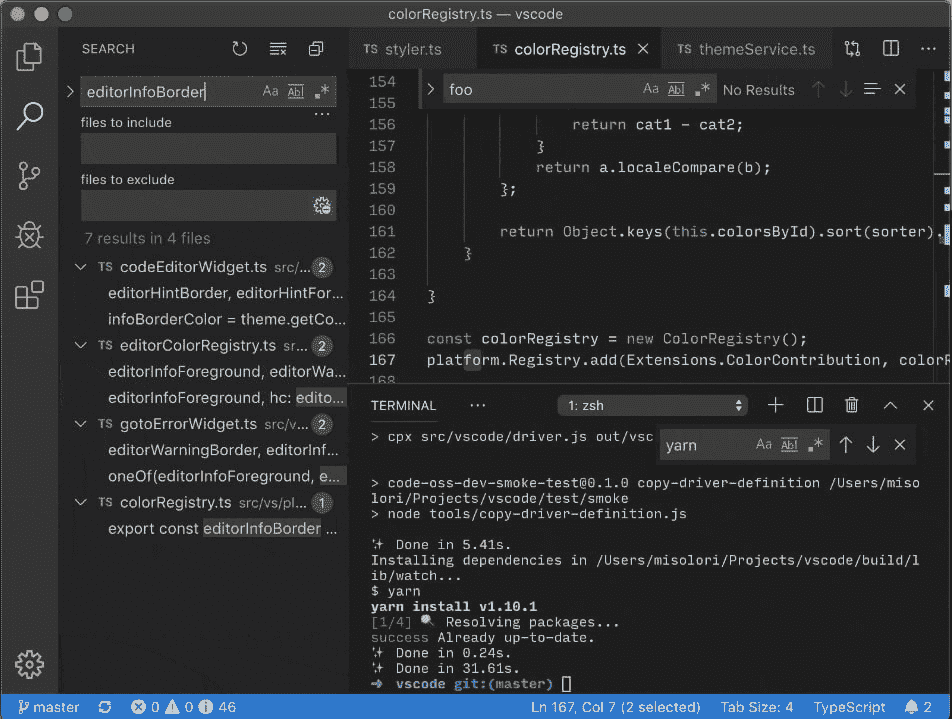
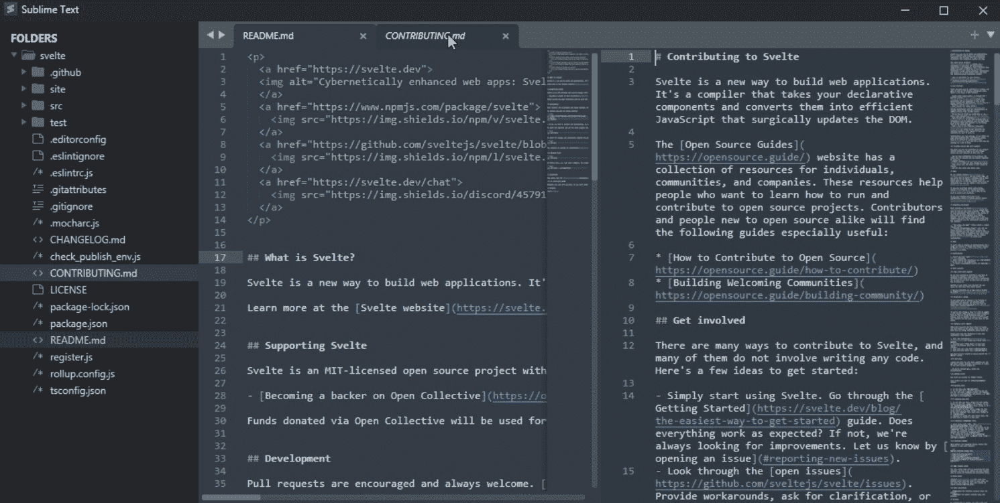
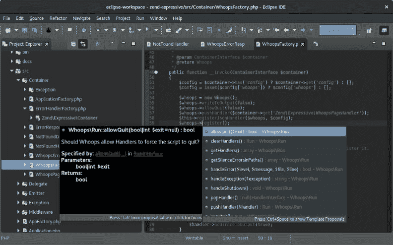
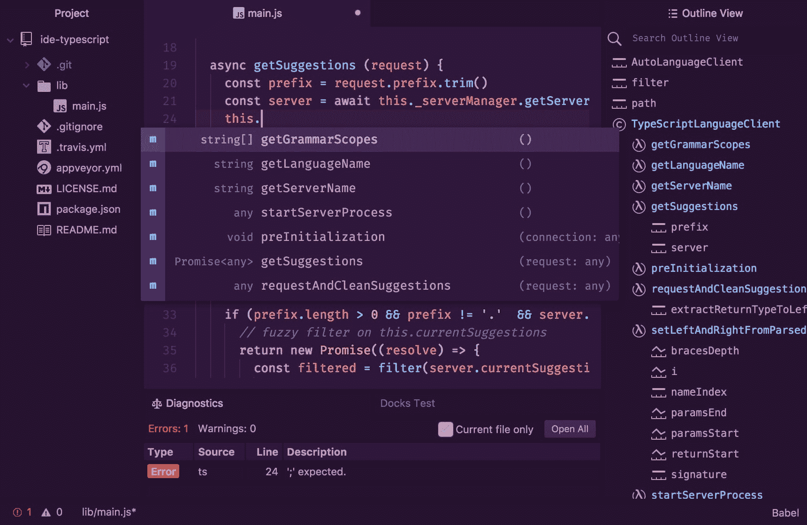
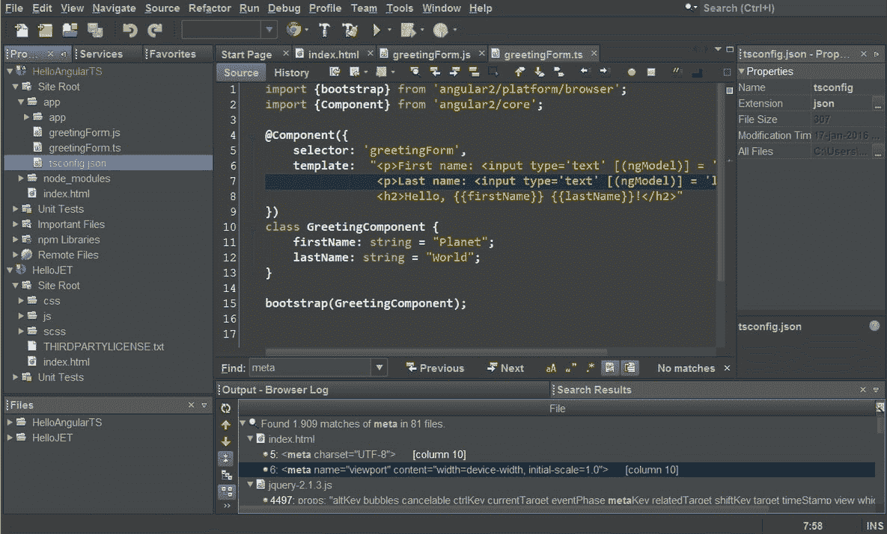
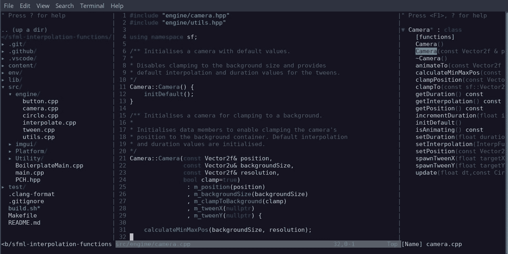

# 2022 年最好用的 JavaScript IDE 或代码编辑器是什么？(根据我们的开发者和 JavaScript 社区)

> 原文：<https://www.stxnext.com/blog/best-javascript-ides-code-editors/>

 *2022 年 10 月 24 日更新*

[**JavaScript**](/services/javascript-development/)**是 web 的核心技术和最流行的编程语言之一。通常，它使用 HTML 和 CSS 进行前端开发，但 JavaScript 也有助于构建移动应用程序。引入 [Node.js](/services/nodejs-development/) 也将这种高级解释编程语言的范围扩展到了后端开发。**

有许多专门为 JavaScript 构建的有用工具。然而，它们太多了，所以我们决定根据我们的开发者和 JavaScript 社区为您提供一份最佳 JavaScript IDEs 和代码编辑器的列表，以帮助您开发您的产品。

**我们将考虑它们的价格、系统兼容性、最重要的** **功能、优缺点和使用案例。** **这篇文章将帮助你选择一个能有效满足你编程需求的软件。** **继续读下去，决定你应该选择哪个 JavaScript 工具！** 

#### 顶级 JavaScript IDEs 和代码编辑器

我们已经介绍了 IDE 的定义，IDE 和代码编辑器之间的区别，以及使用它们的原因。现在让我们看看我们的最佳 JavaScript IDEs 和代码编辑器列表。

接下来我们将从 STX 上真正推荐的开始:WebStorm、PyCharm、IntelliJ IDEA、PhpStorm 和 Visual Studio Code。 **你可以很容易地只依赖其中任何一个，不需要任何额外的选项，因为它们几乎是相同的工具，但为稍微不同的语言创建。**

它们是众所周知的、被广泛认可的、最先进的工具，提供了按时交付高质量项目所需的所有特性，并给予您愉快的编码体验。

 [##### 1.网络风暴](https://www.jetbrains.com/webstorm/) 

**Source: https://www.jetbrains.com/webstorm/**

**首次发布:** 2010 年

**类型:** IDE

**系统兼容性:** 推荐最新 64 位版本的 Windows、macOS 或 Linux

[**WebStorm**](https://www.jetbrains.com/webstorm/)**是 JavaScript 最常用的集成开发环境之一，可能是目前最好的前端开发 IDE。**是一款专门做 JavaScript 和 TypeScript 的软件编辑器工具。根据 JetBrains 的说法，“WebStorm 使您的开发更加愉快，自动化日常工作，并帮助您轻松处理复杂的任务。”

它是迄今为止开发 web、移动、服务器和桌面应用程序的最智能的 JavaScript 编辑器之一。它支持用 Angular、React 或 Vue.js 进行前端开发；用 Node.js 和 Meteor 进行服务器端或后端开发；使用 Ionic、Cordova 或 React Native 进行移动开发；和桌面应用程序开发。这个 IDE 建立在一个开源平台之上:IntelliJ。

重要的是，WebStorm 是目前市场上最受支持和更新的选项之一，因此任何新功能通常会首先进入 WebStorm。

WebStorm 被誉为“最智能的 JavaScript IDE ”,它有很多特性:

*   移动编辑，
*   安全重构，
*   出色的导航，
*   代码完成和质量分析，
*   快速文档，
*   内置 HTML 预览，
*   各种各样的插件和模板，
*   高级版本控制集成，
*   内置 HTTP 客户端，
*   集成终端，
*   快速导航和搜索，
*   还有很多。

许多开发者认为 WebStorm 的自动调试和代码测试功能是市场上最好的。WebStorm 还有一个优秀的智能模板功能。

**优点:**

*   可靠的更新和用户支持
*   使用插件进行定制
*   对学生和开源项目免费
*   智能自动修复
*   预集成了 Angular、TypeScript、Vue 和 React

**缺点:**

*   会消耗设备内存
*   偶尔缓慢加载时间
*   很难跟踪 git 图表和折扣
*   收藏夹和书签可能更有用

免费或付费:个人用户每年 61 美元起，公司用户每年 134 美元起。此外，教育机构和非营利组织也有一些折扣和免费许可证。

如果您是一名多语言的 web 开发人员，正在寻找一个优秀的 IDE 来支持复杂的项目，请使用它。

 [##### 2.皮查姆](https://www.jetbrains.com/pycharm/) 

**Source: https://www.jetbrains.com/pycharm/**

**首次发布:** 2014 年

**类型:** IDE

**系统兼容性:** Microsoft Windows 8 或更高版本、macOS 10.14 或更高版本、任何支持 Gnome、KDE 或 Unity DE 的 Linux 发行版(PyCharm 不适用于某些 Linux 发行版)

虽然 [PyCharm](https://www.jetbrains.com/pycharm/) 并不是最好的免费 JavaScript IDE，但付费专业版绝对值得一试。对于 Python 程序员来说，这是一个优秀的 web 开发 IDE，但它不是 PyCharm 支持的唯一语言。

事实上，它可以与几乎所有流行的语言和框架一起工作，包括 JavaScript、AngularJS、Coffee Script、CSS、Python、HTML、Node.js、TypeScript 和模板语言。

使用 PyCharm，您可以访问以下功能:

*   代码完成；
*   自动错误搜索；
*   项目中的智能导航；
*   内置调试器；
*   与流行的版本控制系统集成；
*   Jupyter 笔记本，Anaconda 和其他图书馆。

**优点:**

*   出色的代码完成
*   良好的调试能力
*   方便使用版本控制服务器(VCS)
*   使用数据库的能力
*   良好的 SQL 自动完成
*   使用位于远程机器上的代码并调试它
*   自动依赖修复
*   内置外壳

**缺点:**

*   有报酬的
*   更加以 Python 为中心
*   调试时有时会出现问题

免费或付费:IDE 有两个版本:专业版每月 8.90 美元，如果按年计费，则每年 89 美元。社区版是完全免费的，是基于开源软件构建的。

免费版相当令人满意，而且与付费版的功能有很多重叠；但是，它不支持 web 框架。您可以从他们的官方页面下载专业版或社区版的 30 天试用版。

如果您是一名多语言 web 开发人员，正在寻找既便宜又适合 Python 和 JavaScript 的东西，请使用它。

 [##### 3.智能理念](https://www.jetbrains.com/idea/) 

**Source: https://www.jetbrains.com/idea/**

首次发布: 2001 年

**类型:** IDE

**系统兼容性:** 推荐最新 64 位版本的 Windows、macOS 或 Linux

[**IntelliJ IDEA**](https://www.jetbrains.com/idea/)**是一个以 Java 为中心的 IDE，由 JetBrains 创建，主要致力于提高开发人员的工作效率。它符合人体工程学，智能，能够自动化重复的编程任务，以减少开发时间。在 2001 年发布时，它是第一批集成了代码导航和代码重构等功能的 Java IDEs 之一。**

IntelliJ IDEA 最好的特性之一是，它会在每个上下文中自动添加相关的建议:即时而巧妙的代码完成、即时的代码分析和可靠的重构工具。

根据 JetBrains 的说法，“它旨在提供一种开箱即用的体验，包括集成版本控制系统和各种支持的语言和框架，没有插件的麻烦。”

虽然 IntelliJ IDEA 是一个专门为 Java 设计的 IDE，但它也能理解各种其他语言，如 JavaScript，并为其提供智能编码帮助。

这里的学习曲线相当陡峭，但是一旦你理解了它，IntelliJ IDEA 将提供一个真正令人愉快的工作体验。

**特性:**

*   内置静态代码分析器
*   部署和调试工具
*   高级代码完成
*   集成版本控制
*   与 Git 轻松集成
*   数据库编辑器
*   具有许多特性的 UML 设计器

**优点:**

*   直观的用户界面
*   基于 DOM 模型的精确自动补全
*   辅助功能包括屏幕阅读器
*   内置版本控制
*   众多插件和扩展可供尝试
*   用户友好的自动完成
*   一个很棒的调试模式特性

**缺点:**

*   相当慢的索引
*   陡峭的学习曲线

*   免费版本不支持 JavaScript
*   相当贵
*   它消耗了大量的计算机资源
*   相当慢的内置控制台

免费或付费:社区版是免费的，终极版需要每月 52 美元的授权购买。**不幸的是，社区版的可用选项和工具比付费版少得多，包括使用 JavaScript。**

如果您是一名专业人士，需要为您的 Java(脚本)项目提供广泛的功能，请使用它。

 [##### 4\. PhpStorm](https://www.jetbrains.com/phpstorm/) 

**Source: https://www.jetbrains.com/phpstorm/**

首次发布: 2009 年

**类型:** IDE

**系统兼容性:** 推荐最新 64 位版本的 Windows、macOS 或 Linux

[**PHP storm**](https://www.jetbrains.com/phpstorm/)**是 JetBrains 打造的跨平台 IDE。它是为 PHP 开发而开发的，但是它也有一些很棒的特性可以用作 JavaScript IDE。另外，PhpStorm 的功能可以通过各种插件来扩展。**

除了自动化重构、错误预防、语法突出显示和动态代码分析之外，PhpStorm 还支持零配置调试。它附带了数百个代码检查，并提供快速修复以提高代码质量。

IDE 还具有用于测试和分析的内置工具，并提供了一个统一的 UI 来与众多流行的 VCS 一起工作，包括 Git、Mercurial 和 Perforce。此外，PhpStorm 提供了在项目中使用数据库和 SQL 的工具。

**特性:**

*   代码帮助(使用数据库和 SQL 时)
*   自动完成
*   语法突出显示
*   排除故障
*   内置代码格式
*   变量和方法的提示
*   轻松的代码导航

**优点:**

*   调试新的代码库时，PhpStorm 很容易使用
*   与 Docker 和 XDebug 等第三方工具很好地集成，使得编码非常容易
*   强大的插件支持
*   容易发现错误
*   您可以轻松地将您的本地数据库与您的 PHP 项目连接起来
*   智能是非常活跃的，因此在开发应用程序时，您将很少出错

**缺点:**

*   在你的电脑上可能会有点慢和沉重
*   有时部署需要很长时间，但在调试中非常快
*   对初学者来说有点贵
*   没有社区版本，只有 30 天的试用期

免费或付费:个人用户第一年需要支付 89 美元，第二年需要支付 71 美元，之后需要支付 53 美元。组织第一年支付 199 美元，第二年支付 159 美元，此后支付 119 美元。

如果您希望满足所有需求，包括完整的 JavaScript、CSS 和 HTML 支持，请使用它。

 [##### 5.Visual Studio 代码](https://code.visualstudio.com/) 

**Source: https://code.visualstudio.com/**

**首次发布:** 2015 年

**类型:**代码编辑器

**系统兼容性:** 推荐最新 64 位版本的 Windows、macOS 或 Linux

[Visual Studio Code](https://code.visualstudio.com/) 是微软推出的精简代码编辑器，支持调试、版本控制、任务运行等开发操作。它是最受欢迎和最可靠的 JavaScript 代码编辑器之一。

根据他们的网站，“它旨在为开发者提供快速代码构建调试周期所需的工具，并将更复杂的工作流程留给更全面的 ide，如 Visual Studio IDE。”

除了 JS，Visual Studio 代码还支持 30 多种编程语言，包括 C#、HTML5、PHP 和 Ruby。

**Visual Studio 代码的特性包括:**

*   IntelliSense 通过列出代码建议、提示和参数描述来帮助开发人员；
*   代码重构；
*   调试工具；
*   内置 Git 命令；
*   函数在线峰值；
*   任务运行器，允许创建和配置任务，使用 Gulp、Grunt 或 MSBuild 执行与设置相关的任务；
*   调用堆栈，设置断点，观察变量；
*   还有更多。

最重要的是，它很轻，高度可定制，免费，并且不需要强大的机器来运行它。最后，它有一个专门的社区和强大的技术支持，所以如果你不介意安装插件来扩展 VS Code 的功能，Visual Studio Code 为 JavaScript 开发提供了足够多的东西。

**优点:**

*   自由的
*   低内存消耗
*   控制台集成
*   任务管理
*   支持 JavaScript 框架，包括 React 和 Node.js
*   辅助功能的屏幕阅读器
*   市场提供了大量的扩展来扩展功能
*   与 WSL(Linux 的 Windows 子系统)集成
*   可扩展和可定制

最棒的是，如果你安装了一些扩展，它们在单独的进程中运行，所以它们不会让你的程序慢那么多。

**缺点:**

*   缺乏对一些流行编程语言的支持
*   较差的源代码控制
*   作为代码编辑器，它显然缺少一些内置的工具和测试功能；然而，这些功能可以通过许多插件和扩展来安装
*   陡峭的学习曲线
*   有时很慢
*   安装扩展和插件需要大量的设置时间

**免费或付费:**免费

如果您是一名企业开发人员，并且想要一个能够处理复杂项目的通用而轻便的工具，请使用它。

#### 选择 JavaScript IDE 或代码编辑器时的其他建议

我们上面提到的工具对你来说应该绰绰有余。这五大 ide 和代码编辑器是:

*   更新最频繁；
*   跟上最新的趋势、变化和技术；
*   提供最佳舒适度和最广泛的功能组合；
*   为您的开发过程提供最可观的速度提升；
*   提高你的生产力；
*   让你的工作更轻松。

话虽如此，我们的目标是为您提供一系列适合任何需求的通用工具。在这一点上，我们想为你推荐一些更有趣的使用 JavaScript 的方法。

 [##### 1.可视化工作室](https://visualstudio.microsoft.com/pl/vs/) 

**Source: https://visualstudio.microsoft.com/pl/**

我们刚刚讨论的 Visual Studio 代码编辑器是 Visual Studio IDE 的一个简化版本。 [Visual Studio](https://visualstudio.microsoft.com/pl/) 是一个资源密集型的微软 IDE，用于创建 GUI、控制台、web 应用程序、在线应用程序、移动应用程序、云和 web 服务等。

它使用微软的软件开发平台，如 Windows Store、Microsoft Silverlight 和 Windows API。与市场上的其他 ide(每月 45 美元)相比，它可能对一些人来说比较贵，有点慢，而且不像其他 ide 那样最新。

如果你已经开发软件很多年了，并且习惯了一些使用工具的方式，并且不想切换到一个新奇的 IDE，那么就使用它。

 [##### 2.崇高的文本](https://www.sublimetext.com/) 

**Source: https://www.sublimetext.com/**

[**崇高文字**](https://www.sublimetext.com/) 是一款开源、跨平台的 JS 编辑器。有 JS 的 IntelliSense 包，也有不错的 GitHub 集成。Sublime Text 的最新版本是 SBT3，它将该工具从源代码编辑器转变为伪 IDE。

许多开发人员喜欢 Sublime Text 的多光标和多选特性，因为它们允许同时在多个地方编辑代码。从那以后，这两个选项在新的编辑器中变得很常见。

**另一方面，Sublime Text 被其他程序员认为是缓慢、奇怪、难以习惯、不值得花钱(每三年 80 美元)的。**

 [##### 3.黯然失色](https://eclipseide.org/release/) 

**Source: https://www.eclipse.org/ide/**

[**Eclipse**](https://eclipseide.org/release/) 是一个免费的开源 IDE，专注于 Java 开发，但也支持 JavaScript 和其他编程语言。然而，为了使用 Eclipse 进行 JavaScript 开发或获得其任何值得注意的功能的好处，开发人员需要非常耐心地安装特定的插件，因为程序真的很慢。

如果你更喜欢开源软件，不介意花很多时间来定制它，并且你喜欢别人认为是老派的界面，那么 Eclipse 可能适合你。

 [##### 4.原子](https://atom.io/) 

**Source: https://atom.io/**

[**Atom**](https://atom.io/) **是一个由 GitHub 构建的代码编辑器**，它得到了脸书的大力支持。这是一个免费、开源、简单的文本编辑器，以其简单的用户界面和可定制性而闻名。这是一个较大的应用程序，如果您的机器性能较弱，它可能会降低您的速度。

如果你 **喜欢直观的界面、强大的在线社区，但不介意一些 bug、死机和崩溃，那么试试 Atom——它是免费的。**

 [##### 5.Apache NetBeans](https://netbeans.apache.org/) 

**Source: https://netbeans.apache.org/**

[**NetBeans**](https://netbeans.apache.org/)**是一个免费的多平台 IDE，虽然它最常用于 Java，但它支持多种语言，包括 JavaScript、HTML5 和 CSS3。许多程序员喜欢 NetBeans 直观且可定制的界面。它还具有许多强大的功能，因此您可以在安装后快速投入使用。**

众所周知，NetBeans 对资源要求很高，如果您的设备规格较低，它可能无法顺利运行。集成支持有点差，弹出窗口很烦人，而且很难与其他工具集成。

如果编程是你的爱好，而不是全职工作，就用它；如果您是一名 Java 或多语言开发人员，拥有一台可以处理真正重量级应用程序的设备，并且不介意落后于最新技术。

 [##### 6.精力](https://www.vim.org/) 

**Source: https://www.vim.org/**

最后但同样重要的是，我们不能不提到古老的[**Vim**](https://www.vim.org/)**，最初发布于 30 多年前。虽然 Vim 通常与 Linux 和 Unix 相关联，但它目前是跨平台的，甚至可以在 Windows 上使用。它最令人满意的方面之一是 Vim 非常可定制，这可以通过可用的插件来实现，这些插件是用 vimscript 或 VimL 编写的。**

Vim 无疑是我们名单上所有编辑中最简朴的。虽然 Vim 可以使用图形界面，但它更像是一个基于文本的编辑器。尽管这几乎是不可能理解的事实，Vim 在 it 老手中仍然有一些狂热的粉丝，他们并不介意这一切的粗糙。

#### 关于最佳 JavaScript IDEs 和代码编辑器的最终想法

感谢您阅读我们的文章，根据我们的开发者和 JavaScript 社区，这是关于最佳 JavaScript IDEs 和代码编辑器的文章！我们希望我们的专业知识已经帮助您选择了最适合您工作的工具，并且您已经发现我们的附加建议很有趣。

需要注意的是 在不同的 ide 和代码编辑器之间做出选择时，最终的决定通常取决于您的项目、日常工作特点和个人偏好。

我们也知道它们还有很多，如此简短的描述可能无法解决您所有的问题和疑虑。这就是为什么我们邀请您做一些进一步的研究，或者也许 [联系我们](/contact/) 一起讨论这个问题。

**尽管如此，我们要强调的是，无论你选择哪一个顶级的 ide 和代码编辑器，你都会感到满意。它们是市场上的最佳选择。**

一旦您选择了您的 IDE 或代码编辑器，我们鼓励您查看我们的免费资源，这将进一步提高您的 JavaScript 编码技能:

*   [**什么是打字稿？TypeScript 与 JavaScript 的利弊**](https://www.stxnext.com/blog/typescript-pros-cons-javascript/)

*   [**Python vs. JavaScript:比较公平吗？**](/blog/python-vs-javascript-comparison/)

*   [**React vs Angular:JavaScript 库和 TypeScript 框架**](/blog/react-vs-angular-comparison/) 的比较

*   [**Vue.js vs. React:顶级 JavaScript 框架对比**](/blog/vue-vs-react-comparison/)

如果您正在寻找一个[JavaScript 专家开发团队](/services/javascript-development/) 【手头有各种各样的库和框架来满足您特定的前端需求，请不要犹豫，联系我们——我们非常乐意帮助您！