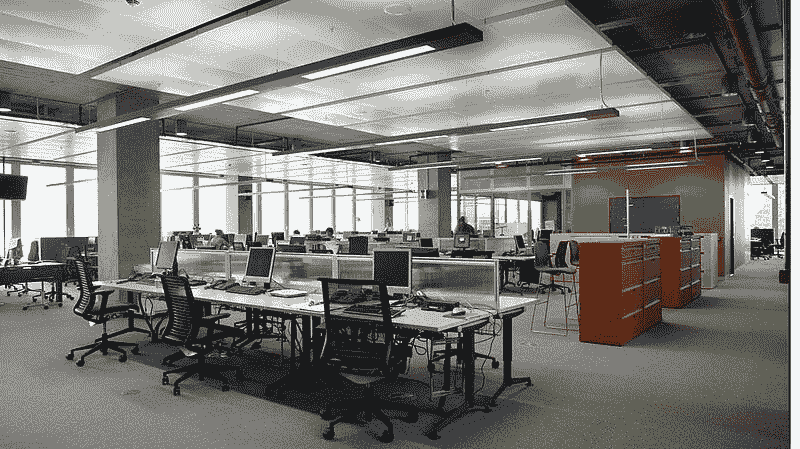
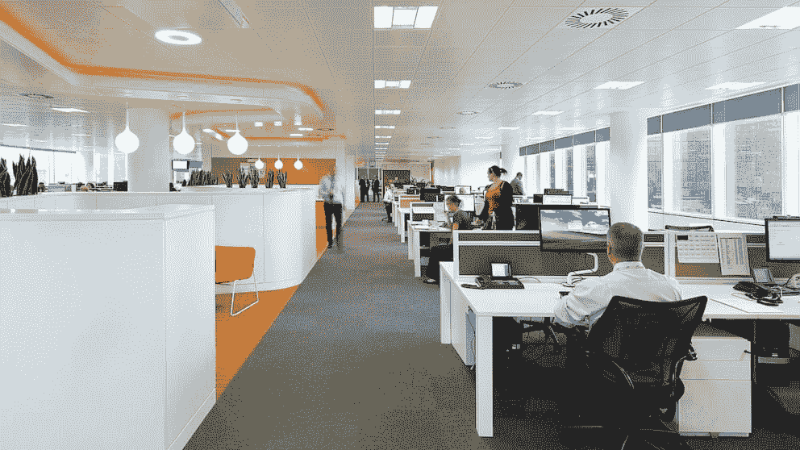
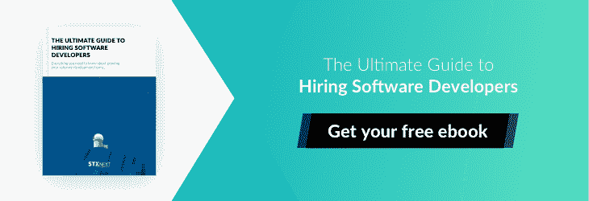
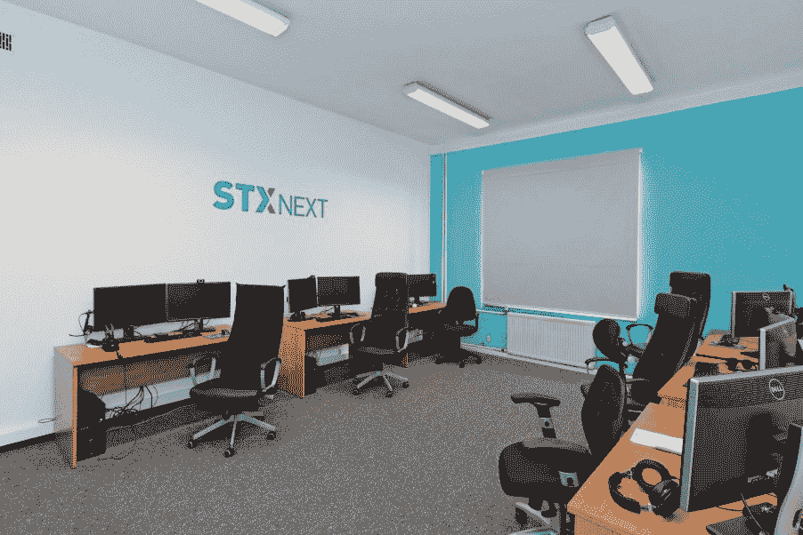
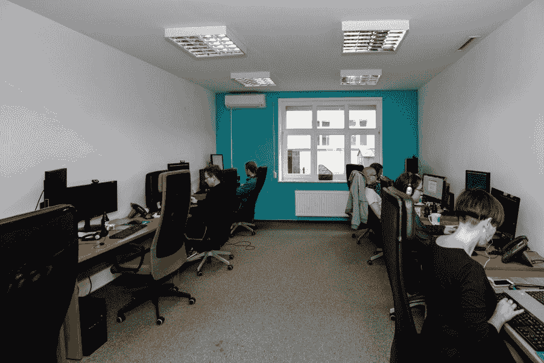

# 为什么开放空间的工作场所不适合软件开发人员

> 原文：<https://www.stxnext.com/blog/why-open-space-workplace-doesnt-work-developers/>

 你有没有考虑过你的开发人员工作的环境？据你估计，它们的舒适度如何？

你的所有员工，包括软件工程师在内，大部分时间都在办公室度过。他们的工作场所应该永远是灵感和动力的源泉。

世界各地的经理们为他们的开发人员广泛使用的一种解决方案是开放式办公室。 **开放式办公室乍一看可能像是未来的工作场所——但真的是这样吗？**

最近，我和 STX Next 的工程副总裁[ukasz Koczwara](http://bit.ly/2h2vub9)就这个话题进行了一次交谈。他对开放式办公室不感兴趣，并提出了**一种不同的解决方案，既能提高员工参与度，又能提高客户满意度。**

**继续阅读了解详情。**

**** 

#### 什么是开放式办公室？

让我们从定义我们正在谈论的到底是什么开始。

开放式办公室(也称为开放空间办公室)是  **一种管理公司工作场所的解决方案，取消了单独的房间。**

在许多方面，这正是你所期望的:一个没有单独房间的开放空间，员工可以坐在一起工作。他们的工作站可能会或可能不会被短隔间墙隔开。在开放式办公室工作通常意味着你在同事的视线范围内，他们也能看到和听到你。

如果你仍然不确定如何描绘它，这里有几个例子:

开放式办公空间已经在经理中流行起来，他们在工作场所也采用了这种方式。这个想法也不是一无是处，我们接下来会讨论。

#### 管理者为什么决定实施开放式办公室？

让我们回顾一下开放式办公室受欢迎的几个原因。

##### 1.消除沟通中的瓶颈

如果所有人都在同一个房间里，你就可以随时联系到你的同事。

##### 2.员工了解公司发生的事情

无论开放式办公室里发生了什么，你都会知道。成功和挑战都会从你周围人的脸上显现出来。

##### 3.平等意识

没有**更好的**或者**更差的**员工当大家坐在一起的时候。********

 ******##### 4.员工更容易融入

开放的空间总是有助于融入工作环境。随着时间的推移，你可能会发现你的办公室里摆满了乒乓球桌、飞镖板和桌上足球桌，为工作日增添了一点乐趣。

##### 5.更易于管理

有了开放式办公室，你就不需要考虑你需要的房间类型、房间大小以及每个房间的工作人数。你可以简单地添加更多的隔间。面对四面混凝土墙，你就没那么灵活了。

##### 6.它只是成本更低

对于一个公司老板来说，租一个大厅，放上一些桌子，根据需要创造小隔间，会更便宜。

然而，尽管有上面提到的所有优势，开放式办公室正在受到抨击。 祖卡斯告诉我，越来越多的经理表达了他们的担忧。他们说，开放式办公室实际上对他们的员工有害，让他们痛苦和没有效率。这是为什么呢？

******  ******#### 为什么开放式办公室不起作用

因此，很明显，有很多原因可以让你的组织选择开放式办公室。但是这个概念有一系列的缺点，使得它在很多情况下不切实际，特别是当你想要管理软件开发人员的工作时。

以下是你和你的员工在开放式办公室工作时可能会遇到的一些问题:

##### 1.“嘿，有时间吗？”

当你总是能和同事相处时，你会发现你的注意力被转移到了不重要的任务和同事的要求上。当有人每半小时拍一下你的肩膀，请求你的帮助时，你很难集中精力做重要的事情。

##### 2.噪音和干扰

开放式办公室饱受噪音和视觉干扰的困扰。人们在办公室里走来走去，与同事交谈，举行虚拟会议，甚至在听得见的地方打乒乓球。在这种情况下，员工很难集中精力，进入高效的工作流程。

##### 3.假消息传播得更快

开放式办公室会让更多的流言在工作场所传播开来。这似乎是一个微不足道的问题——除非你从经理的角度来看。一旦你开始对员工和消费者的满意度负责，你就会发现流言蜚语的传播是有害的，会破坏办公室关系。

##### 4.细菌天堂，生产力地狱

在开放式办公室里，疾病更容易传播，导致员工可用率下降。

##### 5.“你在这里工作吗？”

潜在客户在一个开放的空间里拜访开发人员可能会得到一个印象，即没有进行任何有成效的工作。他们可能会看到开发人员利用前面提到的飞镖板和桌上足球来代替开发软件。这让你的职业精神在客户眼中受到质疑。

一旦你考虑到使用开放式办公室解决方案的潜在危险，你可能会发现自己想知道如何为软件开发人员组织你的工作空间。

幸运的是，根据我们作为 Python 软件公司的经验，有一种策略既有效又总是受到我们客户的赞赏。

#### 为软件开发人员提供更好的工作空间解决方案

我们知道开放式办公室的一些优势，比如改善的沟通或更加一体化的团队。你如何保持这些优势，同时消除缺点:噪音、干扰、工作流程中断等。？

根据我们的经验，管理软件开发人员工作的最佳解决方案是 **专用的封闭办公室。** 我们简称它们为专用房间。看一看:

在实施它们时，我们遵循我们的经验法则: [一室。一个团队。一个客户。全神贯注。](https://stxnext.com/blog/2018/06/12/why-are-company-values-important-and-how-we-defined-ours/)

当然，专用房间将是一个更昂贵的解决方案，因为很难找到办公大楼提供适当大小和数量的房间。这也可能导致建立和维护工作空间的工作量增加。但还是值得的。

为了找出原因，让我们来探索为开发团队使用专用房间的优势:

##### 1.你需要的每个人都在一个地方

团队的所有角色都在一个地方。无论你对开发、测试、DevOps 或者 [Scrum](http://bit.ly/stxscrum) 流程有什么问题，总会有人在房间里回应你的问题。

##### 2.你不需要的人都呆在外面

与上述相反的是，公司的其他人呆在房间外面。你知道的，日常不需要交流的那部分。

##### 3.举行会议是轻而易举的事

你有自己的房间，所以你可以随时开会。不需要担心超额预定的会议室。

##### 4.更少的分离工作，更少的上下文切换

在专用的房间里工作，团队可以专注于手头的任务。即使他们中的一个被拍了拍肩膀来提供一些东西，这个任务仍然在他们项目的范围内。这极大地提高了团队的绩效。

##### 5.与客户建立更好的关系

如果你和商业客户一起工作，当他们知道他们在你的大楼里的某个地方有自己的房间，他们的团队在那里进行他们的项目时，他们会感到安心。他们甚至可以亲自访问它(在我们的例子中，他们经常这样做)。

##### 6.团队自治等于团队承诺

有了自己的房间，团队可以随心所欲地组织空间，用电影海报和项目指南装饰墙壁。

这使得团队更加敬业，有助于留住员工。我们的一位来自游戏行业的潜在客户最近告诉我们，看到我们的人谈论外包项目时就好像这是他们自己的项目一样，这令人震惊。

简而言之， **专用房间是创造更专业的工作环境的直接方式，** 摆脱无聊的分心和频繁的干扰。与此同时，确保从事一个项目的团队呆在一个空间有助于他们建立比开放式办公室更密切的关系。

 

#### 如何充分利用专用房间

和任何事情一样，为你的开发团队实现专用房间有好有坏。让我们分享一些我们的经验。

##### 1.目标是 8-9 人的房间(和团队)

这个数字有助于你实现最佳沟通，而不会带来混乱。在这一点上，你可能不相信我们，但你应该相信杰夫·贝索斯和他的2 披萨法则，它说你永远不应该召开超过你可以用 2 个披萨养活的人数的会议。我们相信这也适用于团队规模。

##### 2.敏捷并适应你的房地产情况

上述观点可能并不总是容易(甚至不可能)实现。尽量利用你拥有的空间，如果需要的话，创建更小或更大的团队。

##### 3.尽量充分利用专用房间的潜力

我们对专用房间的概念假设几乎所有的事情都发生在房间里:与客户的电话会议、每日站立会议、计划会议等等。

##### 4.几个专用房间和几个会议室

虽然专用房间提供了很多机会，但有时团队可能觉得有必要在其他地方召开会议，或者您的员工可能希望召开混合会议。

在这种情况下，有必要在你的计划中加入几个会议室，帮助团队将计划混合起来，偶尔改变一下环境。

对于大多数组织来说，一个用于一对一对话的房间、一个小会议室和一个大会议室就足够了。

##### 5.房间应该给团队一个自主和自我组织的机会

让团队可以按照他们想要的方式组织房间；他们是建筑师。麦当娜海报？当然可以。墙上的功能需求列表？没问题。

这有助于团队融合并成为朋友——使他们更有可能留在你的公司。这不仅改善了团队的整体情绪，还有助于避免员工轮换的问题，降低你的招聘成本。

#### 摘要

我希望这篇文章能让您更进一步，为您的开发人员提供他们应得的工作环境。再次感谢  [尤卡斯兹·科兹瓦拉](http://bit.ly/2h2vub9) 分享他的专业知识。

我们已经在几篇文章中讨论了管理软件开发人员的各种策略，涉及的主题有:

*   [招聘开发者](http://bit.ly/stxhiringdevelopers)，
*   [改善你的开发者管理流程](http://bit.ly/devs-managing)，
*   [解决开发团队中的冲突](http://bit.ly/stxteamconflict)。

你还有其他需要我们解决的问题吗？请在下面的评论中告诉我们。

要在新的博客文章出现时保持最新状态，请使用右边的框(或通过向下滚动移动设备)继续并 **订阅我们的时事通讯** 。

在这篇文章中，我介绍了作为技术合作伙伴与 STX Next 合作的感受。要了解更多与我们合作的信息，请务必查看我们对 Clutch.co 的评论 **[。](http://bit.ly/stxreviews)**

如果你对  [知识](https://stxnext.com/ebooks/what-is-python-used-for/) 的胃口还不满足，可以随意看看我们下面的文章。

祝你在管理工作中好运！

******