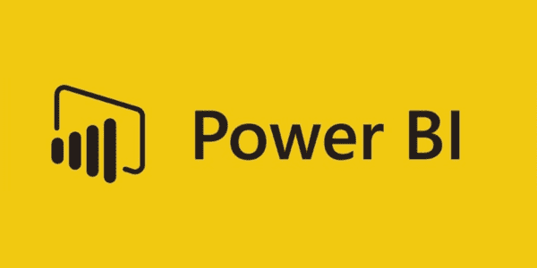

# 顶级商业智能和分析软件工具比较:Tableau vs . Power BI vs . Domo vs . si sense

> 原文：<https://www.stxnext.com/blog/business-intelligence-tools/>

 快速浏览一下 Gartner 的商业智能(BI)和分析工具 的庞大 [列表，足以让任何人感到困惑。选择是无止境的，这意味着企业领导和最终用户经常发现很难选择合适的技术来满足他们的报告和分析需求。当旧平台适应不断发展的数据环境时，新工具也在不断涌现。](https://www.gartner.com/reviews/market/analytics-business-intelligence-platforms)

商业智能是指将原始企业数据转换为可视化报告或见解的应用程序和技术类别。BI 工具的用途非常广泛，从数据挖掘操作的最技术性的方面，到管理人员组合横截面记录和绘制信息图表的简单需求。

简而言之，这些工具改善了企业决策，帮助制定战略，并为整个组织的用户提供直接的分析能力。

**本文是为商业智能决策者和分析师撰写的，旨在帮助他们在顶级分析解决方案方面做出最佳选择。我们将全面概述当今市场上最流行的四种 BI 工具:Tableau、Power BI、Domo 和 Sisense。** 

#### tableau:IT 专业人士的首选

[Tableau 是现代自助商业智能中的市场领先工具](https://www.tableau.com/resource/business-intelligence) ，涵盖所有基地。它提供了巨大的分析广度、深度和灵活性，使理解数据变得更加容易和简单。

虽然该工具擅长创建漂亮的可视化效果，但它的大部分广告都集中在围绕数据工程师和更大预算的企业环境上。该工具的免费公共版本功能有限。

然而，您可以为十几个行业选择定制版本，包括医疗保健、银行和制造业，为人力资源、销售、财务、IT 和营销部门提供支持。Tableau 还有一个非盈利选项和学术设置版本。

一般来说，你付的越多，Tableau 对你来说就越有效。对于来自第三方的基准数据、调查的绘图和分析以及时间序列数据来说，尤其如此。最近，Tableau 一直在利用自然语言处理的人工智能技术来帮助用户避免点击和拖动来创建公式，而是描述他们想要看到的内容。

##### Tableau 的灵活性和部署选项

*   除了免费的公共产品之外，Tableau 还有几种形式(个人、团队和嵌入式分析计划)。各种部署选项包括内部公共云服务器、私有云服务器或具有超过 75 个本地数据源连接的完全托管 SaaS。
*   免费试用版让您可以完全使用该工具的所有方面。
*   Tableau 允许您设置初始实例。仪表板上列出了所有可用的连接，您可以连接数据源以开始构建工作表。
*   您所有的可视化都存储在平台上，您可以通过仪表板访问它们。
*   如果您在 Tableau Desktop 中构建可视化，您可以通过 Tableau Online 或 Tableau Server 轻松地与您的团队共享它们。

##### 与 Tableau 的集成和关键连接

*   Tableau 支持与流行的企业工具和广泛使用的连接进行集成。登录该工具后，您将看到您的帐户级别中包含的所有连接。
*   Tableau 的连接接口比其他 BI 工具要复杂一些。当您建立连接时，您必须确定哪些数据将被拉入工具中。此外，在建立这些联系之前，您可能还想了解要查看哪些数据以及为什么要查看这些数据。

##### Tableau 中的仪表板和 BI 报告

*   Tableau 介于基于查询和依赖于开发人员的数据可视化和拖放之间。
*   该界面具有一个拖放式表格视图，可用于询问有关数据的问题。你所要做的就是把你的数据类型放在 X 和 Y 轴上，Tableau 会很快构建你的可视化。
*   Tableau 的仪表板和报告可用于根据过去的客户行为预测收入，并根据您的要求利用计算转换现有数据。
*   由人工智能和机器学习驱动的直观映射功能和智能建议，以及实时查询功能和摘录，特别有利于经常陷入查询过程的数据分析师。

##### Tableau 的其他生产力特性

*   Tableau 具有广泛的支持工具，可以帮助您了解从设置软件的基础到执行初始数据分析的所有内容。
*   您可以使用移动应用程序访问和更改数据，并且您的整个团队可以围绕共享仪表板进行协作。
*   虽然 Tableau 没有自然语言查询，但当该公司被 Salesforce 收购时，数据发现工具 Einstein AI 被集成到其中。
*   Tableau 还拥有一个多元化和充满激情的全球数据爱好者社区，该社区是灵感和支持的持续来源。它还可以直接积极地影响产品开发。

##### 你应该选择 Tableau 吗？

为了直接回答这个问题，人们选择 Tableau 是因为它比任何其他商业分析工具都有更高的上限。

由于应用程序中集成了多种工具，Tableau 是可视化和粒度多样化的完美选择。在数据权限和嵌入式分析任务中需要更高粒度的组织可以使用 Tableau 轻松实现他们的目标。

Tableau 的易用性简直令人难以置信。一旦你清理并理解了你的数据集，你会发现创建新的可视化和其他动态的东西真的很容易。如果您的 ETL 过程创建顺利，您可以用 Tableau 构建复杂的仪表板。此外，每周和/或每月更新也很容易。你所需要做的就是刷新你的摘录，并检查以确保所有内容都相应地更新。

一些人认为初学者很容易创建 Tableau 仪表盘。然而有时，相反的情况可能是真的。学习几个 Excel 公式是无法掌握 Tableau 仪表盘的。最重要的是，如果底层数据得到了很好的理解和组织，Tableau 仪表板的创建会非常有效。

此外，Tableau 将大型数据集压缩到其 fast。几乎任何数据源的超级格式—无论是 Excel、JSON、数据库还是其他。通过将数据连接到 Tableau，您将能够通过拖放到具有内置数据可视化功能的窗格中，当场获得答案和见解。

此外，Tableau 在桌面客户端旁边有一个管理界面，允许公司访问和协作已发布的数据工作簿。

##### Tableau 的优点、缺点、优点和缺点

以下是利用 Tableau 的主要好处:

*   它以一种先进的方式提供数据可视化。
*   Tableau 软件提供了最佳质量的客户支持。
*   系统升级需要低投资。
*   广泛的客户资源。
*   多个数据源连接。

缺点是:

*   版本控制和 BI 功能较差，没有自动刷新报告的功能。
*   Tableau 对中小型公司来说可能很贵。它还具有不灵活的定价模式。
*   Tableau 的 IT 支持团队不是最好的，你可能会遭受各种安全问题。
*   售后支持很差，工具没有定期备份。

#### Power BI:面向分析师的微软解决方案

[Power BI 是现有的微软系统](https://powerbi.microsoft.com/en-us/) ，像 SQL、Excel、Azure，帮助分析和可视化来自本地或云来源的数据，并将报告发布到 Power BI 平台。此外，它还提供数据准备、交互式仪表盘、基于视觉的发现和增强分析。

Power BI 的免费桌面版本是独立用户的理想选择。然而，专业版利用 SharePoint、Microsoft Office 365 和团队来控制原始数据和发布的报告，使按月付费的协作分析变得更加容易。

对于希望全力以赴获得商业智能和分析的企业来说，这一高级层可以带来完全不同的结果。它允许通过预构建的连接器和 Microsoft Dynamics 365、Azure SQL 数据仓库以及 Salesforce 等第三方来源中保存的公司数据进行自助式数据准备。

简而言之，对于已经熟悉 Office 365、Azure 和 Excel 等微软产品的人来说，Power BI 是一个极好的选择。毕竟，对于需要数据可视化但没有大量额外资金的中小企业和初创公司来说，它的价格相当低。

##### Power BI 的灵活性和部署选项

*   Power BI 有多种形式，从台式机到专业版、移动版、高级版、嵌入式和报表服务器。因此，基于您的需求和角色，您可以利用这些服务中的一个或几个来构建和发布可视化。
*   最基本的设置是一个 Azure 租户——即使在试用期结束后仍将为您工作——它应该通过 Office 365 管理界面连接到您的 Power BI。虽然这听起来有点挑战性，但大多数使用该软件的公司已经有了一个框架来快速让服务器运行起来。
*   不过，你可以通过内置的连接和 API 快速连接所有数据源、现有的电子表格和应用程序。

##### 与 Power BI 的集成和关键连接

*   Power BI 带有 API 访问和预构建的仪表板，可快速了解一些最常用的技术，如 Salesforce、电子邮件营销、Google Analytics 和微软产品。
*   您还可以连接到组织内的服务或下载创建可视化所需的任何文件。您所要做的就是点击“获取数据”按钮，将任何数据连接到 Power BI。此外，您应该通过一个简短的授权过程来获得完全连接。

##### Power BI 中的仪表盘和 BI 报告

*   Power BI 提供实时数据访问以及一些非常方便的拖放功能。
*   整个工具旨在缩短创建可视化效果所需的时间。它甚至为新手用户提供了强大的数据分析和发现功能，而无需深入的知识和经验。
*   访问实时数据的能力意味着团队可以对从 CRM、销售、项目管理和财务工具输入到 Power BI 的业务变化做出即时反应。

##### Power BI 的其他生产力特性

*   Power BI 附带本地应用，让您可以从任何地方访问数据。
*   发布到 web 功能将允许您直接将可视化添加到您的博客或网站。
*   广泛的在线支持，包括指导学习和文档，包括 Power BI 网络研讨会及其 YouTube 频道，可以帮助您导航该工具。
*   Power BI 附带的自然语言查询工具的工作方式非常类似于 Google。你会问一些关于数据的问题，比如“我们最有价值的客户住在哪里？”或者，“我们对每个客户投资多少？”自然语言工具会为你找到答案。

##### 你应该选择 Power BI 吗？

人们经常遇到 Power BI，一旦意识到它的功能，就会坚持使用它。Power BI 是为共同利益相关者开发的，不一定是数据分析师。因此，该界面更多地依赖于拖放功能来帮助团队增强他们的可视化。

然而，Power BI 不仅仅是一个数据报告或可视化工具。如果您有一个好的数据模型，它将允许您快速创建可持续的报告，从而通过自动执行定期汇总从长远来看节省您的时间。

当你从商业的角度来看，如果你有一个合适的结构，它可以加快决策过程。它使人们能够在没有额外工作的情况下看到每日的趋势，而不是等待每月报告的摘要。它还有一个强大的后端，可以让你以任何你想要的方式操作和组织数据。

##### 电源 BI 的优势、劣势、优点和缺点

我们强烈建议使用 Power BI。它是一个强大的 BI 工具，允许您执行以下操作:

*   使您能够连接到不同的数据源。
*   快速创建美观的报告。
*   允许您构建内存中的数据模型或直接连接到数据以实现实时流传输。
*   以各种形式与您的公司共享数据。
*   使用名为 PowerQuery 的基于 UI 的 ETL 工具在 Power BI 中提取数据并修改它。
*   构建强大的度量，使您能够计算复杂的 KPI，这些 KPI 会随着参数的更改或不同的筛选器选择而重新计算。

但是有几个缺点:

*   Power BI 的 premium 云版本极其昂贵。
*   内部版本与 SQL Server Enterprise 许可证捆绑在一起，不能单独购买。
*   本地服务器不支持 AzureAD、ADFS 或任何基于声明的身份验证平台。

#### Domo:现代商务智能平台

[Domo 是一个基于云的平台](https://www.domo.com/) ，主要关注业务用户部署的仪表盘和易用性。该工具为医疗保健、金融服务、教育、制造等各种行业以及销售、IT 员工、首席执行官和 BI 专业人员等角色提供了理想的商业智能解决方案。

首席信息官们应该先看看 Domo 是如何处理来自吉拉、AWS、GitHub 和 New Relic 的数据的，然后再来看看可以帮助整个组织的 500 多个集成。

##### Domo 的灵活性和部署选项

*   Domo 提供了更好的用户体验，几个预构建的页面可以根据数据输入进行自我组装，例如财务、销售、人力资源、零售和营销。如果需要，您甚至可以拖放它们。
*   它具有数据融合功能，允许您合并来自多个数据源的数据。
*   Domo 通过从您选择的任何数据源收集数据来执行云中的所有处理。
*   它还使转换、提取和加载过程更加容易，因为您可以快速分析数据，而无需事先接受 SQL 培训。

##### 与 Domo 的集成和关键联系

*   Domo 是一个基于云的仪表板工具。这意味着它们可以随时提供对所有数据源的洞察力和可见性。
*   此外，所有没有本地连接的数据源都可以通过 Domo Workbench 连接器的 API 进行访问，从而允许您通过 CSV 文件将数据导入 Domo。
*   他们的连接器库中有超过 1，000 个预建的连接器。Domo 还拥有一个专有的应用程序商店，为各种角色和行业提供预建的解决方案，如果您正在寻找一个灵活的解决方案，这些解决方案将会产生重大影响。
*   Domo 可以连接到几乎任何数据源，无论是物理的还是虚拟的。然而，它在云中完成所有的处理。这将有助于减少您自己的服务器上的负载，尽管这可能意味着在特定情况下速度会变慢。

##### Domo 中的仪表板和 BI 报告

*   Domo 仪表盘非常棒，尤其是在可视化和用户体验方面。您可以毫不费力地利用 Card Builder 工具来拖放数据输入，以构建定制的可视化效果。
*   Domo 使公司能够分析和清理他们的数据，无论其来源如何。它简化了 ETL 处理(提取、转换和加载)，因此即使没有经过正式的 SQL 培训，您也可以轻松地找到数据中的价值。
*   数据融合功能还允许您合并来自多个来源的数据。

##### Domo 的其他生产力特性

*   在 Domo 中，预测分析是通过 Mr. Roboto 提供的，这是一个人工智能引擎，允许数据科学家创建预测模型，并利用人工智能、自然语言处理、机器学习和其他人工智能技术来通知你 KPI 的变化。
*   他们的开放式云平台带有预构建的应用程序、仪表板和连接器 API，允许您构建自己的应用程序并在 Domo Appstore 上共享。
*   Domo 的主要缺点是它不适合初学者，因为学习曲线很陡。然而，他们确实提供培训课程。
*   定价模型是不透明的，但是这个工具碰巧在更贵的一边。

##### 应该选择 Domo 吗？

Domo 允许您提取内置的 ETL 数据，创建报告，并在几分钟内共享它们。它也是相对用户友好的，即使对于不太懂技术的观众来说也是如此。

该工具主要关注炒作和品牌，而不是核心功能。它宣传自己是组织的完美的一体化基于云的数据和分析解决方案。然而，Domo 的许多特性往往没有被利用。此外，对于有大量现金的公司来说，这只是一个很好的选择，因为他们花在一个工具上的钱并不一定那么好用。

即使在 ETL 的情况下，Domo 也不允许您根据需要轻松地创建虚拟表和删除它们。此外，临时表中的数据碰巧也没有什么商业价值——但它们确实让您为此付出了代价。该模型效率非常低，因为您必须将所有事实和维度合并到一个巨大的表中，这意味着添加一个新的维度将具有挑战性。而且，粒度是顶级的。

##### Domo 的优点、缺点、优点和缺点

使用 Domo 有几个好处:

*   即使对于不太懂技术的用户也很容易使用。
*   良好的定制水平。
*   云存储数据和仪表板的快速加载时间。
*   各种连接器。
*   优秀的图形用户界面和可视化。

缺点是:

*   模糊的定价和高昂的成本。
*   产品限制—没有基于云的权限，最少的定制选项，不能过滤聚合，等等。
*   复制报告具有挑战性。所有副本都是相连的，因此如果您只调整一个副本，它会更改原件。因此，您必须从头开始重新创建报告，然后进行更改。
*   你可以用 Domo 编写你的 SQL 代码，但是 Domo 的 SQL 代码比其他的 SQL 数据库更挑剔。
*   Domo 的文本提醒没有其他工具那么智能。

#### Sisense:无处不在的分析工具

[Sisense 的 BI 软件栈](https://www.sisense.com/) 专注于从数据库到 ETL 和分析到可视化的一切。事实上，该组织声称其芯片内数据库引擎比内存数据库更快。此外，它因其嵌入式 BI 用例而闻名。

Sisense 的最新版本带有新的机器学习功能，可在云和内部使用。它还为市场营销、人力资源、财务、销售和 It 以及客户服务、运营和物流部门提供解决方案。此外，Sisense 通过将分析工具嵌入到 web 应用程序中，使得向在企业外部工作的用户提供分析工具变得更加容易。

Sisense 在 2019 年 9 月获得了潜望镜数据。他们还在通过收购整合高级分析能力。

##### Sisense 的灵活性和部署选项

*   Sisense 的 BI 工具支持一种混合部署方法，既可以在云中工作，也可以在内部工作。
*   它在 Linux 上有两种部署拓扑:单节点和多节点。
*   在这两种部署中，该应用程序都作为 Docker 容器提供。集装箱通过 Kubernetes 进行协调。
*   通过初始化 Sisense，它被安装为一个 Kubernetes 名称空间。应用程序中包含的 ElastiCubes 和服务是分散在部署中的一个或多个节点上的 pod。此外，Sisense 支持多个共享存储选项，以实现一致性、数据分发和弹性，如亚马逊 AWS、微软 Azure 和谷歌云平台。
*   Sisense 采用透明、灵活的现收现付定价模式和“意料之中”的工作流程。你加入的任何附加功能，比如自然语言叙述和嵌入式分析，都可以增加基数。

##### 与海信的集成和关键联系

*   Sisense 提供内部和云中的数据库连接。
*   导入过程往往非常简单，可以用有限的 IT 资源和基础架构来实施。然而，您应该对 SQL 有深入的了解，以便导入电子表格、表格和数据格式化技术。
*   ElastiCube 工具用于将数据直接导入 Sisense，从而建立连接。虽然您也可以使用第三方应用程序来建立连接，但它们不能保存在 Sisense 上。

##### 海信的仪表盘和 bi 报告

*   Sisense 提出嵌入式分析和平台来构建应用程序。
*   使用 Sisense 中的嵌入式分析，您可以通过 JavaScript APIs、iframes 和插件将它们链接到现有的应用程序。
*   BloX 是一个可视化模板工具，具有通过 CSS 和 JSON 定制的功能，允许您在 Sisense 中开发应用程序。
*   Sisense 还支持与亚马逊 Alexa 和其他物联网(物联网)工具和机器人的集成。

##### 海信的附加生产力特性

*   Sisense 通过监控五个主要用户的行为来进行数据治理:管理员、设计师、数据管理员、数据设计师和查看者。
*   该工具附带了各种角色的默认设置和访问配置。因此，Sisense API 将为管理员提供对每个职位权限的细粒度控制。
*   Sisense 包含 Sisense 叙述许可，将自然语言纳入其应用程序。该工具为单个部件添加了英文描述，从而为部件提供了上下文。
*   它还提供了一个名为 Boto 的自然语言机器人，可以在 Skype、脸书、Slack 等第三方应用中使用。你可以问 Boto 一个问题，工具会分析数据，给出自然语言的答案。

##### 应该选择 Sisense 吗？

如果构建分析应用程序是您的首要任务，Sisense 是一个不错的选择。然而，它很复杂，需要训练才能掌握。您还应该拥有高水平的技术技能来设置缓存内技术。此外，您需要的持续技术支持的数量将大大增加保持工具运行的成本。

虽然 ElastiCube 意味着您不需要另一个数据仓库或数据方面的支持基础设施，但没有 IT 支持，非技术用户将很难设置 ElastiCube 数据对象。这将阻碍您的组织扩展 Sisense 的能力。

##### Sisense 的优点、缺点、优点和缺点

使用 Sisense 的优势如下:

*   适用于大型数据集。
*   精心设计的仪表板。

缺点是:

*   在使用 Sisense 仪表板时，用户应对 BI 有扎实的技术理解。
*   它缺少创建详细可视化所需的高级图形，也缺少构建简单可视化所需的简单默认格式。
*   ElastiCube 功能很容易出错，而且非常耗时。

#### 关于商业智能和分析软件工具的最终想法

在为您的组织选择最合适的 BI 工具时，您应该查看市场研究和产品功能，以了解应用程序是否符合您的业务需求。

此外，您还应该考虑企业的规模和增长。例如，更便宜的软件和轻量级工具可能最适合数据种类和数量较少的小公司。同样，在培训新手用户时，功能较少的简单工具更容易学习，也更划算。只有当最终用户精通软件或分析时，更复杂的 BI 工具才是合适的。

在 STX Next，我们推广使用数据可视化最佳实践。正因为如此，Tableau 无疑是我们的赢家。无论是从任何来源获取数据，还是创建漂亮的仪表板，Tableau 都投入了大量精力来加强数据可视化游戏。

此外，该公司也在不断听取他们的用户。随着每个新版本的推出，Tableau 变得越来越容易使用。例如，最新的 10.2 版本提供了映射功能，这在以前只能使用自定义 JavaScript 库实现。

然而，有几个原因可以解释为什么您可能想使用其他工具。

Power BI 附带了点击操作，无需了解 SQL 的数据工程师来清理不同系统的数据。另一方面，使用 Domo，组织中的每个人都可以访问数据集并获得可靠的见解，从而更快地做出决策。同样，Sisense 使从复杂数据中发现业务见解变得非常容易，因此您几乎可以立即启动并运行。

最终，就像通常的情况一样，选择应该取决于你的个人需求。

如果您有兴趣了解有关业务分析工具的更多信息，这里有一些资源可以提供帮助:

*   [如何挑选最好的分析工具:产品分析景观](/blog/how-to-pick-the-best-analytics-tools-product-analytics-landscape/)
*   [KPI(R)演进:实施 KPI 如何帮助你成为数据驱动的企业](/blog/kpi-revolution-implementing-kpis-data-driven-business/)
*   [STX 下一个T3【数据工程服务】](/services/data-engineering/)
*   [将开发移回内部:如何确保一个滴水不漏的软件项目移交过程](/blog/moving-development-back-in-house-how-ensure-watertight-software-project-handover-process/)
*   [【如何把你的项目交给软件外包合作伙伴(里面的分步清单)](/blog/project-handover-software-outsourcing-partner/)

关于商业分析工具，你还有什么问题吗？或者你需要一些帮助来开发你自己的智能平台？如果是这样，我们的软件工程专家团队将随时为您提供支持。 [联系我们](/hire-us) ，获得你寻求的所有答案！