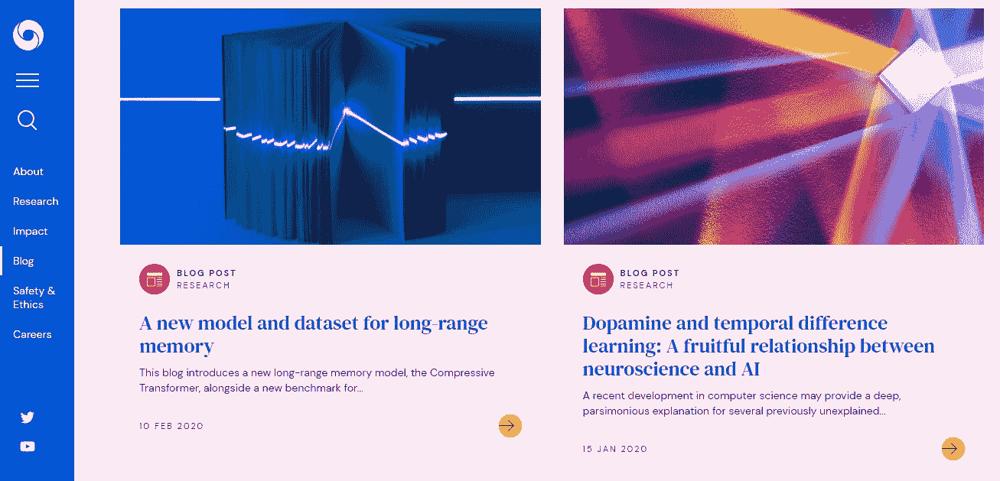
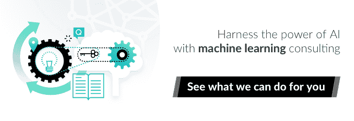
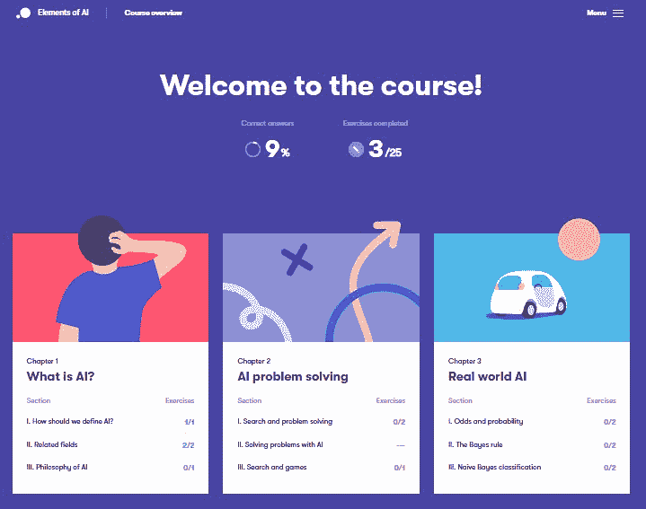

# 最好的机器学习博客和资源

> 原文：<https://www.stxnext.com/blog/best-machine-learning-blogs-resources/>

 机器学习是近年来最热门的词汇之一。一些人小声地说着这个词，对机器人接管的恐惧充斥着他们的头脑，而另一些人则对这一前景非常乐观。现实比这两个群体中的任何一个所设想的都更平凡，也更有希望。

机器学习经常与术语“人工智能”互换使用，它是关于使用预测算法来使生活变得更容易。想想当你没有食物时会告诉你的冰箱，知道在哪里打扫的 Roombas，以及实际上最大限度减少碰撞几率的自动驾驶汽车。这是生活质量的巨大提高，而且总是有需求的。许多公司已经[利用机器学习来获得优势](/blog//machine-learning-implementation-project-management/)，所以站在最新趋势的顶端是确保你的业务经得起未来考验的最佳方式。

我们意识到机器学习的内部工作可能是复杂和令人生畏的，如果你只是在没有准备的情况下深入研究它们，这就是为什么我们编辑了这个博客和资源列表。由于 Python 通常是机器学习成长的土壤，你可以说我们对这个主题略知一二。继续阅读，了解从哪里开始你的机器学习冒险，以及如何保持最新。

 

#### 博客

##### 1.KDnuggets

[https://www.kdnuggets.com/](https://www.kdnuggets.com/)

迄今为止，关于机器学习主题的时间最长、最受欢迎的博客之一。尽管它的用户界面看起来就像轮子发明时一样，但它仍然被广泛使用，这一事实表明，从长远来看，功能确实胜过形式。KDnuggets 定期更新丰富的信息内容，为初学者和中级用户提供指南，以及各种课程和活动的信息，可以让您快速了解机器学习的所有内容。

值得注意的帖子:  [商业智能数据集成方法初学者指南](https://www.kdnuggets.com/2020/03/beginner-guide-data-integration-approaches-business-intelligence.html) 是一个很好的例子，说明了 KDnuggets 的作者如何解释特定的机器学习相关概念及其实际实现。

##### 2.算法 a

[https://algorithmia.com/bloghttps://algorithmia.com/blogEDX](https://www.edx.org/)

如果你正在寻找一个博客，它会给你一个与机器学习相关的一切的良好纲要，Algorithmia 是一个很好的起点。这些西雅图的专家拥有相当丰富的知识储备，他们乐于在易于理解的博客帖子中分享这些知识。他们将帮助你了解人工智能最基本的方面以及更高级的概念。

值得注意的帖子:  [机器学习示例](https://algorithmia.com/blog/machine-learning-examples) 是一篇非常透彻的帖子，它很好地向入门级读者介绍了机器学习的概念。正如标题所示，它列出了实际机器学习实现的真实例子。

##### 3.中等

[https://medium.com/topic/machine-learningMachine 学习速成班](https://developers.google.com/machine-learning/crash-course/ml-intro)

Medium 托管了大量信息丰富的博客，它的机器学习部分特别有帮助。你马上会注意到的是轻松、熟悉的语气，例如像  [这样的文章，我是如何意外地创建了一个无限像素的 Hellscape](https://onezero.medium.com/how-i-accidentally-created-an-infinite-pixel-hellscape-fe070551365f) ，但不要让这种直接的印象欺骗你，以为这就是全部。通过业余程序员和行业专家撰写的频繁发布的文章，您会发现基于真实、实用知识的大量提示，为您在所有机器学习方面可能遇到的最紧迫的问题提供答案。

值得注意的帖子:  [人工智能如何改变谷歌地图](https://medium.com/swlh/ai-google-maps-79237f8946e3) 的故事是对机器学习对流行应用的广泛影响。这是一篇引人入胜的文章，展示了这项技术是如何产生巨大影响的。

##### 4.走向数据科学

[https://towardsdatascience.com/Pandas](https://pandas.pydata.org/)

由 Medium 主办的《走向数据科学》提供了大量由来自世界各地的投稿人撰写的高质量文章。一个由国际专家组成的专门团队负责审查社区撰写的内容，以确保发布的每一篇文章都值得您花费时间。你会发现整个部分都致力于机器学习和人工智能，每个部分都充满了高度教育的内容。

值得注意的帖子:这篇关于如何构建一个生成照片般逼真的人脸的应用程序的教程是走向数据科学的一个很好的例子。这篇文章是实用的，易理解的，而且研究得很好。

##### 5.蒸馏

[https://distill.pub/](https://distill.pub/)

称这个条目为博客是一种保守的说法。蒸馏一个在线研究期刊，提供关于机器学习的一些最新发展的信息。这意味着这里的内容会更高级一点，肯定会超出入门级，但它仍然以一种可访问的方式呈现。特别值得注意的是图形，高级而清晰的反应图完美地说明了文章中描述的有时令人困惑的过程。

值得注意的帖子:最近最好的帖子之一是一篇关于神经网络的  [可视化的帖子，它充分说明了图形的重要性。贯穿全文的各种图表很好地使这个复杂的问题变得更容易理解。](https://distill.pub/2020/grand-tour/)

##### 6.DeepMind 的博客

**[艾的 https://distill.pub/Elements](https://course.elementsofai.com/)**

**The DeepMind Blog**

如果你在找这方面的专家，最好是找那些每天都和它打交道的人。DeepMind 是一家英国 AI 公司，目前归谷歌所有。他们的帖子大多是与他们当前研究相关的报告和思考，所以通过密切关注博客，你可能会学到一些别人还没有谈到的东西。如果你厌倦了阅读，想听点别的，他们也有播客。

值得注意的帖子:感谢 DeepMind 的博客，你可以确切地看到人工智能如何通过其实际实施来改变世界。他们在  [WaveNet 技术上的帖子以及它如何帮助言语障碍者恢复他们的旧声音](https://deepmind.com/blog/article/Using-WaveNet-technology-to-reunite-speech-impaired-users-with-their-original-voices) 让你一窥机器学习改善生活的潜力。

##### 7\. The TensorFlow Blog

[https://www.tensorflow.org/Quora](https://www.quora.com/)

如果你已经准备好涉足更深的水域，Tensorflow 就是你要去的地方。博客部分非常技术性，绝对不适合绝对的新手，但即使你对这个主题更熟悉，并且正在寻找更具体的知识来帮助你磨练机器学习技能，这也是适合你的博客。它还提供带证书的课程，以提高你的企业在该领域的可信度。

值得注意的帖子:一篇关于 TensorFlow.js 的 [WebAssembly 后端的文章不仅解释了这个概念本身，还提供了如何使用 WASM 后端的详细说明。](https://blog.tensorflow.org/2020/03/introducing-webassembly-backend-for-tensorflow-js.html)

##### 8.PyImageSearch

[https://www.pyimagesearch.com/blog/](https://www.pyimagesearch.com/blog/)

库是机器学习的一个重要元素，但是你到底如何使用它们呢？PyImageSearch 提供了大量的案例研究和实际例子，可以帮助你以自己熟悉的速度学习所有关于图书馆的知识。博客上的教程可以变得非常详细，它们是关于图书馆的一些最好的信息来源。

值得注意的帖子:这些教程的一个很好的例子是关于  [OpenCV 的“dnn”模块与 NVIDIA GPUs、CUDA 和 cuDNN](https://www.pyimagesearch.com/2020/02/03/how-to-use-opencvs-dnn-module-with-nvidia-gpus-cuda-and-cudnn/) 的指南。通读这篇文章，你可以看到这些教程可以变得多么具体。博客文章本身对这个过程的每一步都有非常深入的细节，所以在文章结束时，你会确切地知道如何处理这个问题。

##### 9.奥赖利

[https://www.oreilly.com/radar/topics/ai-ml/](https://www.oreilly.com/radar/topics/ai-ml/)

有了 O'Reilly 的博客，很容易保持在行业趋势的顶端，因为他们的帖子通常来自领先的影响者。它将帮助您了解人工智能和机器学习是如何被企业实施的，为您提供确保您的业务保持相关性所需的灵感和工具。

值得注意的帖子:一个完美的例子是他们关于 2020 年科技领袖需要关注的  [5 个关键领域的文章。它提供了所有当前趋势的清晰画面，以及它们将如何影响您的运营。](https://www.oreilly.com/radar/oreilly-2020-platform-analysis/)

 

#### 其他资源

##### 1.卡格尔

[https://www.kaggle.com/](https://www.kaggle.com/)

也许机器学习对你来说听起来是一个很好的工具，但是你并不完全愿意花时间从头开始学习它。然而，你想作为一个公司来利用它，所以你仍然需要一些专家来为你处理它。幸运的是，Kaggle 在这里帮你解决这个问题。许多通过 Kaggle 提供服务起家的专家已经在该领域建立了自己的公司，使这个网站成为名副其实的人才温床。您可以通过组织竞赛来参与其中，确保您获得的代码和数据集是以最高的精确度创建的。

##### 2.EDX

[https://www.edx.org/](https://www.edx.org/)

EDXhas 为所有机器学习爱好者积累了无可挑剔的课程选择，无论他们是刚刚起步还是已经有了先进的知识。EDX 可以帮助你参加世界上一些最负盛名的机构主办的课程，并为你指出最有声誉的资源的方向。

##### 3.机器学习速成班

[https://developers . Google . com/machine-learning/crash-course/ml-intro](https://developers.google.com/machine-learning/crash-course/ml-intro)

学习机器学习的最好地方莫过于源头。谷歌的速成班正是它在电视上所说的，但这甚至还没有开始涵盖这一资源的纯粹效用。它被非常整齐地划分为由几个视频或文本形式的指南以及实践活动组成的单元。它们附带一个时间估算表，可以让你灵活地决定学习的时间和方式。

##### 4.熊猫

[https://pandas.pydata.org/](https://pandas.pydata.org/)

如果你正在寻找图书馆来开始你的机器学习努力，Pandas 绝对值得一看。基于 Python，熊猫于 2008 年开始开发。从那时起，它就是一个可靠的开源库，拥有许多有用的特性，比如快速有效的 DataFrame 对象数据操作、极大优化的性能和难以置信的灵活性。它非常适合学术和商业用途。

##### 5.用 Python 实现实用的机器学习

[https://www.youtube.com/watch?list = plqvvva a 0 qudfktos 3 keq _ kag 2 p 55 yrn 5v&v = ogxgnh 8 y2 nm](https://www.youtube.com/watch?list=PLQVvvaa0QuDfKTOs3Keq_kaG2P55YRn5v&v=OGxgnH8y2NM)

由 sentdex 主办的这一系列 YouTube 视频全面概述了机器学习及其实际应用。这门课程需要 Python 的知识，但是在这个过程中你会学到你需要知道的所有东西。如果你正在寻找视频格式的东西，这是一个既容易理解又详尽的完美指南。

##### 6.人工智能的要素

[https://course.elementsofai.com/](https://course.elementsofai.com/)

**Elements of AI**

风靡芬兰的人工智能速成班现在可以免费获得多种语言版本。每门课程结束时都有一个令人愉快的设计和简短的测验来测试你学到了多少，这可能是你将参加的最容易和最有效的课程之一。

##### 7.Quora

[https://www.quora.com/](https://www.quora.com/)

Quora 拥有几乎所有的信息，通常由该领域的专家直接提供。人工智能在这方面也不例外:你会发现一系列有助于你掌握技术的话题。有了关于  [机器学习](https://www.quora.com/topic/Machine-Learning)、  [人工智能](https://www.quora.com/topic/Artificial-Intelligence)、  [深度学习](https://www.quora.com/topic/Deep-Learning) 等等的问题，全部在一个地方回答，你就有了一个得心应手的即时知识来源。

##### 8.Reddit

[https://www.reddit.com/](https://www.reddit.com/)

就像 Quora 一样，Reddit 几乎有一个包含所有内容的子编辑。虽然它们不像 Quora 的主题那样广泛，但 Reddit 是一个可以帮助你自己解决问题的社区，也可以为非常模糊的事情提供定制指南。你可以从[r/machine learning](https://www.reddit.com/r/MachineLearning/)、  [r/artificial](https://www.reddit.com/r/artificial/) 、[r/learn machine learning](https://www.reddit.com/r/learnmachinelearning/)等等开始。

#### 最后的想法

众所周知，[机器学习是未来的](/blog//future-of-machine-learning-and-python-expert-opinions?_x_tr_sl=en&_x_tr_tl=ar&_x_tr_hl=ar&_x_tr_pto=sc)，对它的理解可能会决定你的业务是否会成功。

令人欣慰的是，这个话题非常吸引人，而且有可能改变世界的知识以易于理解的形式提供给你。即使你已经熟悉机器学习，这个领域的快速发展也意味着总会有新的令人兴奋的东西要学。

将我们的列表作为你的起点，无论你是在机器学习之旅的开始，还是在寻找更高级的资源。

既然如此，为什么不看看我们关于机器学习的文章呢？

*   [机器学习应用:4 个行业的 22 个以上的例子](https://stxnext.com/machine-learning-applications-examples-industries/)
*   [人工智能会取代程序员吗？](/stx-new-blog/will-artificial-intelligence-replace-developers/)
*   [教程:Python 机器学习入门](/stx-new-blog/getting-started-machine-learning-python/)
*   [专家对机器学习(和 Python)的未来有什么看法？](/blog//future-of-machine-learning-and-python-expert-opinions?_x_tr_sl=en&_x_tr_tl=ar&_x_tr_hl=ar&_x_tr_pto=sc)

如果您有任何问题，请随时通过  [给我们留言](https://stxnext.com/contact-us/)。

