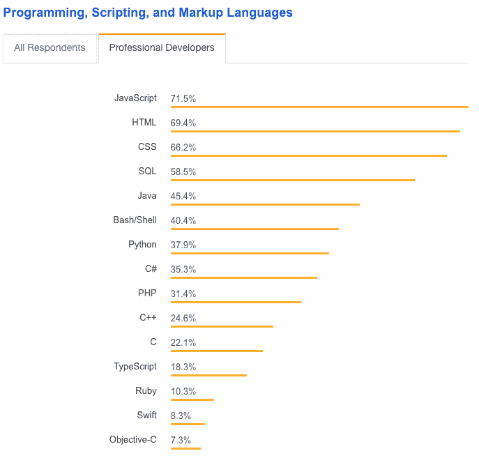
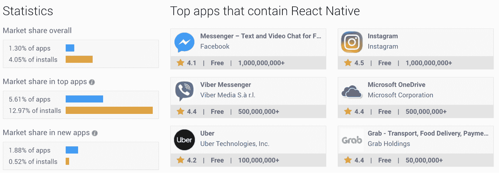
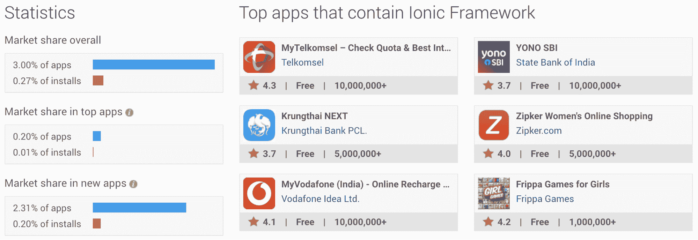
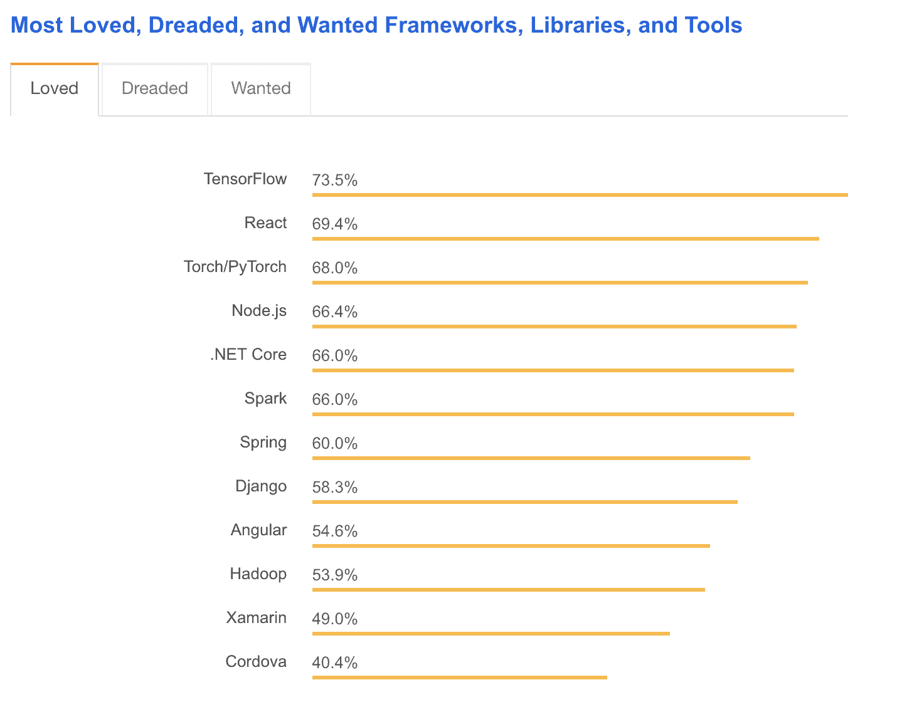
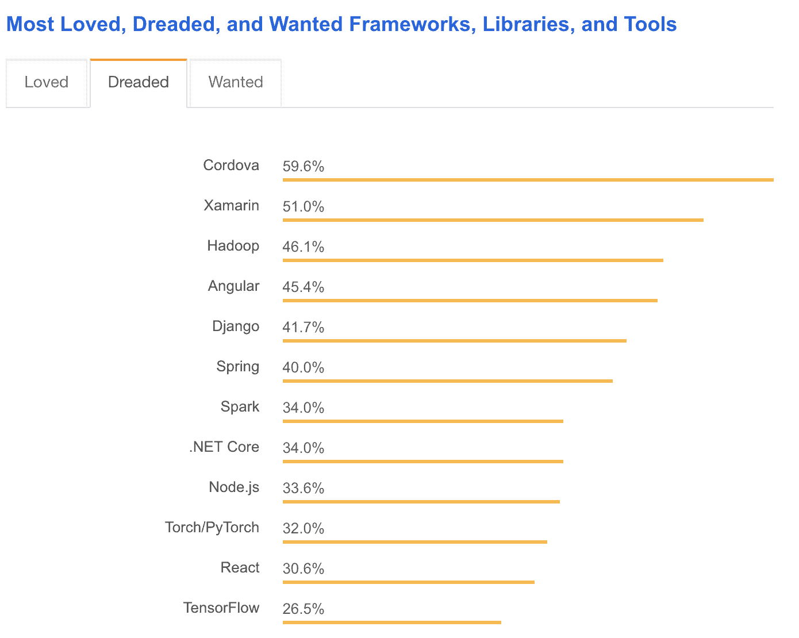
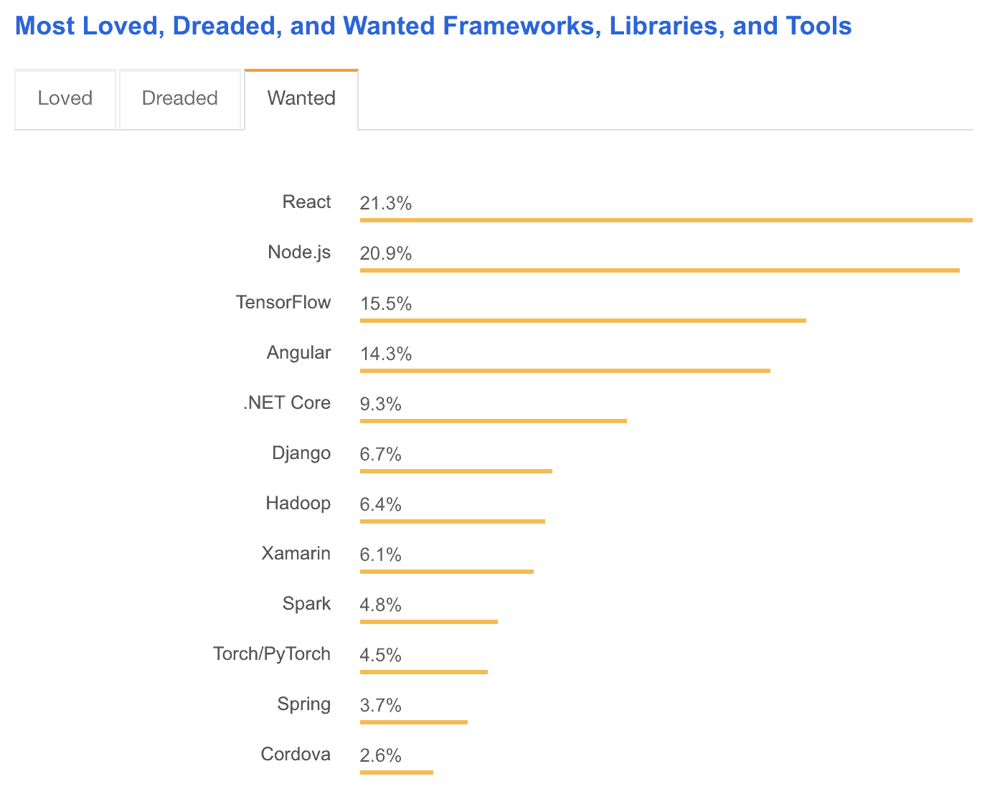

# 反应原生与离子:利弊比较

> 原文：<https://www.stxnext.com/blog/react-native-vs-ionic-comparison/>

 我们在博客上发布的许多“X 对 Y”的文章，像  [Python 对 Node.js](/stx-new-blog/python-vs-ruby-comparison/) 或  [Python 对 Java](/stx-new-blog/python-vs-java-comparison/) ，没有严格意义上的明确的。

然而，在 React Native 与 Ionic 的案例中，我们不是在比较苹果和橙子。就  [手机 app 开发](https://stxnext.com/services/mobile-development/) 来说，  [赢家很明显，是 React Native。](/stx-new-blog/why-use-react-native-your-mobile-app/)

诚然，Ionic 并不都是坏的，尤其是在某些用例中，但大多数时候它比  [React Native](https://stxnext.com/services/react-native/) 更糟糕。对此有两个例外:

1.  **你的开发团队中没有人熟悉 React**
2.  你已经有了一个基于 Angular 的 web 应用程序，可以用 Ionic 包装并分发到应用程序商店。

就你的预算而言，爱奥尼亚可能更有效率，但仅此而已。

请继续阅读，了解:

*   手机 app 开发的基本理论
*   **什么反应原生和离子都有，**
*   **他们在性能方面如何比较，**
*   **两者的优缺点。**

**** 

#### 混血儿与本地人

首先，我们需要区分 **混合应用和本地应用。** 它们是两组独立的移动应用程序，掌握它们之间的差异对于从本文中获得最大收益是必要的。混合应用和本地应用在许多方面都有所不同，包括:

*   用户体验
*   **表现，**
*   **特性，**
*   **，**
*   **开发成本和维护成本。**

##### **混合移动应用**

**混合应用基于网络技术——**，如 HTML、【CSS】和[JavaScript](https://stxnext.com/services/javascript-development/)——运行在一个名为 WebView 的移动平台上。它们不仅仅是单页应用(spa)或  [渐进式网络应用(pwa)](/stx-new-blog/progressive-web-apps-features-and-business-advantages/)，因为你可以用本地模块或插件来扩充它们。这使得混合应用程序具有移动浏览器不具备的功能，如摄像头、联系人或加速度计。

混合应用也可以有原生 UI 元素，就像原生移动应用一样。 然而他们大多数情况下拥有的只是一个原生的 UI 容器和里面的 WebView。

这可能导致用户体验比完全原生的移动应用稍差；毕竟，我们使用的是网页，用户界面的响应可能不如其本地版本。

如果你已经有了一个反应灵敏的单页应用程序，混合应用程序也更容易开发。 你可以将一个 SPA 封装在一个原生容器中，对其进行编译，并使其在 App Store 或 Google Play 上可用，像其他任何应用一样交付给最终用户。

##### **本地移动应用**

**原生应用依赖于完全原生的、特定于平台的 UI 组件**。 它们运行在为个人移动操作系统量身定制的元素上。理论上，这提供了最佳的用户体验。原生应用还提供更好的性能，更容易访问硬件传感器，以及更多现成的功能，如离线模式。

在过去，只有使用 Java for Android 和 Objective-C 或 Swift for iOS 等技术才能开发原生应用。因此，代码不能在这两个平台之间重用。这导致开发和维护成本增加。

此外，许多应用程序只能在一个平台上使用。比如 2010 年发布了 Instagram，但只是针对 iOS  [花了 2 年才发布安卓版](https://www.cnet.com/how-to/instagram-for-android-is-now-available/)。当然，当时 Instagram 远没有现在这么大，但仍有多达 43 万人注册了 Android 应用程序的等候名单。

在 21 世纪初，没有广泛使用的多平台移动应用程序开发工具，创建应用程序要困难得多。如果要同时在 iOS 和 Android 上发布，他们需要更大的预算和多个开发团队。

幸运的是，我们现在有选择。我们仍然可以使用 Java/Kotlin 或 Swift/Objective-C 来创建移动应用程序，但我们也可以通过使用多平台技术来简化软件开发过程。这几乎没有缺点。

#### 在移动应用开发中使用 JavaScript

移动应用不会消失。它们现在很受欢迎，而且这种需求在未来只会继续增长。由于移动浏览器有限的 API 和它们之间的差异，你不能用 web 应用程序做所有的事情。有时候，用户体验才是最重要的。

React Native 和 Ionic 都允许你使用 JavaScript 创建移动应用。 两者都是多平台的，比完全原生开发要划算得多。

[以下是 Stack Overflow 报道的关于专业开发人员使用的编程语言的一些统计数据](https://insights.stackoverflow.com/survey/2018/#most-popular-technologies) :

您会注意到 JavaScript 的用户比 Java、Swift 和 Objective-C 加起来还要多。这不是巧合。

**JavaScript 被公认为最通用的编程语言**。 多用于 web 开发，也用于后端(Node.js)、移动(React Native)，甚至桌面 app(Electron)。

使用 JavaScript 的框架通常对开发人员来说起点较低，因为它们不需要先学习特定的编程语言(假设开发人员已经知道 JavaScript)。

选择错误的编程语言会带来可怕的后果。 那就是旋舞的一个例子，一个直接对竞争对手做出反应的土著。Dart，Flutter 使用的语言，是一个不受欢迎的选择，因此它被认为是 Flutter 最大的缺点之一。

关于理论已经说得够多了。我们知道自己的立场，所以我们来详细讨论一下 React Native 和 Ionic。

#### 什么是 React Native？

**React Native 是一个允许你使用 JavaScript** 创建原生移动应用的框架。 它基于 React——前端开发中最流行的技术之一，也是开发人员最喜欢的技术之一。无论是 React[还是 React Native](https://stxnext.com/services/react-native/) 都是开源的，有脸书做后盾。

React Native 于 2015 年开源，此后一直快速增长，获得越来越多的市场份额和开发者支持。2018 年 2 月，  [脸书在开源社区的强烈反对下，将许可从 BSD+Patents](https://medium.com/@paulhyunchong/react-native-is-not-under-the-mit-license-54308f8b26ed) 改为 MIT。这使得 React Native 成为一个安全的选择，无论您打算如何使用它。

尽管 React Native 使用 JavaScript，但它不依赖于 HTML 或 CSS，也不基于混合应用程序开发方法。相反，它用 JavaScript 代码给出纯本机结果。使用 React Native 创建的应用程序与使用 Java、Swift 或 Objective-C 构建的移动应用程序没有区别，这是因为桥接了本机线程和 JavaScript 线程。

**React Native 遵循“学一次，到处写”的原则。** 表示框架尊重平台间的差异，你可能需要在 iOS 和 Android 上不同地实现某些特性。就提供最佳用户体验而言，这是一件好事，尽管这可能会增加开发成本。

#### 反应本机性能:统计数据和流行度

[查看这些统计数据](https://www.appbrain.com/stats/libraries/details/react_native/react-native)，我们可以得出结论，尽管 React Native 仅被相对较小比例的应用程序使用(整体 1.3%，500 强应用程序 5.61%)，但这些应用程序比其他应用程序更受欢迎(整体安装量的 4.05%，500 强安装量的近 13%)。

基于此，我们可以说  **选择 React Native 直接影响 app 的人气和成功率。** 此外，这些顶级应用的用户评分都很高——超过 4.0。

虽然 React Native 因其成本效益而在初创公司中非常受欢迎，但它也广泛用于市场上最大的公司。像 Facebook Messenger、Instagram 或 Skype 这样的应用程序已经被下载了超过一次  *十亿次* 。

这些应用背后的科技巨头——脸书、微软、Airbnb 等。—还通过提供帮助、专业技能和生产就绪模块来支持开源社区。这意味着 React Native 只会继续增长，被越来越多的人使用 STX Next 也是如此，在诸如  [Zappi](https://stxnext.com/portfolio/zappi/) 这样的项目中。到这里来学习

 

#### 什么是爱奥尼亚？

**Ionic 是一款面向 web 开发者的混合移动应用开发平台。** 于 2013 年推出，它允许你在移动、网络和桌面应用之间创建共享代码库的应用。

Ionic 使用与 web 相同的技术，包括 HTML、CSS 和 JavaScript。  **与 React Native 不同，Ionic 遵循“一次写入，随处运行”的原则。** 这意味着用 Ionic 编写的 app 可以很容易地在环境之间移植。

使用 Apache Cordova 和 PhoneGap 访问原生功能，用 Ionic 创建的混合应用程序在功能方面比 web 应用程序强大得多，同时仍然使用 web 技术。

自 2013 年以来，Ionic 已经走过了漫长的道路，成为现在这样一个现代、成熟的框架。如今，它与 Angular——React 的最大竞争对手，仅次于 Vue.js 紧密相连。

#### 离子性能:统计和普及

**[根据这些图表](https://www.appbrain.com/stats/libraries/details/ionic/ionic-framework)， Ionic 比 React Native** 应用更广泛(所有 app 中有 3%使用 Ionic，1.3%的 app 使用 React Native)。然而，如果我们比较应用安装方面的市场份额，React Native 遥遥领先(React Native 为 4.05%，Ionic 为 0.27%)。

如果我们只看排名前 500 的应用程序，差距会变得更大:Ionic 只占应用程序总安装量的 0.01%，而 React Native 接近 13%。不过，这种比较可能有点不公平，因为仅 Facebook Messenger 的下载量就可能超过所有排名最高的 Ionic 应用的总和。

对于新应用，Ionic 的成功率也较低(应用安装率为 0.20%，而 React Native 为 0.52%)，使用每种技术的应用数量相当。

#### 面向未来的移动技术体系

当您为未来产品选择技术组合时，选择满足您特定需求的技术非常重要。然而，搭配一些  **流行、广泛使用、深受喜爱的东西也可能是有益的。**

这不仅仅是为了让开发人员的生活更轻松。更受欢迎的技术获得更多关于堆栈溢出的有价值的问题和答案。也有更多的教程和课程提供给他们。

这种社区支持使你在困难的时候更容易找到帮助，这可以大大加快你的发展进程。与小众技术相比，  [也更容易找到并招募流行技术的开发者](https://stxnext.com/ebooks/ultimate-guide-hiring-software-engineers/) 。

此外，  **受欢迎程度是一个很好的指标，表明哪些工具会继续存在，或者在不久的将来会变得重要。** 它确保你的选择从长远来看会有回报。

毕竟，没有人愿意投资一种基于技术的产品，这种产品迟早会过时。

 

#### 开发者更喜欢 React Native 还是 Ionic？

栈溢出是开发者  **通过问答学习和分享知识的地方。** 每年，栈溢出都会进行一次开发者调查。

2018 年，超过 100，000 名开发人员参与了调查，对技术的现状给予了很大的反馈。该调查涵盖多种主题，包括  **数据库、平台和框架选择。**

调查的一部分特别引起了我们的注意，即  [“最喜欢、最害怕和最想要的框架、库和工具。”](https://insights.stackoverflow.com/survey/2018/#technology-most-loved-dreaded-and-wanted-frameworks-libraries-and-tools)

这个名字可能不会脱口而出，但这是因为该部分包罗万象的性质。它不仅涵盖了前端或移动框架，还涉及了各种其他用例中最流行的框架、技术和工具。

另外，它也是决定开发者更喜欢反应自然还是离子的关键。

##### **最受欢迎的框架、库和工具**

****

可以看到，  **React 是最受喜爱的前端技术**—仅次于 TensorFlow，后者是一个  [机器学习](https://stxnext.com/services/machine-learning/) 框架，因而不是 React 的直接竞争对手。

另一方面，Cordova(Ionic 的基础)是开发人员最不喜欢的主要框架。诚然，爱奥尼亚和科尔多瓦不是一回事，但事实上一个使用另一个意味着我们需要记住这两者之间的关系。

此外，Ionic 还与 Angular 相结合，Angular 在图表中的排名也低于 React。虽然 React Native 没有出现在列表中，但可以肯定的是，它的得分与 React 相似，因为它是基于 React 的，并且遵循相同的架构。

##### **最可怕的框架、库和工具**

****

相反，Cordova 被认为是开发人员最害怕的技术，而  **React 是所有前端框架和库中对开发人员最友好的。** 棱角分明在图表上也相当高，令 45.4%的开发人员感到恐惧。

React 的流行对它非常有利。即使开发人员在实现功能上有困难，他们也很容易在网上找到信息来帮助解决他们的问题并继续编码。

##### **最想要的框架、库和工具**

****

最后这张图表显示了开发人员希望学习或认为他们应该在不久的将来学习的技术。

几乎没有人对科尔多瓦表现出任何兴趣，这强烈表明这项技术没有光明的未来。 **反应过来似乎是最优的选择，后面带点棱角。**

现在我们已经确定了开发人员的偏好，让我们仔细看看 React Native 与 Ionic 相比如何。我们将列出每种方法的优点和缺点。

#### React Native 的利与弊

鉴于它是我们首选的移动应用程序开发解决方案，我们相信 React Native 有很多优点。我们使用该框架编写的软件产品之一是  [【网球对决】](https://stxnext.com/portfolio/deuce-tennis/)。你可以在这里阅读所有相关内容:

 

##### **React Native 的优点**

React Native 的主要优势如下:

*   **使用 JavaScript 创建全原生移动应用**

此外，用 React Native 编写的应用程序的性能与使用 Java、Objective-C 或 Swift 创建的完全原生的应用程序相当。

*   **庞大的发展社区**

这同样适用于 React。

*   **加速发展**

有了 Live Reloading 这样的工具，只要原生代码没有改变，就不需要重新编译应用。

*   **易缩放**

这要归功于 React 基于组件的架构。

*   **大量的工作机会**

该框架有一个非常有前途的未来，工作机会比率因此倾向于本土的优势。

*   **广泛使用的**

尤其是最受欢迎的应用程序。

*   **“学一次，用处处”**

遵循原则尊重平台之间的差异。比如操作系统中的权限处理，在 iOS 和 Android 中就有很大的不同。编写同时处理两个系统并涵盖所有极限情况的代码是根本不可能的。

在导航、手势处理、输入类型等方面也有差异。如果受到尊重，它们会提供更好的用户体验，并与操作系统无缝集成。

*   **比混合应用** 更好的用户体验
*   **用 Java、Objective-C 或 Swift 编写代码时得心应手**
*   **能够为 Android 和 iOS 应用程序共享超过 95%的 JavaScript 代码库**

*   **[麻省理工学院许可下开源](https://opensource.org/licenses/MIT)**

##### **React Native 的缺点**

不管 React Native 有多棒，它也不是没有缺陷。

React Native 的主要缺点如下:

*   **“学一次，用处处”**

虽然这个原则有很多优点，但它也意味着有时在两个平台上使用相同的方法是不可行的。

*   **需要你的开发者提供一些移动开发知识**

这里的一些技术示例包括 Xcode、CocoaPods、Gradle、basic Objective-C 和用于本地代码集成的 Java 语法。了解 iOS 和 Android 之间的平台差异，以及特定操作系统内的不同版本，会非常有益。

*   **某些关键特性的开源模块有时会被抛弃**

这迫使开发人员寻找或创建一个分支来提供与 React Native 最新版本的兼容性。

*   **略陡的学习曲线**

好消息是，这可以通过使用 Expo 这样的工具来缓解。它允许您创建 React 本机应用程序，而不需要集成甚至没有任何本机代码。Expo 的主要缺点是其有限的 API，这使得它不可能添加比所提供的更多的开箱即用的本机功能。

*   **React 和 React Native web 项目之间只有一部分代码可以重用**

#### 爱奥尼亚的利弊

我们已经说得很清楚了，我们更喜欢自然反应而不是离子反应。然而，这并不意味着离子没有好处。

##### **离子的优点**

以下是爱奥尼亚的主要优势:

*   **独立平台**

它可以在手机、网络和桌面上运行。

*   **采用网络技术**

这使得 web 开发人员更容易学习。

*   **增强网络技术**

它允许使用本地移动功能。

*   **比 React Native 更清晰的文档**

所有原生模块都在一个地方，而不是分散在 GitHub 各处。

*   **麻省理工许可下的开源**

##### **离子的缺点**

不幸的是，Ionic 的缺点可能足以掩盖它的优点。

以下是爱奥尼亚的主要缺点:

*   **比反应过来的土著更小的群落**

这使得解决问题和获得帮助变得更加困难。

*   **依赖科尔多瓦**

退一步说，我们已经知道 Cordova 不是对开发人员最友好的平台。

*   **比完全原生解决方案更差的用户体验**

#### 最后的想法

尽管 React Native 总的来说优于 Ionic，但仍有一些因素可能会影响您的选择:

1.  React Native 和 Ionic 之间的选择很大程度上取决于您的开发团队的技能组合。
2.  如果用户体验和整体性能是你的首要任务，  **选择 React Native。**
3.  如果你需要更复杂的原生功能，如蓝牙或后台地理定位，  **也可以使用 React Native。**
4.  如果你已经有了一个反应灵敏的单页应用程序或渐进式网络应用程序，并希望你的移动应用程序覆盖大致相同的功能，只需稍加添加，  **可以考虑试试 Ionic。**
5.  如果你需要在有限的时间内和有限的资源下开发 web 和移动应用程序，但移动功能有限，  **也可以考虑试试 Ionic。**

最终，一如既往，选择权在你。

* * *

非常感谢您阅读我们的帖子。React Native 是一个令人兴奋的框架，我们非常高兴能够参与其中并撰写相关文章。

我们最近发布了许多用 React Native 编写的软件产品，其中最主要的是和[平手](https://stxnext.com/portfolio/deuce-tennis/)。前往  [我们的产品组合](https://stxnext.com/portfolio/) 了解我们为他们提供的服务的更多信息。

如果您想与我们讨论您自己的移动发展计划，  [请点击这里](https://stxnext.com/services/mobile-development/)。

