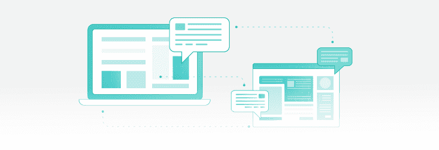

# UX 设计:STX 产品设计主管的问答

> 原文：<https://www.stxnext.com/blog/ux-design-q-and-a-head-product-design-stx-next/>

 我们喜欢深入探讨我们在博客上处理的所有主题，但偶尔采取更广泛的方法会有所帮助。

例如，当我们在网上搜索我们能帮你解决的问题时，我们遇到了许多围绕 UX 设计的问题。

幸运的是，我们在 STX Next 有一个非常能干的  [产品设计团队](https://stxnext.com/services/product-design/) ，由 Wiktor Pawlik 掌舵。

Wiktor 总是很乐意与任何提问的人分享他的知识，所以我们坐下来与他进行了一次简短的问答&。结果就是这个帖子。

***请继续阅读，从维克特的角度了解 UX 设计** 。*

** 

#### 什么是 UX 设计？

“UX 设计”代表“用户体验设计”这是改善用户与你的产品互动方式的过程。

这个定义看起来很简单，但它背后的实际意义是什么呢？

“用户体验”是一个如此宽泛的术语。 **你不可能真的设计 UX；只是*是。***

UX 之所以被称为“被设计”，是为了让它成为产品设计过程中不可或缺的一部分。

但是  **用户体验不是你创造的。你的用户将永远对你的产品有*和*的体验。问题是你是否足够重视，让这种经历变得积极。**

UX 设计不是产品开发的众多“阶段”之一。 你全面地思考 UX，不断地改进它，永远把它保留在你的后脑勺。

产品开发团队的每个成员——业务分析师、开发人员、用户界面设计师、营销人员——都参与了 UX 的形成过程。最终结果是整个团队努力的总和。

UX 设计师的角色是确保用户体验被考虑到每一步，但他们不是唯一负责的人。

#### 谁是 UX 设计师？UX 设计师是做什么的？

就像我说的，用户体验是所有团队成员的责任。这决不能归咎于一个人。

设计团队也是如此——没有“UX 独角兽”会为你处理一切。 这种方法根本行不通。你需要一群人，每个人都专注于他们自己的用户体验设计方面，比如交互、视觉设计、信息架构、动作设计等。

然而，大多数团队也有指定的 UX/UI 设计师。通常是 UI 设计师，他们处理从低到高的事物，一直到有颜色和细节的特定界面。

但是为什么 UX 设计师是一个独立的职位呢？

这个问题并不像看起来那么明显。就连 UX 设计师的工作要求也不明确。不同的人理解不同。

然而，最重要的是，**UX 设计师站在用户的角度。**

他们的责任是确保团队在设计产品的每一个方面时，不会忽略最终用户的观点。 **了解用户的需求是 UX 设计师的主要关注点。**

在小型产品团队中，通常最有效的方法是让产品设计师参与进来——这个人同时将用户  *和* 放在心上。每个团队都是不同的，每个产品也是如此，你需要合适的人来做这项工作。

 

#### 你的 UX 设计流程是什么？

首先，  **没有单一的用户体验设计“流程”**

塑造你思考设计的方式的某些指导方针确实存在，但是它们不会以一个规则手册的形式出现。

设计思维——开发设计概念时使用的解决问题的过程——就是这样一个框架，尽管它取决于你的过程设置。

无论你的设计师是在产品公司工作还是在软件公司这样的机构工作，你个人的 UX 设计过程主要取决于给定产品的开发阶段。

让我们考虑两种不同的情况:

##### 1.您正在从头开始构建产品。

在这里，你在验证假设。启动方法是非常快速地验证每一个假设。但这并不容易。

这也使得与最终用户的沟通成为问题，仅仅因为你还没有任何沟通。你基本上是在假设谁是用户，并期望他们以某种方式使用你的产品。

您可以执行前期用户研究，创建用户组的原型(原型人物角色)，但这再次意味着您需要更多的假设。尤其是在 MVP 开发阶段，当你试图尽可能地削减成本时。

你可以采取的另一个步骤是用户测试。你向你的目标用户展示你所拥有的东西，看看他们如何与之互动。由此可以得出有价值的观察结果。

##### 2.这种产品在市场上可以买到。

[当产品已经存在时，您的工作会变得更容易一些](/stx-new-blog/how-leverage-ux-analytics-data-driven-product-design/)，因为您不再需要假设，而是可以利用您现有的用户数据库快速验证解决方案。

当产品处于活动状态时，您也有可以用于您的目的的分析数据，例如 A/B 测试。你可以在一群人身上测试产品，而不是一个假设的样本。

#### 怎样才能成为一名优秀的 UX 设计师？

许多因素需要聚集在一起才能形成一个好的 UX 设计师。

技巧。天赋。好奇心。

总是看到进步的空间。

对更多的渴望。

用户体验设计是无止境的追求。每个角落都有新的发展。  **一个好的 UX 设计师从不停滞，从不停止追逐下一个最好的东西。**

这种永不满足的不断学习的欲望是珍贵的。结合理论和实践准备，它给你一个非常坚实的基础。

成为一名优秀的 UX 设计师的另一个基本方面是经验。

这是没有办法的:成为真正擅长 UX 设计的人，始于并止于多次尝试设计伟大的东西，并在这个过程中学习如何去做。

不管你的 UX 设计师有多好，没有什么能胜过经验。

然而，还有一个更重要的品质最重要:  **移情**。如果不理解和同情用户的需求和问题，要成为一名优秀的 UX 设计师是不可能的。

#### 哪个应用程序的 UX 设计最好？

没有一款应用拥有“最佳”的 **UX 设计，因为 UX 天生就是主观的。**

顾名思义:用户体验是一种  *体验。* 和我们经历的事情都不一样。

任何满足给定目标群体需求的 UX 都可以被认为是好的 UX。

从我的角度来看，优步是一个伟大的 UX 应用程序的例子。它完全符合我的需求，我喜欢这款应用的设计方式，也乐于使用它。

然而，对其他人来说，情况可能完全不是这样。

#### UX 设计师应该具备哪些编程技能？

简而言之，一个 UX 设计师应该有前端知识，或者更具体地说，意识到前端的限制和能力。

GUI(图形用户界面)是 UX 设计师工作的基石。大多数产品都有界面，所以这是你最需要设计的。这就是为什么 UX 的焦点通常归于用户界面设计。

通常情况下，UX 的设计师不需要真正的  *编程技能* 而更需要 T 型方法——他们必须是自己领域的专家，拥有其他专业领域的一般知识。

UX 设计师的核心职责是理解正在进行的工作。 因此，假设他们是 UI 设计师，他们应该熟悉 HTML 和 JSS。

然而，只有当用户界面设计者是 UX 设计的一个运行点时，以上所有才是真的。如果一个研究人员的任务是处理 UX，他们不会做用户界面设计本身，而是验证假设。

在他们的案例中，  [分析工具](/stx-new-blog/how-leverage-ux-analytics-data-driven-product-design/) ，如  [Hotjar](https://www.hotjar.com/) 、[Google Analytics](https://analytics.google.com/analytics/web/)或[full story](https://www.fullstory.com/)将是基本技能，与最终用户一起运行适度测试的能力也将是至关重要的。

#### UX 最好的设计实践是什么？

客观地说，我不知道什么是“最好”，但我能想到两个好的 UX 设计实践的例子:

##### 1.尼尔森试探法

Jakob Nielsen 开发的启发式评估可以帮助你评估用户体验的质量。我们自己也用它们偶尔进行 UX 审计。

尼尔森试探法的主要重点是始终牢记最终用户的观点。

我们永远无法按照我们这些设计者希望的方式来设计体验，即使我们适合目标群体，因为我们不是客观的用户。更不用说我和我的产品设计团队在 STX 下一个 工作的很多产品  [我们永远不会使用。](https://stxnext.com/services/product-design/)

这就是为什么，作为 UX 的设计师，我们不能把我们的主观感受应用到产品上。但是，任何可以作为指导我们的一般原则的东西都会派上用场——这正是尼尔森的启发法的价值所在。

##### 2.WCAG 标准

网站内容可访问性指南是帮助您提高数字产品可访问性的标准。它们有助于对抗数字排斥，这应该是市场上任何 B2C 产品的优先事项。

通过遵循一系列可归结为 4 条原则的规则，WCAG 标准确保您的软件产品:

*   可感知的，
*   可操作的，
*   可以理解，
*   健壮。

虽然这些对于任何产品来说都是很好的指导方针，但是对于公共部门的所有产品来说都是必须的。

 

#### UX 设计师的最佳灵感来源是什么？

简单地说，这是一切与 UX 设计无关的东西。

人们很容易陷入 UX 思维的无尽循环中。如果你过于缩小视野和关注范围，你就有耗尽新想法和创造力的风险。最终，您可能会重复和重用相同的解决方案和方法。

避免这种情况的最快方法是从外面看问题。仅仅为了欣赏而探索其他设计师的作品。 **以一个旁观者的角度去观察好的设计，而不是设计师。**

无论是工业设计还是建筑都没什么区别。同样的道理也适用于拓宽你在上述 T 型技能组合中的专业知识；探索产品管理、开发和营销等。

至于具体的 UI 设计灵感，我个人喜欢使用  [Uplabs](https://www.uplabs.com/) 来忘记我目前正在做的事情，只是浏览一下别人设计的伟大概念。

它帮助我理清思路，从人们每天完成的无限可能中获得灵感。

#### 最后的想法

*感谢您阅读我们的 UX 设计 Q & A.*

这里的答案只是触及了 UX 设计的皮毛。我们挑选了我们认为你最有可能问的问题。在不久的将来，我们计划发表一篇关于雇佣 UX 设计师的更全面的文章——敬请期待！

但是也许你会对其他的东西感兴趣？你有什么特别想让我们讨论的吗？请在下面的评论区告诉我们。

与此同时，请随意查看我们其他面向设计的博客文章:

*   *[如何利用 UX 分析进行数据驱动的产品设计](/stx-new-blog/how-leverage-ux-analytics-data-driven-product-design/)*
*   *[软件产品设计:好的 UX 投资回报率是多少？](/stx-new-blog/software-product-design-roi-good-ux/)*
*   *[申请表设计:最佳实践和关键要素](/stx-new-blog/application-form-design-best-practices-and-key-elements/)*

你也可以看看我们的产品设计团队在  [行为](https://www.behance.net/STXNextTeam)上的工作，或者浏览我们的  [作品集](https://stxnext.com/resources/product-design-portfolio/)。

**