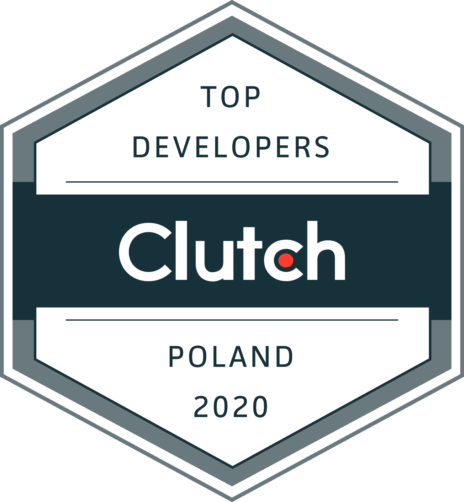
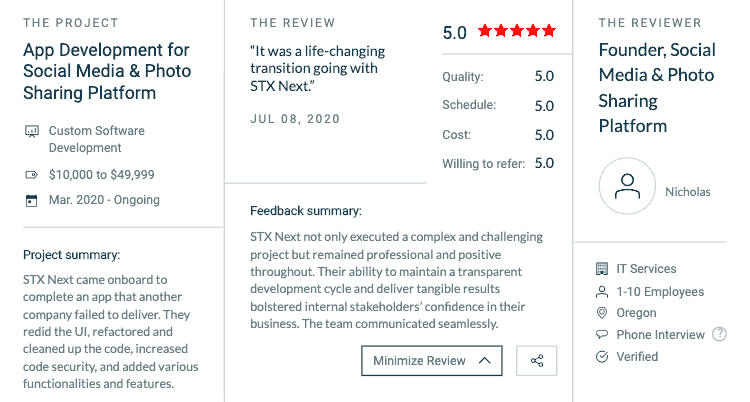

# STX Next 赢得波兰顶级网络和定制软件开发商大奖！

> 原文：<https://www.stxnext.com/blog/stx-next-wins-clutch-award-top-web-custom-software-developer-poland>

 当你的网站或软件代表你的业务时，关键是 [找到一个可以帮助你利用顶级技术趋势的合作伙伴](https://www.forbes.com/sites/forbestechcouncil/2018/12/04/how-to-successfully-outsource-software-development/#4770927a7ef5) 。一个理想的供应商将使你从竞争对手中脱颖而出，并帮助你站在行业的最前沿。

也就是说，外包开发不是一项简单的任务。如何在开发人员的海洋中导航？这不是一个容易做出的选择，尤其是当你的时间和资源岌岌可危的时候。

这就是客户评论的用武之地。客户评价给像我们这样的公司带来了可信度，证明我们是任何开发项目的优质竞争者。 

#### 离合器上的下一个 STX

我们许多满意的客户可以证明我们精湛的开发专业知识。他们的精彩评论在 B2B 评级和评论网站 Clutch 上展示。我们在 Clutch 的 [波兰](https://clutch.co/developers/python-django) 领先开发者名单中打头阵，并且拥有一个不断增长的优秀客户评价数据库。

此外，Clutch 刚刚宣布我们是波兰的顶级开发商！

#### 我们对该奖项的评论

这是巨大的。离合器的研究人员团队分析了该地区数百家公司，我们击败了许多有才华的竞争对手。

我们的业务发展总监 Matthew Harris 听到这个消息非常激动:

*“我很高兴看到 STX Next 在定制软件开发和网页开发方面再次跻身波兰顶级开发商之列。我们的多功能性是客户对我们离合器产品评价如此之高的部分原因。”*

我们在 STX Next 分享他的兴奋。

STX Next 是一个主要的 Python 发电站，它随时提供超过 200 名 Python、JS、React Native 和全栈开发人员来执行您的下一个项目。我们专注于非凡的代码和敏捷开发实践。

#### 示例回顾:社交媒体平台的开发

在最近的一个项目中，我们创建了一个社交媒体和照片共享平台的旗舰应用程序。我们做了客户以前的提供商做不到的事情:提供简化的 UX/用户界面，集成复杂的功能，并确保高水平的代码安全性。

我们能说什么呢？我们的工作超出了客户的期望！

客户满意是我们最优先考虑的事情，所以听到这些赞美的话，我们非常激动。

你可以在我们的离合器页面上找到我们的其他精彩评论。很快就会清楚，我们是您下一个开发项目的最佳选择。来  [聊一聊今天的](/hire-us) ！