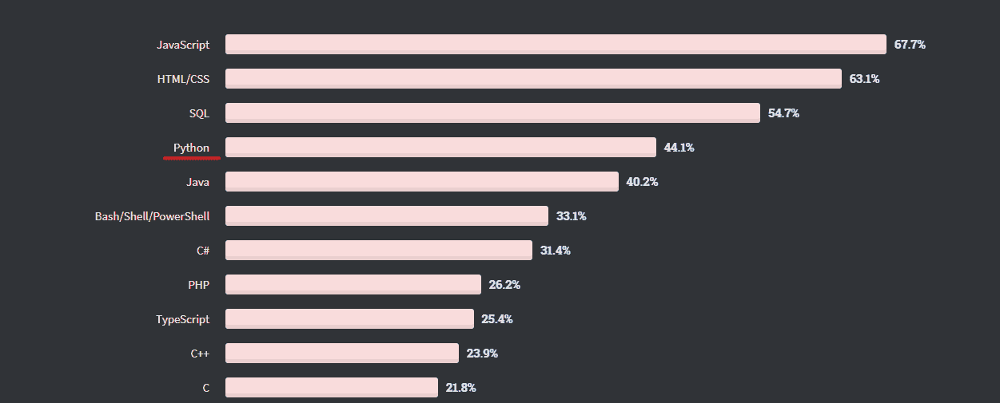

# 为什么使用 Python 进行 Web 开发？优点、缺点和商业利益

> 原文：<https://www.stxnext.com/blog/python-for-web-development/>

 当你想到 web 开发时，你会想到什么？

是单纯的商业网站吗？是个人博客吗？是像脸书一样的社交媒体巨头吗？也许是所有这些东西？

Web 开发就是网络上的软件。它可以是任何东西，只要您可以通过 web 浏览器(或命令行界面)访问它。

说到商业软件，web 开发可能意味着 CRM 或 ERP 的应用程序，有时一个公司可能需要一个定制的 CMS。web 开发中最流行的用例是带有博客的商业网站。有很多很棒的技术可以用来建造这些东西。

那么，为什么要为您的 web 项目选择 Python 呢？什么时候这样做有意义？你在正确的地方找到了所有这些东西，所以请继续阅读。 

#### 为什么选择 Python 进行 web 开发项目？

以下是支持使用 Python 进行 web 开发的论据列表:

##### Python 是成熟和安全的

Python 在 90 年代就已经出现了。这是 Python 最初的创造者吉多·范·罗苏姆近 30 年的持续改进，直到最近。

对于一些开发人员来说，成熟、稳定的技术可能很无聊，但它们确实有效。一个有经验的 Python 程序员确切地知道这种语言的强项和弱项。没有必要重新发明轮子或变得有创造性，开发者可以很容易地找到常见问题的解决方案。

这非常方便，尤其是当您需要您的 web 应用程序尽可能安全时。 [Python 经常被用在 fintech](https://www.stxnext.com/blog/why-python-should-be-technology-choice-your-fintech/) 中，因为它非常适合处理大量数据，而且相对容易(对于一个高级开发人员来说)做出一个具有军用级别安全性的密闭 app。

##### 每样东西都有一个 Python 库

你的网站需要漂亮的情节吗？开发者可以雇佣 [Matplotlib](https://matplotlib.org/) 来负责生成它们。

也许你的 web 应用程序需要机器学习功能？还有 [TensorFlow](https://www.tensorflow.org/) ，世界上最流行的 ML 库。

或者，更具体地说，您需要 SQL 的强大功能，但需要 Python 代码吗？还有 [SQLAlchemy](https://pypi.org/project/SQLAlchemy/) ，每月只有 2500 万次下载，没什么大不了的。它是一个库，为您提供了久经考验的企业开发模式的力量，以便使用 Python 快速简单地访问数据库。

[Python 包索引](https://pypi.org/) 超过 30 万个项目。它们从小型的库到大型复杂的工具都有。 [有一个什么都有的库](https://www.stxnext.com/blog/most-popular-python-scientific-libraries/) ，包括很多小众的 web 开发用例。

我们需要为这些工具中的一个单独的点，Python 的 web 开发秘密武器: [Django](https://www.stxnext.com/services/django-development/) 。

##### Python 有 Django

[Django](https://www.djangoproject.com/) 是 Python 的主要 web 开发框架。这是一个非常有用的库集合，集合在一起形成一个非常灵活、强大、全面的平台，用于构建任何类型的 web 应用程序。哦，它被许多其他主要互联网公司的 [Instagram](https://instagram-engineering.com/web-service-efficiency-at-instagram-with-python-4976d078e366#:~:text=Instagram%20currently%20features%20the%20world's,is%20written%20entirely%20in%20Python.) 使用。

它做了一个伟大的框架应该做的事情:它消除了构建和粘合组成 web 服务器所需的所有部件的痛苦。开发人员可以专注于创造性的高要求任务，而不是低影响的基本问题。

另外，如果有人真的不喜欢 Django，但想要一个 Python web dev 框架，还有 [Flask](https://flask.palletsprojects.com/en/2.0.x/) ，这有点像 Django 的对立面。这是一个微框架，所以它的现成部分比 Django 少得多，但是它更灵活。

从业务的角度来看，[Django 和 Flask 的主要区别是风险管理](https://www.stxnext.com/blog/flask-vs-django-comparison/) —Django 可以覆盖更多开箱即用的用例，因此可以节省您的时间，而 Flask 需要更多时间来适应不断变化的需求。

##### 有很多 Python 开发者

根据 2020 年堆栈溢出调查显示，它是第二受欢迎的通用编程语言，不如 JavaScript 和其他两种基本的 web 技术——HTML/CSS 和 SQL。

**资料来源:2020 年堆栈溢出开发者调查**

然而，这并不意味着在调查中选择 Python 的所有开发人员都是高级开发人员，他们选择的主要工具是 Python。用 Python 构建 web 后端是一个非常常见的用例，但是很多开发人员在日常工作中以其他方式使用 Python，例如:

*   自动化过程，如网页抓取或数据分段，
*   将使用各种技术构建的不同 API 和组件粘合在一起，
*   可视化数据。

然后是人工智能和机器学习。Python 确实在这一领域独占鳌头。它是目前用于人工智能和人工智能的主要语言，而 [专家表示，它将继续主导](https://www.stxnext.com/blog/future-of-machine-learning-and-python-expert-opinions) 。

鉴于 AI/ML 目前是计算机科学中最热门的事情之一，如果不是唯一最热门的事情，它也是 Python 受欢迎的一大原因。

这种流行产生了大量具有专业经验的 Python 开发人员。对你来说，这意味着为你的团队雇佣 Python 开发者比雇佣 C++开发者要容易得多。

#### 什么时候使用 Python 进行 web 开发有意义？

你可能会说，“这很好，但是你还没有告诉我 Python 是否适合我的项目。”

对于初学者来说，没有 [仔细看看你的项目](https://www.stxnext.com/hire-us) 是不可能确定的。然而，关于 Python 的一些基本事实会让您知道它是否是您的技术堆栈的正确选择:

##### 你需要很高的开发和/或执行速度

就像通常发生的那样，一些开发人员会告诉你 Python 在性能方面很棒，其他人会给你 10 个为什么不好的理由。我们的解决方案架构师 Piotr Podgórski 在这里告诉您不必过于担心性能:

****选择科技是为了执行的速度，而不是开发的速度，这是一个新手的错误。*** *Python 是一种非常好的构建和迭代快速的语言。性能固然重要，但响应不断变化的需求更是如此。此外，有了好的架构，您总能找到并优化瓶颈。”**

 ***—Piotr Podgórski，解决方案架构师**

这还不是全部。认为 Python 很难实现快速性能的观点是不正确的。

这个神话来自于 Python 的默认实现 CPython。单独来看，CPython 确实很慢并且消耗资源，就像每天都是作弊日一样——**但是这是一个可以解决的问题！**我们可以优化它，采用特殊的架构，或者使用像[asyncio](https://docs.python.org/3/library/asyncio.html)[PyPy](https://www.pypy.org/)和 [Cython](https://cython.org/) 这样的工具来提高性能。

更重要的是，在一次失败的退休尝试后，吉多·范·罗苏姆(Python 的最初创造者)再次致力于 Python—[，这次是在微软](https://thenewstack.io/guido-van-rossums-ambitious-plans-for-improving-python-performance/) 。他的主要目标是给 CPython 增压，让它比以往任何时候都快，这样性能只会越来越好。*  *##### 你想快速找到开发者

初级 Python 程序员可以做 web 开发，效果很好。你不必担心初级 Pythonistas 构建你的下一个 web 应用程序，即使有资金在手——我们的投资组合 中有项目可以证明这一点。

这很好，因为与大多数编程语言 相比，寻找初级 Python 开发人员相对容易 [。事实上，Python 学长也稍微好找一点——尽管记住，在这个行业，“稍微好找”并不意味着简单。与不太流行的语言相比，这里有更大的人才库。](https://www.stxnext.com/python-vs-other-programming-languages/)

如果需要快速组建团队，尽快开始开发，确保快速达到 MVP 阶段——Python 是很好的选择。

##### 复杂数据是您业务的核心

[Fintech](https://www.stxnext.com/services/fintech-development/) 和 medtech 是最适合 Python 的行业中最突出的例子。

大量的数据、可视化、分析、对预测事物的需求、对人工智能的需求(因为问题太复杂，人类无法有效解决)，以及错误决策往往带来的灾难性后果——金融和医疗保健拥有这一切。

当然，他们不是唯一拥有大量数据和大量风险的行业。如果您想知道 Python 是否适合您的项目，请考虑您的业务模型的核心数据。

如果它像在 [金融](https://www.stxnext.com/blog/is-python-a-good-choice-for-finance) 或医疗保健中一样复杂，那么 Python 可能是一个很好的选择，无论是作为主要技术还是辅助角色。*  *#### 总结:Python 和 web 开发有着复杂的关系，但最终它们会非常契合

一个简单的事实是:Python 并不仅仅是为了 web 开发而构建的。但是这枚硬币有两面，正如皮奥特可以告诉我们的那样:

的确，Python 不是专门为 web 开发而构建的，但这是一件好事。这正是 Python 如此适合编程和如此多才多艺的原因。它有缺陷，但它被设计成一种通用的、易用的语言。像 PHP 和 JavaScript 这样的网络优先技术是从黑客开始的，虽然它们的设计有所改进，但那段历史仍然存在。”

**—Piotr Podgórski，解决方案架构师**

Python 是一种简单、强大、设计良好的语言。几十年来，它一直是成熟的，并朝着合理的方向积极发展。框架的选择不是压倒性的(就像 JavaScript 一样，它们一度是跨浏览器支持所必需的),并且您可以创建一个明智、可靠的工具箱，而不用担心您使用的不是最新的技术。

所以，最终，Python 是 web 开发的一个很好的选择。

#### 关于使用 Python 进行 web 开发的最终想法

我们很乐意使用 Python 进行 STX Next 的 [web 开发](https://www.stxnext.com/services/web-development/) 。它是多用途的，在我们团队的手中，Python 代码可以被塑造成几乎任何类型的 web 应用程序。

在软件开发的世界里，有很多观点和模式。如果你问 10 个不同的开发人员或首席技术官，他们每个人都会描绘出一幅独特的画面，说明 Python 如何在 web 开发中起作用或不起作用。

然而，共识似乎是明确的。虽然 JavaScript 由于其在浏览器中的垄断地位而一直存在，并且有前途的技术每天都在涌现，但 Python 的发展势头却越来越大。2005 年，我们决定在 Python 上构建我们的未来，我们相信你也可以在 Python 上构建你的未来。

需要 Python 专家吗？ [联系我们，让我们一起讨论你的项目](https://www.stxnext.com/hire-us) ！

或者，如果您想了解更多关于 Python 的知识，请点击这里:

*   [Python 是用来做什么的？](https://www.stxnext.com/what-is-python-used-for/)
*   [Python vs .其他编程语言](https://www.stxnext.com/python-vs-other-programming-languages/)
*   [Python Web 框架入门](https://www.stxnext.com/blog/beginners-introduction-python-frameworks/)*