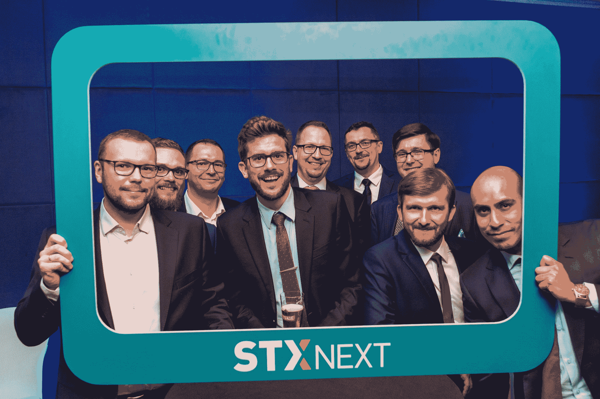
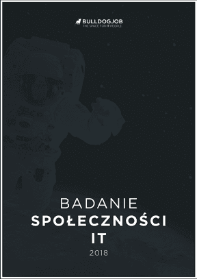

# 2018 年总结:合作伙伴比以往任何时候都多，位列顶级 IT 雇主

> 原文：<https://www.stxnext.com/blog/summary-2018-top-it-employers/>

 去年是多事之秋。  [我们的首席执行官 Maciej Dziergwa 发表了他对 2018 年](https://www.linkedin.com/pulse/summary-2018-looking-forward-future-maciej-dziergwa/) 的总结，其中他收集了 STX Next 在过去一年中所有值得注意的成功。

但本周我们还想分享一条新闻:STX 下一次成为了 Bulldogjob 的理想雇主名单。 

#### 离合器的第一把交椅

2018 年发生的最引人注目的事件之一与离合器有关。  [我们在顶级 Python & Django 开发者排行榜上升至第一名。](/stx-new-blog/stx-next-global-leader-clutch-1000/)

#### 比以往更多的合作伙伴

我们的另一个骄傲点是[2018 年我们有多少客户](https://stxnext.com/portfolio/)。与前一年相比，这一数字上升了 160%。

#### 扩展产品设计

说到令人印象深刻的数字，我们将  [产品设计部门](https://stxnext.com/services/product-design/) 的员工人数增加了惊人的 175%。这让我们扩大了在动作设计、插图和网络分析方面的能力。

你可以看看我们  [行为的一些结果。](https://www.behance.net/STXNextTeam)

#### 谷歌、苹果和 STX Next:波兰 IT 界的梦想雇主

Bulldogjob 的一份报告将我们列为波兰 30 大 IT 雇主之一。

该报告调查了波兰的 IT 社区，向他们询问了有关技术、招聘、工作条件等各种问题。他们在 2018 年 8 月和 9 月在波兰的每个省进行了超过 1450 项调查。

参与者都参与了波兰的 IT 市场，他们的平均工作经验几乎是 5 年。

这是 STX Next 值得庆祝的一个重要原因。调查参与者将我们列入了他们理想雇主的名单。提到的其他公司是科技巨头，如谷歌、微软、网飞、SpaceX、Spotify、苹果和脸书。

> ***“波兰的 IT 产业正以惊人的速度发展[...].每个人都知道，在一个不断变化的市场上，就像 IT 市场一样，有才华和敬业的员工是成功的秘诀。”——Adam kukoowicz，斗牛犬作业**T3 的编辑兼首席技术官*

不可能不同意那个评估。

#### 关于报告

由 Bulldogjob 准备的  [全面报告给出了波兰 IT 市场的总体状况。它提供关于参与者对特定技术的知识以及关于工资和就业形式的信息。](https://bulldogjob.pl/it_report_2018)

也有统计数据告知读者专家的补充培训和描述理想雇主的素质(几个例子包括:以发展为导向，能够创造友好的氛围，诚实。)

报告的很大一部分是关于招聘和换工作的过程。根据调查结果，超过 50%的参与者目前有意更换雇主。这是我们现代职业生活动态的最佳表现。

#### STX 的识别下一步

入选“30 个梦想雇主”名单是一个巨大的荣誉。我们想真诚地感谢每个人的投票。

更让我们高兴的是，这些结果来自一个完全独立的来源。

这肯定会成为我们继续做正确事情的额外动力。

