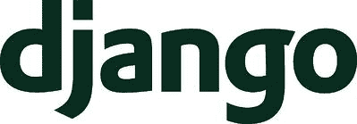

# 2022 年最佳 Python Web 框架初学者入门

> 原文：<https://www.stxnext.com/blog/beginners-introduction-python-frameworks/>

 既然你正在读这篇文章，可以肯定你对 Python 感兴趣——或者也许你已经开始学习这种令人敬畏的语言。

这看起来并不令人畏惧，对吗？毕竟，你可以编码，所以这只是掌握语法差异的问题。

那么我们就更上一层楼，谈谈 Python 中的 [**收集适当的经验**](http://stxnext.com/ebooks/what-is-python-used-for/) 。

让我们讨论创建您的第一个 [**Python**](/services/python-development/) 项目。

你从哪里开始？

很明显，有个想法，但那不是问题。当然，你已经有几个伟大的概念安全地锁在你的脑海中，只是等待一些宝贵的业余时间和注意力。

接下来是什么？框架的选择。

这就是真正的难题开始的地方，因为 Python 框架的生态系统非常广泛和多样。

在本文中，我们将描述最好和最流行的 Python 框架。你挑个合适的开始应该绰绰有余了。

不过，请注意，这个列表是相当主观的。它主要是我们在商业项目中使用以下框架的集体经验的结果。 

#### 什么是 web 框架？

在您决定一个特定的框架之前，让我们确保我们在定义上是一致的。

当我们谈论一个 web 应用程序框架时，我们脑子里到底在想什么？

简而言之，web 框架是一个通用功能包，它使得开发人员更容易创建 web 应用程序。它作为一种快捷方式，通过重用现有的解决方案来消除编写不必要代码的需要。因此，它减少了开发人员需要花费在编写代码上的时间，并使他们的工作更加有效。

Web 框架可以分为两类:前端和后端。前者，也称为 CSS 框架，是用户看到并与之交互的 web 应用程序的所有部分。后者与创建 web 应用程序的幕后工作有关。

使用 Python 框架的关键好处是，您可以在每个框架中混合和匹配前端和后端元素，以获得想要的结果。根据项目的范围，您可以专注于一个项目，也可以合并几个项目。

通过提供现成的解决方案，web 应用程序框架帮助开发人员添加复杂的动态元素，否则从头开始开发将非常困难或耗时。

#### 使用 Python web app 框架有什么好处？

使用 Python 时有必要使用框架吗？简短的回答是:不，没有必要。

当然，没有 web 开发框架也可以用 Python 写。然而，在构建 web 应用程序和网站时，使用 Python 是非常有用的，因为 Python 不是像 PHP 那样作为直接的 web 脚本语言编写的。因此，像连接数据库这样的普通事情并不是 it 所固有的，框架会派上用场。

使用 Python 框架的好处包括——除了明显使用 Python 创建 web 应用程序更容易之外——使用更有组织的代码、提高生产率和简化 web 开发过程。

框架有用于处理常见任务的库和用于调试和测试应用程序的工具。使用 Python 框架，实现和集成更容易，文档更好，效率更高，整个过程更安全，因为所有的框架库都经过严格测试。

此外，还有使用相同代码库开发软件的社区，因此如果您有问题，您可以很容易地找到帮助。总的来说，如果你的语言有一个很好的框架，并且得到了社区的很好的支持，那么就没有理由反对使用它。

#### 使用 Python web 应用程序框架的缺点是什么？

使用 Python web 框架显然有一些缺点。首先，你被捆绑在一个特定的工具上，这限制了你切换到不同工具的选择。在处理现有项目时，您可能还需要重构代码以使用 web 开发框架。

此外，一些 Python 框架可能根本不适合较小的项目，而另一些对于初学者来说则完全无法理解。

最后，Python web 框架可能需要一些时间来学习，而且相当复杂。这样，你可能不明白如何使用框架的单个组件，因为其中一些组件太大了，并且花费了太多的时间来掌握它。

尽管如此，使用 Python web 开发框架的缺点并没有超过它的好处。现在让我们考虑一下在你选择合适的 Python 框架之前你应该知道的一些事情。

#### 在选择 Python web 框架之前，您应该了解什么？

在您采取行动并选择 Python web 开发框架之前，请记住它的规模和复杂性——有些可能非常大，学习起来非常有挑战性。

您还应该考虑框架提供的特性，因为有些框架比其他框架提供更多的扩展和工具。

您还应该考虑的是框架可用的文档和它使用的许可证；**一些是开源软件(OSS)****而另一些是** **闭源软件(CSS)**这意味着软件使用专有的和严密保护的代码。

#### 3 种类型的 Python 框架

本质上，我们将 Python 框架分为三种类型:全栈(也称为企业)、微框架和异步(async)框架。在我们继续讨论 2022 年的最佳 Python web 框架之前，让我们仔细看看这些类别。

##### 1.全栈框架

如果您计划开发一个充满大量需求和特性的大型结构，那么全栈框架将是您和您的项目的最佳选择。

这样的框架是满足您所有需求的一体化解决方案。通常，表单生成器、表单验证和模板布局等都可以在通常的全栈框架中获得。

##### 2.微观框架

另一方面，如果你正在创建一个小而简单的应用程序，你应该考虑选择一个微框架。

微框架是轻量级的，它们不提供额外的功能和特性，比如数据库抽象层、表单验证以及特定的工具和库。因此使用它们的开发人员将需要手动添加大量代码和附加需求。

##### 3.异步框架

越来越流行的异步(async)框架是一种允许处理大量并发连接的微框架。通常，为 Python 构建的异步框架使用编程语言的 asyncio 库。

#### 全栈 Python web 框架

##### 姜戈

****

**[Django](/services/django-development/) 是最流行的 Python 框架**之一。从低端到高端，在一个包中提供构建 web 应用程序所需的所有工具是它的商标。

Django 应用程序基于一种类似于 MVC 的设计模式，即所谓的 MVT(模型-视图-模板)模式。模型是使用 Django ORM 定义的，而 SQL 数据库主要用作存储。

该框架有一个内置的管理面板，允许轻松管理数据库内容。通过最少的配置，该面板是基于定义的模型自动生成的。

视图可以包含函数和类，并且将 URL 分配给视图是在一个位置(urls.py 文件)完成的，这样在查看了这个文件之后，您就可以了解哪些 URL 是受支持的。模板是使用一个相当简单的 Django 模板系统创建的。

Django 因强大的社区支持和描述框架功能的详细文档而受到称赞。这种文档加上安装后获得的综合环境使得入门门槛相当低。一旦你通过了  [官方教程](https://docs.djangoproject.com/en/1.11/intro/tutorial01/)，你将能够做构建一个应用程序所需的大部分事情。

**不幸的是，Django 的独石主义也有弊端。** 用另一个实现替换一个内置元素虽然不是不可能，但是很困难。例如，使用其他一些 ORM(如 SQLAlchemy)需要放弃或完全重新构建管理面板、授权、会话处理或生成表单等项目。

因为 Django 是完整但不灵活的，所以它适合标准应用程序(即绝大多数软件项目)。然而，如果你需要实现一些非常规的设计，就会导致与框架的斗争，而不是愉快的编程。

##### **Django 的样品模型**