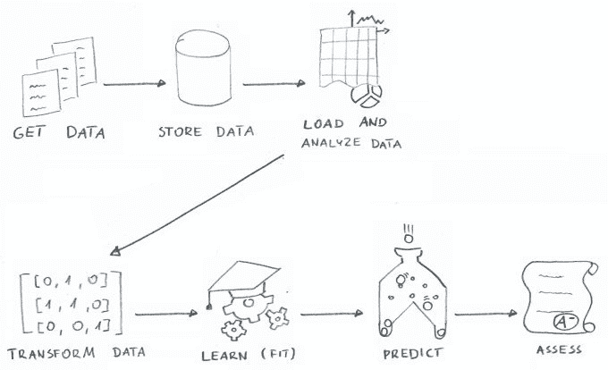
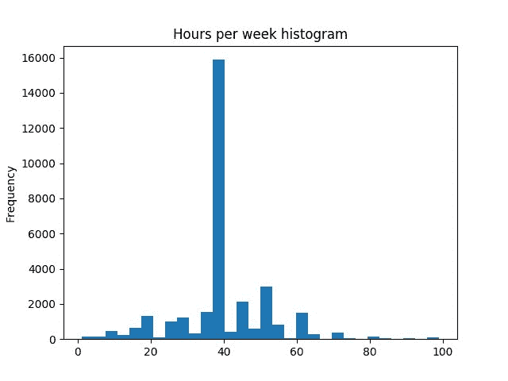
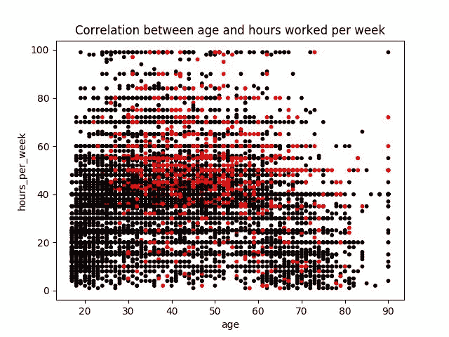

# 教程:Python 机器学习入门

> 原文：<https://www.stxnext.com/blog/getting-started-machine-learning-python/>

 每隔一段时间，我都会很高兴在这个博客上发表一篇真正震撼我的世界的文章。这是其中之一。

任何一个新的领域一开始都会令人望而生畏，不管它提供了什么样的机会。  [机器学习](https://stxnext.com/services/machine-learning/) 也不例外。

这就是为什么没有什么比拥有一个现成的模板在一个令人兴奋的新领域迈出第一步更有价值的了。

我们的两位 Python 开发专家 radosaw Jankiewicz 和 Tomasz Mać kowiak 已经为您准备好了入门所需的一切。如果你正在寻找 Python 中  [机器学习](https://stxnext.com/machine-learning-applications-examples-industries/) 的实用介绍，不用再找了。 

#### 简介:关于 Python 中的机器学习，您将学到什么

**机器学习** 如今绝对是方兴未艾。计算机能够从例子中学习，而不是严格按照以前编写的规则操作，这是一种令人兴奋的解决问题的方式。

[**Python**](https://stxnext.com/ebooks/what-is-python-used-for/) 是[最流行的](https://fossbytes.com/popular-top-programming-languages-machine-learning-data-science/)语言[用于机器学习](https://stxnext.com/ebooks/what-is-python-used-for/#machine-learning)和数据科学。在本文中，我们将展示用 Python 实现机器学习的基本工具链。

我们将解释:

*   如何加载数据集
*   如何对数据运行机器学习算法
*   如何评估算法的性能

...只需几行 Python 代码！

但首先，一个免责声明。我们希望在实践中向您展示如何在不被理论淹没的情况下迈出机器学习的第一步。所以我们只给你  *什么是机器学习*的‘须知’。

我们不会解释  *算法如何工作*。我们不会展示  *如何针对你的问题选择合适的算法* 。也不会呈现  *如何优化算法的参数* 。

我们将专注于基础知识，我们将通过一个具体的例子来回顾机器学习的过程，从*(获取数据)到  *Z* (评估所创建模型的性能[准确性])。*

 *我们假设读者对机器学习有粗略的了解，并且他已经了解 Python。

我们希望到本文结束时，您将能够看到  **为什么** Python 是这个领域的首选。*  *#### 我们的问题

本文的目标是通过一个简单的例子展示机器学习。开始时需要解决的一个重要问题是获取数据集。

幸运的是，有大量公开可用的数据集，它们对于开始机器学习的冒险非常有用。

对于本文，我们选择了一个可以使用公共数据集进行研究的问题(稍后将提供关于获取它的更多信息)。

我们希望用机器学习解决的示例问题如下:

基于一个人的属性(如年龄、工作时间、行业等)。)，预测这个人的工资是否很高(他们的年薪是高于还是低于 50，000 美元)。

这个问题是一个  **分类**的问题。我们要把人口分为两类:*高收入* 和  *低收入*。由于只有两个阶层，而每个人恰好属于一个阶层，我们称之为  *二元分类* 问题。

换句话说，对于每个人我们都在努力确定他们是否属于*低收入阶层。*

 *#### 机器学习过程是怎样的？高级机器学习概述

机器学习的过程可以分为以下几个步骤:



**机器学习概述** 

##### **a)获取数据**

获取足够大的数据集(包括标签或问题的答案)。

##### **b)存储数据**

将获取的数据存储在一个位置，以便于检索。

##### c)加载并分析数据

从存储中加载数据集，并进行基本的数据分析和可视化。

##### **d)转换数据**

机器学习需要纯粹的数字输入，所以你需要对输入的数据进行转换。

##### **e)学习(适应)**

通过机器学习算法运行标记的数据，产生模型。

##### **f)预测**

使用该模型来预测该模型以前没有看到的数据的标签。

##### **g)评估**

验证模型所做预测的准确性。

#### 获取数据

为了启动机器学习过程，你需要拥有一组用于训练算法的数据。

确保数据的来源是可信的非常重要，否则您将收到不正确的结果，即使算法本身工作正常(遵循  [*垃圾入，垃圾出*](https://en.wikipedia.org/wiki/Garbage_in,_garbage_out) 的原则)。

第二件重要的事情是数据集的大小。对于它应该有多大，没有直接的答案。答案可能取决于许多因素，例如:

*   你想解决的问题类型，
*   数据中的特征数量，
*   使用的算法类型。

幸运的是，为您的示例项目找到一个现成的数据集并不困难。

首先，您可以使用  [`scikit-learn`](http://scikit-learn.org/stable/index.html) 软件包提供的内置数据集之一。

一个流行的选择是鸢尾花数据集，它由 3 种不同类型的鸢尾( *Setosa* 、  、 Versicolour 和  *Virginica* )的花瓣和萼片长度数据组成，存储在 150×4 `numpy.ndarray`:

```
>>> from sklearn import datasets
>>> iris = datasets.load_iris()
>>> print(iris.DESCR)
Iris Plants Database
====================

Notes
-----
Data Set Characteristics:
    :Number of Instances: 150 (50 in each of three classes)
    :Number of Attributes: 4 numeric, predictive attributes and the class
    :Attribute Information:
        - sepal length in cm
        - sepal width in cm
        - petal length in cm
        - petal width in cm
        - class:
                - Iris-Setosa
                - Iris-Versicolour
                - Iris-Virginica
...

>>> iris.data[:5]
array([[ 5.1,  3.5,  1.4,  0.2],
       [ 4.9,  3. ,  1.4,  0.2],
       [ 4.7,  3.2,  1.3,  0.2],
       [ 4.6,  3.1,  1.5,  0.2],
       [ 5. ,  3.6,  1.4,  0.2]])
```

另一个有趣的公开可用数据集的好来源是加州大学欧文分校的  [机器学习知识库](https://archive.ics.uci.edu/ml/index.php) ，其中包含了机器学习社区中使用的大量数据集。

出于本文的目的，我们选择了  [成人数据集](https://archive.ics.uci.edu/ml/datasets/Adult) ，它包含了从美国 1994 年人口普查数据库中提取的 48，842 条记录。每条记录包含 14 个  **属性**:

*   `age`——整数、
*   `workclass`——分类值('私人'、'自我雇员-非公司'、'自我雇员-公司'、'联邦政府')，...),
*   `fnlwgt`——整数、
*   `education` -分类('学士'，'某大学'，'十一年级'，'高年级'，...),
*   `education-num`——整数、
*   `marital-status`——分类('已婚-公民-配偶'，'离婚'，'未婚'，'分居'，...),
*   `occupation`——分类(‘技术支持’，‘工艺维修’，‘其他服务’，‘销售’，...),
*   `relationship`——分类的('妻子'，'亲生子女'，'丈夫'，'不在家庭'，...),
*   `race`——分类(‘白人’，‘亚洲太平洋岛民’，‘美洲印第安爱斯基摩人’，‘其他’，...),
*   `sex`——直言不讳(‘女’，‘男’)，
*   `capital-gain`——整数、
*   `capital-loss`——整数、
*   `hours-per-week`——整数、
*   `native-country` -绝对的('美国'，'柬埔寨'，'英国'，'波多黎各'，...).

对于每条记录，我们还得到  **分类标签** ( `<=50k` 或`>50k`——关于年薪等级的信息)。

基于这个数据集，我们将训练一个分类算法，能够预测一个具有给定属性集的人的年收入是高于还是低于 5 万美元。

#### 训练数据和测试数据

在训练完你的模型后，你肯定会想知道它是否足够好地解决现实世界中的问题。

为了正确衡量模型的准确性，您需要用一组新的数据来验证它——不同于您用来训练它的数据集。

因此，在使用收集的数据集来训练您的算法之前，您应该将它分成一个子集，一个子集将用于训练过程(**训练集**)，另一个子集将用于验证算法的准确性(**测试集**)。

在实践中，您应该将收集的数据集的 20%-30%用于验证目的(*测试集*)。

假设您有一个输入数据矩阵 `X` 和一个对应的预期结果向量 `y` 。您可以使用一个简单的效用函数: [`sklearn.model_selection.train_test_split`](http://scikit-learn.org/stable/modules/generated/sklearn.model_selection.train_test_split.html#sklearn.model_selection.train_test_split) 将其分解为 *列车* 和 *测试* 给定比例的子集:

```
from sklearn.model_selection import train_test_split

X_train, X_test, y_train, y_test = train_test_split(X, y, test_size=0.25)
```

对于我们的示例问题，我们不需要自己分割数据集。我们选择的  *成人数据集* 集合已经由两个独立的文件组成:

*   训练集-`adult.data`(32561 条记录)
*   测试集-`adult.test`(16281 条记录)

#### 用熊猫加载数据

*免责声明:我们省略了将从 [UC Irvine 机器学习库](https://archive.ics.uci.edu/ml/index.php) 下载的文本文件中的数据加载到  `SQLite` 数据库中的描述，因为这超出了本文的范围。您仍然可以在  **完整清单** 部分自行阅读我们的解决方案。*

一旦你将数据存储在一个位置，你就应该将它们加载到一个工具中，这样你就可以轻松地对其进行分析，  *将它们切片* 然后在你的机器学习算法中使用它们。

Python[`pandas`](https://pandas.pydata.org/)包就是一个很好的工具。

开箱即用，它允许您读取各种格式的数据:

*   平档如`CSV``JSON``HTML`、
*   二进制格式包括  `Excel` 和  `pickle`，
*   关系数据库，
*   云(`Google Big Query`)，
*   和其他人。

下面我们呈现一个通过  [`SQLAlchemy`](https://www.sqlalchemy.org/) 从 SQL 数据库读取数据的例子。

```
import os.path
import pandas
from sqlalchemy import create_engine

def read_data_frame():
    DB_FILE_PATH = os.path.join(os.path.dirname(__file__), 'data.sqlite')
    TABLE_NAME = 'adult'
    engine = create_engine(f'sqlite:///{DB_FILE_PATH}')
    with engine.connect() as conn:
        with conn.begin():
            return pandas.read_sql_table(TABLE_NAME, conn, index_col='id')
```

将数据读取为 `pandas` `DataFrame` 对象。该对象包含数据中属性(列)的信息:

```
>>> data_frame.columns
Index(['age', 'workclass', 'fnlwgt', 'education', 'education_num',
       'marital_status', 'occupation', 'relationship', 'race', 'sex',
       'capital_gain', 'capital_loss', 'hours_per_week', 'native_country',
       'classification'],
      dtype='object')
```

您可以查看一条数据记录:

```
>>> data_frame.iloc[0]
age                          39
workclass             State-gov
fnlwgt                    77516
education             Bachelors
education_num                13
marital_status    Never-married
occupation         Adm-clerical
relationship      Not-in-family
race                      White
sex                        Male
capital_gain               2174
capital_loss                  0
hours_per_week               40
native_country    United-States
classification            <=50K
Name: 1, dtype: object
```

您可以逐列查看数据:

```
>>> data_frame.workclass
id
1               State-gov
2        Self-emp-not-inc
3                 Private
4                 Private
5                 Private
6                 Private
7                 Private
8        Self-emp-not-inc
9                 Private
10                Private
               ...
32552             Private
32553             Private
32554             Private
32555             Private
32556             Private
32557             Private
32558             Private
32559             Private
32560             Private
32561        Self-emp-inc
Name: workclass, Length: 32561, dtype: object
```

您可以快速获得特定列的值计数汇总:

```
>>> data_frame.workclass.value_counts()
Private             22696
Self-emp-not-inc     2541
Local-gov            2093
?                    1836
State-gov            1298
Self-emp-inc         1116
Federal-gov           960
Without-pay            14
Never-worked            7
Name: workclass, dtype: int64
```

`pandas`库可以让你分组、过滤、转换你的数据等等。

#### 用 matplotlib 实现数据可视化

在开始对数据建模之前，将数据可视化可能非常有益。这将让您更好地理解将要处理的数据的性质。您可能会发现输入值之间的关系和模式，这将有助于您获得更好的结果。

数据可视化还可以帮助您预先验证输入数据。例如，你会期望大多数人一周工作 40 个小时。为了检验你的假设是否正确，你可以画一个直方图。您可以使用  [`matplotlib`](https://matplotlib.org/devdocs/index.html) 标图库与您的  `pandas` `DataFrame`快速集成:

```
import matplotlib.pyplot as plt

data_frame.hours_per_week.plot.hist(bins=30)
plt.show()
```

应显示如下图表:

 **每周小时直方图**

快速浏览一下生成的图表，可以确认您的假设是正确的。

假设你想知道年龄和每周工作时间与收入的关系。为此你可以让  `matplotlib` 画出你的数据散点图:

```
import numpy as np

colors = np.where(data_frame.classification == '>50K', 'r', 'k')
plot = data_frame.plot.scatter(x='age', y='hours_per_week', s=10, c=colors)
plot.figure.show()
```

结果，您会收到一个图表，显示您收集的两列值(年龄和每周工作小时数)之间的相关性，其中红点代表年收入高于 50，000 美元的人，黑点代表低于 50，000 美元的人:

  **散点图示例**

你可以看到红点的密度在 30 到 60 岁的人群样本所代表的区域更高，他们每周工作时间超过 40 小时。

正如你所看到的  `matplotlib` 是一个强大且易于使用的库，对于可视化处理后的数据非常有用。而且，它被  `Series` 和  `DataFrame` 对象很好地包装起来，这些对象用于表示  `pandas` 库中的数据集，这使得绘制不同种类的图表更加得心应手。

#### 使用 sklearn-pandas 转换数据

##### **a)映射器**

机器学习算法只期望数值作为输入。确切地说，它期望一个  [`numpy`](http://www.numpy.org/) 低级矩阵的数值数据。

我们前面加载的数据存储在一个  `pandas` `DataFrame`中。要将  `DataFrame` 转换成我们需要的`numpy` 数组，我们可以使用`DataFrameMapper` 从[`sklearn-pandas`](https://github.com/scikit-learn-contrib/sklearn-pandas)——一个桥接  `pandas` 和  `sklearn`的库。

映射器允许我们选择要用于机器学习的数据属性(列),以及应该为每个属性执行什么转换。每列可以依次应用一个或多个转换:

```
import sklearn.preprocessing
from sklearn_pandas import DataFrameMapper

mapper = DataFrameMapper([
    (['age'], sklearn.preprocessing.StandardScaler()), # single transformation
    ('sex', sklearn.preprocessing.LabelBinarizer()), # single transformation
    ('native_country', [ # multiple transformations
        sklearn.preprocessing.FunctionTransformer(
            native_country_generalize, validate=False
        ),
        sklearn.preprocessing.LabelBinarizer()
    ]),
    ...
])
```

如果该列不需要任何转换，请在该属性的配置中使用  `None` 。映射器配置中未提及的属性将不会用于映射器的输出。

在我们的数据中，我们有一些数字属性(例如  `age`)以及一些字符串枚举(例如  `sex`、  `marital_status`)。

##### **b)缩放数值**

当一个属性(例如  `capital_gain`)由于其值的数量级更高而超过另一个属性(例如  `age`)的重要性时，将所有数值缩放到标准范围是一个很好的做法，以避免出现问题。我们可以用  `sklearn.preprocessing.StandardScaler` 来为我们换算数值。

##### c)转换枚举数

枚举是一种更复杂的情况。如果枚举只有两个可能的值:

| 身份证明（identification） | 性 |
| --- | --- |
| one | 男性的 |
| Two | 女性的 |
| three | 女性的 |
| four | 男性的 |

我们可以将该列转换为布尔标志列:

| 身份证明（identification） | 性 |
| --- | --- |
| one | Zero |
| Two | one |
| three | one |
| four | Zero |

如果枚举有多个值，例如:

| 身份证明（identification） | 婚姻状况 |
| --- | --- |
| one | 已婚的 |
| Two | 从未结过婚 |
| three | 离婚的 |
| four | 从未结过婚 |
| five | 已婚的 |
| six | 从未结过婚 |
| seven | 离婚的 |

然后我们可以把它转换成一系列布尔标志列，每个标志列对应一个可能的枚举值:

| 

身份证明（identification）

 | 

婚姻状况 _ 已婚

 | 

婚姻状况从未结过婚

 | 

婚姻状况离婚

 |
| --- | --- | --- | --- |
| one | one | Zero | Zero |
| Two | Zero | one | Zero |
| three | Zero | Zero | one |
| four | Zero | one | Zero |
| five | one | Zero | Zero |
| six | Zero | one | Zero |
| seven | Zero | Zero | one |

`sklearn.preprocessing.LabelBinarizer` 可以处理上述两种情况。

##### **d)复杂变换**

有时我们希望对数据进行更高级的转换，包括应用一些业务逻辑。在我们的数据中，属性  `native_country` 有 42 个可能的值，尽管 90%的记录包含值  `United-States`。

为了避免创建 42 个新列，我们希望减少列以包含一组更小的值:  `United-States` 和  `Other` 用于 10%的剩余记录。我们可以用  `sklearn.preprocessing.FunctionTransformer` 来实现这一点:

```
import numpy
import functools

def numpy_map(callback):
    @functools.wraps(callback)
    def numpy_map_wrapper(X):
        return numpy.array([callback(x) for x in X])
    return numpy_map_wrapper

@numpy_map
def native_country_generalize(x):
    return 'US' if x == 'United-States' else 'Other'

mapper = DataFrameMapper([
    ...
    ('native_country', [
        sklearn.preprocessing.FunctionTransformer(
            native_country_generalize, validate=False
        ),
        sklearn.preprocessing.LabelBinarizer()
    ])
])
```

注意我们仍然通过 `LabelBinarizer` 运行 `FunctionTransformer` 的输出来将新的枚举转换为布尔标志。

##### **e)特性**

`DataFrameMapper` 将我们的`pandas``DataFrame`转换成一个`numpy`**的矩阵特征**。一个  *特征* 是我们机器学习算法的单个输入。

可以看到，我们原始数据的一个  *列* 可以对应多个  *特征* (在枚举的情况下)。

如果您想要预览映射器正在生成的输出，可以在训练数据输入上运行它:

```
>>> data = mapper.fit_transform(train_X)
>>> data
array([[ 0.03067056,  1.        ,  0.        , ..., -0.21665953,
        -0.03542945,  1.        ],
       [ 0.83710898,  0.        ,  0.        , ..., -0.21665953,
        -2.22215312,  1.        ],
       [-0.04264203,  0.        ,  0.        , ..., -0.21665953,
        -0.03542945,  1.        ],
       ...,
       [ 1.42360965,  0.        ,  0.        , ..., -0.21665953,
        -0.03542945,  1.        ],
       [-1.21564337,  0.        ,  0.        , ..., -0.21665953,
        -1.65522476,  1.        ],
       [ 0.98373415,  0.        ,  0.        , ..., -0.21665953,
        -0.03542945,  1.        ]])
>>> data.dtype
dtype('float64')
```

可以看到，映射器产生了一个二维的  `numpy` 浮点值矩阵。这是机器学习算法期望的输入格式。

但是，这个数据只是数字的集合。它不存储有关列名或枚举值的信息。换句话说，这种格式的数据几乎不是  *人类可读的*。在这种状态下很难分析数据。这就是为什么我们宁愿使用  `pandas`来加载和处理数据，并且只在运行算法之前执行这个转换。

#### 训练模型

输入数据经过预处理后，您就可以将它提供给所选的算法来训练模型了。

在我们给出的例子中，我们决定使用  *多层感知器(MLP)* 算法，这是*监督学习神经网络分类算法*的一个例子。在本文中，我们不会关注算法选择过程的细节，但是您应该知道，这取决于您需要解决的问题的类型以及您拥有的数据的类型和数量。

*监督学习算法* 是一种要求训练数据包含输入对象(特征向量)和该对象的预期输出值的方法。因此，我们需要把我们的  `train_data_frame` 拆分成:

*   `train_X`–一个  `DataFrame` 对象包含输入记录与  `classification` 列省略
*   `train_y`–一个  `Series` 对象只包含  `classification` 列(映射成布尔值)

```
classification_map = {
    '<=50K': True,
    '>50K': False
}

train_X = train_data_frame[train_data_frame.columns.drop('classification')]
train_y = train_data_frame['classification'].map(classification_map)
```

分类器对象( [`sklearn.neural_network.MLPClassifier`](http://scikit-learn.org/stable/modules/generated/sklearn.neural_network.MLPClassifier.html) )必须用多个参数初始化，例如神经网络的隐藏层数或它们的大小(即每层中神经元的数量)。为了简明起见，我们没有展示如何确定这些参数的最佳值。相信我们的话，这个问题的最佳精度可以通过由包含 20 个神经元的 **1 个隐藏层组成的神经网络来实现。**

```
from sklearn.neural_network import MLPClassifier

NUMBER_OF_LAYERS = 1
NEURONS_PER_LAYER = 20

classifier = MLPClassifier(
    hidden_layer_sizes=(NEURONS_PER_LAYER, ) * NUMBER_OF_LAYERS,
    alpha=0.01,
    random_state=1
)
```

最后，我们将训练数据应用于分类器算法。在此之前，我们使用之前构造的  [`mapper`](https://stxnext.com/blog/2018/06/28/getting-started-machine-learning-python/#mapper) 将输入的数据转换为分类器对象可以理解的数字形式。

```
from sklearn.pipeline import Pipeline

pipeline = Pipeline([
    ('mapper', mapper),
    ('classifier', classifier)
])

model = pipeline.fit(X=train_X, y=train_y)
```

根据 `scikit-learn` 文档——所有被监督的估计器实现一个 `fit(X, y)` 方法来拟合(训练)模型，以及一个 `predict(X)` 方法，即，给定未标记的观察值 `X` ，返回预测的标签 `y` 。

#### 使用模型进行预测

作为训练过程的结果而产生的分类 **模型** 现在可以用于 **预测** 测试集 `DataFrame` 上的分类，或者可能是全新的数据*。*

```
test_X = test_data_frame[test_data_frame.columns.drop('classification')]

predictions = model.predict(X=test_X)
```*  *#### 评估模型

你应该采取的最后一步是模型评估。这会告诉你  **经过训练的模型做出的预测有多准确**。

正如您可能注意到的，评估过程是在先前提取的  **测试集** ( `test_X`，  `test_y`)上执行的，该测试集在训练过程中由模型更早地  **未见过** 。

您应该  **永远不要** 评估  *训练集*上的模型，因为获得的结果不会转化为现实世界的应用(这样您就无法验证您的模型是否能够进行归纳)。

有几个指标可以让您评估模型的准确性。最基本的一个是  [`sklearn.metrics.accuracy_score`](http://scikit-learn.org/stable/modules/generated/sklearn.metrics.accuracy_score.html) ，它表示所有正确预测值与所有处理样本的比率。

```
from sklearn import metrics

test_y = test_data_frame['classification'].map(classification_map)

accuracy_score = metrics.accuracy_score(test_y, predictions)
```

在我们的例子中， `accuracy_score` 返回 `0.856212763344` 的值，可以解释为*“~ 85%的预测是正确的”* 。

#### 总结:为什么 Python 是机器学习的首选

我们向您展示了如何在一个示例数据集上运行您的第一个机器学习算法。通过评估创建的模型，我们证明了机器学习是可行的(85%的准确率是一个不错的结果)。

你应该在整篇文章中注意到的是，我们没有写那么多代码。当然，我们不必编写机器学习算法本身。

对于一路上的每个任务，我们都有一个现成的**久经考验的* Python 库来为我们做这些繁重的工作:*

 **   `pandas` 用于加载和摆弄数据、
*   `matplotlib` 用于可视化数据、
*   `sklearn-pandas` 用于将我们的输入转换成一个数值矩阵，
*   `sklearn` 用于实际的机器学习和评估。

我们所要写的只是  **胶水**——将一切捆绑在一起的代码。

这就是为什么 **Python** 是进行机器学习的第一语言**所有的工具都在那里，用法简单，文档广泛，社区充满活力。您可以立即运行机器学习解决方案！***  ***#### 附录:完整的机器学习脚本

下面你可以找到用于本文的完整的机器学习脚本。

```
import csv
import functools
import os.path

import numpy
from sqlalchemy import create_engine
import pandas
from sklearn_pandas import DataFrameMapper
import sklearn.preprocessing
from sklearn.pipeline import Pipeline
from sklearn.neural_network import MLPClassifier
from sklearn import metrics

DIR = '/home/user/workspace/machine-learning'

TRAIN_DATA_FILE_PATH = os.path.join(DIR, 'data', 'adult.data')
TEST_DATA_FILE_PATH = os.path.join(DIR, 'data', 'adult.test')

TRAIN_DB_FILE_PATH = os.path.join(DIR, 'db', 'data.sqlite')
TEST_DB_FILE_PATH = os.path.join(DIR, 'db', 'test.sqlite')

train_engine = create_engine(f'sqlite:///{TRAIN_DB_FILE_PATH}')
test_engine = create_engine(f'sqlite:///{TEST_DB_FILE_PATH}')

INT = 'INTEGER'
STR = 'VARCHAR'

FIELDS = (
    ('age', INT),
    ('workclass', STR),
    ('fnlwgt', INT),
    ('education', STR),
    ('education_num', INT),
    ('marital_status', STR),
    ('occupation', STR),
    ('relationship', STR),
    ('race', STR),
    ('sex', STR),
    ('capital_gain', INT),
    ('capital_loss', INT),
    ('hours_per_week', INT),
    ('native_country', STR),
    ('classification', STR)
)

def create_schema(connection):
    fields_sql = ', '.join(
        f'{field_name} {field_type}' for (field_name, field_type) in FIELDS
    )
    connection.execute(
        f'CREATE TABLE adult (id INTEGER PRIMARY KEY, {fields_sql})'
    )

def read_data(data_file_path):
    with open(data_file_path, newline='') as csvfile:
        reader = csv.reader(csvfile, delimiter=',', skipinitialspace=True)
        for row in reader:
            if len(row) != 15:
                continue  # Skip empty rows, skip test file header
            classification = row[-1]
            if classification.endswith('.'):
                # Test file has dots ('.') at the end of lines, strip them out.
                row[-1] = classification[:-1]
            yield row

def insert_row(row, connection):
    fields = ', '.join(field_name for (field_name, _) in FIELDS)
    placeholders = ', '.join(['?'] * len(FIELDS))
    connection.execute(
        f'INSERT INTO adult ({fields}) VALUES ({placeholders})', row
    )

def import_data(data, connection):
    create_schema(connection)
    with connection.begin():
        for row in data:
            insert_row(row, connection)

def gather_data():
    return read_data(TRAIN_DATA_FILE_PATH), read_data(TEST_DATA_FILE_PATH)

def store_data(train_data, test_data):
    with train_engine.connect() as conn:
        import_data(train_data, conn)
    with test_engine.connect() as conn:
        import_data(test_data, conn)

def load_data(train_engine, test_engine):
    with train_engine.connect() as conn:
        with conn.begin():
            train_data_frame = pandas.read_sql_table(
                'adult', conn, index_col='id'
            )

    with test_engine.connect() as conn:
        with conn.begin():
            test_data_frame = pandas.read_sql_table(
                'adult', conn, index_col='id'
            )

    return train_data_frame, test_data_frame

def get_mapper():
    def numpy_map(callback):
        @functools.wraps(callback)
        def numpy_map_wrapper(X):
            return numpy.array([callback(x) for x in X])
        return numpy_map_wrapper

    @numpy_map
    def native_country_generalize(x):
        return 'US' if x == 'United-States' else 'Other'

    @numpy_map
    def workclass_generalize(x):
        if x in ['Self-emp-not-inc', 'Self-emp-inc']:
            return 'Self-emp'
        elif x in ['Local-gov', 'State-gov', 'Federal-gov']:
            return 'Gov'
        elif x in ['Without-pay', 'Never-worked', '?']:
            return 'None'
        else:
            return x

    @numpy_map
    def education_generalize(x):
        if x in ['Assoc-voc', 'Assoc-acdm']:
            return 'Assoc'
        elif x in [
            '11th', '10th', '7th-8th', '9th', '12th', '5th-6th',
            '1st-4th', 'Preschool'
        ]:
            return 'Low'
        else:
            return x

    return DataFrameMapper([
        (['age'], sklearn.preprocessing.StandardScaler()),
        ('workclass', [
            sklearn.preprocessing.FunctionTransformer(
                workclass_generalize, validate=False
            ),
            sklearn.preprocessing.LabelBinarizer()
        ]),
        # ('fnlwgt', None),
        ('education', [
            sklearn.preprocessing.FunctionTransformer(
                education_generalize, validate=False
            ),
            sklearn.preprocessing.LabelBinarizer()
        ]),
        (['education_num'], sklearn.preprocessing.StandardScaler()),
        ('marital_status', sklearn.preprocessing.LabelBinarizer()),
        ('occupation', sklearn.preprocessing.LabelBinarizer()),
        ('relationship', sklearn.preprocessing.LabelBinarizer()),
        ('race', sklearn.preprocessing.LabelBinarizer()),
        ('sex', sklearn.preprocessing.LabelBinarizer()),
        (['capital_gain'], sklearn.preprocessing.StandardScaler()),
        (['capital_loss'], sklearn.preprocessing.StandardScaler()),
        (['hours_per_week'], sklearn.preprocessing.StandardScaler()),
        ('native_country', [
            sklearn.preprocessing.FunctionTransformer(
                native_country_generalize, validate=False
            ),
            sklearn.preprocessing.LabelBinarizer()
        ]),
    ])

classification_map = {
    '<=50K': True,
    '>50K': False
}

def train(train_data_frame, mapper):
    train_X = train_data_frame[train_data_frame.columns.drop('classification')]
    train_y = train_data_frame['classification'].map(classification_map)

    NUMBER_OF_LAYERS = 1
    NEURONS_PER_LAYER = 20

    classifier = MLPClassifier(
        hidden_layer_sizes=(NEURONS_PER_LAYER, ) * NUMBER_OF_LAYERS,
        alpha=0.01,
        random_state=1
    )

    pipeline = Pipeline([
        ('mapper', mapper),
        ('classifier', classifier)
    ])

    model = pipeline.fit(X=train_X, y=train_y)
    return model

def predict(model, test_data_frame):
    test_X = test_data_frame[test_data_frame.columns.drop('classification')]

    predictions = model.predict(X=test_X)
    return predictions

def assess(test_data_frame, predictions):
    test_y = test_data_frame['classification'].map(classification_map)

    accuracy_score = metrics.accuracy_score(test_y, predictions)
    return accuracy_score

def main():
    train_data, test_data = gather_data()
    store_data(train_data, test_data)
    train_data_frame, test_data_frame = load_data(train_engine, test_engine)
    mapper = get_mapper()
    model = train(train_data_frame, mapper)
    predictions = predict(model, test_data_frame)
    score = assess(test_data_frame, predictions)
    print('Accuracy score', score)

if __name__ == '__main__':
    main()
```

```
cycler==0.10.0
matplotlib==2.1.1
numpy==1.13.3
pandas==0.21.1
pyparsing==2.2.0
python-dateutil==2.6.1
pytz==2017.3
scikit-learn==0.19.1
scipy==1.0.0
six==1.11.0
sklearn==0.0
sklearn-pandas==1.6.0
SQLAlchemy==1.1.15
```

[](https://cta-redirect.hubspot.com/cta/redirect/4542168/b78873fb-4ec5-464f-b446-596458732930)******