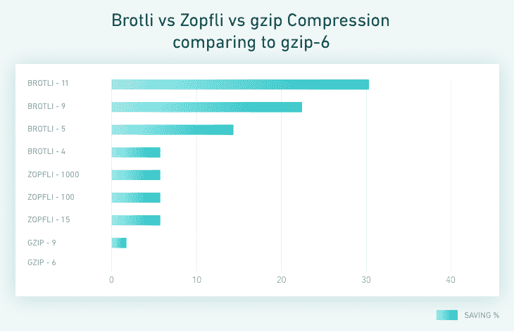
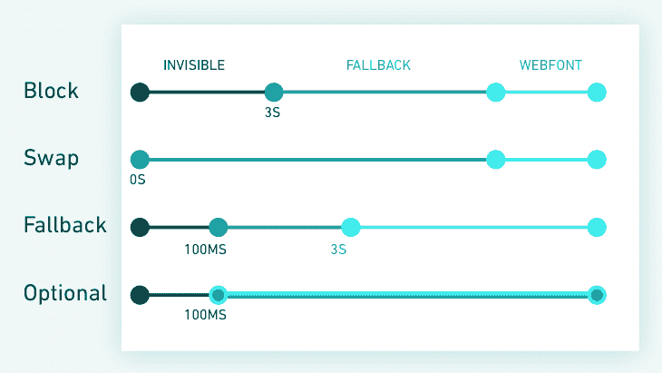

# 如何加快你的网络应用程序和提高网站性能

> 原文：<https://www.stxnext.com/blog/web-app-speed-website-performance/>

 [//www.youtube.com/embed/jmMJICBZ_sk](//www.youtube.com/embed/jmMJICBZ_sk)

Web 应用加载速度很重要。

用户希望快速找到问题的答案。  **多一秒钟的延迟都会对你页面的整体性能产生重大影响，** 从客户满意度和转化率到搜索引擎排名位置。

根据谷歌的说法，如果你的页面加载时间超过 3 秒，超过一半的移动用户会放弃它，转到其他地方。

这项研究还显示，在它分析的 90，000 个网站中，70%的网站花了近 7 秒钟来显示上述内容。

幸运的是，你可以采取一些步骤来优化你的网站的加载速度，并超越你的竞争对手。在这篇文章中，我们将引导你了解其中的一些。

此外，我们将:

*   解释网站性能的基础知识，
*   展示速度优化的一般好处，
*   提供一些推荐的性能指标。

[](https://cta-redirect.hubspot.com/cta/redirect/4542168/70673cfa-2089-46d5-a7af-25b9b668f19e) 

#### 你为什么要优化你的网络应用程序的速度？

人们的注意力是一种有限的资源，在网站设计中，一切都是为了即时的满足。不管你的内容或服务对用户需求的响应有多好，如果你的网站的性能因为糟糕的优化和不必要的额外费用而停滞不前，人们*就会转身离开。*

 *另一方面，  如果你花一些时间优化你的网络应用程序的速度，你的用户会感谢你，你的转化率会增加，你的谷歌 SERP 位置很可能会受益。


##### **页面速度和用户体验**

装载速度是你给潜在客户的第一印象。一个快速加载的页面表明你的企业是值得信赖的，并鼓励访问者花更多的时间浏览它。这尤其适用于希望提高品牌认知度的新企业。

在一项  [调查](https://www.thinkwithgoogle.com/marketing-resources/experience-design/mobile-page-speed-load-time/)中，79%的受访者表示，如果他们对某个网站的表现不满意，他们就不太可能从该网站购物。

据报道，超过 75%的网上消费者 [宁愿](https://conversionxl.com/blog/11-low-hanging-fruits-for-increasing-website-speed-and-conversions/) 前往竞争对手的网站，也不愿忍受延误。

如果你仍然不相信，内布拉斯加大学林肯分校的一项  研究  发现，用户对信息检索的可容忍时间约为 2 秒，这加强了快速网页加载时间的理由。

正如我们的一位客户所说，“出于对用户的尊重，我们应该提高性能”，这是我们完全支持的原则。

##### **网站性能如何影响转化率**

简单来说，  糟糕的用户体验转化为糟糕的转化率。即使是毫秒级的延迟也会对你增加转化率和留住回头客的能力产生重大影响。以下是一些真实世界的例子——摘自  [WPO 统计](https://wpostats.com/)——关于网络应用优化如何带来更多的金钱利益:

*   Trainline 将其漏斗中的延迟减少了 0.3 秒，客户一年多花了 800 万英镑(约 1150 万美元)；
*   *沃尔玛发现，装载时间每改善 1 秒，转化率就增加 2%,而每改善 100 毫秒，收入也会增加 1%;*
*   *全球速卖通将装载时间缩短了 36%，订单增加了 10.5%，新客户转化率增加了 27%。*

##### **网站性能如何影响 SERP 排名**

2015 年，移动搜索首次超过桌面搜索。为了应对这一发展，谷歌在 2018 年初开始对所有搜索结果进行排名，包括桌面搜索结果，同时考虑到你的网页的移动体验。

这意味着如果你想保持或提高你的可见性，你必须采取措施来减少所有版本的页面的加载时间。你可以从看看这个谷歌 [工具](https://search.google.com/test/mobile-friendly) 开始，它可以帮助你优化你的网站以获得移动优先的索引。

然而，请记住，加载时间并不是谷歌搜索引擎算法背后的唯一因素。如果你的页面已经排名靠后，因为它没有提供引人注目的内容，或者你忽视了搜索引擎优化的前沿，为了减少加载时间而对其进行瘦身不会让你一下子就登上榜首。

[](https://cta-redirect.hubspot.com/cta/redirect/4542168/dfc7061b-1a6c-40c6-8752-871f5425acf3)*  *#### 到底什么是网页性能？

要实施正确的措施，你需要做的第一件事是  确定你的 web 性能的哪些方面需要改进。

大多数开发人员已经熟悉了浏览器开发工具。像  [灯塔](https://developers.google.com/web/tools/lighthouse/) 这样的自动化工具可以审计任何网页的性能，并生成报告，指明是什么降低了页面加载速度。

但是如果你经过更深入的分析，看看  [【网页测试】](https://www.webpagetest.org/)。它允许您运行多个并发测试，并为您提供了许多位置、设备和连接速度选项供您选择。

下面我们列出了 WebPageTest 提供数据的一些指标。努力改进其中的一些将会帮助你大大加快页面加载的速度。

请记住, **负载不是一个单一的时刻，可以用一个指标来捕捉。** 它是一系列时刻的集合，这些时刻共同影响着你的用户体验，决定着他们认为你的页面是“快”还是“慢”

##### **到达第一个字节的时间**

当有人访问您的网站时，他们的浏览器会向服务器请求某些信息，如页面的 URL。首字节时间(TTFB)是一个度量指标，用于捕捉浏览器接收所请求信息的首字节需要多长时间。

虽然平均 TTFB 是 100-500 毫秒，但谷歌 [建议](https://developers.google.com/speed/docs/insights/Server#overview) 将您的服务器响应时间减少到最多 200 毫秒

##### **开始渲染(也称为首次绘制)**

开始渲染表示网站布局的第一个元素(如背景)开始出现在先前空白的屏幕上需要多长时间。

它给用户一个清晰的视觉反馈，页面正在打开，他们可以期待其他内容很快出现。这发生在所有渲染阻塞脚本和样式已经下载、解析和执行之后。

r **建议的开始渲染时间** 不应超过 1-2 秒。

##### **第一幅内容丰富的画**

在这一阶段，用户开始看到网站上的内容(图像或文本)，他们对页面即将完全加载的期望得到加强。

如果你在这个阶段遇到任何延迟，这通常意味着你应该优化你的字体交付。

##### **速度指数**

速度指数描述了你的页面内容出现在用户屏幕上所需要的平均时间。

它不是一个特定的时间点指标，而是一个页面指标的集合，用于计算页面在加载的各个阶段有多“完整”。

速度指数取决于你的网页是如何建立的。如果你有很多沉重的内容，分数可能会很低。

##### **互动时间**

这个指标衡量你的网站完全互动需要多长时间。

简而言之，这是用户可以摆弄按钮和输入并期望它们工作的时候。

这个状态有几个要求。最重要的一点是，事件循环现在应该不到 50 毫秒。

##### **满载**

最后，当所有初始资产(包括那些由您的脚本和样式触发的资产)都已下载完毕时，就是完全加载状态。

[](https://cta-redirect.hubspot.com/cta/redirect/4542168/9f52debf-f498-4faf-9ecf-dbe0f2f3e7ab) 

#### 如何优化你的网站速度？

一旦你确定了你的问题领域，在你开始优化之前优先考虑它们是一个好主意。  **记住，你不必马上尝试解决所有的弱点。**

一次实施太多的改变，你可能会忘记什么是有效的，什么是不必要的。从最紧迫的问题开始，按照我们下面列出的清单进行，记住这绝不是详尽无遗的。

##### **DNS 查询优化**

虽然我们对第一个 DNS 请求无能为力，但我们可以用一个简单的技巧优化出现在 HTML 文件中的请求:DNS 预取。这告诉我们的浏览器，我们将很快使用这些域名，尽管它还看不到这些资源。

DNS 预取对供应商脚本和 cdn 最有用。总的来说，这可以减少多达 5%的加载时间。

##### **SSL 协商**

TLS 1.3 已于 2018 年 8 月推出—启用即可。

这个版本提供了很多东西。最值得注意的是，它简化的握手将把协商时间减少至少三分之一。尽管浏览器支持还不普遍，但它会干净利落地退回到 TLS 1.2。

##### **IPv6**

启用 IPv6 可以为您的产品带来惊人的速度。脸书的  [研究](https://code.fb.com/networking-traffic/ipv6-it-s-time-to-get-on-board/) 显示，仅 IPv6 就增加了 10–15%的加载时间。

##### **HTTP2 推送**

添加一些标题到你的网页根目录，享受比以前更多的并行性，因为你的服务器更知道什么需要被用来渲染网页。

嗯，没那么简单。

请记住，您可能会遇到一些问题，主要与缓存这些资源和优先级有关。  **谨慎使用这个技巧** ，因为每次页面加载都会增加额外的开销，即使用户已经取了一次资源。

改编  [渐进式 Web App](/stx-new-blog/progressive-web-apps-features-and-business-advantages/) 缓存将解决这些开销问题中的大部分。

我们建议您至少发送关键的 CSS(除非您决定将它嵌入 HTML，这也是一个不错的主意)和字体(尤其是在关键的 CSS 中使用时)。您仍然可以从您的 HTML 预加载所有其他资源。

如果你想解决没有 PWA 的问题，有一些关于有条件推送 cookies 的解决方案。

##### 布罗特利

这种压缩算法从 2015 年就有了，但其采用率却低得惊人。

解码速度更快，生成的文件也比 gzip 小。但是根据压缩级别的不同，编码可能比不压缩就发送文件需要更长的时间。

专业提示:预先压缩资产，并配置服务器发送这些资产，而不是使用原始版本。如果你因为某种原因不能使用 Brotli，也要预压缩 gzip。



Data retrieved from: https://engineering.linkedin.com/blog/2017/05/boosting-site-speed-using-brotli-compression

##### **HTTP 3**

以前被称为“HTTP over QUIC”(QUIC 是一种使用 UDP 的新网络传输协议)，HTTP3 已被正式接受为 HTTP2 的后续协议。

该项目尚未最终确定，但它有望成为一个令人兴奋的发展。一定要保持关注，这样当它出来的时候你就可以利用它了。

##### **关键 CSS**

这个巧妙的技巧可以极大地改变用户对你的页面的看法，但是除非你事先做好计划，否则也很难介绍。

有两种方法可以解决这个问题:

*   提供一个“应用程序外壳”——一个简单的 DOM，介绍布局和基本样式，然后用实际内容替换它；
*   以这样一种方式规划您的样式，浏览器将使用非常有限的样式呈现令人满意的内容。

这将有助于为用户创建一个更有吸引力的加载过程。

对于现有的应用程序，你可以使用一个库来尝试提取应用于页面上层内容的所有规则。之后检查结果，看看哪些需要进一步手动增强。

##### **字体交付优化**

CSS 不会让浏览器显示你的文本，除非请求的字体已经准备好。尽管您可以在这里使用 HTTP push，但这通常是不够的。

font-display 属性可以解决这个问题，方法是首先使用系统字体显示文本，然后尽可能交换。但是请注意:替换字体可能会有不同的大小，并使布局闪烁。



Data retrieved from: font-display.glitch.me

##### **解析时间**

留意这一指标并尽可能多地去除库代码是值得的。例如，低端设备可能需要几秒钟来解析一兆字节的  [JavaScript](https://stxnext.com/services/javascript-development/) ，而无需执行哪怕一行代码。

有些浏览器比较老，只支持 JavaScript ES5。不要让他们拖累你。

使用脚本类型模块，我们可以只向支持 ES6 模块的浏览器提供脚本。对于所有其他浏览器，我们可以使用  *nomodule* 属性。

1 2 3 4

```
<script type="module" src="/main.js">  </script>
<script type="text/javascript" src="/main.es5.js" nomodule>  </script>
```

利用这一点，创建两个不同的构建目标:一个用于带有 polyfils 的 ES5，另一个用于 ES6。对于新的浏览器来说，这将大大减轻包的重量。

最上面的 cherry 为您的脚本添加了  *defer* 或  *async* 属性，因此它们可以在不阻塞主线程的情况下加载。

##### **如何优化网络应用中的图像**

平均来说，网站上的图片占了下载量的 60%。你可以通过以下几招来减少它。

##### 1.停止使用 img 标签

使用图片标签是更聪明的做法。它们告诉浏览器它们有哪种图像，并让浏览器根据视窗大小和支持的格式选择最佳的图像进行下载。

将标签应用到任何地方都很有挑战性，但它应该会显著减少不同设备或浏览器之间使用的大小。

1 2 3 4 5 6 7

```
<!--Change the browser window width to see the image change.-->

<picture>
   <source srcset="/media/examples/surfer-240-200.jpg"
      media="(min-width: 800px)">
   
</picture>
```

##### 2.WebP 很酷

虽然目前只有 70%的用户支持 WebP，但是你可以使用上面关于图片标签的建议来解决它。WebP 应该会给你的图像尺寸带来显著的改进，根据设置，你可能会比 JPEGs 有更好的质量。

如果这听起来像是你要做的事情，那就去看看  [squoosh](https://squoosh.app/) 。这是一个谷歌应用程序，可以优化你的图像，并比较几种算法及其结果。

##### 3\. Lazyload

这应该很明显，但是你不需要下载用户看不到的图片。Chrome 将很快尝试默认延迟加载图像，但当你这么做时，只需添加你能找到的最小的库来完成这项工作。

#### 下一步:渐进式网络应用(PWAs)

一旦你应用了上面的一些(或全部)技巧，你的 web 应用程序的加载速度应该会提高。

幸运的是，你不必为回头客再次体验这些好处而经历同样的过程。如果你使用缓存，你将能够减少用户再次访问你的站点时必须下载的元素数量，并进一步加快加载速度。

[渐进式网络应用(PWAs)](/stx-new-blog/progressive-web-apps-features-and-business-advantages/) 当你想缓存时就是答案。它们可能看似简单，所以不要被识破——缓存本来就很难。但是，如果使用得当，PWAs 可以带来巨大的好处。

工具箱 是一个库，它实现了大多数合理的缓存策略，并让你以一种可管理的方式实现它们。

#### 最后的想法

我们永无止境地追求使网站更具功能性和美观性，但这往往会损害用户体验的一个核心方面:页面加载速度。

漫长的等待时间伤害了商业信誉，赶走了用户，最终降低了转化率。

幸运的是，正如我们上面概述的，您可以在后端采取许多步骤来避免这种情况，同时保持您的前端一如既往地引人注目和交互。

如果你觉得这篇文章很有用，并且想了解我们上面描述的网站性能的更多方面，为什么不看看我们以前的文章呢？

*   [渐进式网络应用:特点和商业优势](/stx-new-blog/progressive-web-apps-features-and-business-advantages/)
*   [Python Web 框架入门](/stx-new-blog/beginners-introduction-python-frameworks/)
*   软件产品设计:好的 UX 的投资回报率是多少？

14 年来，我们一直为客户提供如何提高网站性能的建议。我们的团队包括和  [移动开发](https://stxnext.com/services/mobile-development/)的专家。看看我们提供的  [广泛的服务范围](https://stxnext.com/services/) 和  [让我们知道您是否有任何问题](https://stxnext.com/contact-us/)！

[](https://cta-redirect.hubspot.com/cta/redirect/4542168/54015681-2749-424f-b7e5-305774e82f3a)*