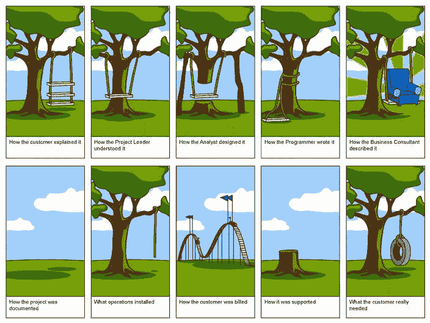
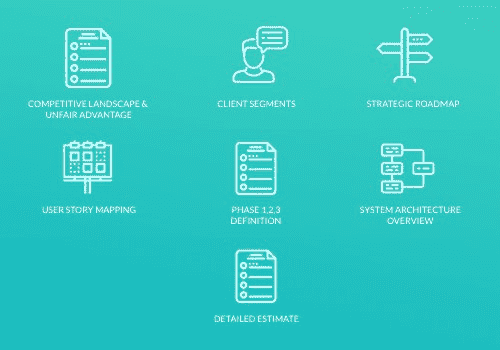

# 软件产品发现研讨会:如何确保成功的数字项目启动(内有免费的分步议程)

> 原文：<https://www.stxnext.com/blog/software-product-discovery-workshops/>

 你还记得创建一个软件产品只需要一个好主意和一个空车库作为办公空间的时代吗？

那些日子已经一去不复返了。伟大的想法远不足以创造伟大的产品。相反，你需要的是:

*   声音评价，
*   适当的设计，
*   严格的计划。

开始构建您的数字产品的正确方法是依靠那些定期开发软件项目的人的知识和经验。

但是你如何利用这种专业知识来获得优势呢？我们建议参加[探索研讨会](/services/discovery-workshops/)。

**继续阅读了解:**

*   **什么是发现工作坊？你能从过程中期待什么？**
*   **您为什么要参加探索研讨会？对你有什么好处？**
*   **探索研讨会的最佳实践有哪些？你应该问什么问题来充分利用它们？** 

#### 软件产品发现研讨会:总结

长话短说，将一个想法转化为完全可操作的数字产品是一项巨大的事业，需要技能、知识和经验——仅举几例。抚养一个孩子需要一个村庄，完成一个软件项目需要一个专业团队。

在你开始你的项目之前，评估你产品的潜力只是许多关键步骤中的一个。无论你只是考虑发展你的想法，为潜在投资者准备一个预告片，还是计划一个详细的实施，发现研讨会都是一个很大的帮助。

##### **通过正确开展前期发现研讨会，您可以避免哪些关键问题？**

1.  低估了产品的开发成本，这会阻碍你完成项目。
2.  发布没有市场潜力的产品。
3.  实现一个不满足用户需求的产品。

##### **参加探索研讨会，你会有什么收获？**

产品发现研讨会侧重于项目规划的各个层面，但以一种最终为您提供切实可交付成果的方式推动该过程。

参加研讨会至少会让您学到:

*   一套明确的业务目标；
*   技术堆栈建议和软件架构概述；
*   对产品实施成本的初步评估；
*   对你的核心目标受众及其视角的精确描述；
*   您的产品的初始范围和战略路线图，包括 MVP 定义(最小可行产品是您的产品的一个版本，其功能刚好足以收集经验证的知识)。

此外，最终产品的界面概念可能在发现研讨会期间起草。然后，在项目开发的下一阶段，您可以使用这些概念来制作一个可点击的产品原型。

##### 什么样的企业会从探索研讨会中获益最多？

最有可能从发现研讨会中获益的企业可分为三大类:

1.  进行数字化扩张并考虑实施复杂产品的公司寻求创新和提高客户忠诚度，但需要概念评估和适当的资源评估；
2.  寻求外部资金的组织；
3.  想法很棒但实施潜力很小的创业公司。

在 STX Next，我们为来自世界各地(美国、英国、澳大利亚、法国、加拿大和许多其他国家)的客户举办了许多发现研讨会，帮助他们构建成功的软件产品。

这些年来，我们学到了很多关于经营工作坊的知识；例如，如果你决定完全跳过开发过程中的这一步，你会冒什么样的风险。

如果 TL，请继续阅读；上面的 DR 部分不足以满足您的好奇心，您希望更深入地了解软件产品发现研讨会的主题。

 

#### 跳过软件产品发现研讨会有什么风险？

计算机科学中有一个概念叫做“GIGO”，代表“垃圾进，垃圾出”这意味着坏的输入总是给你坏的输出。换句话说，  **正确地开始你的项目是决定你整个开发过程成败的一个因素。**

从长远来看，从一开始就开展探索研讨会这一额外举措肯定会带来回报。不这样做，直接跳到实现，这是你应该抵制的诱惑——否则以后可能会面临可怕的后果。

不相信我们？如果你决定不去参加研讨会，下面是你要冒的风险:

##### 1.低估项目实施成本

不要误以为你的想法很简单。

一个非常常见的错误是假设既然你的解决方案看起来很简单，那么实现它也很简单。

**然而现实是，你的想法出现得越明显，就越容易低估你的项目实施成本。** 这就是许多项目最终未完成或被放弃的原因:没钱完成工作。

简单是一方面，但是你也不应该忽视底层的技术和开发技术，或者将你的产品想法变成现实所必需的过程。

如今，数字产品领域正变得越来越复杂。有可能，甚至很有可能，你能正确评估你的项目的唯一方法是得到熟悉商业、设计和开发领域的人的支持。

##### 2.不适合任何人的伟大产品

不幸的是，资金不是你可能遇到的唯一问题。

即使你有足够的钱投资你的产品，仍然有一个非常现实的可能性，你根本找不到任何人来卖它。当创意没有事先得到验证时，数字产品通常会缺乏用户。

**为了正确评估您的每一个解决方案，您应该考虑:**

1.  **市场潜力，**
2.  **成本利润比。**

这两个都是判断你的产品是否能赚钱的关键。准确定义你的想法，并为市场验证做好准备  **是必须的。**

不过需要注意的是，发现工场  *不* 包含市场验证。相反，我们帮助你明确你的想法，并可能建议一种通过原型或 MVP 来验证它们的方法。

##### 3.错误的喜剧

无论您是否是软件开发人员，您都可能听说过关于某种形式的秋千设计过程的笑话:

**Source: https://knowyourmeme.com/memes/tree-swing-cartoon-parodies**

迷因是一个明显的夸张，但它描绘了一幅当你没有正确地将你的想法转化为你的产品时会发生什么的美好画面。

如果你不希望关键细节在翻译中丢失，你需要正确地计划流程，确保你期望开发的所有功能都包含在产品的路线图中。

尽早这样做是个好主意，因为预期的功能决定了开发技术——而不是相反。 从发现最适合你项目的实现技术开始。

此外，要明确的是，当你不参加研讨会时，你不仅仅是在冒着这些事情发生的风险。如果你的运气够差，你的项目可能会遭受上述两种甚至全部三种风险。想想吧！

#### 通过软件产品发现研讨会克服分析瘫痪

当你有一个伟大的想法，但你过度意识到你可能会在实施过程中和实施后遇到的问题，你可能会成为一种现象的受害者，这种现象被称为“分析瘫痪”——过度思考你的行动过程，以至于你没有完成任何工作。

实现你的想法的潜力是一回事；实际上，执行起来完全是另外一回事。如果你几乎没有或根本没有实施数字产品的经验，那么整个过程会显得特别困难。这更适用于具有更大潜力的想法，这些想法可能会变成更大的项目。

能够帮助你打破这种不采取行动的恶性循环的方法是提炼你的想法，让你能够迈出项目的最初几步。 这就是探索工作室发挥作用的地方。

当你把它分解成最基本的要素时，  **发现研讨会是一个收集关于你的业务、目标和想法的信息，然后把它们变成一个计划的过程。**

让我们一步一步来看看这个过程。

##### 1.定义业务需求和目标

第一个关键步骤是核实你的业务需求和目标。你真的应该涵盖所有的基础，从每个必要的角度来看这个问题。

即使所有相关方似乎都达成了一致，不同涉众的计划和期望之间的差异有时会在开发过程的后期暴露出来。

这些计划和期望应该从一开始就明确并考虑进去，以免你最终得到一个设计和开发都不充分的产品。

##### 2.对照业务目标测试产品创意

一旦你正确地定义了你的商业目标，是时候抓住你的产品的潜力，以及它如何与你的目标相一致来服务于它的目的。

这是实际产品功能需要从你的期望和想法中获得的地方。同时，这里需要大量的构建软件的知识。

想法测试阶段不仅仅是实施。在此过程中，您还需要:

*   根据你的产品目标对功能进行优先级排序，
*   为实施分配足够的时间，
*   将功能划分为可管理的阶段(包括 MVP)，
*   评估产品交付成本。

重要的结论往往在这一点上达成。例如，  **你可能会发现你的范围需要调整或者你的产品不会盈利，** 因为实施的成本远远超过了潜在的利润。

##### 3.想象产品的潜力

最后但并非最不重要的一点是，探索研讨会应该给你一个产品潜力的直观展示。让你的可交付成果可视化是以故事的形式讲述你的想法的一个很好的方式，让你更容易向利益相关者表达你的概念和假设。

一旦你想象出你的产品的潜力，你应该考虑将你的想法转化成一个可点击的界面原型，虽然开发这样一个原型不会发生在探索研讨会上，因为它是一个独立的产品。

无论如何，原型是这个过程的下一个有机步骤，它允许你进一步验证你的产品，并帮助你吸引种子投资者。你的投资者会期待你有一份可靠的商业计划，同时有机会亲眼看看提议的功能是如何运作的；一个原型是完美的。

拥有原型的主要好处是能够与潜在用户一起验证你的核心产品想法。 无论你计划在内部使用你的产品还是在市场上销售，从你的最终用户那里获得关于产品特性的反馈对于释放产品的真正潜力是至关重要的。

 

#### 软件产品发现研讨会工件和交付件

总而言之，准备充分且进行良好的发现研讨会将为您提供:

*   全面定义您的业务目标和需求；
*   概述您的软件架构和技术堆栈建议；
*   产品的战略路线图和范围，以及 MVP 定义；
*   实施产品的初始成本评估；
*   针对流程中后续步骤的可靠生产计划。

Software product discovery workshop artifacts and deliverables

有了这个结果，你应该已经准备好做出正确的决定来推进你的产品创意。

#### 接下来我们如何在 STX 举办软件产品发现研讨会？

多年来，我们已经为来自世界各地的客户举办了 50 多次探索研讨会，总共持续了 128 天。

每一次，我们都从分配三整天的现场研讨会开始。然后，我们邀请客户到我们的办公室，并确保他们在这里感到受欢迎。

一旦为期三天的研讨会结束，我们需要额外的几天时间来完善交付成果并将其转换为可共享的形式。

##### 你应该提前准备些什么？

实际研讨会之前的大部分工作都由我们完成。我们试图通过研究客户的行业和商业领域来做尽可能多的准备。

为了不遗余力，我们经常要求我们的客户给我们提供他们拥有的任何文件，这些文件可以帮助我们更好地准备他们的意见。 **当前流程的概述、业务目标和战略、市场潜力研究——所有这些都可能对我们非常有用。**

但是，你没有  *有* 给我们提供任何东西。事实上，我们遇到过这样的情况，我们需要在研讨会期间后退一步，重新验证一个策略，即使它已经提前交付给我们了。

没有哪两个工作坊是完全一样的，对其他人有效的可能对你完全无效。像往常一样，在我们开始研讨会之前，用你最好的判断来决定与我们分享什么就足够了。

##### 参与的各方是谁？

我们所有的发现研讨会都有三个人参与，每个人都负责在整个过程中保持不同的观点:

1.  **产品战略顾问，代表商业视角；**
2.  **产品设计负责人，代表用户视角；**
3.  **技术专家，代表技术视角。**

从客户的角度来看，我们总是要求相应的团队也代表业务、用户(或营销)和技术的观点。这里的技术视角不一定意味着数字产品知识，而是你的专业领域。

此外，我们建议从所有应该参与到您的产品构建过程中的利益相关者那里获得直接或间接的意见。在这种情况下，直接输入将是您在研讨会期间随时可以得到的输入。

##### **流程是什么？**

我们对每个车间都进行单独处理，没有放之四海而皆准的解决方案。每个客户都有不同的待遇。这一过程如此有效，部分原因是因为它非常灵活。

每当我们计划举办研讨会时，我们都会考虑许多因素:

*   产品生命周期阶段，
*   你产品的特性，
*   你一开始给我们的输入。

这是一个全新项目的流程示例，处于构思阶段。

首先，我们将研讨会分成三个不同的模块。根据产品的复杂性和研讨会的目标，最初的几个小时都是关于你的产品愿景和战略。

我们与您一起创建一份愿景声明，列出所有对您的产品具有重要意义的用户群和合作伙伴，然后验证您区别于竞争对手的独特优势。

在这一天的第二部分，我们确定你的产品的潜在用户。理解并满足目标受众的需求是任何产品成功的必要条件。

在第二天和第三天，我们专注于实际的产品规划，将时间用于:

*   构建路线图，
*   定义 MVP，
*   绘制特征图，
*   起草界面，
*   勾勒出建筑轮廓。

最后，我们还会对您产品的实施成本进行初步评估。

研讨会结束后，我们会花几天时间将我们的笔记和交付内容整理成一种您以后可以轻松访问的格式。总结所有成果的演示文稿，附有路线图和界面想法，供您内部使用或与潜在投资者或开发人员分享。

**请记住，参加像我们*这样的公司举办的探索研讨会并不意味着*你也必须和我们一起采取下一步行动。** 所有的可交付成果，包括你的产品架构，都是以一种方式准备的，这种方式可以让你轻松地将你的开发带到你选择的任何团队。

#### 软件产品发现研讨会面向谁？

从参与发现研讨会中获益最多的企业可以很容易地分为三类。

所有人都能够利用他们的研讨会成果对他们的产品做出更好、更明智的商业决策。

##### 1.计划实施复杂项目的组织

首先，我们有公司进行数字化扩张，并计划对新产品进行大规模投资。他们通常有自己的内部开发团队，通常寻求:

*   创新，
*   概念评估，
*   提高客户忠诚度，
*   成本评估，
*   进一步的项目验证。

所有项目都需要一个资金计划，尤其是需要更多资源的复杂项目。当你低估了你的项目范围时，把这些放在一起会变得更加困难。

##### 2.寻找投资者的公司

当你在寻求外部资金时，发现研讨会可以让一切变得不同。

在这种特殊情况下，我们倾向于从一个稍微不同的角度来处理创意验证，特别强调向投资者展示产品的全部市场潜力。

为你的软件项目获得资金不是一件容易的事，准备再多也不过分。你需要数字、细节，最重要的是，一个明确的生产计划。

研讨会将为你提供所有这些。

##### 3.创业公司

很多创业公司都有很棒的想法，但几乎没有开发经验或资源。提炼和形象化你的概念是决定下一步的关键。

实际上，你的想法是已经变成了一个项目，还是刚刚想出来，这并不重要——你会从(重新)评估它的潜力中获得同样多的收益。

在进入开发阶段之前的任何阶段，理解你的业务目标和需求以提升你的产品都是有益的。

#### 关于软件产品发现研讨会的最终想法

当你需要有效地从计划转移到发布你的产品的第一个版本或者一个主要的新模块时，发现研讨会是一个很好的主意。

研讨会:

*   提炼你的概念，
*   更容易理解您的业务和开发人员面临的挑战，
*   给你足够的空间来引入必要的改变，甚至完全重新定义你的项目。

您应该记住的是，探索研讨会不会为您提供完整的项目计划，这不是他们的目的。您在研讨会期间获得的交付成果旨在帮助您稍后规划每个简短的实施阶段(sprint)并根据您现有的或更新的需求进行调整。

灵活性是敏捷工作的主要优势之一，因为它允许您随时修改项目的后续步骤，以交付一个优秀的产品。  **产品的质量是最重要的，而发现研讨会是高效项目管理流程的关键。**

如果您想了解更多有关发现研讨会流程的信息，或者更好地了解如何准备，我们强烈建议您使用上面或下面的表格  **下载我们的免费分步议程。**

如果您希望再次检查您的项目计划，希望为您的项目获得外部资金，或者不确定如何将您的产品推向市场，那么[我们将为您提供帮助](https://stxnext.com/contact-us/)！