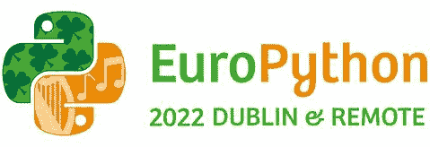
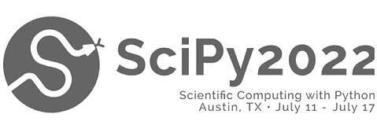
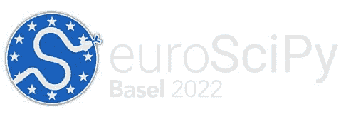
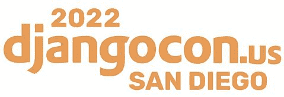

# 2022 年参加 7 场 Python 会议，成为更好的 CTO

> 原文：<https://www.stxnext.com/blog/8-python-conferences-attend-2019-become-better-cto/>

 首席技术官的职位伴随着许多期望和责任。

你需要增加你的知识，使你的关系网多样化。更新你的技术栈或者扩展你的开发团队在任何时候都是合适的。

通过参与演讲机会、会议和媒体活动来代表公司的技术愿景也属于你的职责范围。

最后，雇佣和留住工程人才也是你工作描述的一部分。这是科技初创公司和老牌公司目前面临的最大挑战之一。由于就业市场非常青睐有才华的开发人员，为首席技术官寻找与潜在员工见面的机会变得越来越重要。

那么，你如何着手实现这些目标呢？

**要做到这一点，一个很好的方法是参加专注于您的** [**选择的技术组合**](https://stxnext.com/ebooks/what-is-python-used-for/) **的技术会议。本文中心的 tech 栈的基础是**[**Python**](/python-vs-other-programming-languages/)**。**

即使现在，上半年已经过去了，仍然有很多机会来提高你的人才发现能力，并保持与时俱进。 

#### 你能从 CTO 会议中学到什么？

这里介绍的 7 个会议有助于解决让首席技术官们夜不能寐的一些最大问题，例如:

*   **做技术决策；**
*   **管理创新；**
*   **及时了解新兴技术或框架；**
*   提高编码技能，尤其是如果你是一家初创公司的首席技术官；
*   **管理工程团队组合。**

#### CTO 充分利用 Python 会议的技巧

以下是一些建议，你可以利用这些建议来充分利用参加会议的机会:

##### 1.申请发言

这一点怎么强调都不为过。这些活动为分享你的想法和故事提供了一个很好的平台。此外，这也是一个与其他开发人员一起展示特定项目、邀请辩论和建立联系的机会。

关于这个主题的更多信息，我们建议您查看 DjangoCon 的美国页面 作为参考。

##### 2.赞助活动或抢占展位

根据你的招聘需求，这给了你一个面对面接触潜在开发者的机会。这确实涉及到带来一些额外的团队成员，但成本可能是合理的。DjangoCon Europe 有一页讨论了这种方法的好处。

##### 3.下载会议应用程序

提前使用该应用程序来制作您的个人资料和安排会议。此外，当远程加入会议时，这是与其他参与者联系并获得更全面的会议体验的好方法。如果你想建立关系网和进行一些社交活动，许多与会者也会聚集在官方的 Slack 频道上。

##### 4.充分利用主题演讲人

向其他推动创新的人学习。不要羞于参与问答，让演讲者说出你感兴趣的关键点。另外，记笔记。笔记从来都不是个坏主意。

##### 5.加入黑客马拉松或开发冲刺

对于动手的 CTO 来说，这是为开源项目做贡献甚至介绍自己的项目的好方法。更不用说这很有趣。

##### 6.在招聘会或展览会上建立关系网

即使没有展位，这也是接触有才华的开发人员的最佳策略。查看 2019 年的 [PyCon 招聘会](https://us.pycon.org/2019/sponsors/jobs/) ，了解这是如何组织的。它可能有点旧，但当我们说它没有过时时，请相信我们。

#### 2022 年下半年必须参加的 7 个 Python 会议

Python.org 出色地列出了全球顶级 Python 会议。然而，涉水通过名单可能会很麻烦，一些值得注意的地区事件被遗漏。

考虑到这一点，我们选择并在下面列出了一些重要的 Python 会议，任何 CTO 或工程经理都应该考虑参加即将到来的 2022 年下半年的会议。

这些会议是根据活动的实际日期来排序的。如果你是最后一分钟，从头开始。

##### 1.PyData 伦敦 2022

*   地点:英国伦敦
*   日期:6 月 17 日至 19 日
*   网址: [(点此)](https://pydata.org/london2022/)

##### **期待什么**

在三天的时间里，来宾将有机会参加研讨会，参加现场主题演讲和与优秀演讲者的讨论，并结识 PyData 社区的其他成员。现在唯一还能买到的票是会议最后两天的票，它们肯定会很快消失，所以最好快点。

##### **什么让它与众不同**

PyData 处于多元化和包容性的最前沿。作为非营利组织 NumFOCUS 的教育项目，他们试图创造一个多样化和包容性的空间。他们支持女性作为主要的主题发言人，并在活动期间提供免费的儿童保育服务，我们对此都很关心。

##### 2.欧洲 Python 2022

*   地点:爱尔兰都柏林&偏远地区
*   日期:7 月 11 日至 17 日
*   网站: [(点击此处)](https://ep2022.europython.eu/)

##### **期待什么**

EuroPython 是一整周的讲座、研讨会和教程。该事件分为以下几个部分:

*   两个研讨会/培训日(7 月 11 日至 12 日)
*   三个会议日(7 月 13 日至 15 日)
*   两个冲刺日(7 月 16 日至 17 日)

今年，您可以同时参加现场和在线会议，这将是欧洲最大的 Python 会议。它将包括 120 多个演讲环节，以及各种互动活动。

##### **什么让它与众不同**

第一条欧洲巨蟒实际上比第一条 PyCon 早了一年。最初的活动聚集了 240 名与会者。现在每年参与人数接近 1200 人。如果你以前没有机会参加 EuroPython，并且你想知道它看起来怎么样，你可以在[【archive.org】](https://blog.europython.eu/europython-videos-all-on-archiveorg/)上观看所有以前的视频资料。

##### 3\. SciPy USA 2022

*   地点:美国德克萨斯州奥斯汀
*   日期:7 月 11 日至 17 日
*   网址: [(点此)](https://www.scipy2022.scipy.org/)

##### **期待什么**

这将是第 21 届著名的 Python 科学计算年会。该活动包括两天的辅导、三天的讲座和两天的开发人员冲刺。

它汇集了一个致力于通过数学、科学和工程领域的开源 Python 软件推进科学计算的社区。来自世界各地的参与者可以展示他们的最新作品，并相互学习和合作。

今年，SciPy 宣布了另外两个将与常规会议同时进行的专业主题:机器学习和数据生命周期。鉴于最近对这些话题的兴趣激增，这似乎是一个与业内专业人士交流和拓宽知识面的绝佳机会！

##### **什么让它与众不同**

对于社区建设，SciPy 引入了“一丘之貉”(BoFs)会议。这一活动包括一个专家小组的简短发言，随后主持人向所有与会者开放讨论。BoF 的主题可以是大家普遍感兴趣的，也可以基于会议的主题。

##### 4.欧洲科学 2022

*   地点:瑞士巴塞尔
*   日期:8 月 29 日至 9 月 2 日
*   网址: [(点此)](https://www.euroscipy.org/2022/)

##### **期待什么**

该计划由五天的辅导、冲刺和讲座组成，有 80 多名演讲者参加。到目前为止，还没有公布太多的细节，因为几天前才结束征集提案，但我们肯定会感到兴奋。

##### **什么让它与众不同**

科学笔记是一个完整的讲座集合，涵盖了从科学 Python 的基础到更高级的主题和软件包的所有内容，是根据多年来所有科学事件汇编而成的。

##### 5.PyCon UK 2022

*   地点:英国卡迪夫
*   日期:9 月 16 日至 18 日
*   网址: [(点此)](https://2022.pyconuk.org/)

##### **期待什么**

为期三天的会议吸引了 500 多名与会者，主要集中在英国。在这些天里，与会者可以参加主题演讲、会谈和小组讨论，以及闪电会谈和短跑。和这个列表中的所有会议一样，PyCon UK 为公司提供了一个选择，赞助一个展位，并将他们的会议成果与招聘结合起来。

##### **什么让它与众不同**

自 2016 年以来，每年都会推出 PyCon UK Slack，其唯一目的是组织与其他与会者的聚会。社交频道为那些无法在整个活动期间逗留的人提供了社交机会。

##### 6.决哥肯欧洲 2022 年

*   地点:葡萄牙波尔图&偏远地区
*   日期:9 月 21 日至 25 日
*   网址: [(点此)](https://2022.djangocon.eu/)

##### **期待什么**

DjangoCon Europe 是我们个人的最爱之一，它连续第三年重返葡萄牙！每年，它由不同的独立志愿者团队主办，但由于缺乏申请人，它将再次在波尔图举行。

就我们而言，我们欣喜若狂，因为他们以前的分期付款太棒了。目前没有可用的时间表，但预计将很快宣布。

##### **什么让它与众不同**

DjangoCon 是一个为期五天的国际会议，重点是[Django](https://www.djangoproject.com/)——Python 的“有期限的完美主义者的 web 框架”毫无疑问， [Django](/services/django-development/) 是 Python 中最流行的 web 框架(你可以在这里 了解更多关于 Python web 框架 [)。](/stx-new-blog/beginners-introduction-python-frameworks/)

我们绝对崇拜的是，它提供了一个资助计划，“优先考虑发言者，然后是任何代表不足或边缘化群体的一部分。”就在 2020 年，他们提供了 500 个免费注册！

##### 7.DjangoCon US 2022

*   地点:美国加利福尼亚州圣地亚哥&偏远地区
*   日期:10 月 16 日至 21 日
*   网址: [(点此)](https://pretalx.com/djangocon-2022/cfp)

##### **期待什么**

我们名单上的另一个 DjangoCon，这次是在美国。2022 年版的议程仍在敲定中。会议组织者声称，像往常一样，将会有大量的社交机会，与赞助商共度的时光，以及社交活动。我们期待从关于构建移动应用和快速原型的研讨会到关于数据可视化和可访问性的讨论。

##### **什么让它与众不同**

DjangoCon US 宣布，今年他们将举办一个“深度潜水日”,重点探索 Django 和 Django 相关的主题。它打算跟随《Django:引擎盖下 的脚步，为具有不同 Django 知识和经验水平的人深入研究广泛的主题。

#### 关于参加 2022 年 Python 大会成为更好的 CTO 的最终想法

做 CTO 意味着你可能会非常忙。即使你想参加，你也不能参加所有的会议。有很多工作要做，比如更新你的应用程序，为投资者的推介做出贡献，或者为扩大你的团队进行招聘。

虽然有各种各样令人惊叹的 Python 会议可供选择——其中一些我们可能已经忽略了——但这 7 个精选提供了关于新兴技术的引人入胜的讨论和扩大您的工程团队组合的刺激前景的正确组合。

选择任何一个，我们保证你会得到你的钱的价值。然而，话虽如此，现在这么多的活动正在面对面和在线进行，在你的日历上安排一些额外的活动也不是不可能的！

#### 您的反馈

感谢您花时间通读这份清单。

你同意我们的选择吗？你认为我们遗漏了所列会议的一条重要信息吗？知道另一个 Python 会议应该在列表中，但是没有吗？

去吧 [给我们留下评论](/hire-us) 。我们会核实你的建议，如果我们认为首席技术官可能会感兴趣，我们会在下一次更新帖子时包含这些建议。

如果您想了解更多关于首席技术官当前最重要的问题，请查看我们的 [2021 年全球首席技术官调查](/cto-survey-2021-report) 的报告！