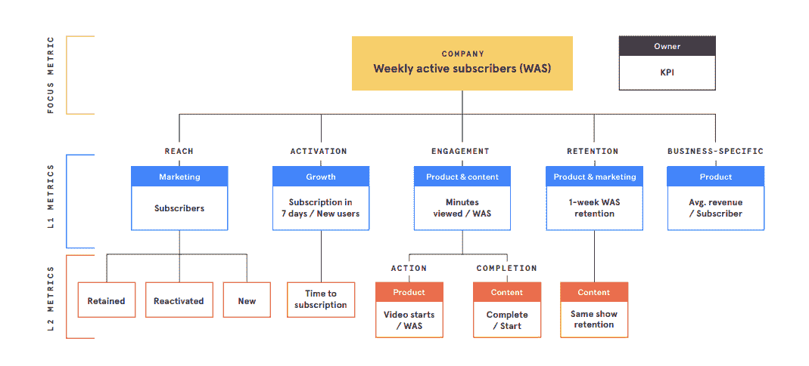
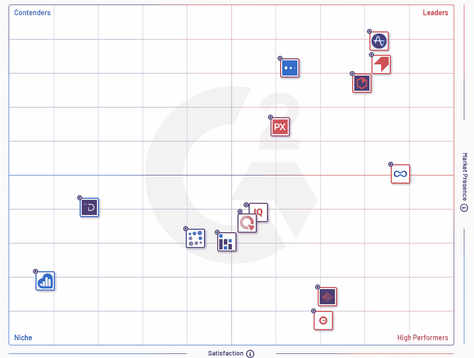
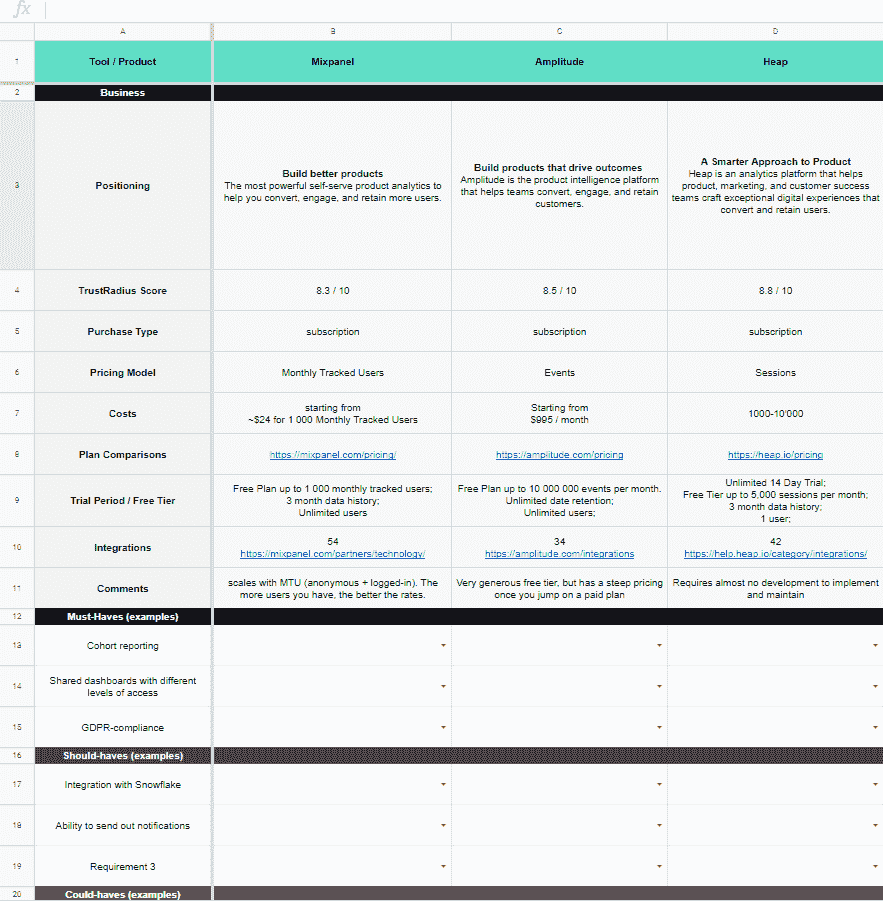

# 如何选择最佳分析工具:产品分析前景

> 原文：<https://www.stxnext.com/blog/how-to-pick-the-best-analytics-tools-product-analytics-landscape/>

 因为你点击了这篇文章，你可能是一个产品或增长经理，对不对？

我知道你的工作有多困难。负责开发一个产品，哎哟！你肩上的担子太重了。所以，我想让你的生活稍微轻松一点。

让我先问你这个问题:你是如何做决定的？我的意思是关于你的产品发展方向的决定。

凭你的直觉？勇敢。

按照别人告诉你的去做？有风险。

可能……用数据？聪明。

如果你像大多数伟大的产品经理一样——我相信你也是！—你有数据。但不仅仅是为了拥有它。你根据这些数据得出结论并采取行动。

在我们上周的“不要搞砸你的产品分析”现场会议中，我们讨论了分析策略，回答了诸如“你应该为你的产品跟踪什么指标？”以及“您如何找到最适合您产品的分析工具？”

下面是我们讨论内容的快速回顾。在文章的最后，你还会发现一个我个人在我们公司使用的产品分析电子表格。

如果你有兴趣，你可以在这里观看整个直播 时段 ！ 

[https://www.youtube.com/embed/zyU9xRImR3I](https://www.youtube.com/embed/zyU9xRImR3I) 

#### 逐步发展你的分析策略

如果你希望以正确的方式发展你的分析策略，我建议遵循以下 4 个步骤:

##### 1.好好审视一下你的生意

从问自己一系列问题开始，诚实地回答它们。

你如何赚钱？你如何向用户传递价值？交叉是什么？你需要什么信息来发展你的产品？

##### 2.选择一个能够很好地反映产品增长的指标

通常，这将是一个同时捕捉两件事的指标:你创造价值的时刻和它发生的频率。

这里的例子可能包括:每日活跃用户、每周活跃买家或每月活跃订户。

##### 3.将您的客户旅程分成一个漏斗

您还应该开发一组更细粒度的指标，每个指标对应于一个特定的生命周期阶段。

一个典型的漏斗是这样的:触及激活参与保持。

Mixpanel 是一个很好的工具。看看他们的框架:

***Mixpanel 的产品指标指南***

##### 4.绘制您的产品流程图

用户需要采取哪些步骤来执行关键的、推动价值的行动？你可以有一个注册流程，一个登录流程，一个试用升级流程(如果你是 SaaS)等等。

查看产品流程中的所有步骤。这些是你的事件。

[听听我们的现场直播，了解更多细节](https://www.youtube.com/watch?v=zyU9xRImR3I)——我保证你会喜欢的！

#### 产品分析前景

现在我们已经讨论了产品策略，让我们跳到本文的核心:工具。

快速浏览一下 G2Crowd，你会发现市场上大约有 35 种产品分析工具。然而在现实中呢？你应该把这个数字翻倍。

如果你还包括网络分析工具，这些工具经常被归为一类——增加两倍。

*[G2Crowd 的产品分析工具矩阵](https://www.g2.com/categories/product-analytics)*

大多数工具都是基于订阅的，具有非常相似的特性和报告能力。但是您可以对它们进行分组。有两种方法可以实现:

##### 定价

#### 1。会话

每次用户访问您的软件产品或网站时，您都需要付费。根据产品的性质和使用频率，会话可能会很快堆积起来。一个非常流行的按会话计费的工具是堆分析。

#### 2。事件

在会话期间，用户可以执行许多操作。每个被跟踪的动作都是一个事件。因此，虽然会议在这里并不重要，但产品使用的强度可以决定你钱包的成败。

振幅也许是使用按事件定价的最著名的工具。它还附带了一个非常慷慨的 10，000，000(！)每月事件。

#### 3。每月跟踪的用户数

这种计费方式非常适合用户基数较小、使用模式密集的产品。

你将为每个访问过你的产品或网站的用户(匿名或已确认)付费。但是在这种情况下，您不需要担心用户生成的会话或事件的数量。

使用这种计费方式的一个流行工具是 Mixpanel。

##### 数据收集法

说到数据收集，有两种观点:

#### 1。选择性测量，又称经典分析

在这种情况下，您需要预先定义数据点，也就是您想要跟踪的事件。您将这些事件硬编码到产品中，开始向工具发送信息。

您可以随时添加更多事件。但是您只能从实现的时候开始收集数据。

从这个意义上说，Mixpanel 和 Amplitude 都是经典的分析工具。它们需要开发人员来正确地设置和维护——尤其是当您的产品发生很大变化时。

#### 2。衡量一切，又称追溯分析

我个人觉得这种做法很酷，真的很有用。像 Heap 这样的工具会跟踪从你在产品中放置一段代码开始发生的所有事件。然后，您自己定义事件。In-tool，无需开发人员。

更妙的是，您可以随时定义新事件，并获得这些事件的所有历史数据。

现在你知道为什么它是追溯性的了！

##### 特征

好吧，这不一定是一个独立的分组，就像前面列出的两个分组一样。但是为了比较这些工具，最好知道要查看哪些特性。

我喜欢如何将 [马修·勃兰特](https://ch.linkedin.com/in/matthewabrandt#:~:text=In%20the%20analytics%20field%20since,analyses%20of%20the%20data%20collected.) 分解为 [CXL 课程](https://cxl.com/institute/online-course/product-analytics/) 。他区分了 4 个特征类别:

#### 1。指标

会话、参与、事件、保留、目标、转化、社交活动、电子商务等。

#### 2。用户识别

地理定位，人口统计，拼接。

#### 3。报告

实时、群组、设备统一、趋势、漏斗、仪表盘。

#### 4。附加功能

A/B 测试、通知、集成、警报、访问级别、质量保证。

所有这些都将在下一节中派上用场。

#### 为工作选择合适的工具

##### 电子表格，而不是框架

老实说，我不一定有选择最佳产品分析工具的框架。它更像是结构化的谷歌电子表格。实际上，是马修·勃兰特的修改版。

它收集关于您正在考虑的工具和您的业务需求的业务信息——非常简单。

我想你可能会发现它对你自己的分析需求非常有用，所以我想与你分享。阅读这篇文章的末尾，获得我的电子表格的链接！

为了让事情变得更简单，我已经填写了我们之前提到的 3 个产品的细节:Mixpanel、Amplitude 和 Heap Analytics。

这张电子表格是这样的:

***产品分析工具电子表格***

##### 收集您的业务需求

既然您已经准备好了一个不错的电子表格，那么您必须做好自己的工作，开始收集您的业务需求。

我这么说到底是什么意思？

简而言之，你必须四处走动，与你的每一个利益相关者交谈。问他们想要什么，准备好列出一大堆愿望清单。

这就是更困难的部分:你必须把这个清单剥离到绝对必须拥有的东西。他们离不开的功能、报告和集成。

帮助我抓住利益相关者需求本质的是使用“5 个为什么”有印象吗？它是丰田生产系统(TPS)的一部分。他们在酷之前就已经很敏捷了！

“5 个为什么”就是它看起来的样子——你问了 5 次“为什么”。这样做可能会觉得有点奇怪，但我向你保证，这确实有效。如果你不相信我，可以看看 Buffer 关于“5 个为什么”的文章 

##### 莫斯科

这是一个非常酷的城市，但这不是我们在这里谈论的。或者地铁 2033。

一旦你在前面的步骤中收集了所有的需求，你应该试着把它们放到莫斯科。

让我解释一下…

莫斯科是一个在管理中非常流行的优先级框架。我不打算给你一个冗长的定义(你可以在 [维基百科](https://en.wikipedia.org/wiki/MoSCoW_method) 上查一下)。简单来说，它是一个缩写词，代表:****【必须拥有】【应该拥有】【本可以拥有】【不会拥有】****

 *这些是你的需求类别。

确保你正在考虑的产品分析工具勾选了所有必备的选项。理想情况下，它们还应该包括大多数应该拥有的东西和一些可能拥有的东西。*  *#### 摘要和电子表格下载

这就是它的长与短。感谢您阅读我关于产品分析前景的文章！

请记住，数据是做出明智商业决策的关键。没有它，你会迷失方向，永远无法实现产品的全部潜力。

我已经和你分享了我认为最适合这项工作的分析工具，但是剩下的就看你自己了。不过，我认为这篇文章可以作为你开始的一个很好的路线图。

现在，正如承诺的那样， [这是我的产品分析工具电子表格，包括 Mixpanel、Amplitude 和 Heap Analytics](https://docs.google.com/spreadsheets/d/1PMUC6F2VoIIZzLp_PHQ7iAenqlhAQ3iv-vu6n7gZsnw/edit#gid=0) 。

我希望它能像对我一样为你服务。祝您的分析和数据驱动型决策好运！*