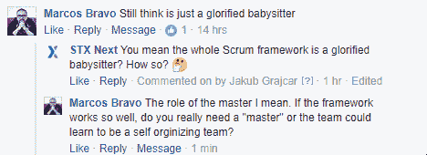

# 4 个常见的 Scrum 误解(以及头号 Scrum 错误)

> 原文：<https://www.stxnext.com/blog/common-misconceptions-about-scrum-framework/>

 不久前，我根据对 Dominika brzezinska 的采访，介绍了 Scrum 框架的基础知识。在那篇文章中，我承诺会更深入地探讨这个主题，并谈论针对 Scrum(以及某种程度上的敏捷)的常见批评。

兑现这一承诺的时候到了。

要了解更多关于常见的 Scrum 误解，包括 Dominika 所说的头号 Scrum 错误，请继续阅读。

作为一名经验丰富的 Scrum 大师，Dominika 听到了几乎所有你能想到的对 Scrum 框架的批评。以下是前四名，以及她的反驳。 

#### " Scrum 只有会议，没有工作！"

一个流行的批评是 Scrum 有太多的会议，超过了确保团队效率所必需的。 但是，让我来问你这个问题:什么比例的  **策划** 到  **行动** 你认为对于交付一个高质量的复杂项目是必要的吗？

如果你回答了“大约 15%的计划到 85%的行动”——恭喜你！这正是一个普通的 Scrum 团队花在会议上的时间。剩下的就是工作:计划周密、目标明确的工作。

诚然，在 Scrum 过程中有相当多的  *类型* 的会议，但是，正如你在  [我们的 Scrum 简介](http://bit.ly/stxscrum) 中所看到的。但是每一次会议都有一个重要而明确的目的。

没有分心的余地；Scrum Master 确保每次会议都紧扣主题，并在指定的时间内完成，正是为了避免团队陷入不必要的谈话。

#### “Scrum 在我们公司不起作用。”

有些公司和组织已经尝试过 Scrum，并认为它不适合他们。这没关系。

但是在你决定 Scrum 肯定不是要走的路之前，问自己另一个问题:  **我的公司准备好 Scrum 了吗？**

如果你的公司不鼓励频繁和开放的交流，你可能还没有准备好实施这个框架。Scrum 提供的直接合作需要一些时间来适应，并且需要正确的公司价值观。

也许您的公司根本没有为任何框架做好准备。如果你的日常工作包含混乱和无序，那么在实现 Scrum 和任何系统时，一些批评和抵制是可以预料的。

只有当你在合理的时间内给真正的、照章办事的 Scrum 一个公平的机会时，你才能说它“不起作用”。

#### “我只想编码，我不需要开会或者演讲！”

这种批评通常是由开发人员自己提出的。刚接触 Scrum 的开发人员可能会认为 Scrum 会议和 Scrum 大师(T1)和产品负责人(T3)的工作是不必要的，会打断他们的工作流程。

然而，你应该记住 Scrum 意味着团队合作。强调“团队”。

在某些情况下，独狼的心态是好的，但是当你在一个复杂的项目中工作时，你需要时刻意识到产品的远景和目标。如果你不计划你的工作，不把它与客户的实际需求相比较，你就会失去这种意识。

一个没有 Scrum 会议的开发人员可以在同一时间做更多的编程工作，这可能是真的。但是，如果没有“非编程工作”，一些代码将会变得毫无用处，这也是事实。结果可能是客户的观点完全不同，或者团队中的另一个开发人员已经覆盖了这个特性。

最后，开发人员是因为解决客户的问题而得到报酬的，而不是因为提供尽可能多的代码。 所以把这些问题记在心里并经常谈论它们是有好处的。

#### " Scrum Master 只是一个被美化的保姆！"

我相信这篇文章在我们的粉丝中引起小小的争议并不奇怪。其中一个人评论了另一个 Scrum 批评，添加到列表中:

论点似乎是 Scrum Master 对于团队的运作不是必要的。如果团队能自我组织，自己遵守 Scrum 的规则，Scrum 高手就没什么事了。

实际上，你可能会听到一些 Scrum 大师自己说同样的话。他们中的一些人采取的方法是“Scrum Master 努力变得不必要”。但这并不完全正确。

首先，没有实现框架的人，框架就不可能存在。有时候人会失去动力。突然，他们懒得去遵循 Scrum 的元素——即使他们以前是自组织的。在这种情况下，Scrum 大师会帮助他们遵循框架。它的所有元素都有存在的理由。

即使我们假设团队可以在 Scrum 下“自组织”,他们仍然需要:

*   有人在实践中教他们 Scrum
*   当变化发生时(变化总是会发生)，帮助他们保持良好实践的人
*   当他们开始停滞不前时，有人会督促他们提高自己
*   有人给他们一个局外人的视角来看待他们的挑战

Scrum Master 完成了所有这些角色。保姆通常不会走这么远。

##### **头号混战错误**

实施 Scrum 需要做一些工作。正如你在上面看到的(在我们的  [Scrum 简介](http://bit.ly/stxscrum) )，在 Scrum 角色、会议和规则之间，有很多地方需要讨论。那么，一些人在实现 Scrum 时犯错误，有时导致他们完全放弃框架，这就不足为奇了。

我问 Dominika 最大的 Scrum 错误是什么。她的回答几乎是瞬间的:

“人们做事不问为什么。”

很多时候，Scrum 专家过于关注过程的实际步骤，而没有看到背后更大的推理。他们说他们必须开一个计划会议，或者一个待办事项细化会议，或者一个每日脱口秀。

但是他们真的不需要开会。

他们真正需要的是计划好他们的工作，细化他们的待办事项，并同步他们的日常工作。他们具体怎么做是他们的事。

归根结底，Scrum 只是一个工具。一个定义明确、使用广泛、非常有效的工具，但仍然是一个工具。如果你不努力，它不会自己解决你的问题。但是如果你这样做了，Scrum 会确保你的努力没有白费。

如果你想更多地了解“为什么”的重要性在 Scrum 中，有一段她在最新的  [STX 下一届科技力量峰会](http://bit.ly/stxsummitvids)上的演讲视频:

[//www.youtube.com/embed/buUCi525od8](//www.youtube.com/embed/buUCi525od8)

#### 最后的想法

我们坚信，真善美终将胜利。

如果你曾经遇到过一个 Scrum 否定者，他使用了上面的批评之一，一定要把这篇文章分享给他们——他们可能会明白。分享按钮就在这段文字的正下方。

也许你对 Scrum 和敏捷的体验有点不同，你有独特的 Scrum 问题需要解决。不要害怕！我们很乐意帮忙。你可以通过 [business@stxnext.pl](mailto:dominika.brzezinska@stxnext.pl) 联系 Dominika 和我们团队的其他成员来聊聊 Scrum。

(如果你正在寻找  [了解更多关于 Scrum 软件开发业务方面的](https://stxnext.com/ebooks/what-is-python-used-for/) ，为什么不看看我们的[【C-Level 软件开发指南】呢？)](https://stxnext.com/ebooks/c-level-guide-to-software-development-nearshoring/)

