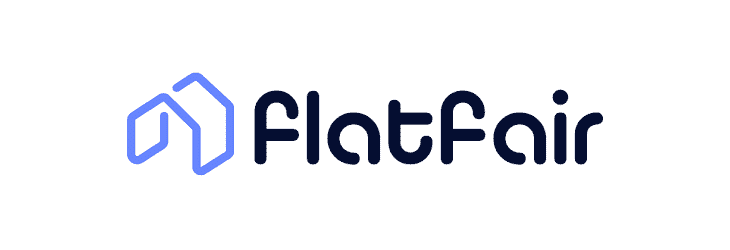
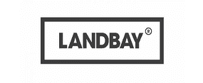
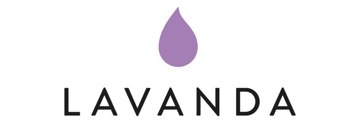
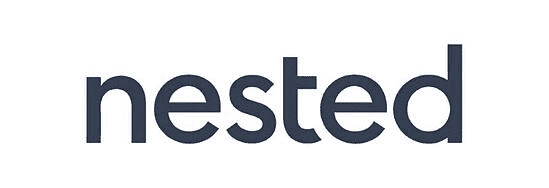

# 英国顶级 Proptech 公司及其技术堆栈

> 原文：<https://www.stxnext.com/blog/top-uk-proptech-companies-tech-stack/>

 英国是一个 proptech 强国。T3

Proptech 正在全世界蓬勃发展，而房地产行业还远未结束这场革命。但截至 2020 年，不列颠群岛，尤其是伦敦，显然是 proptech 竞赛的赢家。

根据牛津大学最近的一份报告，最成功的 proptech 企业将是那些“从数据中产生和提取价值”的企业 它们不仅会被广泛需求，还会成为投资者最安全的赌注。

这篇文章中介绍的英国 proptech 公司显然牢记这一点，因为它们严重依赖数据。因此，他们也采用了一些我们最喜欢的技术和编程语言，当然程度不同:  [Python](https://stxnext.com/what-is-python-used-for/) 、  [JavaScript](https://stxnext.com/services/javascript-development/) 、  [数据科学](https://stxnext.com/blog/2018/09/20/most-popular-python-scientific-libraries/)，或者  [机器学习](https://stxnext.com/machine-learning-applications-examples-industries/)。

在这篇文章中，你会发现我们列出的英国十大 proptech 公司及其详细描述，以及对 proptech 世界的简要介绍。

即使你不从事 proptech 业务，这个列表也将帮助你识别哪些技术被成功的公司所采用，以及 2020 年的科技之风将吹向何方！

 

#### 什么是 proptech？

在我们进一步深入之前，让我们试着解释一下 proptech 的真正含义。

Proptech 作为任何新的颠覆性技术，都没有一个官方定义。  **这是一个涵盖新技术的术语，适用于房地产行业，推动了房地产行业更大规模的数字化转型。**

不同公司提供的技术类型可能有所不同。一般来说，公司简介可以  [分为四类](https://learn.g2.com/proptech):

##### 1.信息聚合者

聚集和提供对财产数据的访问的公司。

##### 2.效率驱动因素

利用技术提高效率并降低不同运营成本(如租赁、销售等)的公司。).

##### 3.智能建筑

由于舒适和环保，物联网支持的酒店越来越受欢迎。

##### 4.共享经济

P2P 商业模式正在房地产行业兴起。以 Airbnb 为例！

#### proptech 的未来如何？

那么，目前这个蓬勃发展的行业发生了什么？ [根据 Unissu 的说法，](https://www.unissu.com/proptech-resources/global-proptech-funding-2019)2019 年全球 proptech 资金总额为 138.5 亿美元，在 726 场资助活动中筹集。

在 proptech 资金总额方面，英国在欧洲国家中处于领先地位，将欧洲大陆的其他国家远远甩在后面。  [截至 2019 年 6 月](https://placetech.net/analysis/year-of-disruption-for-uks-5bn-proptech-sector-oxford-said/)，“超过 50 亿美元投资于 805 家英国 proptech 公司，比德国多 5 倍。”

[根据最近牛津的报道，](https://www.sbs.ox.ac.uk/sites/default/files/2020-02/proptech2020.pdf) **我们现在即将进入第三波 proptech。** 推动 proptech 2.0 的初创公司的大规模崛起可能即将结束，但在该行业趋于稳定和成熟的同时，现金仍在流动。

proptech 3.0 会是什么样子？它“可能会受到气候变化和快速城市化的全球压力的推动，并通过物联网、机器学习、人工智能和区块链等外源技术的成熟来实现。”

我们可以从报告中吸取另一个重要的教训。根据作者的说法，  **最成功的 proptech 企业将是那些“从数据中产生和提取价值”的企业** 不仅他们的服务会被需要，而且他们也会成为投资者最安全的赌注！

这一趋势在我们的英国十大 proptech 企业名单中显而易见，所有这些企业都是由数据驱动的。

#### 英国 10 家最成功的 proptech 公司

##### 1\. Bricklane

[https://bricklane.com/](https://bricklane.com/)

*   **总部:** 伦敦
*   **成立:** 2014
*   **亮点:**[brick lane 2019 年 10 月 A 轮筹得 4.7M](https://www.uktech.news/featured/property-investment-platform-bricklane-raises-4-7m-series-a-20191001)

##### **关于**

Bricklane 是一个房地产投资平台，使其客户能够投资 1 亿到 1 亿多英镑的住宅房地产。  [据该公司首席执行官](https://bricklane.com/about)西蒙·希伍德称，“住宅物业是英国最重要的资产类别。”该公司的使命是让进入这个有吸引力的市场变得更容易，同时改善租房者的租赁市场。

凭借其数据驱动的方法，Bricklane 提供了节税和强劲的回报。

据 Crunchbase 称，Bricklane 已经筹集了超过 600 万英镑的资金，其中 470 万英镑是由 A/O Proptech 和 DMG 风险投资公司牵头的最新一轮投资。其他投资者包括 LocalGlobe 和 Zoopla。

##### **技术堆栈**

该公司非常重视数据。基于  [当前](https://www.linkedin.com/jobs/view/1628407251/?refId=7538484571582718717242&trk=d_flagship3_company) [工作](https://bricklane.recruitee.com/o/software-engineer-data-1) [发帖](https://bricklane.recruitee.com/o/software-engineer-london) (截至 2020 年 3 月)，公司使用 Python 作为后端，以及 Postgres 数据库和 AWS 云计算服务。[brick lane](https://bricklane.recruitee.com/o/full-stack-developer-1)的开发人员被要求具备“React 和 Typescript(或等效物)、现代 web 框架(Python/Flask)和 CSS 框架(如 Bootstrap 和 Blueprint)的知识。”

##### 2.费尔特

[https://flatfair.co.uk/](https://flatfair.co.uk/)

*   **总部:** 伦敦
*   **创办:** 2017
*   **亮点:**[flat fair 2019 年 8 月 A 轮融资 1100 万美元](https://www.standard.co.uk/tech/proptech-startup-flatfair-rental-deposits-a4214246.html?utm_source=linkedin&utm_medium=social&utm_campaign=2019-08-bdnews)

##### **关于**

Flatfair 是英国的存款替代方案，其使命是修复英国的住宅租赁模式。  [正如他们的网站所说](https://flatfair.co.uk/about/)，该公司将“最有效的政府存款计划与智能技术相结合，使租户更能负担得起租金，房东更能获利，代理商和机构更有效率。”

在实践中意味着什么？房客可以支付会员费而不是押金，房东可以在收费上加倍保护。对于代理商来说，flatfair 提供了一个无忧无虑的房产出租流程。

Flatfair 已经获得了许多奖项，既作为一个成功的企业，也作为一个伟大的雇主。2019 年 8 月，该公司在由 Index Ventures 牵头的首轮融资中筹集了 1100 万美元。根据 CrunchBase 的数据，该公司目前的融资总额为 1320 万美元。

##### **技术堆栈**

根据他们的  [工作邀请](https://flatfair.co.uk/careers/#rt-jobs-1)，flatfair 平台在前端主要使用 Vue.js，在后端混合使用 Python 和 Node。他们还使用 CircleCI、Terraform、AWS Lambda 和 PostgreSQL。

##### 3.理想的室友

[https://www.idealflatmate.co.uk/](https://www.idealflatmate.co.uk/)

*   **总部:** 伦敦
*   **创办:** 2015
*   **亮点:** 理想合租者的联合创始人汤姆·加岑(Tom Gatzen)开玩笑地将这项服务描述为“ 【租房的火种】

##### **关于**

这家初创公司的名字说明了一切——这是一款致力于帮助你找到完美的同居者的应用程序，无论你是想租房还是转租房间。他们是怎么做到的？除了列出你对地点、价格、条件等的偏好之外。，网站还要求你参加匹配测试。

理想的平板电脑应用程序既有网页版，也有手机版。他们的使命是帮助他们的客户充分利用公寓租赁，同时帮助人们找到最适合居住的地方并建立一个社区。

根据 Crunchbase 的数据，Ideal Flatmate 目前的总融资额为 220 万英镑，在 2019 年底之前通过股权众筹完成了 110 万英镑的融资。

##### **技术堆栈**

据 LinkedIn 称，该公司现在“由一个托管在 AWS 上的 PHP 网络应用组成”T3与 MySQL，yii 2.0，以及 HTML 和 CSS 也是如此。公司  还雇佣了数据科学家  ，他们需要有 Python/R 或类似语言的统计建模经验，以及使用 SQL 与数据库交互的经验。

##### 4.兰德贝

[https://landbay.co.uk/](https://landbay.co.uk/)

*   **总部:** 伦敦
*   **成立:** 2013
*   **亮点:** 兰德贝是英国金融 的成员

##### **关于**

在 proptech 和 fintech 之间运营的、、、 [Landbay](https://landbay.co.uk/our-story) 、、是一个“主要住宅购买租赁抵押贷款的专业市场借贷平台，将市场专业知识与技术创新相结合，使投资者和房东双方受益。”它过去也为零售 P2P 贷款机构提供服务，但由于不利的市场环境，这部分业务已经关闭。

兰德贝赢得了许多声望很高的头衔。例如，它在 2018 年德勤快速 50 强排名中名列第 20 位，而在 2019 年，它被评为年度最佳买房出租贷款机构、最佳专业贷款机构等。

根据 Crunchbase 的数据，Landbay 的总融资额现在为 16 亿美元，该公司在 2019 年 7 月获得了€11 亿美元的债务融资。

##### **技术堆栈**

[根据招聘信息](https://landbay.co.uk/careers)，公司使用 Java，(以及 Spring Boot 和 JPA)，TypeScript/JavaScript，Angular，Node.js，HTML 和 CSS / Sass。此外，他们的数据科学职位需要 SQL 和 Python 知识。

##### 5.兰德科技

[https://land.tech/](https://land.tech/)

*   **总部:** 伦敦
*   **成立:** 2011 年
*   **亮点:**2020 年初，兰德科技与全球风险投资基金 JLL 星火 合作

##### **关于**

兰德科技的使命是为房地产行业提供他们需要的工具，以促进他们的日常运作。

他们目前的产品组合包括:

*   land insight——一个网站采购平台，致力于更快地发现和评估场外机会；
*   land enhance——一个使规划过程更加灵活和安全的平台；
*   land fund——一款旨在弥合“房地产开发商和贷款人之间的鸿沟”的产品，目前仍在开发中。

兰德科技已经获得了 PlaceTech、UKPA(英国 Proptech 协会)、SaaS 成长等机构颁发的许多著名奖项。

兰德科技已经在 3 轮融资中筹集了总计 67.89 万美元的资金，最新一轮融资可追溯至 2020 年 1 月 27 日。

##### **技术堆栈**

根据工作邀请，LandTech 目前的技术堆栈包括 Node.js (Vue.js & React)、Python、Shell 脚本、Mongo、Postgres 和 ElasticSearch 等数据存储、CI 和一些 CD via CircleCI、AWS 和 Kubernetes Cluster。

##### 6.拉旺达

[https://getlavanda.com/](https://getlavanda.com/)

*   **总部:** 伦敦
*   **成立:** 2014
*   **亮点:** 在最新一轮 500 万美元的融资后，拉万达正计划在全球范围内扩大规模

##### **关于**

拉凡达是一个 SaaS 平台，其使命是结合房地产，酒店和旅游业。无论您是在处理住宅资产、学生公寓、酒店式公寓，还是物业管理，Lavanda 的产品都能为您提供帮助。

目前，在 Lavanda 平台上管理着 10，000 多个单元。他们的客户包括 JLL、阿伯丁标准投资、第一太平戴维斯、拉萨尔、长海港和欧洲资本。

Lavanda 的总融资额为 830 万美元，其中 500 万美元由 Henley 牵头进行 A 轮融资。

##### **技术堆栈**

根据提供的工作机会，Lavanda 使用 Ruby 和 JavaScript/TypeScript，以及 PostgreSQL 进行数据科学工作。但是我们确信他们的技术更加强大！

##### 7.嵌套的

[https://nested.com/](https://nested.com/)

*   **总部:** 伦敦
*   **创办:** 2015
*   **亮点:** 虽然 Nested 是一家科技初创公司，但他们雇佣房地产经纪人来获得更全面的体验

##### **关于**

Nested 是“唯一一家在一个地方管理你的销售、购买和连锁的房地产代理。”

该公司旨在通过打破链条来减轻销售和搬运过程的压力。他们的客户可以在旧房尚未售出时购买房屋，因为他们可以获得现金预付款(高达销售价格的 97%)。

Nested 仍然提供房地产经纪人的帮助，以及一个全天候监控销售进度的应用程序。他们还有房屋估价或市场报告工具。

据 AngelList 报道，Nested 总共筹集了 4790 万美元。

##### **技术堆栈**

Nested 是一家数据驱动的公司。  [根据他们的工作邀约](https://hire.withgoogle.com/public/jobs/nestedcom)，他们的 tech 栈包括 Python 和 SQL，也用 Jupyter Notebook。

##### 8.丰富的

[https://www.plentific.com/](https://www.plentific.com/)

*   **总部:** 伦敦
*   **成立:** 2012
*   **亮点:** Plentific 在英国、德国、土耳其设有办事处

##### **关于**

Plentific 的使命是“将房东和物业经理与当地的专业贸易人员联系起来，开展一系列维修和维护工作。”

通过使用 Plentific 平台，房东可以更轻松地管理物业组合，提供更好的租户服务，并获得更好的维护和维修。贸易专业人士可以获得“独家工作、更快的支付和管理(他们的)业务的平台。”

投资者包括 A/O Proptech、PiLAbs、Target Global 和 RHV。

根据 CrunchBase 的数据，他们目前的融资总额为 4100 万美元。2019 年 11 月，该公司在 A 轮融资中筹集了 3200 万美元，由 A/O Proptech 领投。

##### **技术堆栈**

正如该网站自豪地宣布的那样，Plentific 平台建立在 Python 3 和 Django 之上，前端是 React，托管在 Amazon AWS 上。根据他们的工作邀请和 G2 堆栈，他们的技术堆栈的其余部分包括 PostgreSQL、PostGIS、AWS、Amazon Redshift、Kubernetes、Docker、Redis、Celery、Pandas、Numpy、Scrapy、Git with Zenhub、Jenkins、Elasticsearch、Logstash 和许多用于分析的原始 SQL。

##### 9.真的

[https://www.realyse.com/](https://www.realyse.com/)

*   **总部:** 伦敦
*   **创办:** 2015
*   **亮点:**2020 年初，Realyse 开始与利物浦市议会合作，成为首个获得大数据物业洞察的英国地方当局

##### **关于**

Realyse 的使命是为英国的住宅物业专业人士提供有价值的数据。他们的专业领域是“智能技术、房地产专业知识和独立来源的数据。”

他们的产品帮助开发商和投资者通过访问相关数据实现价值最大化，将房东的风险降至最低，并使顾问能够成功地为客户提供建议。所有数据都存储在一个地方，易于分析和仔细验证。

目前的资金总额为 350 万英镑。投资者包括 XTX 市场、安泰米斯集团、Quivira 资本、PiLabs 和 Round Hill 资本。

##### **技术堆栈**

根据他们的工作邀请和 G2 堆栈，Realyse 的技术堆栈包括 Go，Scala，Java，脚本的 Python/Ruby，以及 Postgres 和 PostGIS，Docker，AWS 和 Spark。

##### 10.居住地

[http://resident.ly/](http://resident.ly/)

*   **总部:** 伦敦
*   **创办:** 2017
*   **亮点:** Residently 为在伦敦和纽约寻找租房的人提供服务

##### **关于**

Residently 的使命是通过为租户提供无压力的体验来修复租赁流程，让他们即使在自己并不拥有的房产中也有宾至如归的感觉。

Residently 平台允许租房者轻松搜索房屋和公寓，以及签署没有纸质文件的手续。在搬进搬出时，它们提供了灵活性，以及一些额外的好处(如欢迎包或随时可用的 WiFi)，使整个体验更加愉快。

他们还向公寓业主提供帮助，以较低的佣金将他们的房产出租给负责任的业主。

Residently 的总资金额为 950 万英镑。2019 年 8 月，他们在由 A/O Proptech、Felix Capital 和 LocalGlobe 牵头的种子轮融资 700 万英镑。

##### **技术堆栈**

根据招聘信息，Residently 使用 Ruby 和 JavaScript，重点是 React Native。对于与数据相关的职位，他们需要 SQL 以及 Python 和/或 r 的高级知识。

#### 最后的想法

这只是对充满活力的英国 proptech 场景的介绍，而绝不是一个确定的列表。随着投资者、房地产专业人士和客户的兴趣持续上升，proptech 的前景一片光明。

正如我们的短名单所示，proptech，至少在英国，是数据驱动的。Python，作为数据科学的完美语言，因此被广泛使用——即使它不是产品和平台的支柱，它在数据科学相关的工作中也会派上用场。更重要的是，我们的 proptech 客户已经使用它很长时间了！

如果您想知道还有哪些行业依赖 Python，请随意查看这些资源:

*   [将 Python 纳入其技术堆栈的前 17 家金融科技公司](/stx-new-blog/top-15-fintech-companies-include-python-their-tech-stack/)
*   [Python 是用来做什么的？](https://stxnext.com/what-is-python-used-for/)

如果您参与了 proptech，并希望了解如何在这个竞争激烈的环境中让您的技术更加领先，  [看看我们能为您做些什么。](https://stxnext.com/services/)

